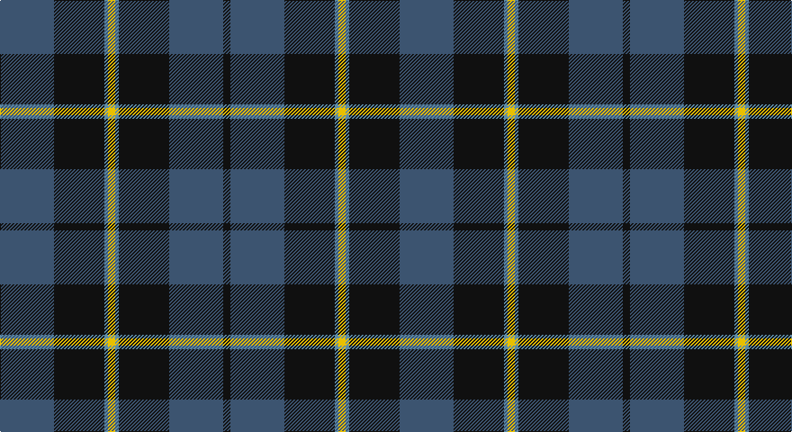

This page is one **sett** — a single exact thread-count. It belongs to the [tartan](/setts/n15k14t1ly2t1k14n15k2/)
(the same proportion at any scale), whose colour order is pattern [BKBYBKBK](/stripes/bkbybkbk/).

Sourced from register-of-tartans.  It is a [8 stripe tartan](/stripes/stripes8/).

Original link https://www.tartanregister.gov.uk/tartanDetails.aspx?ref=3840

2 attestations — the source records this cloth was collapsed from (oldest owns this page)

<ul>
<li>01/01/1995 — South African Air Force (register-of-tartans, <a href="https://www.tartanregister.gov.uk/tartanDetails.aspx?ref=3840">record</a>)</li>
<li>1995 — South African Air Force (Military) (tartans-authority, <a href="http://www.tartansauthority.com/tartan-ferret/display/5317/">record</a>)</li>
</ul>

## Register references

External register numbers recorded for this tartan.

- Scottish Register of Tartans: [3840](https://www.tartanregister.gov.uk/tartanDetails.aspx?ref=3840)
- Scottish Tartans Authority (ITI): 5317

## Thread count
B/60 K56 Ba4 Y8 Ba4 K56 B60 K/8

One full sett is **444 threads**.

## Palette

Palette: <strong>Tartan Register</strong> <small style="color:#888">(5 of 7 colours)</small>
<table><thead><tr><th>Colour</th><th>Threads</th><th>Shade</th><th>Base</th><th>OKLCh</th></tr></thead><tbody><tr><td>B/</td><td style="text-align:right;font-variant-numeric:tabular-nums">60</td><td><code style="background-color:#3C5470;">#3C5470</code> <small style="color:#888">#3C5470</small></td><td>B <code style="background-color:#2A418A;">#2A418A</code></td><td><small style="color:#888">oklch(43.9% 0.055 252.8)</small></td></tr><tr><td>K</td><td style="text-align:right;font-variant-numeric:tabular-nums">56</td><td><code style="background-color:#101010;">#101010</code> <small style="color:#888">#101010</small></td><td>K <code style="background-color:#000000;">#000000</code></td><td><small style="color:#888">oklch(17.3% 0.000 89.9)</small></td></tr><tr><td>Ba</td><td style="text-align:right;font-variant-numeric:tabular-nums">4</td><td><code style="background-color:#5C8CA8;">#5C8CA8</code> <small style="color:#888">#5C8CA8</small></td><td>B <code style="background-color:#2A418A;">#2A418A</code></td><td><small style="color:#888">oklch(61.7% 0.067 235.0)</small></td></tr><tr><td>Y</td><td style="text-align:right;font-variant-numeric:tabular-nums">8</td><td><code style="background-color:#E8C000;">#E8C000</code> <small style="color:#888">#E8C000</small></td><td>Y <code style="background-color:#F2BF00;">#F2BF00</code></td><td><small style="color:#888">oklch(81.9% 0.168 93.7)</small></td></tr><tr><td>Ba</td><td style="text-align:right;font-variant-numeric:tabular-nums">4</td><td><code style="background-color:#5C8CA8;">#5C8CA8</code> <small style="color:#888">#5C8CA8</small></td><td>B <code style="background-color:#2A418A;">#2A418A</code></td><td><small style="color:#888">oklch(61.7% 0.067 235.0)</small></td></tr><tr><td>K</td><td style="text-align:right;font-variant-numeric:tabular-nums">56</td><td><code style="background-color:#101010;">#101010</code> <small style="color:#888">#101010</small></td><td>K <code style="background-color:#000000;">#000000</code></td><td><small style="color:#888">oklch(17.3% 0.000 89.9)</small></td></tr><tr><td>B</td><td style="text-align:right;font-variant-numeric:tabular-nums">60</td><td><code style="background-color:#3C5470;">#3C5470</code> <small style="color:#888">#3C5470</small></td><td>B <code style="background-color:#2A418A;">#2A418A</code></td><td><small style="color:#888">oklch(43.9% 0.055 252.8)</small></td></tr><tr><td>K/</td><td style="text-align:right;font-variant-numeric:tabular-nums">8</td><td><code style="background-color:#101010;">#101010</code> <small style="color:#888">#101010</small></td><td>K <code style="background-color:#000000;">#000000</code></td><td><small style="color:#888">oklch(17.3% 0.000 89.9)</small></td></tr></tbody></table>

# Sample pattern

## Nearest tartans

The nearest existing variants by ΔTartan distance, with this tartan at the top so the swatches line up against it.

ΔTartan

Tartan

Sett

—

<a href="/ttd/edit/#slug=n15k14t1ly2t1k14n15k2~x4">South African Air Force</a> <a class="nn-out" href="/variants/s8/n15k14t1ly2t1k14n15k2~x4/" title="open its dictionary page">↗</a>

1.00

<a href="/variants/s8/g47r3g6db35lo3~x2/">Gracie</a>

1.11

<a href="/ttd/edit/#slug=db13dg8r5db3dg2r1ly1~x4&amp;base=n15k14t1ly2t1k14n15k2~x4">Fibonacci7</a> <a class="nn-out" href="/variants/s7/db13dg8r5db3dg2r1ly1~x4/" title="open its dictionary page">↗</a>

1.16

<a href="/ttd/edit/#slug=dg20db2g6db2dg4db27lo2db8~x2&amp;base=n15k14t1ly2t1k14n15k2~x4">Kinross (Fashion)</a> <a class="nn-out" href="/variants/s8/dg20db2g6db2dg4db27lo2db8~x2/" title="open its dictionary page">↗</a>

1.19

<a href="/ttd/edit/#slug=g26db10k3db2dy2db10~x4&amp;base=n15k14t1ly2t1k14n15k2~x4">St. Andrews Old Course Hotel (Corp)</a> <a class="nn-out" href="/variants/s6/g26db10k3db2dy2db10~x4/" title="open its dictionary page">↗</a>

1.19

<a href="/ttd/edit/#slug=r1db12y5db2y4lb1~x2&amp;base=n15k14t1ly2t1k14n15k2~x4">Connaught Green</a> <a class="nn-out" href="/variants/s6/r1db12y5db2y4lb1~x2/" title="open its dictionary page">↗</a>

1.20

<a href="/ttd/edit/#slug=n34k7n12k39n3k4lg3~x2&amp;base=n15k14t1ly2t1k14n15k2~x4">Tartan Army Children's Charity (Corp</a> <a class="nn-out" href="/variants/s7/n34k7n12k39n3k4lg3~x2/" title="open its dictionary page">↗</a>

1.21

<a href="/ttd/edit/#slug=k32b2k6b2k13n30w2~x2&amp;base=n15k14t1ly2t1k14n15k2~x4">Mountain Rescue Association Honor Guard</a> <a class="nn-out" href="/variants/s7/k32b2k6b2k13n30w2~x2/" title="open its dictionary page">↗</a>

1.23

<a href="/ttd/edit/#slug=dg4db12r3db12dg32lr4~x2&amp;base=n15k14t1ly2t1k14n15k2~x4">MacIntyre LC</a> <a class="nn-out" href="/variants/s6/dg4db12r3db12dg32lr4~x2/" title="open its dictionary page">↗</a>

1.23

<a href="/ttd/edit/#slug=dg4db12r3db12dg32lr4&amp;base=n15k14t1ly2t1k14n15k2~x4">MacIntyre LC</a> <a class="nn-out" href="/variants/s6/dg4db12r3db12dg32lr4/" title="open its dictionary page">↗</a>

1.23

<a href="/ttd/edit/#slug=db24g3db3g3lo2g18r2~x2&amp;base=n15k14t1ly2t1k14n15k2~x4">Greenways Marketing Intl (Corporate)</a> <a class="nn-out" href="/variants/s7/db24g3db3g3lo2g18r2~x2/" title="open its dictionary page">↗</a>

## Neighbour map

Every grey dot is one of 14360 variants placed by the first two principal components of the ΔTartan feature space (44% of its variance). Red is this tartan; blue dots are its nearest — click one to open its page.

<svg viewBox="0 0 640 380" role="img" style="max-width:100%;height:auto;border:1px solid #e0e0e0;border-radius:4px;display:block" xmlns="http://www.w3.org/2000/svg"><image href="/nn/cloud.v1.png" width="640" height="380"/><a href="/variants/s8/g47r3g6db35lo3~x2/"><circle cx="326.0" cy="190.4" r="4" fill="#3465a4"><title>Gracie</title></circle></a><a href="/variants/s7/db13dg8r5db3dg2r1ly1~x4/"><circle cx="283.5" cy="208.0" r="4" fill="#3465a4"><title>Fibonacci7</title></circle></a><a href="/variants/s8/dg20db2g6db2dg4db27lo2db8~x2/"><circle cx="333.8" cy="198.5" r="4" fill="#3465a4"><title>Kinross (Fashion)</title></circle></a><a href="/variants/s6/g26db10k3db2dy2db10~x4/"><circle cx="315.5" cy="218.3" r="4" fill="#3465a4"><title>St. Andrews Old Course Hotel (Corp)</title></circle></a><a href="/variants/s6/r1db12y5db2y4lb1~x2/"><circle cx="353.3" cy="220.4" r="4" fill="#3465a4"><title>Connaught Green</title></circle></a><a href="/variants/s7/n34k7n12k39n3k4lg3~x2/"><circle cx="362.7" cy="223.8" r="4" fill="#3465a4"><title>Tartan Army Children's Charity (Corp</title></circle></a><a href="/variants/s7/k32b2k6b2k13n30w2~x2/"><circle cx="376.9" cy="203.3" r="4" fill="#3465a4"><title>Mountain Rescue Association Honor Guard</title></circle></a><a href="/variants/s6/dg4db12r3db12dg32lr4~x2/"><circle cx="322.0" cy="229.6" r="4" fill="#3465a4"><title>MacIntyre LC</title></circle></a><a href="/variants/s6/dg4db12r3db12dg32lr4/"><circle cx="322.0" cy="229.6" r="4" fill="#3465a4"><title>MacIntyre LC</title></circle></a><a href="/variants/s7/db24g3db3g3lo2g18r2~x2/"><circle cx="312.1" cy="197.7" r="4" fill="#3465a4"><title>Greenways Marketing Intl (Corporate)</title></circle></a><circle cx="310.9" cy="209.2" r="5" fill="#c00000"/></svg>

ID: /variants/s8/n15k14t1ly2t1k14n15k2~x4/
