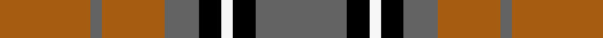

This page is one **sett** — a single exact thread-count. It belongs to the [tartan](/setts/n16k4w2k4n6o11n2o16/)
(the same proportion at any scale), whose colour order is pattern [BKWKBRBR](/stripes/bkwkbrbr/).

Part of the [Sydney](/tartans/sydney/) tartan — the named design grouping this sett with its other cloths.

Sourced from tartans-authority.  It is a [8 stripe tartan](/stripes/stripes8/).

Original link http://www.tartansauthority.com/tartan-ferret/display/1291/

2 attestations — the source records this cloth was collapsed from (oldest owns this page)

<ul>
<li>t Jan 1986 — Sydney (Nova Scotia) (District) (tartans-authority, <a href="http://www.tartansauthority.com/tartan-ferret/display/1291/">record</a>)  <em>Designed for the bi-centenial of Sydney, Nova Scotia. The grey shown here was originally shown as blue. Nomindex states: colours representative of the city's only main employer, the Speco Steel Plant which manufatures steel mainly for railway lines. Grey for the steel, red/oOrange for the hot steel ingots; black for the coal for the furnaces and off-white for the limestone used in production of steel.</em></li>
<li>01/01/2002 — Sydney (Nova Scotia) #2 (register-of-tartans, <a href="https://www.tartanregister.gov.uk/tartanDetails.aspx?ref=4058">record</a>)  <em>Designed by Mrs Rod Mullin for the City of Sydney, Nova Scotia, the colours reflect the citys main employer, Sepco Steel Works. Registered with the Scottish Tartans Society.</em></li>
</ul>

## Register references

External register numbers recorded for this tartan.

- Scottish Register of Tartans: [4058](https://www.tartanregister.gov.uk/tartanDetails.aspx?ref=4058)
- Scottish Tartans Authority (ITI): 1291
- Scottish Tartans World Register: 1291

## Thread count
O/32 N4 O22 N12 K8 W4 K8 N/32

One full sett is **180 threads**.

## Palette
<table><thead><tr><th>Colour</th><th>Shade</th><th>OKLCh</th></tr></thead><tbody><tr><td>O</td><td><code style="background-color:#A65C11;">#A65C11</code> <small style="color:#888">#A65C11</small></td><td><small style="color:#888">oklch(55.0% 0.125 58.3)</small></td></tr><tr><td>K</td><td><code style="background-color:#000000;">#000000</code> <small style="color:#888">#000000</small></td><td><small style="color:#888">oklch(0.0% 0.000 0.0)</small></td></tr><tr><td>W</td><td><code style="background-color:#F7F7F7;">#F7F7F7</code> <small style="color:#888">#F7F7F7</small></td><td><small style="color:#888">oklch(97.6% 0.000 89.9)</small></td></tr><tr><td>N</td><td><code style="background-color:#636363;">#636363</code> <small style="color:#888">#636363</small></td><td><small style="color:#888">oklch(50.0% 0.000 89.9)</small></td></tr></tbody></table>

# Sample pattern

## Nearest tartan variants

The nearest existing variants by ΔTartan distance, with this cloth at the top so the swatches line up against it.

ΔTartan

Threads

Variant

Sett

—

180

<a href="/variants/s8/n16k4w2k4n6o11n2o16~x2/">Sydney (Nova Scotia) (District)</a>

<a href="/ttd/edit/#slug=n16k4w2k4n6r11n2r16~x2&amp;base=n16k4w2k4n6o11n2o16~x2" title="compare in the TTD">2.88</a>

180

<a href="/variants/s8/n16k4w2k4n6r11n2r16~x2/">Sidney (Nova Scotia) Canadian Tartan</a>

## Neighbour map

Every grey dot is one of 13620 variants placed by the first two principal components of the ΔTartan feature space (42% of its variance). Red is this tartan; blue dots are its nearest — click one to open its page.

<svg viewBox="0 0 640 380" role="img" style="max-width:100%;height:auto;border:1px solid #e0e0e0;border-radius:4px;display:block" xmlns="http://www.w3.org/2000/svg"><image href="/nn/cloud.v1.png" width="640" height="380"/><a href="/variants/s8/n16k4w2k4n6r11n2r16~x2/"><circle cx="217.1" cy="200.6" r="4" fill="#3465a4"><title>Sidney (Nova Scotia) Canadian Tartan</title></circle></a><circle cx="230.5" cy="213.1" r="5" fill="#c00000"/><text x="320" y="376" text-anchor="middle" font-size="11" fill="#999">ground</text><text x="11" y="190" text-anchor="middle" font-size="11" fill="#999" transform="rotate(-90 11 190)">complexity</text></svg>

ID: /variants/s8/n16k4w2k4n6o11n2o16~x2/
