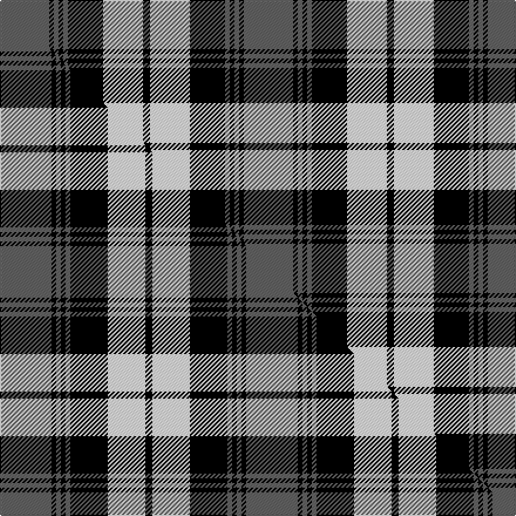

This is one **variant** — a specific cloth: this exact thread count and colourway, with its own
provenance below. It is one weaving of the [sett](/tartans/l/la/laksaa/) (the scale-free proportion — the
same cloth at any scale or shade), whose colour order is pattern [BKBKBKWK](/stripes/bkbkbkwk/).

Part of the [Laksaa](/tartans/l/la/laksaa/) tartan — the named design grouping this sett with its other cloths.

Sourced from weddslist.  It is a [8 stripe tartan](/stripes/stripes8/).

Original link [http://www.weddslist.com/cgi-bin/tartans/pg.pl?source=sts](http://www.weddslist.com/cgi-bin/tartans/pg.pl?source=sts)

Dataset <small>— provenance for this record, inherited from the source manifest</small>

<dl class="dataset-prov">
<dt>source</dt><dd><a href="/sources/weddslist/">Weddslist</a></dd>
<dt>data captured from</dt><dd><a href="https://github.com/thetartan/tartan-database/blob/master/data/weddslist/data.csv">https://github.com/thetartan/tartan-database/blob/master/data/weddslist/data.csv</a></dd>
<dt>data date</dt><dd>2016-11-17 <small>(dataset default)</small></dd>
<dt>licence</dt><dd><a href="https://creativecommons.org/licenses/by-nc-nd/4.0/">CC BY-NC-ND 4.0</a></dd>
</dl>

Capture chain <small>— the hands this data passed through, oldest first; each capture carries its own licence</small>

<ol class="capture-chain">
<li><a href="https://www.weddslist.com/tartans/">Weddslist</a> <small>the living privately compiled reference</small></li>
<li><a href="https://github.com/thetartan/tartan-database">thetartan/tartan-database</a> <small>2016-2017</small> · <a href="https://creativecommons.org/licenses/by-nc-nd/4.0/">CC BY-NC-ND 4.0</a> <small>Levko Kravets's frozen compilation — the capture we vendored, and where its CC licence text came from</small></li>
<li>this dictionary <small>captured 2026-06-10 · commit 5bf86c7566</small> <small>each re-capture is a git commit to data/sources</small></li>
</ol>

## Thread count
N/42 K4 N4 K4 N4 K30 W34 K/6

One full sett is **208 threads**.

## Palette
<table><thead><tr><th>Colour</th><th>Shade</th><th>OKLCh</th></tr></thead><tbody><tr><td>K</td><td><code style="background-color:#000000;">#000000</code> <small style="color:#888">#000000</small></td><td><small style="color:#888">oklch(0.0% 0.000 0.0)</small></td></tr><tr><td>W</td><td><code style="background-color:#F7F7F7;">#F7F7F7</code> <small style="color:#888">#F7F7F7</small></td><td><small style="color:#888">oklch(97.6% 0.000 89.9)</small></td></tr><tr><td>N</td><td><code style="background-color:#636363;">#636363</code> <small style="color:#888">#636363</small></td><td><small style="color:#888">oklch(50.0% 0.000 89.9)</small></td></tr></tbody></table>

# Sample pattern

## Compared to the master

This cloth is one sett of its design; the master sett (the exemplar the design is anchored on) is below for comparison.

Its **ΔTartan distance** from the master is **0.07** — the same measure the nearest-tartans table ranks by (0 is identical; a re-scale of the same cloth is near 0, a recolour or a different proportion further).

<figure class="master-compare" style="margin:0">

this sett
master sett ★

<figcaption style="color:#888;font-size:smaller">One weave of this sett against the <a href="/setts/n22k2n2k2n2k16w16k3/">master sett ★</a>, split on the diagonal: a shared proportion runs seamlessly across it with only the shades shifting; a different proportion breaks on it.</figcaption>
</figure>

## Nearest tartan variants

The nearest existing variants by ΔTartan distance, with this cloth at the top so the swatches line up against it.

ΔTartan

Threads

Variant

Sett

—

208

<a href="/variants/s8/n21k2n2k2n2k15w17k3~x2/">Laksaa</a>

<a href="/ttd/edit/#slug=n22k2n2k2n2k16w16k3~x2&amp;base=n21k2n2k2n2k15w17k3~x2" title="compare in the TTD">0.07</a>

210

<a href="/variants/s8/n22k2n2k2n2k16w16k3~x2/">Laksaa (Manx)</a>

<a href="/ttd/edit/#slug=n32k3n3k3t5k8o21k4~x2~n1900000-o2500000&amp;base=n21k2n2k2n2k15w17k3~x2" title="compare in the TTD">1.44</a>

244

<a href="/variants/s8/n32k3n3k3t5k8o21k4~x2~n1900000-o2500000/">Speyside Blue (Fashion)</a>

<a href="/ttd/edit/#slug=w2k11w2k2w16k2w2k11lo2~x4&amp;base=n21k2n2k2n2k15w17k3~x2" title="compare in the TTD">2.03</a>

384

<a href="/variants/s9/w2k11w2k2w16k2w2k11lo2~x4/">MacFie of Colonsay Dress (Fashion?)</a>

<a href="/ttd/edit/#slug=k16b1k1b1k1b9ly18b1~x4&amp;base=n21k2n2k2n2k15w17k3~x2" title="compare in the TTD">2.26</a>

316

<a href="/variants/s8/k16b1k1b1k1b9ly18b1~x4/">Kelvingrove (Fashion)</a>

<a href="/ttd/edit/#slug=w4k2o12dr3k3dr3k23o10k2o6k2~x2~o2500000&amp;base=n21k2n2k2n2k15w17k3~x2" title="compare in the TTD">2.38</a>

268

<a href="/variants/s11/w4k2o12dr3k3dr3k23o10k2o6k2~x2~o2500000/">Auld Lang Syne, Grey Weavers Tartan</a>

<a href="/ttd/edit/#slug=y1k4b2k10w1b2w10b1w4y1~x4&amp;base=n21k2n2k2n2k15w17k3~x2" title="compare in the TTD">2.41</a>

280

<a href="/variants/s10/y1k4b2k10w1b2w10b1w4y1~x4/">Chieftain</a>

<a href="/ttd/edit/#slug=w2lb7w2lb3w2k15w2k15lb15w2lb2~x2&amp;base=n21k2n2k2n2k15w17k3~x2" title="compare in the TTD">2.52</a>

260

<a href="/variants/s11/w2lb7w2lb3w2k15w2k15lb15w2lb2~x2/">Clark (Clan)</a>

<a href="/ttd/edit/#slug=w23k4w4k4w4k22o23ly5~x2~o2005046&amp;base=n21k2n2k2n2k15w17k3~x2" title="compare in the TTD">2.53</a>

300

<a href="/variants/s8/w23k4w4k4w4k22o23ly5~x2~o2005046/">Aberlour</a>

<a href="/ttd/edit/#slug=g24k3g2k3g4k4r20k3r6~x2~g2504202&amp;base=n21k2n2k2n2k15w17k3~x2" title="compare in the TTD">2.58</a>

216

<a href="/variants/s9/g24k3g2k3g4k4r20k3r6~x2~g2504202/">Alma College</a>

<a href="/ttd/edit/#slug=y9k32g6w20y3w9k5~x2&amp;base=n21k2n2k2n2k15w17k3~x2" title="compare in the TTD">2.61</a>

308

<a href="/variants/s7/y9k32g6w20y3w9k5~x2/">Black and White Golf</a>

## Neighbour map

Every grey dot is one of 13656 variants placed by the first two principal components of the ΔTartan feature space (42% of its variance). Red is this tartan; blue dots are its nearest — click one to open its page. The map is a flat projection of a many-dimensional space — [how to read it](/posts/neighbourhood-maps/).

<svg viewBox="0 0 640 380" role="img" style="max-width:100%;height:auto;border:1px solid #e0e0e0;border-radius:4px;display:block" xmlns="http://www.w3.org/2000/svg"><image href="/nn/cloud.v1.png" width="640" height="380"/><a href="/variants/s8/n22k2n2k2n2k16w16k3~x2/"><circle cx="188.2" cy="176.0" r="4" fill="#3465a4"><title>Laksaa (Manx)</title></circle></a><a href="/variants/s8/n32k3n3k3t5k8o21k4~x2~n1900000-o2500000/"><circle cx="215.4" cy="169.1" r="4" fill="#3465a4"><title>Speyside Blue (Fashion)</title></circle></a><a href="/variants/s9/w2k11w2k2w16k2w2k11lo2~x4/"><circle cx="250.8" cy="184.5" r="4" fill="#3465a4"><title>MacFie of Colonsay Dress (Fashion?)</title></circle></a><a href="/variants/s8/k16b1k1b1k1b9ly18b1~x4/"><circle cx="204.5" cy="147.0" r="4" fill="#3465a4"><title>Kelvingrove (Fashion)</title></circle></a><a href="/variants/s11/w4k2o12dr3k3dr3k23o10k2o6k2~x2~o2500000/"><circle cx="194.6" cy="142.7" r="4" fill="#3465a4"><title>Auld Lang Syne, Grey Weavers Tartan</title></circle></a><a href="/variants/s10/y1k4b2k10w1b2w10b1w4y1~x4/"><circle cx="159.7" cy="157.2" r="4" fill="#3465a4"><title>Chieftain</title></circle></a><a href="/variants/s11/w2lb7w2lb3w2k15w2k15lb15w2lb2~x2/"><circle cx="197.4" cy="183.4" r="4" fill="#3465a4"><title>Clark (Clan)</title></circle></a><a href="/variants/s8/w23k4w4k4w4k22o23ly5~x2~o2005046/"><circle cx="105.6" cy="195.2" r="4" fill="#3465a4"><title>Aberlour</title></circle></a><a href="/variants/s9/g24k3g2k3g4k4r20k3r6~x2~g2504202/"><circle cx="224.5" cy="162.6" r="4" fill="#3465a4"><title>Alma College</title></circle></a><a href="/variants/s7/y9k32g6w20y3w9k5~x2/"><circle cx="163.2" cy="178.3" r="4" fill="#3465a4"><title>Black and White Golf</title></circle></a><circle cx="181.4" cy="178.7" r="5" fill="#c00000"/><text x="320" y="376" text-anchor="middle" font-size="11" fill="#999">ground</text><text x="11" y="190" text-anchor="middle" font-size="11" fill="#999" transform="rotate(-90 11 190)">complexity</text></svg>

ID: /variants/s8/n21k2n2k2n2k15w17k3~x2/
