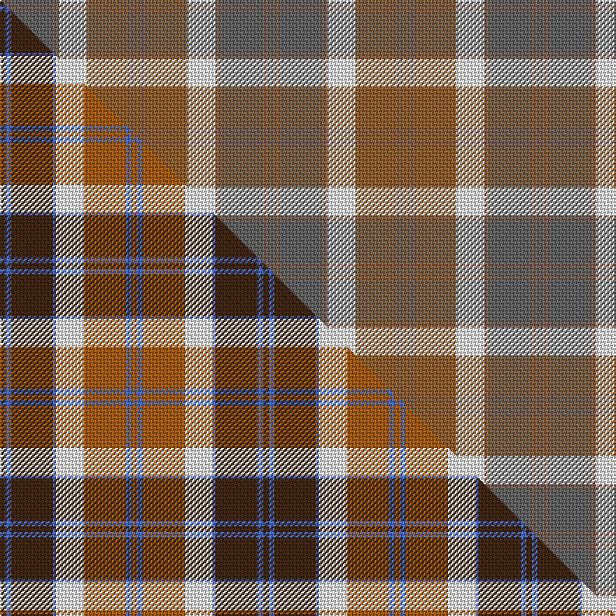

This page is one **sett** — a single exact thread-count. It belongs to the [tartan](/setts/n2o2n15o2w10oi15o2oi2/)
(the same proportion at any scale), whose colour order is pattern [BRBRWRRR](/stripes/brbrwrrr/).

Part of the [Bannockbane](/tartans/bannockbane-3/) tartan — the named design grouping this sett with its other cloths.

Sourced from weddslist.  It is a [8 stripe tartan](/stripes/stripes8/).

Original link http://www.weddslist.com/cgi-bin/tartans/pg.pl?source=sts

## Thread count
N/4 O4 N30 O4 W20 Oi30 O4 Oi/4

One full sett is **192 threads**.

## Palette
<table><thead><tr><th>Colour</th><th>Shade</th><th>OKLCh</th></tr></thead><tbody><tr><td>W</td><td><code style="background-color:#F7F7F7;">#F7F7F7</code> <small style="color:#888">#F7F7F7</small></td><td><small style="color:#888">oklch(97.6% 0.000 89.9)</small></td></tr><tr><td>O</td><td><code style="background-color:#906030;">#906030</code> <small style="color:#888">#906030</small></td><td><small style="color:#888">oklch(53.1% 0.089 63.7)</small></td></tr><tr><td>O</td><td><code style="background-color:#806050;">#806050</code> <small style="color:#888">#806050</small></td><td><small style="color:#888">oklch(51.7% 0.049 47.8)</small></td></tr><tr><td>N</td><td><code style="background-color:#636363;">#636363</code> <small style="color:#888">#636363</small></td><td><small style="color:#888">oklch(50.0% 0.000 89.9)</small></td></tr></tbody></table>

# Sample pattern

## Compared to the master

This cloth is one sett of its design; the master sett (the exemplar the design is anchored on) is below for comparison.

Its **ΔTartan distance** from the master is **4.84** — the same measure the nearest-tartans table ranks by (0 is identical; a re-scale of the same cloth is near 0, a recolour or a different proportion further).

<figure class="master-compare" style="margin:0">

this sett
master sett ★

<figcaption style="color:#888;font-size:smaller">One weave of this sett against the <a href="/setts/do2b2do15b1w10o15b2o2/">master sett ★</a>, split on the diagonal: a shared proportion runs seamlessly across it with only the shades shifting; a different proportion breaks on it.</figcaption>
</figure>

## Nearest tartan variants

The nearest existing variants by ΔTartan distance, with this cloth at the top so the swatches line up against it.

ΔTartan

Threads

Variant

Sett

—

192

<a href="/variants/s8/n2o2n15o2w10oi15o2oi2~x2~o2102055-oi2104058/">Bannockbane, Grey</a>

<a href="/ttd/edit/#slug=r2ly1t8r1g7ly1r2~x6&amp;base=n2o2n15o2w10oi15o2oi2~x2~o2102055-oi2104058" title="compare in the TTD">2.71</a>

240

<a href="/variants/s7/r2ly1t8r1g7ly1r2~x6/">Cercle de Fermieres de St-Elie . . .</a>

<a href="/ttd/edit/#slug=g6y1r1lb2r2~x4&amp;base=n2o2n15o2w10oi15o2oi2~x2~o2102055-oi2104058" title="compare in the TTD">2.71</a>

64

<a href="/variants/s5/g6y1r1lb2r2~x4/">Wilson's No.179</a>

<a href="/ttd/edit/#slug=k3lr15t3lr4t3lr4t10y30w3~x2~lr2800000-t2503227&amp;base=n2o2n15o2w10oi15o2oi2~x2~o2102055-oi2104058" title="compare in the TTD">3.07</a>

288

<a href="/variants/s9/k3lr15t3lr4t3lr4t10y30w3~x2~lr2800000-t2503227/">Highland Road (Fashion)</a>

<a href="/ttd/edit/#slug=b3do2o14g17do14b8o14do2b3~x2&amp;base=n2o2n15o2w10oi15o2oi2~x2~o2102055-oi2104058" title="compare in the TTD">3.23</a>

296

<a href="/variants/s9/b3do2o14g17do14b8o14do2b3~x2/">Monaghan</a>

<a href="/ttd/edit/#slug=t3r2dg16r2t3r2n16r2t3~x4&amp;base=n2o2n15o2w10oi15o2oi2~x2~o2102055-oi2104058" title="compare in the TTD">3.33</a>

368

<a href="/variants/s9/t3r2dg16r2t3r2n16r2t3~x4/">MacPherson Gathering 1996</a>

<a href="/ttd/edit/#slug=b10lr1b3lr6b1lr3b1o5y1o3y6o1y3o1~x4~lr3200000-o2607049&amp;base=n2o2n15o2w10oi15o2oi2~x2~o2102055-oi2104058" title="compare in the TTD">3.35</a>

316

<a href="/variants/s14/b10lb1b3lb6b1lb3b1o5y1o3y6o1y3o1~x4~lb3200000-o2607049/">MacGlashan</a>

<a href="/ttd/edit/#slug=dp11o2dp2o2dp2o11g14w2~x2&amp;base=n2o2n15o2w10oi15o2oi2~x2~o2102055-oi2104058" title="compare in the TTD">3.46</a>

158

<a href="/variants/s8/dp11o2dp2o2dp2o11g14w2~x2/">Lamont</a>

<a href="/ttd/edit/#slug=r10b44o5dg40o62r5o10&amp;base=n2o2n15o2w10oi15o2oi2~x2~o2102055-oi2104058" title="compare in the TTD">3.48</a>

332

<a href="/variants/s7/r10b44o5dg40o62r5o10/">Ballintrae</a>

<a href="/ttd/edit/#slug=r1g6y1r2y1r2y1db6y1~x2&amp;base=n2o2n15o2w10oi15o2oi2~x2~o2102055-oi2104058" title="compare in the TTD">3.56</a>

80

<a href="/variants/s9/r1g6y1r2y1r2y1db6y1~x2/">Stevenson</a>

<a href="/ttd/edit/#slug=w6n27dp6o40lr44w8o4~o2505023-lr3003019&amp;base=n2o2n15o2w10oi15o2oi2~x2~o2102055-oi2104058" title="compare in the TTD">3.64</a>

260

<a href="/variants/s7/w6n27dp6o40lr44w8o4~o2505023-lr3003019/">Susan G Komen 06</a>

## Neighbour map

Every grey dot is one of 13620 variants placed by the first two principal components of the ΔTartan feature space (42% of its variance). Red is this tartan; blue dots are its nearest — click one to open its page.

<svg viewBox="0 0 640 380" role="img" style="max-width:100%;height:auto;border:1px solid #e0e0e0;border-radius:4px;display:block" xmlns="http://www.w3.org/2000/svg"><image href="/nn/cloud.v1.png" width="640" height="380"/><a href="/variants/s7/r2ly1t8r1g7ly1r2~x6/"><circle cx="241.6" cy="233.7" r="4" fill="#3465a4"><title>Cercle de Fermieres de St-Elie . . .</title></circle></a><a href="/variants/s5/g6y1r1lb2r2~x4/"><circle cx="210.4" cy="240.6" r="4" fill="#3465a4"><title>Wilson's No.179</title></circle></a><a href="/variants/s9/k3lr15t3lr4t3lr4t10y30w3~x2~lr2800000-t2503227/"><circle cx="250.2" cy="187.2" r="4" fill="#3465a4"><title>Highland Road (Fashion)</title></circle></a><a href="/variants/s9/b3do2o14g17do14b8o14do2b3~x2/"><circle cx="227.8" cy="241.9" r="4" fill="#3465a4"><title>Monaghan</title></circle></a><a href="/variants/s9/t3r2dg16r2t3r2n16r2t3~x4/"><circle cx="251.5" cy="218.8" r="4" fill="#3465a4"><title>MacPherson Gathering 1996</title></circle></a><a href="/variants/s14/b10lb1b3lb6b1lb3b1o5y1o3y6o1y3o1~x4~lb3200000-o2607049/"><circle cx="216.5" cy="205.0" r="4" fill="#3465a4"><title>MacGlashan</title></circle></a><a href="/variants/s8/dp11o2dp2o2dp2o11g14w2~x2/"><circle cx="197.6" cy="222.6" r="4" fill="#3465a4"><title>Lamont</title></circle></a><a href="/variants/s7/r10b44o5dg40o62r5o10/"><circle cx="285.4" cy="211.9" r="4" fill="#3465a4"><title>Ballintrae</title></circle></a><a href="/variants/s9/r1g6y1r2y1r2y1db6y1~x2/"><circle cx="159.8" cy="224.5" r="4" fill="#3465a4"><title>Stevenson</title></circle></a><a href="/variants/s7/w6n27dp6o40lr44w8o4~o2505023-lr3003019/"><circle cx="236.3" cy="215.5" r="4" fill="#3465a4"><title>Susan G Komen 06</title></circle></a><circle cx="225.2" cy="225.2" r="5" fill="#c00000"/><text x="320" y="376" text-anchor="middle" font-size="11" fill="#999">ground</text><text x="11" y="190" text-anchor="middle" font-size="11" fill="#999" transform="rotate(-90 11 190)">complexity</text></svg>

ID: /variants/s8/n2o2n15o2w10oi15o2oi2~x2~o2102055-oi2104058/
