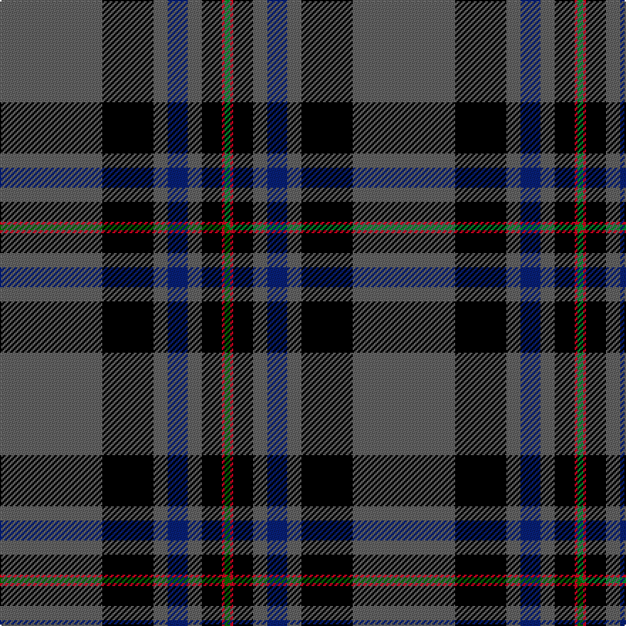

This page is one **sett** — a single exact thread-count. It belongs to the [tartan](/setts/n36k18n5db7n5k7r1g2/)
(the same proportion at any scale), whose colour order is pattern [BKBBBKRG](/stripes/bkbbbkrg/).

Part of the [Suttle](/tartans/suttle/) tartan — the named design grouping this sett with its other cloths.

Sourced from tartans-authority.  It is a [8 stripe tartan](/stripes/stripes8/).

Original link http://www.tartansauthority.com/tartan-ferret/display/7668/

## Register references

External register numbers recorded for this tartan.

- Scottish Tartans Authority (ITI): 7668

## Thread count
N/72 K36 N10 DB14 N10 K14 R2 G/4

One full sett is **248 threads**.

## Palette
<table><thead><tr><th>Colour</th><th>Shade</th><th>OKLCh</th></tr></thead><tbody><tr><td>DB</td><td><code style="background-color:#082077;">#082077</code> <small style="color:#888">#082077</small></td><td><small style="color:#888">oklch(30.0% 0.149 265.1)</small></td></tr><tr><td>G</td><td><code style="background-color:#008B2A;">#008B2A</code> <small style="color:#888">#008B2A</small></td><td><small style="color:#888">oklch(55.4% 0.170 145.9)</small></td></tr><tr><td>K</td><td><code style="background-color:#000000;">#000000</code> <small style="color:#888">#000000</small></td><td><small style="color:#888">oklch(0.0% 0.000 0.0)</small></td></tr><tr><td>N</td><td><code style="background-color:#636363;">#636363</code> <small style="color:#888">#636363</small></td><td><small style="color:#888">oklch(50.0% 0.000 89.9)</small></td></tr><tr><td>R</td><td><code style="background-color:#D60020;">#D60020</code> <small style="color:#888">#D60020</small></td><td><small style="color:#888">oklch(55.2% 0.224 25.5)</small></td></tr></tbody></table>

# Sample pattern

## Compared to the master

This cloth is one sett of its design; the master sett (the exemplar the design is anchored on) is below for comparison.

Its **ΔTartan distance** from the master is **0.04** — the same measure the nearest-tartans table ranks by (0 is identical; a re-scale of the same cloth is near 0, a recolour or a different proportion further).

<figure class="master-compare" style="margin:0">

this sett
master sett ★

<figcaption style="color:#888;font-size:smaller">One weave of this sett against the <a href="/setts/n36k18n5db7n5k7r1dg2/">master sett ★</a>, split on the diagonal: a shared proportion runs seamlessly across it with only the shades shifting; a different proportion breaks on it.</figcaption>
</figure>

## Nearest variants

The nearest existing variants by ΔTartan distance, with this cloth at the top so the swatches line up against it.

ΔTartan

Threads

Variant

Sett

—

248

<a href="/variants/s8/n36k18n5db7n5k7r1g2~x2/">Suttle (Personal)</a>

<a href="/ttd/edit/#slug=n36k18n5db7n5k7r1dg2~x2~dg1806142&amp;base=n36k18n5db7n5k7r1g2~x2" title="compare in the TTD">0.00</a>

248

<a href="/variants/s8/n36k18n5db7n5k7r1dg2~x2~dg1806142/">Suttle (Personal)</a>

<a href="/ttd/edit/#slug=n49db15k1n18k4r8g7k5g5n19k5~x2&amp;base=n36k18n5db7n5k7r1g2~x2" title="compare in the TTD">1.85</a>

436

<a href="/variants/s11/n49db15k1n18k4r8g7k5g5n19k5~x2/">State Seal of Virginia (Fashion)</a>

<a href="/ttd/edit/#slug=n4db2n7k30n8k7dr5db1w2~x2&amp;base=n36k18n5db7n5k7r1g2~x2" title="compare in the TTD">2.47</a>

252

<a href="/variants/s9/n4db2n7k30n8k7dr5db1w2~x2/">Hebridean Heather</a>

<a href="/ttd/edit/#slug=lo8k50n15dg6n6db3n6lo2~x2&amp;base=n36k18n5db7n5k7r1g2~x2" title="compare in the TTD">2.90</a>

364

<a href="/variants/s8/lo8k50n15dg6n6db3n6lo2~x2/">Royal College of G.P.s (Corporate)</a>

## Neighbour map

Every grey dot is one of 13620 variants placed by the first two principal components of the ΔTartan feature space (42% of its variance). Red is this tartan; blue dots are its nearest — click one to open its page.

<svg viewBox="0 0 640 380" role="img" style="max-width:100%;height:auto;border:1px solid #e0e0e0;border-radius:4px;display:block" xmlns="http://www.w3.org/2000/svg"><image href="/nn/cloud.v1.png" width="640" height="380"/><a href="/variants/s8/n36k18n5db7n5k7r1dg2~x2~dg1806142/"><circle cx="307.8" cy="101.5" r="4" fill="#3465a4"><title>Suttle (Personal)</title></circle></a><a href="/variants/s11/n49db15k1n18k4r8g7k5g5n19k5~x2/"><circle cx="362.7" cy="90.8" r="4" fill="#3465a4"><title>State Seal of Virginia (Fashion)</title></circle></a><a href="/variants/s9/n4db2n7k30n8k7dr5db1w2~x2/"><circle cx="286.8" cy="97.4" r="4" fill="#3465a4"><title>Hebridean Heather</title></circle></a><a href="/variants/s8/lo8k50n15dg6n6db3n6lo2~x2/"><circle cx="255.7" cy="102.4" r="4" fill="#3465a4"><title>Royal College of G.P.s (Corporate)</title></circle></a><circle cx="306.4" cy="101.2" r="5" fill="#c00000"/><text x="320" y="376" text-anchor="middle" font-size="11" fill="#999">ground</text><text x="11" y="190" text-anchor="middle" font-size="11" fill="#999" transform="rotate(-90 11 190)">complexity</text></svg>

ID: /variants/s8/n36k18n5db7n5k7r1g2~x2/
