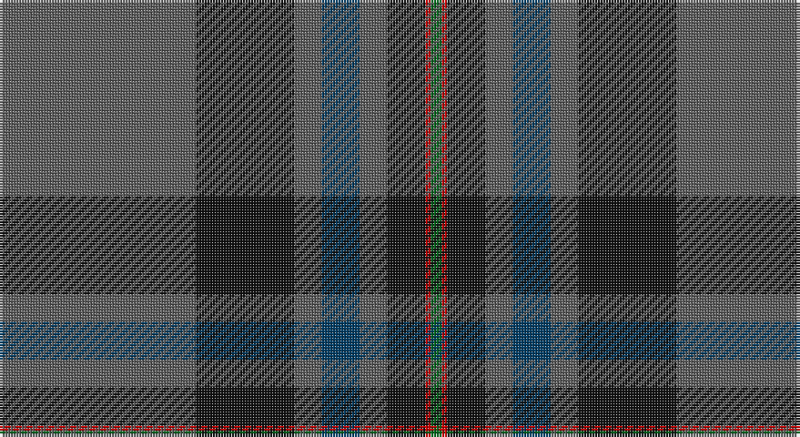

This page is one **sett** — a single exact thread-count. It belongs to the [tartan](/setts/n36k18n5dt7n5k7r1g2/)
(the same proportion at any scale), whose colour order is pattern [BKBBBKRG](/stripes/bkbbbkrg/).

Sourced from tartans-authority.  It is a [8 stripe tartan](/stripes/stripes8/).

Original link http://www.tartansauthority.com/tartan-ferret/display/7668/

2 attestations — the source records this cloth was collapsed from (oldest owns this page)

<ul>
<li>2007 — Suttle (Personal) (tartans-authority, <a href="http://www.tartansauthority.com/tartan-ferret/display/7668/">record</a>)</li>
<li>undated — Suttle (Personal) (register-of-tartans, <a href="https://www.tartanregister.gov.uk/tartanDetails.aspx?ref=5671">record</a>)</li>
</ul>

## Register references

External register numbers recorded for this tartan.

- Scottish Register of Tartans: [5671](https://www.tartanregister.gov.uk/tartanDetails.aspx?ref=5671)
- Scottish Tartans Authority (ITI): 7668

## Thread count
N/72 K36 N10 DB14 N10 K14 R2 G/4

One full sett is **248 threads**.

## Palette

Palette: <strong>Tartan Register</strong> <small style="color:#888">(4 of 5 colours)</small>
<table><thead><tr><th>Colour</th><th>Threads</th><th>Shade</th><th>Base</th><th>OKLCh</th></tr></thead><tbody><tr><td>N/</td><td style="text-align:right;font-variant-numeric:tabular-nums">72</td><td><code style="background-color:#5C5C5C;">#5C5C5C</code> <small style="color:#888">#5C5C5C</small></td><td>B <code style="background-color:#2A418A;">#2A418A</code></td><td><small style="color:#888">oklch(47.5% 0.000 89.9)</small></td></tr><tr><td>K</td><td style="text-align:right;font-variant-numeric:tabular-nums">36</td><td><code style="background-color:#101010;">#101010</code> <small style="color:#888">#101010</small></td><td>K <code style="background-color:#000000;">#000000</code></td><td><small style="color:#888">oklch(17.3% 0.000 89.9)</small></td></tr><tr><td>N</td><td style="text-align:right;font-variant-numeric:tabular-nums">10</td><td><code style="background-color:#5C5C5C;">#5C5C5C</code> <small style="color:#888">#5C5C5C</small></td><td>B <code style="background-color:#2A418A;">#2A418A</code></td><td><small style="color:#888">oklch(47.5% 0.000 89.9)</small></td></tr><tr><td>DB</td><td style="text-align:right;font-variant-numeric:tabular-nums">14</td><td><code style="background-color:#003C64;">#003C64</code> <small style="color:#888">#003C64</small></td><td>B <code style="background-color:#2A418A;">#2A418A</code></td><td><small style="color:#888">oklch(34.5% 0.089 246.0)</small></td></tr><tr><td>N</td><td style="text-align:right;font-variant-numeric:tabular-nums">10</td><td><code style="background-color:#5C5C5C;">#5C5C5C</code> <small style="color:#888">#5C5C5C</small></td><td>B <code style="background-color:#2A418A;">#2A418A</code></td><td><small style="color:#888">oklch(47.5% 0.000 89.9)</small></td></tr><tr><td>K</td><td style="text-align:right;font-variant-numeric:tabular-nums">14</td><td><code style="background-color:#101010;">#101010</code> <small style="color:#888">#101010</small></td><td>K <code style="background-color:#000000;">#000000</code></td><td><small style="color:#888">oklch(17.3% 0.000 89.9)</small></td></tr><tr><td>R</td><td style="text-align:right;font-variant-numeric:tabular-nums">2</td><td><code style="background-color:#C80000;">#C80000</code> <small style="color:#888">#C80000</small></td><td>R <code style="background-color:#CC0000;">#CC0000</code></td><td><small style="color:#888">oklch(52.3% 0.215 29.2)</small></td></tr><tr><td>G/</td><td style="text-align:right;font-variant-numeric:tabular-nums">4</td><td><code style="background-color:#006818;">#006818</code> <small style="color:#888">#006818</small></td><td>G <code style="background-color:#006100;">#006100</code></td><td><small style="color:#888">oklch(45.0% 0.142 145.0)</small></td></tr></tbody></table>

# Sample pattern

## Nearest tartans

The nearest existing variants by ΔTartan distance, with this tartan at the top so the swatches line up against it.

ΔTartan

Tartan

Sett

—

<a href="/ttd/edit/#slug=n36k18n5dt7n5k7r1g2~x2">Suttle (Personal)</a> <a class="nn-out" href="/variants/s8/n36k18n5dt7n5k7r1g2~x2/" title="open its dictionary page">↗</a>

0.83

<a href="/ttd/edit/#slug=n4dt2n7dti30n8dti7r5dt1w2~x2&amp;base=n36k18n5dt7n5k7r1g2~x2">Hebridean Heather</a> <a class="nn-out" href="/variants/s9/n4dt2n7dti30n8dti7r5dt1w2~x2/" title="open its dictionary page">↗</a>

1.13

<a href="/ttd/edit/#slug=r6k3do4k10do5o3k2do31w1do2w2~x2&amp;base=n36k18n5dt7n5k7r1g2~x2">Glen and Son, William (Corporate)</a> <a class="nn-out" href="/variants/s11/r6k3do4k10do5o3k2do31w1do2w2~x2/" title="open its dictionary page">↗</a>

1.13

<a href="/ttd/edit/#slug=r4dg10lo1lb1dt4lb1dt25r2~x2&amp;base=n36k18n5dt7n5k7r1g2~x2">Raymond of Doune</a> <a class="nn-out" href="/variants/s8/r4dg10lo1lb1dt4lb1dt25r2~x2/" title="open its dictionary page">↗</a>

1.22

<a href="/ttd/edit/#slug=dg2dy32dy12k10r1db16r2~x2&amp;base=n36k18n5dt7n5k7r1g2~x2">MacWilliam Htg</a> <a class="nn-out" href="/variants/s7/dg2dy32dy12k10r1db16r2~x2/" title="open its dictionary page">↗</a>

1.32

<a href="/ttd/edit/#slug=db36k10dg3r3dg6k1ly2~x2&amp;base=n36k18n5dt7n5k7r1g2~x2">MacLaurin of Brioch</a> <a class="nn-out" href="/variants/s7/db36k10dg3r3dg6k1ly2~x2/" title="open its dictionary page">↗</a>

1.33

<a href="/ttd/edit/#slug=dy2dg44k10r1db16r1~x2&amp;base=n36k18n5dt7n5k7r1g2~x2">MacWilliam Hunting</a> <a class="nn-out" href="/variants/s6/dy2dg44k10r1db16r1~x2/" title="open its dictionary page">↗</a>

1.36

<a href="/ttd/edit/#slug=k8r2k13lo2dg48b6~x2&amp;base=n36k18n5dt7n5k7r1g2~x2">Green Swamp Youth Campers</a> <a class="nn-out" href="/variants/s6/k8r2k13lo2dg48b6~x2/" title="open its dictionary page">↗</a>

1.37

<a href="/variants/s9/db5r3db21ki5db5ki40k2ki2w1~x2/">MacNeill</a>

1.39

<a href="/ttd/edit/#slug=dt8y74k8dt42y11k2y16dt4&amp;base=n36k18n5dt7n5k7r1g2~x2">Orkney Slate</a> <a class="nn-out" href="/variants/s8/dt8y74k8dt42y11k2y16dt4/" title="open its dictionary page">↗</a>

1.42

<a href="/ttd/edit/#slug=r1k1n30k6n1k6dy8k1r1~x2&amp;base=n36k18n5dt7n5k7r1g2~x2">Klappert Original (Personal)</a> <a class="nn-out" href="/variants/s9/r1k1n30k6n1k6dy8k1r1~x2/" title="open its dictionary page">↗</a>

## Neighbour map

Every grey dot is one of 14360 variants placed by the first two principal components of the ΔTartan feature space (44% of its variance). Red is this tartan; blue dots are its nearest — click one to open its page.

<svg viewBox="0 0 640 380" role="img" style="max-width:100%;height:auto;border:1px solid #e0e0e0;border-radius:4px;display:block" xmlns="http://www.w3.org/2000/svg"><image href="/nn/cloud.v1.png" width="640" height="380"/><a href="/variants/s9/n4dt2n7dti30n8dti7r5dt1w2~x2/"><circle cx="368.3" cy="142.5" r="4" fill="#3465a4"><title>Hebridean Heather</title></circle></a><a href="/variants/s11/r6k3do4k10do5o3k2do31w1do2w2~x2/"><circle cx="401.8" cy="124.3" r="4" fill="#3465a4"><title>Glen and Son, William (Corporate)</title></circle></a><a href="/variants/s8/r4dg10lo1lb1dt4lb1dt25r2~x2/"><circle cx="416.0" cy="162.6" r="4" fill="#3465a4"><title>Raymond of Doune</title></circle></a><a href="/variants/s7/dg2dy32dy12k10r1db16r2~x2/"><circle cx="412.2" cy="178.8" r="4" fill="#3465a4"><title>MacWilliam Htg</title></circle></a><a href="/variants/s7/db36k10dg3r3dg6k1ly2~x2/"><circle cx="393.4" cy="136.4" r="4" fill="#3465a4"><title>MacLaurin of Brioch</title></circle></a><a href="/variants/s6/dy2dg44k10r1db16r1~x2/"><circle cx="427.6" cy="155.3" r="4" fill="#3465a4"><title>MacWilliam Hunting</title></circle></a><a href="/variants/s6/k8r2k13lo2dg48b6~x2/"><circle cx="408.0" cy="175.6" r="4" fill="#3465a4"><title>Green Swamp Youth Campers</title></circle></a><a href="/variants/s9/db5r3db21ki5db5ki40k2ki2w1~x2/"><circle cx="410.8" cy="131.1" r="4" fill="#3465a4"><title>MacNeill</title></circle></a><a href="/variants/s8/dt8y74k8dt42y11k2y16dt4/"><circle cx="431.5" cy="151.0" r="4" fill="#3465a4"><title>Orkney Slate</title></circle></a><a href="/variants/s9/r1k1n30k6n1k6dy8k1r1~x2/"><circle cx="425.8" cy="150.0" r="4" fill="#3465a4"><title>Klappert Original (Personal)</title></circle></a><circle cx="397.0" cy="152.9" r="5" fill="#c00000"/></svg>

ID: /variants/s8/n36k18n5dt7n5k7r1g2~x2/
