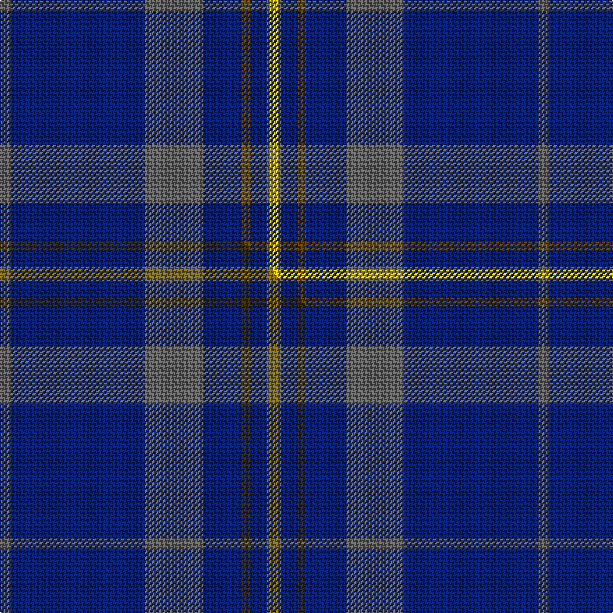

This page is one **sett** — a single exact thread-count. It belongs to the [tartan](/setts/n4db48n21db14dy3db6n1ly3/)
(the same proportion at any scale), whose colour order is pattern [BBBBGBBY](/stripes/bbbbgbby/).

Part of the [Munster Ancestry](/tartans/munster-ancestry/) tartan — the named design grouping this sett with its other cloths.

Sourced from tartans-authority.  It is a [8 stripe tartan](/stripes/stripes8/).

Original link https://www.tartanregister.gov.uk/tartanDetails.aspx?ref=10799

Dataset <small>— provenance for this record, inherited from the source manifest</small>

<dl class="dataset-prov">
<dt>source</dt><dd><a href="/sources/tartans-authority/">Scottish Tartans Authority</a></dd>
<dt>data captured from</dt><dd><a href="https://github.com/thetartan/tartan-database/blob/master/data/tartans-authority/data.csv">https://github.com/thetartan/tartan-database/blob/master/data/tartans-authority/data.csv</a></dd>
<dt>data date</dt><dd>27/03/2013 <small>(this record)</small></dd>
<dt>licence</dt><dd><a href="https://creativecommons.org/licenses/by-nc-nd/4.0/">CC BY-NC-ND 4.0</a></dd>
</dl>

Capture chain <small>— the hands this data passed through, oldest first; each capture carries its own licence</small>

<ol class="capture-chain">
<li><a href="https://www.tartansauthority.com/">Scottish Tartans Authority</a> <small>the heritage body's archive — its tartan-ferret record browser is retired (links repaired to the SRT, above)</small></li>
<li><a href="https://github.com/thetartan/tartan-database">thetartan/tartan-database</a> <small>2016-2017</small> · <a href="https://creativecommons.org/licenses/by-nc-nd/4.0/">CC BY-NC-ND 4.0</a> <small>Levko Kravets's frozen compilation — the capture we vendored, and where its CC licence text came from</small></li>
<li>this dictionary <small>captured 2026-06-10 · commit 5bf86c7566</small> <small>each re-capture is a git commit to data/sources</small></li>
</ol>

## Register references

External register numbers recorded for this tartan.

- Scottish Register of Tartans: [10799](https://www.tartanregister.gov.uk/tartanDetails?ref=10799)
- Scottish Tartans Authority (ITI): 10799

## Thread count
N/8 DB96 N42 DB28 DY6 DB12 N2 LY/6

One full sett is **386 threads**.

## Palette
<table><thead><tr><th>Colour</th><th>Shade</th><th>OKLCh</th></tr></thead><tbody><tr><td>DB</td><td><code style="background-color:#082077;">#082077</code> <small style="color:#888">#082077</small></td><td><small style="color:#888">oklch(30.0% 0.149 265.1)</small></td></tr><tr><td>N</td><td><code style="background-color:#636363;">#636363</code> <small style="color:#888">#636363</small></td><td><small style="color:#888">oklch(50.0% 0.000 89.9)</small></td></tr><tr><td>DY</td><td><code style="background-color:#604000;">#604000</code> <small style="color:#888">#604000</small></td><td><small style="color:#888">oklch(39.8% 0.083 76.8)</small></td></tr><tr><td>LY</td><td><code style="background-color:#E8C000;">#E8C000</code> <small style="color:#888">#E8C000</small></td><td><small style="color:#888">oklch(81.9% 0.168 93.7)</small></td></tr></tbody></table>

# Sample pattern

## Compared to the master

This cloth is one sett of its design; the master sett (the exemplar the design is anchored on) is below for comparison.

Its **ΔTartan distance** from the master is **0.60** — the same measure the nearest-tartans table ranks by (0 is identical; a re-scale of the same cloth is near 0, a recolour or a different proportion further).

<figure class="master-compare" style="margin:0">

this sett
master sett ★

<figcaption style="color:#888;font-size:smaller">One weave of this sett against the <a href="/setts/n4db48n21db14dy3db6n1y3/">master sett ★</a>, split on the diagonal: a shared proportion runs seamlessly across it with only the shades shifting; a different proportion breaks on it.</figcaption>
</figure>

## Nearest tartan variants

The nearest existing variants by ΔTartan distance, with this cloth at the top so the swatches line up against it.

ΔTartan

Threads

Variant

Sett

—

386

<a href="/variants/s8/n4db48n21db14dy3db6n1ly3~x2~dy1603076-ly3307090/">Munster Ancestry (Fashion)</a>

<a href="/ttd/edit/#slug=n4db48n21db14dy3db6n1y3~x2&amp;base=n4db48n21db14dy3db6n1ly3~x2~dy1603076-ly3307090" title="compare in the TTD">0.60</a>

386

<a href="/variants/s8/n4db48n21db14dy3db6n1y3~x2/">Munster Ancestry</a>

<a href="/ttd/edit/#slug=n8y4n35db2lb8db2n4db21n4~x2&amp;base=n4db48n21db14dy3db6n1ly3~x2~dy1603076-ly3307090" title="compare in the TTD">2.46</a>

328

<a href="/variants/s9/n8y4n35db2lb8db2n4db21n4~x2/">Bedford Academy (Corporate)</a>

<a href="/ttd/edit/#slug=n8y4n35db2lt8db2n4db21n4~x2~db1108266-lt3103227&amp;base=n4db48n21db14dy3db6n1ly3~x2~dy1603076-ly3307090" title="compare in the TTD">2.46</a>

328

<a href="/variants/s9/n8y4n35db2lt8db2n4db21n4~x2~db1108266-lt3103227/">Bedford Academy</a>

<a href="/ttd/edit/#slug=db21n2lr1n2db1dr2db1y6~x4&amp;base=n4db48n21db14dy3db6n1ly3~x2~dy1603076-ly3307090" title="compare in the TTD">2.86</a>

180

<a href="/variants/s8/db21n2lr1n2db1dr2db1y6~x4/">Blue Rust (Corporate)</a>

<a href="/ttd/edit/#slug=y4t3y1t17db40t2db3~x2&amp;base=n4db48n21db14dy3db6n1ly3~x2~dy1603076-ly3307090" title="compare in the TTD">2.96</a>

266

<a href="/variants/s7/y4t3y1t17db40t2db3~x2/">Danzas</a>

<a href="/ttd/edit/#slug=r3n32db2n3db4n2db16w1db1~x2&amp;base=n4db48n21db14dy3db6n1ly3~x2~dy1603076-ly3307090" title="compare in the TTD">2.97</a>

248

<a href="/variants/s9/r3n32db2n3db4n2db16w1db1~x2/">Dauphinee, Andrew Hunter (Personal)</a>

<a href="/ttd/edit/#slug=db66dr16w2dr1w1dr1w2dr16db66y2~x2&amp;base=n4db48n21db14dy3db6n1ly3~x2~dy1603076-ly3307090" title="compare in the TTD">2.98</a>

556

<a href="/variants/s10/db66dr16w2dr1w1dr1w2dr16db66y2~x2/">Cougan Irish Personal Tartan</a>

<a href="/ttd/edit/#slug=y4b3y1b17db40b2db3~x2&amp;base=n4db48n21db14dy3db6n1ly3~x2~dy1603076-ly3307090" title="compare in the TTD">3.09</a>

266

<a href="/variants/s7/y4b3y1b17db40b2db3~x2/">Danzas</a>

<a href="/ttd/edit/#slug=dt32ly4db12dt2db4dt2n16dt67ly6~dt1204274-db1406275&amp;base=n4db48n21db14dy3db6n1ly3~x2~dy1603076-ly3307090" title="compare in the TTD">3.22</a>

252

<a href="/variants/s9/db32ly4dbi12db2dbi4db2n16db67ly6~db1204274-dbi1406275/">Calum's Cabin</a>

<a href="/ttd/edit/#slug=y2db66dr16w2dr1w1~x2&amp;base=n4db48n21db14dy3db6n1ly3~x2~dy1603076-ly3307090" title="compare in the TTD">3.24</a>

346

<a href="/variants/s6/y2db66dr16w2dr1w1~x2/">Coogan (Personal)</a>

## Neighbour map

Every grey dot is one of 13620 variants placed by the first two principal components of the ΔTartan feature space (42% of its variance). Red is this tartan; blue dots are its nearest — click one to open its page.

<svg viewBox="0 0 640 380" role="img" style="max-width:100%;height:auto;border:1px solid #e0e0e0;border-radius:4px;display:block" xmlns="http://www.w3.org/2000/svg"><image href="/nn/cloud.v1.png" width="640" height="380"/><a href="/variants/s8/n4db48n21db14dy3db6n1y3~x2/"><circle cx="570.9" cy="166.6" r="4" fill="#3465a4"><title>Munster Ancestry</title></circle></a><a href="/variants/s9/n8y4n35db2lb8db2n4db21n4~x2/"><circle cx="420.3" cy="194.3" r="4" fill="#3465a4"><title>Bedford Academy (Corporate)</title></circle></a><a href="/variants/s9/n8y4n35db2lt8db2n4db21n4~x2~db1108266-lt3103227/"><circle cx="399.0" cy="187.6" r="4" fill="#3465a4"><title>Bedford Academy</title></circle></a><a href="/variants/s8/db21n2lr1n2db1dr2db1y6~x4/"><circle cx="439.5" cy="150.1" r="4" fill="#3465a4"><title>Blue Rust (Corporate)</title></circle></a><a href="/variants/s7/y4t3y1t17db40t2db3~x2/"><circle cx="502.5" cy="171.3" r="4" fill="#3465a4"><title>Danzas</title></circle></a><a href="/variants/s9/r3n32db2n3db4n2db16w1db1~x2/"><circle cx="454.1" cy="141.9" r="4" fill="#3465a4"><title>Dauphinee, Andrew Hunter (Personal)</title></circle></a><a href="/variants/s10/db66dr16w2dr1w1dr1w2dr16db66y2~x2/"><circle cx="592.8" cy="124.3" r="4" fill="#3465a4"><title>Cougan Irish Personal Tartan</title></circle></a><a href="/variants/s7/y4b3y1b17db40b2db3~x2/"><circle cx="526.5" cy="177.1" r="4" fill="#3465a4"><title>Danzas</title></circle></a><a href="/variants/s9/db32ly4dbi12db2dbi4db2n16db67ly6~db1204274-dbi1406275/"><circle cx="551.7" cy="170.1" r="4" fill="#3465a4"><title>Calum's Cabin</title></circle></a><a href="/variants/s6/y2db66dr16w2dr1w1~x2/"><circle cx="587.3" cy="132.9" r="4" fill="#3465a4"><title>Coogan (Personal)</title></circle></a><circle cx="534.9" cy="154.5" r="5" fill="#c00000"/><text x="320" y="376" text-anchor="middle" font-size="11" fill="#999">ground</text><text x="11" y="190" text-anchor="middle" font-size="11" fill="#999" transform="rotate(-90 11 190)">complexity</text></svg>

ID: /variants/s8/n4db48n21db14dy3db6n1ly3~x2~dy1603076-ly3307090/
