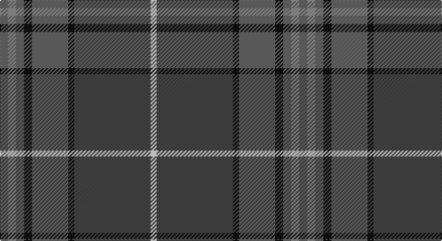

This page is one **sett** — a single exact thread-count. It belongs to the [tartan](/setts/n4o4n4k4n18k3do38w3/)
(the same proportion at any scale), whose colour order is pattern [BRBKBKBW](/stripes/brbkbkbw/).

Sourced from register-of-tartans.  It is a [8 stripe tartan](/stripes/stripes8/).

Original link https://www.tartanregister.gov.uk/tartanDetails.aspx?ref=3671

2 attestations — the source records this cloth was collapsed from (oldest owns this page)

<ul>
<li>01/06/2007 — Scotch Mist (register-of-tartans, <a href="https://www.tartanregister.gov.uk/tartanDetails.aspx?ref=3671">record</a>)</li>
<li>June 2007 — Scotch Mist (Corporate) (tartans-authority, <a href="http://www.tartansauthority.com/tartan-ferret/display/7242/">record</a>)</li>
</ul>

## Register references

External register numbers recorded for this tartan.

- Scottish Register of Tartans: [3671](https://www.tartanregister.gov.uk/tartanDetails.aspx?ref=3671)
- Scottish Tartans Authority (ITI): 7242

## Thread count
Na/8 Nb8 Na8 K8 Na36 K6 N76 LN/6

One full sett is **298 threads**.

## Palette

Palette: <strong>Tartan Register</strong> <small style="color:#888">(3 of 5 colours)</small>
<table><thead><tr><th>Colour</th><th>Threads</th><th>Shade</th><th>Base</th><th>OKLCh</th></tr></thead><tbody><tr><td>Na/</td><td style="text-align:right;font-variant-numeric:tabular-nums">8</td><td><code style="background-color:#646464;">#646464</code> <small style="color:#888">#646464</small></td><td>B <code style="background-color:#2A418A;">#2A418A</code></td><td><small style="color:#888">oklch(50.3% 0.000 89.9)</small></td></tr><tr><td>Nb</td><td style="text-align:right;font-variant-numeric:tabular-nums">8</td><td><code style="background-color:#8C8C8C;">#8C8C8C</code> <small style="color:#888">#8C8C8C</small></td><td>R <code style="background-color:#CC0000;">#CC0000</code></td><td><small style="color:#888">oklch(64.0% 0.000 89.9)</small></td></tr><tr><td>Na</td><td style="text-align:right;font-variant-numeric:tabular-nums">8</td><td><code style="background-color:#646464;">#646464</code> <small style="color:#888">#646464</small></td><td>B <code style="background-color:#2A418A;">#2A418A</code></td><td><small style="color:#888">oklch(50.3% 0.000 89.9)</small></td></tr><tr><td>K</td><td style="text-align:right;font-variant-numeric:tabular-nums">8</td><td><code style="background-color:#101010;">#101010</code> <small style="color:#888">#101010</small></td><td>K <code style="background-color:#000000;">#000000</code></td><td><small style="color:#888">oklch(17.3% 0.000 89.9)</small></td></tr><tr><td>Na</td><td style="text-align:right;font-variant-numeric:tabular-nums">36</td><td><code style="background-color:#646464;">#646464</code> <small style="color:#888">#646464</small></td><td>B <code style="background-color:#2A418A;">#2A418A</code></td><td><small style="color:#888">oklch(50.3% 0.000 89.9)</small></td></tr><tr><td>K</td><td style="text-align:right;font-variant-numeric:tabular-nums">6</td><td><code style="background-color:#101010;">#101010</code> <small style="color:#888">#101010</small></td><td>K <code style="background-color:#000000;">#000000</code></td><td><small style="color:#888">oklch(17.3% 0.000 89.9)</small></td></tr><tr><td>N</td><td style="text-align:right;font-variant-numeric:tabular-nums">76</td><td><code style="background-color:#444444;">#444444</code> <small style="color:#888">#444444</small></td><td>B <code style="background-color:#2A418A;">#2A418A</code></td><td><small style="color:#888">oklch(38.7% 0.000 89.9)</small></td></tr><tr><td>LN/</td><td style="text-align:right;font-variant-numeric:tabular-nums">6</td><td><code style="background-color:#E0E0E0;">#E0E0E0</code> <small style="color:#888">#E0E0E0</small></td><td>W <code style="background-color:#F7F7F7;">#F7F7F7</code></td><td><small style="color:#888">oklch(90.7% 0.000 89.9)</small></td></tr></tbody></table>

# Sample pattern

## Nearest tartans

The nearest existing variants by ΔTartan distance, with this tartan at the top so the swatches line up against it.

ΔTartan

Tartan

Sett

—

<a href="/ttd/edit/#slug=n4o4n4k4n18k3do38w3~x2">Scotch Mist</a> <a class="nn-out" href="/variants/s8/n4o4n4k4n18k3do38w3~x2/" title="open its dictionary page">↗</a>

0.94

<a href="/ttd/edit/#slug=dr1dg4y1dg3dr4dt15w1~x4&amp;base=n4o4n4k4n18k3do38w3~x2">Bressuire</a> <a class="nn-out" href="/variants/s7/dr1dg4y1dg3dr4dt15w1~x4/" title="open its dictionary page">↗</a>

0.97

<a href="/ttd/edit/#slug=o3lr4o4do4o18do3n36w3~x2&amp;base=n4o4n4k4n18k3do38w3~x2">Hebridean Granite Fashion Tartan</a> <a class="nn-out" href="/variants/s8/o3lr4o4do4o18do3n36w3~x2/" title="open its dictionary page">↗</a>

0.98

<a href="/ttd/edit/#slug=r1g4lo1g3r4n15w1~x4&amp;base=n4o4n4k4n18k3do38w3~x2">Bressuire (District)</a> <a class="nn-out" href="/variants/s7/r1g4lo1g3r4n15w1~x4/" title="open its dictionary page">↗</a>

1.00

<a href="/ttd/edit/#slug=y12db2r2db2dt26dg2y3dg3y24r4~x2&amp;base=n4o4n4k4n18k3do38w3~x2">New South Wales Waratah</a> <a class="nn-out" href="/variants/s10/y12db2r2db2dt26dg2y3dg3y24r4~x2/" title="open its dictionary page">↗</a>

1.10

<a href="/ttd/edit/#slug=lo2n28k2w2k2g26n3g5lo2~x2&amp;base=n4o4n4k4n18k3do38w3~x2">Clyde (WCWM Fashion)</a> <a class="nn-out" href="/variants/s9/lo2n28k2w2k2g26n3g5lo2~x2/" title="open its dictionary page">↗</a>

1.16

<a href="/ttd/edit/#slug=lp4dy2dp4dy35n27r3~x2&amp;base=n4o4n4k4n18k3do38w3~x2">Deeside, Royal</a> <a class="nn-out" href="/variants/s6/lp4dy2dp4dy35n27r3~x2/" title="open its dictionary page">↗</a>

1.32

<a href="/ttd/edit/#slug=o3lr4o4k4o18k3n36w3~x2&amp;base=n4o4n4k4n18k3do38w3~x2">Hebridean Granite (Fashion)</a> <a class="nn-out" href="/variants/s8/o3lr4o4k4o18k3n36w3~x2/" title="open its dictionary page">↗</a>

1.37

<a href="/ttd/edit/#slug=ri4y2db4y35t27r3~x2&amp;base=n4o4n4k4n18k3do38w3~x2">Royal Deeside (District)</a> <a class="nn-out" href="/variants/s6/ri4y2db4y35t27r3~x2/" title="open its dictionary page">↗</a>

1.38

<a href="/ttd/edit/#slug=dr4dg27o2db25lo5dg3o3~x2&amp;base=n4o4n4k4n18k3do38w3~x2">Kilkenny, County (District)</a> <a class="nn-out" href="/variants/s7/dr4dg27o2db25lo5dg3o3~x2/" title="open its dictionary page">↗</a>

1.39

<a href="/ttd/edit/#slug=n29y4db4y4do4y4r4~x4&amp;base=n4o4n4k4n18k3do38w3~x2">Marino</a> <a class="nn-out" href="/variants/s7/n29y4db4y4do4y4r4~x4/" title="open its dictionary page">↗</a>

## Neighbour map

Every grey dot is one of 14360 variants placed by the first two principal components of the ΔTartan feature space (44% of its variance). Red is this tartan; blue dots are its nearest — click one to open its page.

<svg viewBox="0 0 640 380" role="img" style="max-width:100%;height:auto;border:1px solid #e0e0e0;border-radius:4px;display:block" xmlns="http://www.w3.org/2000/svg"><image href="/nn/cloud.v1.png" width="640" height="380"/><a href="/variants/s7/dr1dg4y1dg3dr4dt15w1~x4/"><circle cx="338.6" cy="194.3" r="4" fill="#3465a4"><title>Bressuire</title></circle></a><a href="/variants/s8/o3lr4o4do4o18do3n36w3~x2/"><circle cx="302.6" cy="173.7" r="4" fill="#3465a4"><title>Hebridean Granite Fashion Tartan</title></circle></a><a href="/variants/s7/r1g4lo1g3r4n15w1~x4/"><circle cx="332.3" cy="183.6" r="4" fill="#3465a4"><title>Bressuire (District)</title></circle></a><a href="/variants/s10/y12db2r2db2dt26dg2y3dg3y24r4~x2/"><circle cx="323.5" cy="184.7" r="4" fill="#3465a4"><title>New South Wales Waratah</title></circle></a><a href="/variants/s9/lo2n28k2w2k2g26n3g5lo2~x2/"><circle cx="326.5" cy="179.5" r="4" fill="#3465a4"><title>Clyde (WCWM Fashion)</title></circle></a><a href="/variants/s6/lp4dy2dp4dy35n27r3~x2/"><circle cx="337.6" cy="188.7" r="4" fill="#3465a4"><title>Deeside, Royal</title></circle></a><a href="/variants/s8/o3lr4o4k4o18k3n36w3~x2/"><circle cx="291.1" cy="167.2" r="4" fill="#3465a4"><title>Hebridean Granite (Fashion)</title></circle></a><a href="/variants/s6/ri4y2db4y35t27r3~x2/"><circle cx="341.4" cy="187.2" r="4" fill="#3465a4"><title>Royal Deeside (District)</title></circle></a><a href="/variants/s7/dr4dg27o2db25lo5dg3o3~x2/"><circle cx="282.7" cy="195.6" r="4" fill="#3465a4"><title>Kilkenny, County (District)</title></circle></a><a href="/variants/s7/n29y4db4y4do4y4r4~x4/"><circle cx="338.8" cy="207.9" r="4" fill="#3465a4"><title>Marino</title></circle></a><circle cx="329.7" cy="186.4" r="5" fill="#c00000"/></svg>

ID: /variants/s8/n4o4n4k4n18k3do38w3~x2/
