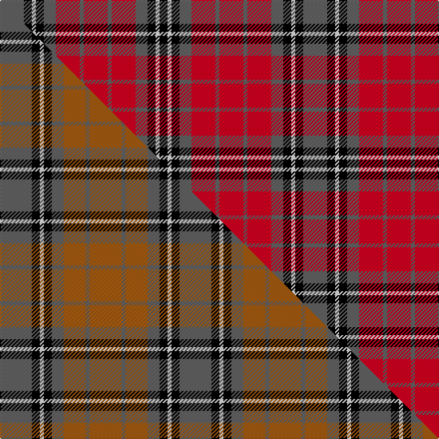

This page is one **sett** — a single exact thread-count. It belongs to the [tartan](/setts/n6k2w1k2n3r6n1r6/)
(the same proportion at any scale), whose colour order is pattern [BKWKBRBRBRBKWK](/stripes/bkwkbrbrbrbkwk/).

Part of the [Sydney](/tartans/sydney/) tartan — the named design grouping this sett with its other cloths.

Sourced from register-of-tartans.  It is a [14 stripe tartan](/stripes/stripes14/).

Original link https://www.tartanregister.gov.uk/tartanDetails.aspx?ref=4057

## Register references

External register numbers recorded for this tartan.

- Scottish Register of Tartans: [4057](https://www.tartanregister.gov.uk/tartanDetails.aspx?ref=4057)
- Scottish Tartans Authority (ITI): 5158

## Thread count
N/24 K8 W4 K8 N12 R24 N4 R24 N4 R24 N12 K8 W4 K/8

One full sett is **304 threads**.

## Palette
<table><thead><tr><th>Colour</th><th>Shade</th><th>OKLCh</th></tr></thead><tbody><tr><td>B</td><td><code style="background-color:#788CB4;">#788CB4</code> <small style="color:#888">#788CB4</small></td><td><small style="color:#888">oklch(63.9% 0.065 264.0)</small></td></tr><tr><td>T</td><td><code style="background-color:#00879F;">#00879F</code> <small style="color:#888">#00879F</small></td><td><small style="color:#888">oklch(57.4% 0.102 216.1)</small></td></tr><tr><td>DB</td><td><code style="background-color:#082077;">#082077</code> <small style="color:#888">#082077</small></td><td><small style="color:#888">oklch(30.0% 0.149 265.1)</small></td></tr><tr><td>DR</td><td><code style="background-color:#55120C;">#55120C</code> <small style="color:#888">#55120C</small></td><td><small style="color:#888">oklch(30.0% 0.099 29.3)</small></td></tr><tr><td>LO</td><td><code style="background-color:#FF9C34;">#FF9C34</code> <small style="color:#888">#FF9C34</small></td><td><small style="color:#888">oklch(77.9% 0.161 61.8)</small></td></tr><tr><td>G</td><td><code style="background-color:#008B2A;">#008B2A</code> <small style="color:#888">#008B2A</small></td><td><small style="color:#888">oklch(55.4% 0.170 145.9)</small></td></tr><tr><td>K</td><td><code style="background-color:#000000;">#000000</code> <small style="color:#888">#000000</small></td><td><small style="color:#888">oklch(0.0% 0.000 0.0)</small></td></tr><tr><td>LB</td><td><code style="background-color:#C8C8C8;">#C8C8C8</code> <small style="color:#888">#C8C8C8</small></td><td><small style="color:#888">oklch(83.3% 0.000 89.9)</small></td></tr><tr><td>N</td><td><code style="background-color:#636363;">#636363</code> <small style="color:#888">#636363</small></td><td><small style="color:#888">oklch(50.0% 0.000 89.9)</small></td></tr><tr><td>DP</td><td><code style="background-color:#4B0B4F;">#4B0B4F</code> <small style="color:#888">#4B0B4F</small></td><td><small style="color:#888">oklch(30.1% 0.125 325.4)</small></td></tr><tr><td>R</td><td><code style="background-color:#D60020;">#D60020</code> <small style="color:#888">#D60020</small></td><td><small style="color:#888">oklch(55.2% 0.224 25.5)</small></td></tr><tr><td>W</td><td><code style="background-color:#F7F7F7;">#F7F7F7</code> <small style="color:#888">#F7F7F7</small></td><td><small style="color:#888">oklch(97.6% 0.000 89.9)</small></td></tr></tbody></table>

# Sample pattern

## Compared to the master

This cloth is one sett of its design; the master sett (the exemplar the design is anchored on) is below for comparison.

Its **ΔTartan distance** from the master is **3.41** — the same measure the nearest-tartans table ranks by (0 is identical; a re-scale of the same cloth is near 0, a recolour or a different proportion further).

<figure class="master-compare" style="margin:0">

this sett
master sett ★

<figcaption style="color:#888;font-size:smaller">One weave of this sett against the <a href="/setts/n16k4w2k4n6o11n2o16/">master sett ★</a>, split on the diagonal: a shared proportion runs seamlessly across it with only the shades shifting; a different proportion breaks on it.</figcaption>
</figure>

## Nearest tartan variants

The nearest existing variants by ΔTartan distance, with this cloth at the top so the swatches line up against it.

ΔTartan

Threads

Variant

Sett

—

304

<a href="/variants/s8/n6k2w1k2n3r6n1r6~x4/">Sydney (Nova Scotia)</a>

<a href="/ttd/edit/#slug=n16k4w2k4n6r11n2r16~x2&amp;base=n6k2w1k2n3r6n1r6~x4" title="compare in the TTD">0.40</a>

180

<a href="/variants/s8/n16k4w2k4n6r11n2r16~x2/">Sidney (Nova Scotia) Canadian Tartan</a>

<a href="/ttd/edit/#slug=r5k5r3g16r3g3r3k10r3b5r12k5r3k3r5~x2&amp;base=n6k2w1k2n3r6n1r6~x4" title="compare in the TTD">2.04</a>

316

<a href="/variants/s15/r5k5r3g16r3g3r3k10r3b5r12k5r3k3r5~x2/">Grant of Ballindalloch</a>

<a href="/ttd/edit/#slug=r15w7r10ki7w3k3w3r10ki5w3k3w3~x2~ki0604259&amp;base=n6k2w1k2n3r6n1r6~x4" title="compare in the TTD">2.59</a>

252

<a href="/variants/s12/r15w7r10ki7w3k3w3r10ki5w3k3w3~x2~ki0604259/">Westgaard of Kileughtero</a>

<a href="/ttd/edit/#slug=n28k3r22k8w3k8r22k3n28k3~x2&amp;base=n6k2w1k2n3r6n1r6~x4" title="compare in the TTD">2.67</a>

450

<a href="/variants/s10/n28k3r22k8w3k8r22k3n28k3~x2/">Henkel</a>

<a href="/ttd/edit/#slug=y3r3k5r2db9r7k1r3k1r7g7r2k2~x2&amp;base=n6k2w1k2n3r6n1r6~x4" title="compare in the TTD">2.73</a>

198

<a href="/variants/s13/y3r3k5r2db9r7k1r3k1r7g7r2k2~x2/">Prince Charles Edward (Edinburgh)</a>

<a href="/ttd/edit/#slug=k2r10g2r10g13r2k6lb2k8r10g2r10k2~x2&amp;base=n6k2w1k2n3r6n1r6~x4" title="compare in the TTD">2.76</a>

308

<a href="/variants/s13/k2r10g2r10g13r2k6lb2k8r10g2r10k2~x2/">MacNicol D</a>

<a href="/ttd/edit/#slug=k2r10g2r10g13r2k6lb2k8r10g2r10k2&amp;base=n6k2w1k2n3r6n1r6~x4" title="compare in the TTD">2.76</a>

154

<a href="/variants/s13/k2r10g2r10g13r2k6lb2k8r10g2r10k2/">MacNicol D</a>

<a href="/ttd/edit/#slug=k2r10g2r10g13r2k6w2k8r10g2r10k2&amp;base=n6k2w1k2n3r6n1r6~x4" title="compare in the TTD">2.80</a>

154

<a href="/variants/s13/k2r10g2r10g13r2k6w2k8r10g2r10k2/">MacNicol D</a>

<a href="/ttd/edit/#slug=r5db5r3g16r3g3r3db10r3lb5r12db5r3db3r5~x2&amp;base=n6k2w1k2n3r6n1r6~x4" title="compare in the TTD">2.89</a>

316

<a href="/variants/s15/r5db5r3g16r3g3r3db10r3lb5r12db5r3db3r5~x2/">Grant of Ballindalloch Clan Tartan</a>

<a href="/ttd/edit/#slug=r15w7r10db7w3k3w3r8db5w3k3w3~x2&amp;base=n6k2w1k2n3r6n1r6~x4" title="compare in the TTD">2.89</a>

244

<a href="/variants/s12/r15w7r10db7w3k3w3r8db5w3k3w3~x2/">Westgaard of Kileughterco (Personal)</a>

## Neighbour map

Every grey dot is one of 13620 variants placed by the first two principal components of the ΔTartan feature space (42% of its variance). Red is this tartan; blue dots are its nearest — click one to open its page.

<svg viewBox="0 0 640 380" role="img" style="max-width:100%;height:auto;border:1px solid #e0e0e0;border-radius:4px;display:block" xmlns="http://www.w3.org/2000/svg"><image href="/nn/cloud.v1.png" width="640" height="380"/><a href="/variants/s8/n16k4w2k4n6r11n2r16~x2/"><circle cx="217.1" cy="200.6" r="4" fill="#3465a4"><title>Sidney (Nova Scotia) Canadian Tartan</title></circle></a><a href="/variants/s15/r5k5r3g16r3g3r3k10r3b5r12k5r3k3r5~x2/"><circle cx="132.5" cy="183.6" r="4" fill="#3465a4"><title>Grant of Ballindalloch</title></circle></a><a href="/variants/s12/r15w7r10ki7w3k3w3r10ki5w3k3w3~x2~ki0604259/"><circle cx="145.7" cy="195.3" r="4" fill="#3465a4"><title>Westgaard of Kileughtero</title></circle></a><a href="/variants/s10/n28k3r22k8w3k8r22k3n28k3~x2/"><circle cx="195.1" cy="172.2" r="4" fill="#3465a4"><title>Henkel</title></circle></a><a href="/variants/s13/y3r3k5r2db9r7k1r3k1r7g7r2k2~x2/"><circle cx="139.9" cy="161.9" r="4" fill="#3465a4"><title>Prince Charles Edward (Edinburgh)</title></circle></a><a href="/variants/s13/k2r10g2r10g13r2k6lb2k8r10g2r10k2~x2/"><circle cx="189.2" cy="178.4" r="4" fill="#3465a4"><title>MacNicol D</title></circle></a><a href="/variants/s13/k2r10g2r10g13r2k6lb2k8r10g2r10k2/"><circle cx="189.2" cy="178.4" r="4" fill="#3465a4"><title>MacNicol D</title></circle></a><a href="/variants/s13/k2r10g2r10g13r2k6w2k8r10g2r10k2/"><circle cx="187.2" cy="177.8" r="4" fill="#3465a4"><title>MacNicol D</title></circle></a><a href="/variants/s15/r5db5r3g16r3g3r3db10r3lb5r12db5r3db3r5~x2/"><circle cx="183.1" cy="208.9" r="4" fill="#3465a4"><title>Grant of Ballindalloch Clan Tartan</title></circle></a><a href="/variants/s12/r15w7r10db7w3k3w3r8db5w3k3w3~x2/"><circle cx="152.9" cy="205.8" r="4" fill="#3465a4"><title>Westgaard of Kileughterco (Personal)</title></circle></a><circle cx="157.2" cy="189.9" r="5" fill="#c00000"/><text x="320" y="376" text-anchor="middle" font-size="11" fill="#999">ground</text><text x="11" y="190" text-anchor="middle" font-size="11" fill="#999" transform="rotate(-90 11 190)">complexity</text></svg>

ID: /variants/s8/n6k2w1k2n3r6n1r6~x4/
