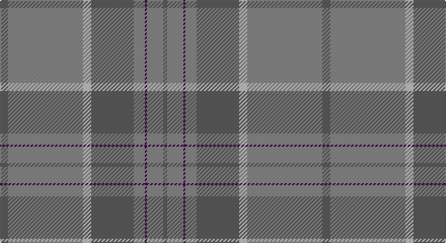

This page is one **sett** — a single exact thread-count. It belongs to the [tartan](/setts/n8o74lb8n42o11dp2o16n4/)
(the same proportion at any scale), whose colour order is pattern [BRBRBWRB](/stripes/brbrbwrb/).

Part of the [Orkney Slate](/tartans/orkney-slate/) tartan — the named design grouping this sett with its other cloths.

Sourced from tartans-authority.  It is a [8 stripe tartan](/stripes/stripes8/).

Original link http://www.tartansauthority.com/tartan-ferret/display/10440/

2 attestations — the source records this cloth was collapsed from (oldest owns this page)

<ul>
<li>1sy April 2011 — Orkney Slate (Fashion) (tartans-authority, <a href="http://www.tartansauthority.com/tartan-ferret/display/10440/">record</a>)</li>
<li>pre 2011 — Orkney Slate (Corporate) (tartans-authority, <a href="http://www.tartansauthority.com/tartan-ferret/display/8669/">record</a>)</li>
</ul>

## Register references

External register numbers recorded for this tartan.

- Scottish Register of Tartans: [10440](https://www.tartanregister.gov.uk/tartanDetails?ref=10440)
- Scottish Tartans Authority (ITI): 10440

## Thread count
N/8 Nb74 Na8 N42 Nb11 DP2 Nb16 N/4

One full sett is **318 threads**.

## Palette

Palette: <strong>Tartan Register</strong> <small style="color:#888">(3 of 4 colours)</small>
<table><thead><tr><th>Colour</th><th>Threads</th><th>Shade</th><th>Base</th><th>OKLCh</th></tr></thead><tbody><tr><td>N/</td><td style="text-align:right;font-variant-numeric:tabular-nums">8</td><td><code style="background-color:#5C5C5C;">#5C5C5C</code> <small style="color:#888">#5C5C5C</small></td><td>B <code style="background-color:#2A418A;">#2A418A</code></td><td><small style="color:#888">oklch(47.5% 0.000 89.9)</small></td></tr><tr><td>Nb</td><td style="text-align:right;font-variant-numeric:tabular-nums">74</td><td><code style="background-color:#888888;">#888888</code> <small style="color:#888">#888888</small></td><td>R <code style="background-color:#CC0000;">#CC0000</code></td><td><small style="color:#888">oklch(62.7% 0.000 89.9)</small></td></tr><tr><td>Na</td><td style="text-align:right;font-variant-numeric:tabular-nums">8</td><td><code style="background-color:#C0C0C0;">#C0C0C0</code> <small style="color:#888">#C0C0C0</small></td><td>W <code style="background-color:#F7F7F7;">#F7F7F7</code></td><td><small style="color:#888">oklch(80.8% 0.000 89.9)</small></td></tr><tr><td>N</td><td style="text-align:right;font-variant-numeric:tabular-nums">42</td><td><code style="background-color:#5C5C5C;">#5C5C5C</code> <small style="color:#888">#5C5C5C</small></td><td>B <code style="background-color:#2A418A;">#2A418A</code></td><td><small style="color:#888">oklch(47.5% 0.000 89.9)</small></td></tr><tr><td>Nb</td><td style="text-align:right;font-variant-numeric:tabular-nums">11</td><td><code style="background-color:#888888;">#888888</code> <small style="color:#888">#888888</small></td><td>R <code style="background-color:#CC0000;">#CC0000</code></td><td><small style="color:#888">oklch(62.7% 0.000 89.9)</small></td></tr><tr><td>DP</td><td style="text-align:right;font-variant-numeric:tabular-nums">2</td><td><code style="background-color:#440044;">#440044</code> <small style="color:#888">#440044</small></td><td>B <code style="background-color:#2A418A;">#2A418A</code></td><td><small style="color:#888">oklch(27.1% 0.125 328.4)</small></td></tr><tr><td>Nb</td><td style="text-align:right;font-variant-numeric:tabular-nums">16</td><td><code style="background-color:#888888;">#888888</code> <small style="color:#888">#888888</small></td><td>R <code style="background-color:#CC0000;">#CC0000</code></td><td><small style="color:#888">oklch(62.7% 0.000 89.9)</small></td></tr><tr><td>N/</td><td style="text-align:right;font-variant-numeric:tabular-nums">4</td><td><code style="background-color:#5C5C5C;">#5C5C5C</code> <small style="color:#888">#5C5C5C</small></td><td>B <code style="background-color:#2A418A;">#2A418A</code></td><td><small style="color:#888">oklch(47.5% 0.000 89.9)</small></td></tr></tbody></table>

# Sample pattern

## Compared to the master

This cloth is one sett of its design; the master sett (the exemplar the design is anchored on) is below for comparison.

<figure style="margin:0"><figcaption style="color:#888;font-size:smaller">this sett</figcaption></figure>
<figure style="margin:0"><figcaption style="color:#888;font-size:smaller"><a href="/setts/dt8y74k8dt42y11k2y16dt4/">master sett →</a></figcaption></figure>

## Nearest tartans

The nearest existing variants by ΔTartan distance, with this tartan at the top so the swatches line up against it.

ΔTartan

Tartan

Sett

—

<a href="/ttd/edit/#slug=n8o74lb8n42o11dp2o16n4">Orkney Slate (Fashion)</a> <a class="nn-out" href="/variants/s8/n8o74lb8n42o11dp2o16n4/" title="open its dictionary page">↗</a>

1.34

<a href="/ttd/edit/#slug=o16lb8n1lb2n1lb1n8o34w2~x2&amp;base=n8o74lb8n42o11dp2o16n4">Stuart of Bute 2013 (Fashion)</a> <a class="nn-out" href="/variants/s9/o16lb8n1lb2n1lb1n8o34w2~x2/" title="open its dictionary page">↗</a>

1.44

<a href="/ttd/edit/#slug=o16lb8dy1lb2dy1lb1dy8o34w2~x2&amp;base=n8o74lb8n42o11dp2o16n4">Stuart of Bute St Colmac</a> <a class="nn-out" href="/variants/s9/o16lb8dy1lb2dy1lb1dy8o34w2~x2/" title="open its dictionary page">↗</a>

1.87

<a href="/ttd/edit/#slug=r2b4y18n2y2n41w2~x2&amp;base=n8o74lb8n42o11dp2o16n4">Haddrell (2013)</a> <a class="nn-out" href="/variants/s7/r2b4y18n2y2n41w2~x2/" title="open its dictionary page">↗</a>

2.04

<a href="/ttd/edit/#slug=o4dg2o7n30o8n7g5dg1w2~x2&amp;base=n8o74lb8n42o11dp2o16n4">Inchforth (Personal)</a> <a class="nn-out" href="/variants/s9/o4dg2o7n30o8n7g5dg1w2~x2/" title="open its dictionary page">↗</a>

2.16

<a href="/ttd/edit/#slug=n44dg12dt1r6~x2&amp;base=n8o74lb8n42o11dp2o16n4">Heslop, William D (Name)</a> <a class="nn-out" href="/variants/s4/n44dg12dt1r6~x2/" title="open its dictionary page">↗</a>

2.18

<a href="/ttd/edit/#slug=g6w1g12o4r4o2r4o32g1o2~x2&amp;base=n8o74lb8n42o11dp2o16n4">Seton, hunting</a> <a class="nn-out" href="/variants/s10/g6w1g12o4r4o2r4o32g1o2~x2/" title="open its dictionary page">↗</a>

2.19

<a href="/ttd/edit/#slug=n48r4n6lo2n2lr2n2r10b6n2b3lr2~x2&amp;base=n8o74lb8n42o11dp2o16n4">Gabrielle (Fashion)</a> <a class="nn-out" href="/variants/s12/n48r4n6lo2n2lr2n2r10b6n2b3lr2~x2/" title="open its dictionary page">↗</a>

2.19

<a href="/ttd/edit/#slug=dy9n4dy2n4dy2n30dy9n4t14lo2~x2&amp;base=n8o74lb8n42o11dp2o16n4">Hanna of Leith (yellow line)</a> <a class="nn-out" href="/variants/s10/dy9n4dy2n4dy2n30dy9n4t14lo2~x2/" title="open its dictionary page">↗</a>

2.21

<a href="/ttd/edit/#slug=y23o4dy6g6y4lb1y4~x4&amp;base=n8o74lb8n42o11dp2o16n4">Tricor (Corporate)</a> <a class="nn-out" href="/variants/s7/y23o4dy6g6y4lb1y4~x4/" title="open its dictionary page">↗</a>

2.21

<a href="/ttd/edit/#slug=r4y40dt12yi2dt12y30k2y4k2y4yi2y3k3~x2&amp;base=n8o74lb8n42o11dp2o16n4">Bartlett, Chris (Personal)</a> <a class="nn-out" href="/variants/s13/r4y40dt12yi2dt12y30k2y4k2y4yi2y3k3~x2/" title="open its dictionary page">↗</a>

## Neighbour map

Every grey dot is one of 14360 variants placed by the first two principal components of the ΔTartan feature space (44% of its variance). Red is this tartan; blue dots are its nearest — click one to open its page.

<svg viewBox="0 0 640 380" role="img" style="max-width:100%;height:auto;border:1px solid #e0e0e0;border-radius:4px;display:block" xmlns="http://www.w3.org/2000/svg"><image href="/nn/cloud.v1.png" width="640" height="380"/><a href="/variants/s9/o16lb8n1lb2n1lb1n8o34w2~x2/"><circle cx="532.9" cy="168.6" r="4" fill="#3465a4"><title>Stuart of Bute 2013 (Fashion)</title></circle></a><a href="/variants/s9/o16lb8dy1lb2dy1lb1dy8o34w2~x2/"><circle cx="528.2" cy="165.1" r="4" fill="#3465a4"><title>Stuart of Bute St Colmac</title></circle></a><a href="/variants/s7/r2b4y18n2y2n41w2~x2/"><circle cx="459.5" cy="181.1" r="4" fill="#3465a4"><title>Haddrell (2013)</title></circle></a><a href="/variants/s9/o4dg2o7n30o8n7g5dg1w2~x2/"><circle cx="408.5" cy="160.6" r="4" fill="#3465a4"><title>Inchforth (Personal)</title></circle></a><a href="/variants/s4/n44dg12dt1r6~x2/"><circle cx="585.5" cy="226.2" r="4" fill="#3465a4"><title>Heslop, William D (Name)</title></circle></a><a href="/variants/s10/g6w1g12o4r4o2r4o32g1o2~x2/"><circle cx="463.7" cy="157.4" r="4" fill="#3465a4"><title>Seton, hunting</title></circle></a><a href="/variants/s12/n48r4n6lo2n2lr2n2r10b6n2b3lr2~x2/"><circle cx="517.9" cy="142.5" r="4" fill="#3465a4"><title>Gabrielle (Fashion)</title></circle></a><a href="/variants/s10/dy9n4dy2n4dy2n30dy9n4t14lo2~x2/"><circle cx="396.7" cy="215.9" r="4" fill="#3465a4"><title>Hanna of Leith (yellow line)</title></circle></a><a href="/variants/s7/y23o4dy6g6y4lb1y4~x4/"><circle cx="506.1" cy="221.2" r="4" fill="#3465a4"><title>Tricor (Corporate)</title></circle></a><a href="/variants/s13/r4y40dt12yi2dt12y30k2y4k2y4yi2y3k3~x2/"><circle cx="486.6" cy="166.0" r="4" fill="#3465a4"><title>Bartlett, Chris (Personal)</title></circle></a><circle cx="524.1" cy="194.2" r="5" fill="#c00000"/></svg>

ID: /variants/s8/n8o74lb8n42o11dp2o16n4/
