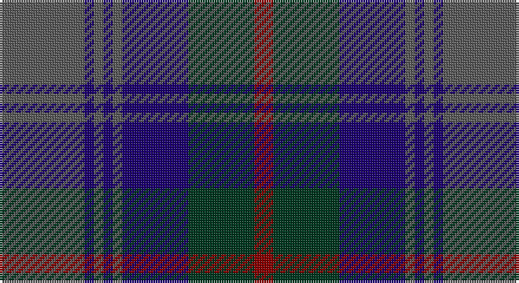

This page is one **sett** — a single exact thread-count. It belongs to the [tartan](/setts/n9db1n1db1n1db7dg7r2/)
(the same proportion at any scale), whose colour order is pattern [BBBBBBGR](/stripes/bbbbbbgr/).

Part of the [Caledonian Hotel](/tartans/caledonian-hotel/) tartan — the named design grouping this sett with its other cloths.

Sourced from tartans-authority.  It is a [8 stripe tartan](/stripes/stripes8/).

Original link http://www.tartansauthority.com/tartan-ferret/display/2215/

## Register references

External register numbers recorded for this tartan.

- Scottish Tartans Authority (ITI): 2215

## Thread count
N/36 DB4 N4 DB4 N4 DB28 DG28 DR/8

One full sett is **188 threads**.

## Palette

Palette: <strong>Tartan Register</strong> <small style="color:#888">(3 of 4 colours)</small>
<table><thead><tr><th>Colour</th><th>Threads</th><th>Shade</th><th>Base</th><th>OKLCh</th></tr></thead><tbody><tr><td>N/</td><td style="text-align:right;font-variant-numeric:tabular-nums">36</td><td><code style="background-color:#5C5C5C;">#5C5C5C</code> <small style="color:#888">#5C5C5C</small></td><td>B <code style="background-color:#2A418A;">#2A418A</code></td><td><small style="color:#888">oklch(47.5% 0.000 89.9)</small></td></tr><tr><td>DB</td><td style="text-align:right;font-variant-numeric:tabular-nums">4</td><td><code style="background-color:#1C0070;">#1C0070</code> <small style="color:#888">#1C0070</small></td><td>B <code style="background-color:#2A418A;">#2A418A</code></td><td><small style="color:#888">oklch(26.3% 0.162 277.1)</small></td></tr><tr><td>N</td><td style="text-align:right;font-variant-numeric:tabular-nums">4</td><td><code style="background-color:#5C5C5C;">#5C5C5C</code> <small style="color:#888">#5C5C5C</small></td><td>B <code style="background-color:#2A418A;">#2A418A</code></td><td><small style="color:#888">oklch(47.5% 0.000 89.9)</small></td></tr><tr><td>DB</td><td style="text-align:right;font-variant-numeric:tabular-nums">4</td><td><code style="background-color:#1C0070;">#1C0070</code> <small style="color:#888">#1C0070</small></td><td>B <code style="background-color:#2A418A;">#2A418A</code></td><td><small style="color:#888">oklch(26.3% 0.162 277.1)</small></td></tr><tr><td>N</td><td style="text-align:right;font-variant-numeric:tabular-nums">4</td><td><code style="background-color:#5C5C5C;">#5C5C5C</code> <small style="color:#888">#5C5C5C</small></td><td>B <code style="background-color:#2A418A;">#2A418A</code></td><td><small style="color:#888">oklch(47.5% 0.000 89.9)</small></td></tr><tr><td>DB</td><td style="text-align:right;font-variant-numeric:tabular-nums">28</td><td><code style="background-color:#1C0070;">#1C0070</code> <small style="color:#888">#1C0070</small></td><td>B <code style="background-color:#2A418A;">#2A418A</code></td><td><small style="color:#888">oklch(26.3% 0.162 277.1)</small></td></tr><tr><td>DG</td><td style="text-align:right;font-variant-numeric:tabular-nums">28</td><td><code style="background-color:#003820;">#003820</code> <small style="color:#888">#003820</small></td><td>G <code style="background-color:#006100;">#006100</code></td><td><small style="color:#888">oklch(30.0% 0.070 158.3)</small></td></tr><tr><td>DR/</td><td style="text-align:right;font-variant-numeric:tabular-nums">8</td><td><code style="background-color:#880000;">#880000</code> <small style="color:#888">#880000</small></td><td>R <code style="background-color:#CC0000;">#CC0000</code></td><td><small style="color:#888">oklch(39.4% 0.162 29.2)</small></td></tr></tbody></table>

# Sample pattern

## Compared to the master

This cloth is one sett of its design; the master sett (the exemplar the design is anchored on) is below for comparison.

<figure style="margin:0"><figcaption style="color:#888;font-size:smaller">this sett</figcaption></figure>
<figure style="margin:0"><figcaption style="color:#888;font-size:smaller"><a href="/setts/n9db1n1db1n1db7k7r2/">master sett →</a></figcaption></figure>

## Nearest tartans

The nearest existing variants by ΔTartan distance, with this tartan at the top so the swatches line up against it.

ΔTartan

Tartan

Sett

—

<a href="/ttd/edit/#slug=n9db1n1db1n1db7dg7r2~x4">Caledonian Hotel (Corporate)</a> <a class="nn-out" href="/variants/s8/n9db1n1db1n1db7dg7r2~x4/" title="open its dictionary page">↗</a>

0.84

<a href="/ttd/edit/#slug=dt17o2dt2o2dt2k17db13k4~x2&amp;base=n9db1n1db1n1db7dg7r2~x4">Balmoral Hotel</a> <a class="nn-out" href="/variants/s8/dt17o2dt2o2dt2k17db13k4~x2/" title="open its dictionary page">↗</a>

0.84

<a href="/ttd/edit/#slug=db16k2db2k2db2k6dg13ly2dg3~x2&amp;base=n9db1n1db1n1db7dg7r2~x4">Christian Dewar (Personal)</a> <a class="nn-out" href="/variants/s9/db16k2db2k2db2k6dg13ly2dg3~x2/" title="open its dictionary page">↗</a>

0.85

<a href="/ttd/edit/#slug=n9db1n1db1n1db7k7r2~x4&amp;base=n9db1n1db1n1db7dg7r2~x4">Caledonian Hotel (Corporate)</a> <a class="nn-out" href="/variants/s8/n9db1n1db1n1db7k7r2~x4/" title="open its dictionary page">↗</a>

0.92

<a href="/ttd/edit/#slug=y24r2y3db14dt24r2dt3db3~x2&amp;base=n9db1n1db1n1db7dg7r2~x4">Grampian (District)</a> <a class="nn-out" href="/variants/s8/y24r2y3db14dt24r2dt3db3~x2/" title="open its dictionary page">↗</a>

0.95

<a href="/ttd/edit/#slug=k3dg4db25k16dg3k3dg3k3dg6r3~x2&amp;base=n9db1n1db1n1db7dg7r2~x4">MacAndreis (Personal)</a> <a class="nn-out" href="/variants/s10/k3dg4db25k16dg3k3dg3k3dg6r3~x2/" title="open its dictionary page">↗</a>

0.96

<a href="/ttd/edit/#slug=db16r2db2r2db2r6dg13lo2dg3~x2&amp;base=n9db1n1db1n1db7dg7r2~x4">Dewar, Christian (Personal)</a> <a class="nn-out" href="/variants/s9/db16r2db2r2db2r6dg13lo2dg3~x2/" title="open its dictionary page">↗</a>

1.10

<a href="/ttd/edit/#slug=k2db3k2db18k11db2k11g25p2~x2&amp;base=n9db1n1db1n1db7dg7r2~x4">Aitchison Family (Kinghorn) (Personal)</a> <a class="nn-out" href="/variants/s9/k2db3k2db18k11db2k11g25p2~x2/" title="open its dictionary page">↗</a>

1.14

<a href="/ttd/edit/#slug=db10k1db1k1db2k8dg10w1~x4&amp;base=n9db1n1db1n1db7dg7r2~x4">Lamont</a> <a class="nn-out" href="/variants/s8/db10k1db1k1db2k8dg10w1~x4/" title="open its dictionary page">↗</a>

1.14

<a href="/ttd/edit/#slug=t1db11k11dg11k2t1~x2&amp;base=n9db1n1db1n1db7dg7r2~x4">Unidentified No 59</a> <a class="nn-out" href="/variants/s6/t1db11k11dg11k2t1~x2/" title="open its dictionary page">↗</a>

1.15

<a href="/ttd/edit/#slug=k1r1dg6k1dg1k1dg1k6db9k1db1~x2&amp;base=n9db1n1db1n1db7dg7r2~x4">Louise of Lorne</a> <a class="nn-out" href="/variants/s11/k1r1dg6k1dg1k1dg1k6db9k1db1~x2/" title="open its dictionary page">↗</a>

## Neighbour map

Every grey dot is one of 14360 variants placed by the first two principal components of the ΔTartan feature space (44% of its variance). Red is this tartan; blue dots are its nearest — click one to open its page.

<svg viewBox="0 0 640 380" role="img" style="max-width:100%;height:auto;border:1px solid #e0e0e0;border-radius:4px;display:block" xmlns="http://www.w3.org/2000/svg"><image href="/nn/cloud.v1.png" width="640" height="380"/><a href="/variants/s8/dt17o2dt2o2dt2k17db13k4~x2/"><circle cx="260.4" cy="249.0" r="4" fill="#3465a4"><title>Balmoral Hotel</title></circle></a><a href="/variants/s9/db16k2db2k2db2k6dg13ly2dg3~x2/"><circle cx="273.1" cy="233.1" r="4" fill="#3465a4"><title>Christian Dewar (Personal)</title></circle></a><a href="/variants/s8/n9db1n1db1n1db7k7r2~x4/"><circle cx="239.9" cy="225.7" r="4" fill="#3465a4"><title>Caledonian Hotel (Corporate)</title></circle></a><a href="/variants/s8/y24r2y3db14dt24r2dt3db3~x2/"><circle cx="277.9" cy="221.1" r="4" fill="#3465a4"><title>Grampian (District)</title></circle></a><a href="/variants/s10/k3dg4db25k16dg3k3dg3k3dg6r3~x2/"><circle cx="257.4" cy="221.9" r="4" fill="#3465a4"><title>MacAndreis (Personal)</title></circle></a><a href="/variants/s9/db16r2db2r2db2r6dg13lo2dg3~x2/"><circle cx="282.3" cy="231.6" r="4" fill="#3465a4"><title>Dewar, Christian (Personal)</title></circle></a><a href="/variants/s9/k2db3k2db18k11db2k11g25p2~x2/"><circle cx="247.7" cy="213.2" r="4" fill="#3465a4"><title>Aitchison Family (Kinghorn) (Personal)</title></circle></a><a href="/variants/s8/db10k1db1k1db2k8dg10w1~x4/"><circle cx="244.1" cy="220.2" r="4" fill="#3465a4"><title>Lamont</title></circle></a><a href="/variants/s6/t1db11k11dg11k2t1~x2/"><circle cx="243.7" cy="251.3" r="4" fill="#3465a4"><title>Unidentified No 59</title></circle></a><a href="/variants/s11/k1r1dg6k1dg1k1dg1k6db9k1db1~x2/"><circle cx="244.7" cy="209.7" r="4" fill="#3465a4"><title>Louise of Lorne</title></circle></a><circle cx="256.3" cy="236.1" r="5" fill="#c00000"/></svg>

ID: /variants/s8/n9db1n1db1n1db7dg7r2~x4/
