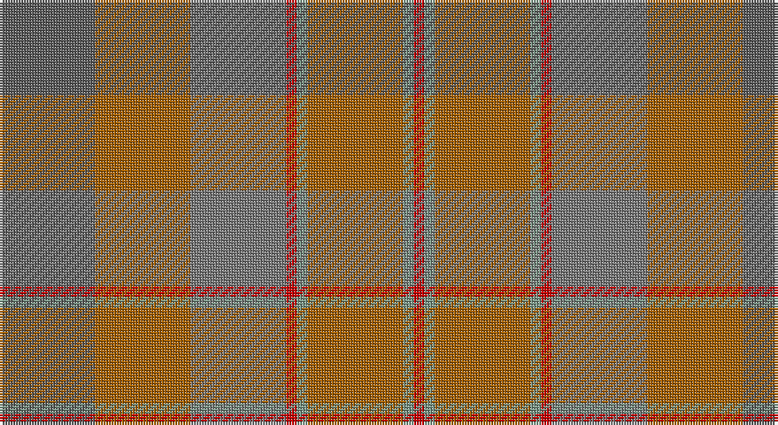

This page is one **sett** — a single exact thread-count. It belongs to the [tartan](/setts/n9o9y9r1yi1o9yi1r1/)
(the same proportion at any scale), whose colour order is pattern [BRGRGRGR](/stripes/brgrgrgr/).

Part of the [Jardine](/tartans/jardine/) tartan — the named design grouping this sett with its other cloths.

Sourced from register-of-tartans.  It is a [8 stripe tartan](/stripes/stripes8/).

Original link https://www.tartanregister.gov.uk/tartanDetails.aspx?ref=1881

## Also known as

This cloth is also recorded under:

- Jardine #2

2 attestations — the source records this cloth was collapsed from (oldest owns this page)

<ul>
<li>01/05/1978 — Jardine (register-of-tartans, <a href="https://www.tartanregister.gov.uk/tartanDetails.aspx?ref=1881">record</a>)</li>
<li>1978 May — Jardine (Clan) (tartans-authority, <a href="http://www.tartansauthority.com/tartan-ferret/display/1432/">record</a>)</li>
</ul>

## Register references

External register numbers recorded for this tartan.

- Scottish Register of Tartans: [1881](https://www.tartanregister.gov.uk/tartanDetails.aspx?ref=1881)
- Scottish Tartans Authority (ITI): 1432
- Scottish Tartans World Register: 1432

## Thread count
N/36 DO36 Na36 R4 LG4 DO36 LG4 R/4

One full sett is **280 threads**.

## Palette

Palette: <strong>Tartan Register</strong> <small style="color:#888">(6 of 9 colours)</small>
<table><thead><tr><th>Colour</th><th>Threads</th><th>Shade</th><th>Base</th><th>OKLCh</th></tr></thead><tbody><tr><td>N/</td><td style="text-align:right;font-variant-numeric:tabular-nums">36</td><td><code style="background-color:#5C5C5C;">#5C5C5C</code> <small style="color:#888">#5C5C5C</small></td><td>B <code style="background-color:#2A418A;">#2A418A</code></td><td><small style="color:#888">oklch(47.5% 0.000 89.9)</small></td></tr><tr><td>DO</td><td style="text-align:right;font-variant-numeric:tabular-nums">36</td><td><code style="background-color:#A46000;">#A46000</code> <small style="color:#888">#A46000</small></td><td>R <code style="background-color:#CC0000;">#CC0000</code></td><td><small style="color:#888">oklch(55.4% 0.125 64.2)</small></td></tr><tr><td>Na</td><td style="text-align:right;font-variant-numeric:tabular-nums">36</td><td><code style="background-color:#787878;">#787878</code> <small style="color:#888">#787878</small></td><td>G <code style="background-color:#006100;">#006100</code></td><td><small style="color:#888">oklch(57.3% 0.000 89.9)</small></td></tr><tr><td>R</td><td style="text-align:right;font-variant-numeric:tabular-nums">4</td><td><code style="background-color:#C80000;">#C80000</code> <small style="color:#888">#C80000</small></td><td>R <code style="background-color:#CC0000;">#CC0000</code></td><td><small style="color:#888">oklch(52.3% 0.215 29.2)</small></td></tr><tr><td>LG</td><td style="text-align:right;font-variant-numeric:tabular-nums">4</td><td><code style="background-color:#789484;">#789484</code> <small style="color:#888">#789484</small></td><td>G <code style="background-color:#006100;">#006100</code></td><td><small style="color:#888">oklch(64.0% 0.040 160.0)</small></td></tr><tr><td>DO</td><td style="text-align:right;font-variant-numeric:tabular-nums">36</td><td><code style="background-color:#A46000;">#A46000</code> <small style="color:#888">#A46000</small></td><td>R <code style="background-color:#CC0000;">#CC0000</code></td><td><small style="color:#888">oklch(55.4% 0.125 64.2)</small></td></tr><tr><td>LG</td><td style="text-align:right;font-variant-numeric:tabular-nums">4</td><td><code style="background-color:#789484;">#789484</code> <small style="color:#888">#789484</small></td><td>G <code style="background-color:#006100;">#006100</code></td><td><small style="color:#888">oklch(64.0% 0.040 160.0)</small></td></tr><tr><td>R/</td><td style="text-align:right;font-variant-numeric:tabular-nums">4</td><td><code style="background-color:#C80000;">#C80000</code> <small style="color:#888">#C80000</small></td><td>R <code style="background-color:#CC0000;">#CC0000</code></td><td><small style="color:#888">oklch(52.3% 0.215 29.2)</small></td></tr></tbody></table>

# Sample pattern

## Compared to the master

This cloth is one sett of its design; the master sett (the exemplar the design is anchored on) is below for comparison.

<figure style="margin:0"><figcaption style="color:#888;font-size:smaller">this sett</figcaption></figure>
<figure style="margin:0"><figcaption style="color:#888;font-size:smaller"><a href="/setts/dy9o9y9r1t1/">master sett →</a></figcaption></figure>

## Nearest tartans

The nearest existing variants by ΔTartan distance, with this tartan at the top so the swatches line up against it.

ΔTartan

Tartan

Sett

—

<a href="/ttd/edit/#slug=n9o9y9r1yi1o9yi1r1~x4">Jardine</a> <a class="nn-out" href="/variants/s8/n9o9y9r1yi1o9yi1r1~x4/" title="open its dictionary page">↗</a>

1.30

<a href="/ttd/edit/#slug=g3yi16o11yi2y11yi2y11yi2o11yi16w3~x2&amp;base=n9o9y9r1yi1o9yi1r1~x4">Harmony 14</a> <a class="nn-out" href="/variants/s11/g3yi16o11yi2y11yi2y11yi2o11yi16w3~x2/" title="open its dictionary page">↗</a>

1.64

<a href="/ttd/edit/#slug=o9oi9y9oii1t1oi9t1oii1~x4&amp;base=n9o9y9r1yi1o9yi1r1~x4">Jardine of Castlemilk Family Tartan</a> <a class="nn-out" href="/variants/s8/o9oi9y9oii1t1oi9t1oii1~x4/" title="open its dictionary page">↗</a>

1.81

<a href="/ttd/edit/#slug=r3o23y8g6y8t6y10t12y3~x2&amp;base=n9o9y9r1yi1o9yi1r1~x4">Lawrence's Seven Pillars of Khaki</a> <a class="nn-out" href="/variants/s9/r3o23y8g6y8t6y10t12y3~x2/" title="open its dictionary page">↗</a>

1.89

<a href="/ttd/edit/#slug=y30n3y3n3y3n10g10yi20m2g5~x2&amp;base=n9o9y9r1yi1o9yi1r1~x4">Roddy's Highland Spirit (Fashion)</a> <a class="nn-out" href="/variants/s10/y30n3y3n3y3n10g10yi20m2g5~x2/" title="open its dictionary page">↗</a>

1.90

<a href="/ttd/edit/#slug=dy31do3dy3do3dy3do22y26r4~x2&amp;base=n9o9y9r1yi1o9yi1r1~x4">Devarr (Fashion)</a> <a class="nn-out" href="/variants/s8/dy31do3dy3do3dy3do22y26r4~x2/" title="open its dictionary page">↗</a>

2.06

<a href="/ttd/edit/#slug=y52ly2n24r3lo26n4~x2&amp;base=n9o9y9r1yi1o9yi1r1~x4">Outlander #1</a> <a class="nn-out" href="/variants/s6/y52ly2n24r3lo26n4~x2/" title="open its dictionary page">↗</a>

2.10

<a href="/variants/s10/o5n3o22r3n6ni17r2ni4r2ni4~x2/">Clyde</a>

2.15

<a href="/ttd/edit/#slug=o52ly2n24r3lo26n4~x2&amp;base=n9o9y9r1yi1o9yi1r1~x4">Outlander #1</a> <a class="nn-out" href="/variants/s6/o52ly2n24r3lo26n4~x2/" title="open its dictionary page">↗</a>

2.18

<a href="/ttd/edit/#slug=n1o6n6oi6n1oi1~x4&amp;base=n9o9y9r1yi1o9yi1r1~x4">Glen Burns (WCWM-2)</a> <a class="nn-out" href="/variants/s6/n1o6n6oi6n1oi1~x4/" title="open its dictionary page">↗</a>

2.18

<a href="/variants/s5/n7oi1ni6oi8o1~x8/">Callum (Buchan)</a>

## Neighbour map

Every grey dot is one of 14360 variants placed by the first two principal components of the ΔTartan feature space (44% of its variance). Red is this tartan; blue dots are its nearest — click one to open its page.

<svg viewBox="0 0 640 380" role="img" style="max-width:100%;height:auto;border:1px solid #e0e0e0;border-radius:4px;display:block" xmlns="http://www.w3.org/2000/svg"><image href="/nn/cloud.v1.png" width="640" height="380"/><a href="/variants/s11/g3yi16o11yi2y11yi2y11yi2o11yi16w3~x2/"><circle cx="310.1" cy="263.8" r="4" fill="#3465a4"><title>Harmony 14</title></circle></a><a href="/variants/s8/o9oi9y9oii1t1oi9t1oii1~x4/"><circle cx="315.5" cy="241.3" r="4" fill="#3465a4"><title>Jardine of Castlemilk Family Tartan</title></circle></a><a href="/variants/s9/r3o23y8g6y8t6y10t12y3~x2/"><circle cx="256.8" cy="261.7" r="4" fill="#3465a4"><title>Lawrence's Seven Pillars of Khaki</title></circle></a><a href="/variants/s10/y30n3y3n3y3n10g10yi20m2g5~x2/"><circle cx="361.1" cy="239.2" r="4" fill="#3465a4"><title>Roddy's Highland Spirit (Fashion)</title></circle></a><a href="/variants/s8/dy31do3dy3do3dy3do22y26r4~x2/"><circle cx="364.6" cy="266.2" r="4" fill="#3465a4"><title>Devarr (Fashion)</title></circle></a><a href="/variants/s6/y52ly2n24r3lo26n4~x2/"><circle cx="424.2" cy="230.2" r="4" fill="#3465a4"><title>Outlander #1</title></circle></a><a href="/variants/s10/o5n3o22r3n6ni17r2ni4r2ni4~x2/"><circle cx="338.3" cy="236.9" r="4" fill="#3465a4"><title>Clyde</title></circle></a><a href="/variants/s6/o52ly2n24r3lo26n4~x2/"><circle cx="409.1" cy="221.0" r="4" fill="#3465a4"><title>Outlander #1</title></circle></a><a href="/variants/s6/n1o6n6oi6n1oi1~x4/"><circle cx="351.2" cy="326.9" r="4" fill="#3465a4"><title>Glen Burns (WCWM-2)</title></circle></a><a href="/variants/s5/n7oi1ni6oi8o1~x8/"><circle cx="375.7" cy="338.5" r="4" fill="#3465a4"><title>Callum (Buchan)</title></circle></a><circle cx="357.2" cy="266.1" r="5" fill="#c00000"/></svg>

ID: /variants/s8/n9o9y9r1yi1o9yi1r1~x4/
