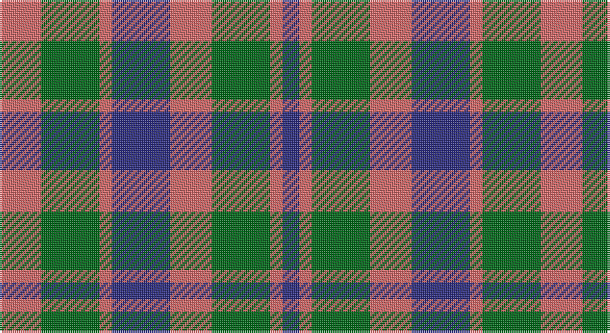

This page is one **sett** — a single exact thread-count. It belongs to the [tartan](/setts/o10g14o3db14o10g14o3db4/)
(the same proportion at any scale), whose colour order is pattern [BRGRBRGR](/stripes/brgrbrgr/).

Part of the [Glasgow](/tartans/glasgow/) tartan — the named design grouping this sett with its other cloths.

Sourced from house-of-tartan.  It is a [8 stripe tartan](/stripes/stripes8/).

Original link http://www.house-of-tartan.scotland.net/house/TartanViewjs.asp?colr=Def&tnam=534

## Provenance

Earliest known date: pre 1992 Originally from the Sindex cards and now woven by House of Edgar in their Old and Rare collection. Need to check if it actually appears in the Old and Rare book.

## Also known as

This cloth is also recorded under:

- Glasgow #2

## Thread count
LR/20 G28 LR6 DB28 LR20 G28 LR6 DB/8

One full sett is **260 threads**.

## Palette

Palette: <strong>Tartan Register</strong> <small style="color:#888">(2 of 3 colours)</small>
<table><thead><tr><th>Colour</th><th>Threads</th><th>Shade</th><th>Base</th><th>OKLCh</th></tr></thead><tbody><tr><td>LR/</td><td style="text-align:right;font-variant-numeric:tabular-nums">20</td><td><code style="background-color:#D46868;">#D46868</code> <small style="color:#888">#D46868</small></td><td>R <code style="background-color:#CC0000;">#CC0000</code></td><td><small style="color:#888">oklch(64.5% 0.137 21.6)</small></td></tr><tr><td>G</td><td style="text-align:right;font-variant-numeric:tabular-nums">28</td><td><code style="background-color:#006818;">#006818</code> <small style="color:#888">#006818</small></td><td>G <code style="background-color:#006100;">#006100</code></td><td><small style="color:#888">oklch(45.0% 0.142 145.0)</small></td></tr><tr><td>LR</td><td style="text-align:right;font-variant-numeric:tabular-nums">6</td><td><code style="background-color:#D46868;">#D46868</code> <small style="color:#888">#D46868</small></td><td>R <code style="background-color:#CC0000;">#CC0000</code></td><td><small style="color:#888">oklch(64.5% 0.137 21.6)</small></td></tr><tr><td>DB</td><td style="text-align:right;font-variant-numeric:tabular-nums">28</td><td><code style="background-color:#2C2C80;">#2C2C80</code> <small style="color:#888">#2C2C80</small></td><td>B <code style="background-color:#2A418A;">#2A418A</code></td><td><small style="color:#888">oklch(35.0% 0.138 276.6)</small></td></tr><tr><td>LR</td><td style="text-align:right;font-variant-numeric:tabular-nums">20</td><td><code style="background-color:#D46868;">#D46868</code> <small style="color:#888">#D46868</small></td><td>R <code style="background-color:#CC0000;">#CC0000</code></td><td><small style="color:#888">oklch(64.5% 0.137 21.6)</small></td></tr><tr><td>G</td><td style="text-align:right;font-variant-numeric:tabular-nums">28</td><td><code style="background-color:#006818;">#006818</code> <small style="color:#888">#006818</small></td><td>G <code style="background-color:#006100;">#006100</code></td><td><small style="color:#888">oklch(45.0% 0.142 145.0)</small></td></tr><tr><td>LR</td><td style="text-align:right;font-variant-numeric:tabular-nums">6</td><td><code style="background-color:#D46868;">#D46868</code> <small style="color:#888">#D46868</small></td><td>R <code style="background-color:#CC0000;">#CC0000</code></td><td><small style="color:#888">oklch(64.5% 0.137 21.6)</small></td></tr><tr><td>DB/</td><td style="text-align:right;font-variant-numeric:tabular-nums">8</td><td><code style="background-color:#2C2C80;">#2C2C80</code> <small style="color:#888">#2C2C80</small></td><td>B <code style="background-color:#2A418A;">#2A418A</code></td><td><small style="color:#888">oklch(35.0% 0.138 276.6)</small></td></tr></tbody></table>

# Sample pattern

## Compared to the master

This cloth is one sett of its design; the master sett (the exemplar the design is anchored on) is below for comparison.

<figure style="margin:0"><figcaption style="color:#888;font-size:smaller">this sett</figcaption></figure>
<figure style="margin:0"><figcaption style="color:#888;font-size:smaller"><a href="/setts/dg25r4db24r21dg25r3db4/">master sett →</a></figcaption></figure>

## Nearest tartans

The nearest existing variants by ΔTartan distance, with this tartan at the top so the swatches line up against it.

ΔTartan

Tartan

Sett

—

<a href="/ttd/edit/#slug=o10g14o3db14o10g14o3db4~x2">Glasgow District Tartan</a> <a class="nn-out" href="/variants/s8/o10g14o3db14o10g14o3db4~x2/" title="open its dictionary page">↗</a>

0.95

<a href="/ttd/edit/#slug=r3db3r3db10g10r3g3r3~x2&amp;base=o10g14o3db14o10g14o3db4~x2">Flora, MacDonald</a> <a class="nn-out" href="/variants/s8/r3db3r3db10g10r3g3r3~x2/" title="open its dictionary page">↗</a>

1.13

<a href="/ttd/edit/#slug=g16r12db16r6db4r6db7r20db8g8db12~x2&amp;base=o10g14o3db14o10g14o3db4~x2">Fiddes</a> <a class="nn-out" href="/variants/s11/g16r12db16r6db4r6db7r20db8g8db12~x2/" title="open its dictionary page">↗</a>

1.15

<a href="/ttd/edit/#slug=r3dg3r3dg10db10r3db3r3~x2&amp;base=o10g14o3db14o10g14o3db4~x2">Flora MacDonald</a> <a class="nn-out" href="/variants/s8/r3dg3r3dg10db10r3db3r3~x2/" title="open its dictionary page">↗</a>

1.23

<a href="/variants/s8/g4r3t1k1t3~x4/">Wilson's No.214</a>

1.25

<a href="/ttd/edit/#slug=lr10dt3lr3dt3lr3dt11dy11o3~x2&amp;base=o10g14o3db14o10g14o3db4~x2">Holden Monaro Corporate Tartan</a> <a class="nn-out" href="/variants/s8/lr10dt3lr3dt3lr3dt11dy11o3~x2/" title="open its dictionary page">↗</a>

1.32

<a href="/ttd/edit/#slug=db7r3g7r1g7r3db7t1~x2&amp;base=o10g14o3db14o10g14o3db4~x2">Hebrides #8</a> <a class="nn-out" href="/variants/s8/db7r3g7r1g7r3db7t1~x2/" title="open its dictionary page">↗</a>

1.33

<a href="/variants/s8/r4dg4r1db4r4~x12/">Gow</a>

1.33

<a href="/ttd/edit/#slug=o6k1o1k1o2k4lo6k1o2k2~x8&amp;base=o10g14o3db14o10g14o3db4~x2">Tyndrum</a> <a class="nn-out" href="/variants/s10/o6k1o1k1o2k4lo6k1o2k2~x8/" title="open its dictionary page">↗</a>

1.34

<a href="/ttd/edit/#slug=r2g4db8r9g9k2r2~x4&amp;base=o10g14o3db14o10g14o3db4~x2">Stewart (Artefact)</a> <a class="nn-out" href="/variants/s7/r2g4db8r9g9k2r2~x4/" title="open its dictionary page">↗</a>

1.38

<a href="/ttd/edit/#slug=o6k1o1k1o2k4dy6k1o2k2~x4&amp;base=o10g14o3db14o10g14o3db4~x2">Tyndrum District Tartan</a> <a class="nn-out" href="/variants/s10/o6k1o1k1o2k4dy6k1o2k2~x4/" title="open its dictionary page">↗</a>

## Neighbour map

Every grey dot is one of 14360 variants placed by the first two principal components of the ΔTartan feature space (44% of its variance). Red is this tartan; blue dots are its nearest — click one to open its page.

<svg viewBox="0 0 640 380" role="img" style="max-width:100%;height:auto;border:1px solid #e0e0e0;border-radius:4px;display:block" xmlns="http://www.w3.org/2000/svg"><image href="/nn/cloud.v1.png" width="640" height="380"/><a href="/variants/s8/r3db3r3db10g10r3g3r3~x2/"><circle cx="170.1" cy="275.4" r="4" fill="#3465a4"><title>Flora, MacDonald</title></circle></a><a href="/variants/s11/g16r12db16r6db4r6db7r20db8g8db12~x2/"><circle cx="195.0" cy="267.2" r="4" fill="#3465a4"><title>Fiddes</title></circle></a><a href="/variants/s8/r3dg3r3dg10db10r3db3r3~x2/"><circle cx="175.1" cy="276.4" r="4" fill="#3465a4"><title>Flora MacDonald</title></circle></a><a href="/variants/s8/g4r3t1k1t3~x4/"><circle cx="117.0" cy="251.3" r="4" fill="#3465a4"><title>Wilson's No.214</title></circle></a><a href="/variants/s8/lr10dt3lr3dt3lr3dt11dy11o3~x2/"><circle cx="141.2" cy="251.5" r="4" fill="#3465a4"><title>Holden Monaro Corporate Tartan</title></circle></a><a href="/variants/s8/db7r3g7r1g7r3db7t1~x2/"><circle cx="193.5" cy="248.2" r="4" fill="#3465a4"><title>Hebrides #8</title></circle></a><a href="/variants/s8/r4dg4r1db4r4~x12/"><circle cx="170.5" cy="296.8" r="4" fill="#3465a4"><title>Gow</title></circle></a><a href="/variants/s10/o6k1o1k1o2k4lo6k1o2k2~x8/"><circle cx="202.7" cy="226.1" r="4" fill="#3465a4"><title>Tyndrum</title></circle></a><a href="/variants/s7/r2g4db8r9g9k2r2~x4/"><circle cx="159.8" cy="253.8" r="4" fill="#3465a4"><title>Stewart (Artefact)</title></circle></a><a href="/variants/s10/o6k1o1k1o2k4dy6k1o2k2~x4/"><circle cx="213.3" cy="232.7" r="4" fill="#3465a4"><title>Tyndrum District Tartan</title></circle></a><circle cx="180.1" cy="274.4" r="5" fill="#c00000"/></svg>

ID: /variants/s8/o10g14o3db14o10g14o3db4~x2/
