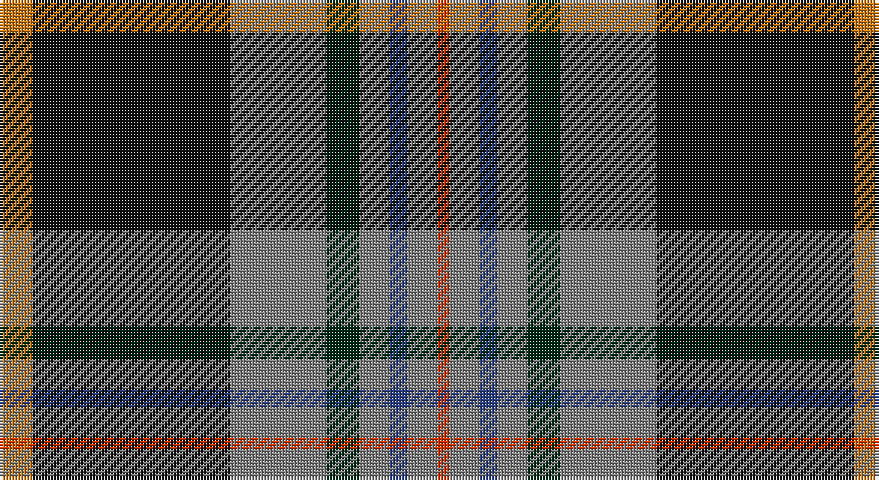

This page is one **sett** — a single exact thread-count. It belongs to the [tartan](/setts/o11k66y32dg11y10db6y10r4/)
(the same proportion at any scale), whose colour order is pattern [RGBGGGKR](/stripes/rgbgggkr/).

Sourced from register-of-tartans.  It is a [8 stripe tartan](/stripes/stripes8/).

Original link https://www.tartanregister.gov.uk/tartanDetails.aspx?ref=5327

## Register references

External register numbers recorded for this tartan.

- Scottish Register of Tartans: [5327](https://www.tartanregister.gov.uk/tartanDetails.aspx?ref=5327)
- Scottish Tartans Authority (ITI): 7398
- Scottish Tartans World Register: 3052

## Thread count
O/11 K66 N32 DG11 N10 B6 N10 R/4

One full sett is **285 threads**.

## Palette

Palette: <strong>Tartan Register</strong> <small style="color:#888">(4 of 6 colours)</small>
<table><thead><tr><th>Colour</th><th>Threads</th><th>Shade</th><th>Base</th><th>OKLCh</th></tr></thead><tbody><tr><td>O/</td><td style="text-align:right;font-variant-numeric:tabular-nums">11</td><td><code style="background-color:#C87814;">#C87814</code> <small style="color:#888">#C87814</small></td><td>R <code style="background-color:#CC0000;">#CC0000</code></td><td><small style="color:#888">oklch(64.5% 0.141 63.8)</small></td></tr><tr><td>K</td><td style="text-align:right;font-variant-numeric:tabular-nums">66</td><td><code style="background-color:#101010;">#101010</code> <small style="color:#888">#101010</small></td><td>K <code style="background-color:#000000;">#000000</code></td><td><small style="color:#888">oklch(17.3% 0.000 89.9)</small></td></tr><tr><td>N</td><td style="text-align:right;font-variant-numeric:tabular-nums">32</td><td><code style="background-color:#808080;">#808080</code> <small style="color:#888">#808080</small></td><td>G <code style="background-color:#006100;">#006100</code></td><td><small style="color:#888">oklch(60.0% 0.000 89.9)</small></td></tr><tr><td>DG</td><td style="text-align:right;font-variant-numeric:tabular-nums">11</td><td><code style="background-color:#002814;">#002814</code> <small style="color:#888">#002814</small></td><td>G <code style="background-color:#006100;">#006100</code></td><td><small style="color:#888">oklch(24.4% 0.059 156.5)</small></td></tr><tr><td>N</td><td style="text-align:right;font-variant-numeric:tabular-nums">10</td><td><code style="background-color:#808080;">#808080</code> <small style="color:#888">#808080</small></td><td>G <code style="background-color:#006100;">#006100</code></td><td><small style="color:#888">oklch(60.0% 0.000 89.9)</small></td></tr><tr><td>B</td><td style="text-align:right;font-variant-numeric:tabular-nums">6</td><td><code style="background-color:#2C4084;">#2C4084</code> <small style="color:#888">#2C4084</small></td><td>B <code style="background-color:#2A418A;">#2A418A</code></td><td><small style="color:#888">oklch(39.4% 0.117 268.3)</small></td></tr><tr><td>N</td><td style="text-align:right;font-variant-numeric:tabular-nums">10</td><td><code style="background-color:#808080;">#808080</code> <small style="color:#888">#808080</small></td><td>G <code style="background-color:#006100;">#006100</code></td><td><small style="color:#888">oklch(60.0% 0.000 89.9)</small></td></tr><tr><td>R/</td><td style="text-align:right;font-variant-numeric:tabular-nums">4</td><td><code style="background-color:#E13200;">#E13200</code> <small style="color:#888">#E13200</small></td><td>R <code style="background-color:#CC0000;">#CC0000</code></td><td><small style="color:#888">oklch(59.2% 0.215 33.6)</small></td></tr></tbody></table>

# Sample pattern

## Nearest tartans

The nearest existing variants by ΔTartan distance, with this tartan at the top so the swatches line up against it.

ΔTartan

Tartan

Sett

—

<a href="/ttd/edit/#slug=o11k66y32dg11y10db6y10r4">Turnbull, Dress Bruce (Personal)</a> <a class="nn-out" href="/variants/s8/o11k66y32dg11y10db6y10r4/" title="open its dictionary page">↗</a>

0.45

<a href="/ttd/edit/#slug=lo11k66o32dg11o10db6o10loi4&amp;base=o11k66y32dg11y10db6y10r4">Royal College of General Practitioners</a> <a class="nn-out" href="/variants/s8/lo11k66o32dg11o10db6o10loi4/" title="open its dictionary page">↗</a>

0.60

<a href="/ttd/edit/#slug=r5t2k30n26ly2n2db4~x2&amp;base=o11k66y32dg11y10db6y10r4">Milne-Murtaugh (Personal)</a> <a class="nn-out" href="/variants/s7/r5t2k30n26ly2n2db4~x2/" title="open its dictionary page">↗</a>

0.79

<a href="/ttd/edit/#slug=lo3k2o15k10dt23r2dt1w2~x2&amp;base=o11k66y32dg11y10db6y10r4">Vienna Highlander (Fashion)</a> <a class="nn-out" href="/variants/s8/lo3k2o15k10dt23r2dt1w2~x2/" title="open its dictionary page">↗</a>

0.84

<a href="/variants/s7/m5yii2k30yi26y2yi2ki4~x2/">Milne-Murtagh (2009)</a>

0.93

<a href="/ttd/edit/#slug=db46ly4db4ly4db6k16n66lb11r6&amp;base=o11k66y32dg11y10db6y10r4">Scottish Association for Neurological Sciences</a> <a class="nn-out" href="/variants/s9/db46ly4db4ly4db6k16n66lb11r6/" title="open its dictionary page">↗</a>

0.94

<a href="/ttd/edit/#slug=k45lo10g7r3w4db13w9r6~x2&amp;base=o11k66y32dg11y10db6y10r4">Legion of Frontiersmen (Corporate)</a> <a class="nn-out" href="/variants/s8/k45lo10g7r3w4db13w9r6~x2/" title="open its dictionary page">↗</a>

0.96

<a href="/ttd/edit/#slug=b3k2r2k12g10ly1k1g2lb2~x4&amp;base=o11k66y32dg11y10db6y10r4">Roderick Dhu</a> <a class="nn-out" href="/variants/s9/b3k2r2k12g10ly1k1g2lb2~x4/" title="open its dictionary page">↗</a>

0.99

<a href="/ttd/edit/#slug=lo9k8lo30k4lb8k4db24k54r14k4lr8&amp;base=o11k66y32dg11y10db6y10r4">Dublin County Crest (Fashion)</a> <a class="nn-out" href="/variants/s11/lo9k8lo30k4lb8k4db24k54r14k4lr8/" title="open its dictionary page">↗</a>

1.01

<a href="/ttd/edit/#slug=y16k2y6k2r2k2db15g1db1w2~x2&amp;base=o11k66y32dg11y10db6y10r4">Otago</a> <a class="nn-out" href="/variants/s10/y16k2y6k2r2k2db15g1db1w2~x2/" title="open its dictionary page">↗</a>

1.02

<a href="/ttd/edit/#slug=w5k26ly2dg24dt7k3r3~x2&amp;base=o11k66y32dg11y10db6y10r4">Cornish Hunting District Tartan</a> <a class="nn-out" href="/variants/s7/w5k26ly2dg24dt7k3r3~x2/" title="open its dictionary page">↗</a>

## Neighbour map

Every grey dot is one of 14360 variants placed by the first two principal components of the ΔTartan feature space (44% of its variance). Red is this tartan; blue dots are its nearest — click one to open its page.

<svg viewBox="0 0 640 380" role="img" style="max-width:100%;height:auto;border:1px solid #e0e0e0;border-radius:4px;display:block" xmlns="http://www.w3.org/2000/svg"><image href="/nn/cloud.v1.png" width="640" height="380"/><a href="/variants/s8/lo11k66o32dg11o10db6o10loi4/"><circle cx="205.6" cy="127.1" r="4" fill="#3465a4"><title>Royal College of General Practitioners</title></circle></a><a href="/variants/s7/r5t2k30n26ly2n2db4~x2/"><circle cx="235.0" cy="144.9" r="4" fill="#3465a4"><title>Milne-Murtaugh (Personal)</title></circle></a><a href="/variants/s8/lo3k2o15k10dt23r2dt1w2~x2/"><circle cx="201.4" cy="119.9" r="4" fill="#3465a4"><title>Vienna Highlander (Fashion)</title></circle></a><a href="/variants/s7/m5yii2k30yi26y2yi2ki4~x2/"><circle cx="243.1" cy="148.9" r="4" fill="#3465a4"><title>Milne-Murtagh (2009)</title></circle></a><a href="/variants/s9/db46ly4db4ly4db6k16n66lb11r6/"><circle cx="215.7" cy="128.5" r="4" fill="#3465a4"><title>Scottish Association for Neurological Sciences</title></circle></a><a href="/variants/s8/k45lo10g7r3w4db13w9r6~x2/"><circle cx="182.2" cy="122.1" r="4" fill="#3465a4"><title>Legion of Frontiersmen (Corporate)</title></circle></a><a href="/variants/s9/b3k2r2k12g10ly1k1g2lb2~x4/"><circle cx="187.0" cy="146.6" r="4" fill="#3465a4"><title>Roderick Dhu</title></circle></a><a href="/variants/s11/lo9k8lo30k4lb8k4db24k54r14k4lr8/"><circle cx="173.4" cy="123.5" r="4" fill="#3465a4"><title>Dublin County Crest (Fashion)</title></circle></a><a href="/variants/s10/y16k2y6k2r2k2db15g1db1w2~x2/"><circle cx="205.7" cy="111.4" r="4" fill="#3465a4"><title>Otago</title></circle></a><a href="/variants/s7/w5k26ly2dg24dt7k3r3~x2/"><circle cx="196.0" cy="164.1" r="4" fill="#3465a4"><title>Cornish Hunting District Tartan</title></circle></a><circle cx="218.5" cy="134.3" r="5" fill="#c00000"/></svg>

ID: /variants/s8/o11k66y32dg11y10db6y10r4/
