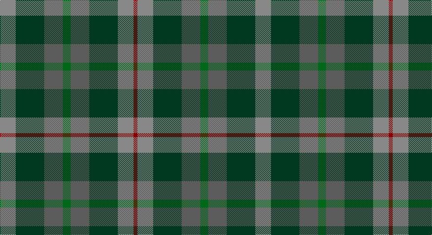

This page is one **sett** — a single exact thread-count. It belongs to the [tartan](/setts/o16dg29n19g8n19dg29o16r4/)
(the same proportion at any scale), whose colour order is pattern [RGBGBGRR](/stripes/rgbgbgrr/).

Part of the [Styrian](/tartans/styrian/) tartan — the named design grouping this sett with its other cloths.

Sourced from register-of-tartans.  It is a [8 stripe tartan](/stripes/stripes8/).

Original link https://www.tartanregister.gov.uk/tartanDetails.aspx?ref=4034

## Register references

External register numbers recorded for this tartan.

- Scottish Register of Tartans: [4034](https://www.tartanregister.gov.uk/tartanDetails.aspx?ref=4034)
- Scottish Tartans Authority (ITI): 5839

## Thread count
Nb/32 DG58 Na38 G16 Na38 DG58 Nb32 DRa/8

One full sett is **520 threads**.

## Palette

Palette: <strong>Tartan Register</strong> <small style="color:#888">(10 of 11 colours)</small>
<table><thead><tr><th>Colour</th><th>Threads</th><th>Shade</th><th>Base</th><th>OKLCh</th></tr></thead><tbody><tr><td>Nb/</td><td style="text-align:right;font-variant-numeric:tabular-nums">32</td><td><code style="background-color:#888888;">#888888</code> <small style="color:#888">#888888</small></td><td>R <code style="background-color:#CC0000;">#CC0000</code></td><td><small style="color:#888">oklch(62.7% 0.000 89.9)</small></td></tr><tr><td>DG</td><td style="text-align:right;font-variant-numeric:tabular-nums">58</td><td><code style="background-color:#003820;">#003820</code> <small style="color:#888">#003820</small></td><td>G <code style="background-color:#006100;">#006100</code></td><td><small style="color:#888">oklch(30.0% 0.070 158.3)</small></td></tr><tr><td>Na</td><td style="text-align:right;font-variant-numeric:tabular-nums">38</td><td><code style="background-color:#5C5C5C;">#5C5C5C</code> <small style="color:#888">#5C5C5C</small></td><td>B <code style="background-color:#2A418A;">#2A418A</code></td><td><small style="color:#888">oklch(47.5% 0.000 89.9)</small></td></tr><tr><td>G</td><td style="text-align:right;font-variant-numeric:tabular-nums">16</td><td><code style="background-color:#006818;">#006818</code> <small style="color:#888">#006818</small></td><td>G <code style="background-color:#006100;">#006100</code></td><td><small style="color:#888">oklch(45.0% 0.142 145.0)</small></td></tr><tr><td>Na</td><td style="text-align:right;font-variant-numeric:tabular-nums">38</td><td><code style="background-color:#5C5C5C;">#5C5C5C</code> <small style="color:#888">#5C5C5C</small></td><td>B <code style="background-color:#2A418A;">#2A418A</code></td><td><small style="color:#888">oklch(47.5% 0.000 89.9)</small></td></tr><tr><td>DG</td><td style="text-align:right;font-variant-numeric:tabular-nums">58</td><td><code style="background-color:#003820;">#003820</code> <small style="color:#888">#003820</small></td><td>G <code style="background-color:#006100;">#006100</code></td><td><small style="color:#888">oklch(30.0% 0.070 158.3)</small></td></tr><tr><td>Nb</td><td style="text-align:right;font-variant-numeric:tabular-nums">32</td><td><code style="background-color:#888888;">#888888</code> <small style="color:#888">#888888</small></td><td>R <code style="background-color:#CC0000;">#CC0000</code></td><td><small style="color:#888">oklch(62.7% 0.000 89.9)</small></td></tr><tr><td>DRa/</td><td style="text-align:right;font-variant-numeric:tabular-nums">8</td><td><code style="background-color:#880000;">#880000</code> <small style="color:#888">#880000</small></td><td>R <code style="background-color:#CC0000;">#CC0000</code></td><td><small style="color:#888">oklch(39.4% 0.162 29.2)</small></td></tr></tbody></table>

# Sample pattern

## Nearest tartans

The nearest existing variants by ΔTartan distance, with this tartan at the top so the swatches line up against it.

ΔTartan

Tartan

Sett

—

<a href="/ttd/edit/#slug=o16dg29n19g8n19dg29o16r4~x2">Styrian</a> <a class="nn-out" href="/variants/s8/o16dg29n19g8n19dg29o16r4~x2/" title="open its dictionary page">↗</a>

1.10

<a href="/ttd/edit/#slug=dy8r1dy8g8k8db8dy8r2~x2&amp;base=o16dg29n19g8n19dg29o16r4~x2">MacDuff Hunting Clan Tartan</a> <a class="nn-out" href="/variants/s8/dy8r1dy8g8k8db8dy8r2~x2/" title="open its dictionary page">↗</a>

1.14

<a href="/ttd/edit/#slug=r1dy7db7k7g7dy7r1~x4&amp;base=o16dg29n19g8n19dg29o16r4~x2">Tennant Family Tartan</a> <a class="nn-out" href="/variants/s7/r1dy7db7k7g7dy7r1~x4/" title="open its dictionary page">↗</a>

1.15

<a href="/ttd/edit/#slug=r1dy7g7db7g7db7r1~x8&amp;base=o16dg29n19g8n19dg29o16r4~x2">Tennant (Yules)</a> <a class="nn-out" href="/variants/s7/r1dy7g7db7g7db7r1~x8/" title="open its dictionary page">↗</a>

1.17

<a href="/ttd/edit/#slug=g8n19dg29o16r4~x2&amp;base=o16dg29n19g8n19dg29o16r4~x2">Styrian (Fashion)</a> <a class="nn-out" href="/variants/s5/g8n19dg29o16r4~x2/" title="open its dictionary page">↗</a>

1.18

<a href="/ttd/edit/#slug=r1dy7g7k7b7dy7r1~x4&amp;base=o16dg29n19g8n19dg29o16r4~x2">Tennant (Clan)</a> <a class="nn-out" href="/variants/s7/r1dy7g7k7b7dy7r1~x4/" title="open its dictionary page">↗</a>

1.28

<a href="/ttd/edit/#slug=dy7r3dy9g15db19dy14r4~x2&amp;base=o16dg29n19g8n19dg29o16r4~x2">Dorward/Dogwood</a> <a class="nn-out" href="/variants/s7/dy7r3dy9g15db19dy14r4~x2/" title="open its dictionary page">↗</a>

1.29

<a href="/ttd/edit/#slug=o7r3o9g15db19o14r4~x2&amp;base=o16dg29n19g8n19dg29o16r4~x2">Dorward</a> <a class="nn-out" href="/variants/s7/o7r3o9g15db19o14r4~x2/" title="open its dictionary page">↗</a>

1.39

<a href="/ttd/edit/#slug=dy9g9ly2g9dy9b9dy3~x2&amp;base=o16dg29n19g8n19dg29o16r4~x2">MacKay - 1800 (Reay Coat) (Artefact)</a> <a class="nn-out" href="/variants/s7/dy9g9ly2g9dy9b9dy3~x2/" title="open its dictionary page">↗</a>

1.40

<a href="/ttd/edit/#slug=do10r2do10g17k12db9do9r2~x2&amp;base=o16dg29n19g8n19dg29o16r4~x2">MacDuff Hunting</a> <a class="nn-out" href="/variants/s8/do10r2do10g17k12db9do9r2~x2/" title="open its dictionary page">↗</a>

1.44

<a href="/ttd/edit/#slug=db11g15k2n5dbi3n11~x2&amp;base=o16dg29n19g8n19dg29o16r4~x2">Saorsa (Corporate)</a> <a class="nn-out" href="/variants/s6/db11g15k2n5dbi3n11~x2/" title="open its dictionary page">↗</a>

## Neighbour map

Every grey dot is one of 14360 variants placed by the first two principal components of the ΔTartan feature space (44% of its variance). Red is this tartan; blue dots are its nearest — click one to open its page.

<svg viewBox="0 0 640 380" role="img" style="max-width:100%;height:auto;border:1px solid #e0e0e0;border-radius:4px;display:block" xmlns="http://www.w3.org/2000/svg"><image href="/nn/cloud.v1.png" width="640" height="380"/><a href="/variants/s8/dy8r1dy8g8k8db8dy8r2~x2/"><circle cx="215.7" cy="264.8" r="4" fill="#3465a4"><title>MacDuff Hunting Clan Tartan</title></circle></a><a href="/variants/s7/r1dy7db7k7g7dy7r1~x4/"><circle cx="167.7" cy="262.2" r="4" fill="#3465a4"><title>Tennant Family Tartan</title></circle></a><a href="/variants/s7/r1dy7g7db7g7db7r1~x8/"><circle cx="208.4" cy="281.6" r="4" fill="#3465a4"><title>Tennant (Yules)</title></circle></a><a href="/variants/s5/g8n19dg29o16r4~x2/"><circle cx="194.9" cy="274.2" r="4" fill="#3465a4"><title>Styrian (Fashion)</title></circle></a><a href="/variants/s7/r1dy7g7k7b7dy7r1~x4/"><circle cx="151.6" cy="254.5" r="4" fill="#3465a4"><title>Tennant (Clan)</title></circle></a><a href="/variants/s7/dy7r3dy9g15db19dy14r4~x2/"><circle cx="229.6" cy="280.8" r="4" fill="#3465a4"><title>Dorward/Dogwood</title></circle></a><a href="/variants/s7/o7r3o9g15db19o14r4~x2/"><circle cx="230.3" cy="279.1" r="4" fill="#3465a4"><title>Dorward</title></circle></a><a href="/variants/s7/dy9g9ly2g9dy9b9dy3~x2/"><circle cx="211.2" cy="314.3" r="4" fill="#3465a4"><title>MacKay - 1800 (Reay Coat) (Artefact)</title></circle></a><a href="/variants/s8/do10r2do10g17k12db9do9r2~x2/"><circle cx="191.6" cy="249.8" r="4" fill="#3465a4"><title>MacDuff Hunting</title></circle></a><a href="/variants/s6/db11g15k2n5dbi3n11~x2/"><circle cx="186.2" cy="262.8" r="4" fill="#3465a4"><title>Saorsa (Corporate)</title></circle></a><circle cx="195.1" cy="267.6" r="5" fill="#c00000"/></svg>

ID: /variants/s8/o16dg29n19g8n19dg29o16r4~x2/
