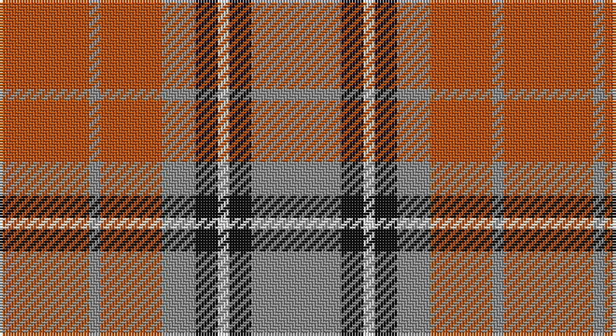

This page is one **sett** — a single exact thread-count. It belongs to the [tartan](/setts/o16oi2o11oi6k4w2k4oi16/)
(the same proportion at any scale), whose colour order is pattern [RKWKRRRR](/stripes/rkwkrrrr/).

Part of the [Sydney](/tartans/sydney/) tartan — the named design grouping this sett with its other cloths.

Sourced from tartans-authority.  It is a [8 stripe tartan](/stripes/stripes8/).

Original link http://www.tartansauthority.com/tartan-ferret/display/1291/

## Also known as

This cloth is also recorded under:

- Sidney
- Sydney #2

## Register references

External register numbers recorded for this tartan.

- Scottish Tartans Authority (ITI): 1291

## Thread count
DO/32 N4 DO22 N12 K8 LN4 K8 N/32

One full sett is **180 threads**.

## Palette

Palette: <strong>Tartan Register</strong> <small style="color:#888">(3 of 4 colours)</small>
<table><thead><tr><th>Colour</th><th>Threads</th><th>Shade</th><th>Base</th><th>OKLCh</th></tr></thead><tbody><tr><td>DO/</td><td style="text-align:right;font-variant-numeric:tabular-nums">32</td><td><code style="background-color:#B84C00;">#B84C00</code> <small style="color:#888">#B84C00</small></td><td>R <code style="background-color:#CC0000;">#CC0000</code></td><td><small style="color:#888">oklch(55.1% 0.156 45.5)</small></td></tr><tr><td>N</td><td style="text-align:right;font-variant-numeric:tabular-nums">4</td><td><code style="background-color:#888888;">#888888</code> <small style="color:#888">#888888</small></td><td>R <code style="background-color:#CC0000;">#CC0000</code></td><td><small style="color:#888">oklch(62.7% 0.000 89.9)</small></td></tr><tr><td>DO</td><td style="text-align:right;font-variant-numeric:tabular-nums">22</td><td><code style="background-color:#B84C00;">#B84C00</code> <small style="color:#888">#B84C00</small></td><td>R <code style="background-color:#CC0000;">#CC0000</code></td><td><small style="color:#888">oklch(55.1% 0.156 45.5)</small></td></tr><tr><td>N</td><td style="text-align:right;font-variant-numeric:tabular-nums">12</td><td><code style="background-color:#888888;">#888888</code> <small style="color:#888">#888888</small></td><td>R <code style="background-color:#CC0000;">#CC0000</code></td><td><small style="color:#888">oklch(62.7% 0.000 89.9)</small></td></tr><tr><td>K</td><td style="text-align:right;font-variant-numeric:tabular-nums">8</td><td><code style="background-color:#101010;">#101010</code> <small style="color:#888">#101010</small></td><td>K <code style="background-color:#000000;">#000000</code></td><td><small style="color:#888">oklch(17.3% 0.000 89.9)</small></td></tr><tr><td>LN</td><td style="text-align:right;font-variant-numeric:tabular-nums">4</td><td><code style="background-color:#E0E0E0;">#E0E0E0</code> <small style="color:#888">#E0E0E0</small></td><td>W <code style="background-color:#F7F7F7;">#F7F7F7</code></td><td><small style="color:#888">oklch(90.7% 0.000 89.9)</small></td></tr><tr><td>K</td><td style="text-align:right;font-variant-numeric:tabular-nums">8</td><td><code style="background-color:#101010;">#101010</code> <small style="color:#888">#101010</small></td><td>K <code style="background-color:#000000;">#000000</code></td><td><small style="color:#888">oklch(17.3% 0.000 89.9)</small></td></tr><tr><td>N/</td><td style="text-align:right;font-variant-numeric:tabular-nums">32</td><td><code style="background-color:#888888;">#888888</code> <small style="color:#888">#888888</small></td><td>R <code style="background-color:#CC0000;">#CC0000</code></td><td><small style="color:#888">oklch(62.7% 0.000 89.9)</small></td></tr></tbody></table>

# Sample pattern

## Nearest tartans

The nearest existing variants by ΔTartan distance, with this tartan at the top so the swatches line up against it.

ΔTartan

Tartan

Sett

—

<a href="/ttd/edit/#slug=o16oi2o11oi6k4w2k4oi16~x2">Sydney (Nova Scotia) (District)</a> <a class="nn-out" href="/variants/s8/o16oi2o11oi6k4w2k4oi16~x2/" title="open its dictionary page">↗</a>

0.74

<a href="/ttd/edit/#slug=o72dr30o18lr62y10dr7lr32&amp;base=o16oi2o11oi6k4w2k4oi16~x2">Manhattan Ethnic</a> <a class="nn-out" href="/variants/s7/o72dr30o18lr62y10dr7lr32/" title="open its dictionary page">↗</a>

0.89

<a href="/ttd/edit/#slug=g3r9t1g9r1g1r9db9r1~x4&amp;base=o16oi2o11oi6k4w2k4oi16~x2">Convention of the Baronage (Corp)</a> <a class="nn-out" href="/variants/s9/g3r9t1g9r1g1r9db9r1~x4/" title="open its dictionary page">↗</a>

0.91

<a href="/ttd/edit/#slug=r16o2r11o6k4w2k4o16~x2&amp;base=o16oi2o11oi6k4w2k4oi16~x2">Sidney (Nova Scotia) Canadian Tartan</a> <a class="nn-out" href="/variants/s8/r16o2r11o6k4w2k4o16~x2/" title="open its dictionary page">↗</a>

1.02

<a href="/ttd/edit/#slug=y3dr18y4dr3y4r13y3y18dr2lo3~x2&amp;base=o16oi2o11oi6k4w2k4oi16~x2">Leitrim</a> <a class="nn-out" href="/variants/s10/y3dr18y4dr3y4r13y3y18dr2lo3~x2/" title="open its dictionary page">↗</a>

1.06

<a href="/ttd/edit/#slug=m3dg6lo2db2lo11dg2lo2m3~x2&amp;base=o16oi2o11oi6k4w2k4oi16~x2">Invertere (Daks #1) (Fashion)</a> <a class="nn-out" href="/variants/s8/m3dg6lo2db2lo11dg2lo2m3~x2/" title="open its dictionary page">↗</a>

1.11

<a href="/ttd/edit/#slug=r11db1r11db1w10o11db1o11~x2&amp;base=o16oi2o11oi6k4w2k4oi16~x2">St Andrews</a> <a class="nn-out" href="/variants/s8/r11db1r11db1w10o11db1o11~x2/" title="open its dictionary page">↗</a>

1.12

<a href="/ttd/edit/#slug=loi36do15loi9r31lo5do4r16~x2&amp;base=o16oi2o11oi6k4w2k4oi16~x2">Manhattan Ethnic</a> <a class="nn-out" href="/variants/s7/loi36do15loi9r31lo5do4r16~x2/" title="open its dictionary page">↗</a>

1.13

<a href="/ttd/edit/#slug=y28k3r22k8w3k8r22k3y28k3~x2&amp;base=o16oi2o11oi6k4w2k4oi16~x2">Henkel</a> <a class="nn-out" href="/variants/s10/y28k3r22k8w3k8r22k3y28k3~x2/" title="open its dictionary page">↗</a>

1.17

<a href="/ttd/edit/#slug=r24n5o9n2o9lb9~x4&amp;base=o16oi2o11oi6k4w2k4oi16~x2">Plaid Wine</a> <a class="nn-out" href="/variants/s6/r24n5o9n2o9lb9~x4/" title="open its dictionary page">↗</a>

1.20

<a href="/ttd/edit/#slug=r1t1r6db3r1g6r1g6r6db1r1t1~x2&amp;base=o16oi2o11oi6k4w2k4oi16~x2">MacQuarrie 4</a> <a class="nn-out" href="/variants/s12/r1t1r6db3r1g6r1g6r6db1r1t1~x2/" title="open its dictionary page">↗</a>

## Neighbour map

Every grey dot is one of 14360 variants placed by the first two principal components of the ΔTartan feature space (44% of its variance). Red is this tartan; blue dots are its nearest — click one to open its page.

<svg viewBox="0 0 640 380" role="img" style="max-width:100%;height:auto;border:1px solid #e0e0e0;border-radius:4px;display:block" xmlns="http://www.w3.org/2000/svg"><image href="/nn/cloud.v1.png" width="640" height="380"/><a href="/variants/s7/o72dr30o18lr62y10dr7lr32/"><circle cx="226.3" cy="204.7" r="4" fill="#3465a4"><title>Manhattan Ethnic</title></circle></a><a href="/variants/s9/g3r9t1g9r1g1r9db9r1~x4/"><circle cx="251.2" cy="198.0" r="4" fill="#3465a4"><title>Convention of the Baronage (Corp)</title></circle></a><a href="/variants/s8/r16o2r11o6k4w2k4o16~x2/"><circle cx="235.6" cy="203.4" r="4" fill="#3465a4"><title>Sidney (Nova Scotia) Canadian Tartan</title></circle></a><a href="/variants/s10/y3dr18y4dr3y4r13y3y18dr2lo3~x2/"><circle cx="247.1" cy="186.3" r="4" fill="#3465a4"><title>Leitrim</title></circle></a><a href="/variants/s8/m3dg6lo2db2lo11dg2lo2m3~x2/"><circle cx="230.8" cy="225.8" r="4" fill="#3465a4"><title>Invertere (Daks #1) (Fashion)</title></circle></a><a href="/variants/s8/r11db1r11db1w10o11db1o11~x2/"><circle cx="216.9" cy="199.0" r="4" fill="#3465a4"><title>St Andrews</title></circle></a><a href="/variants/s7/loi36do15loi9r31lo5do4r16~x2/"><circle cx="244.3" cy="220.8" r="4" fill="#3465a4"><title>Manhattan Ethnic</title></circle></a><a href="/variants/s10/y28k3r22k8w3k8r22k3y28k3~x2/"><circle cx="225.6" cy="181.5" r="4" fill="#3465a4"><title>Henkel</title></circle></a><a href="/variants/s6/r24n5o9n2o9lb9~x4/"><circle cx="233.5" cy="207.3" r="4" fill="#3465a4"><title>Plaid Wine</title></circle></a><a href="/variants/s12/r1t1r6db3r1g6r1g6r6db1r1t1~x2/"><circle cx="239.4" cy="201.3" r="4" fill="#3465a4"><title>MacQuarrie 4</title></circle></a><circle cx="243.6" cy="214.0" r="5" fill="#c00000"/></svg>

ID: /variants/s8/o16oi2o11oi6k4w2k4oi16~x2/
