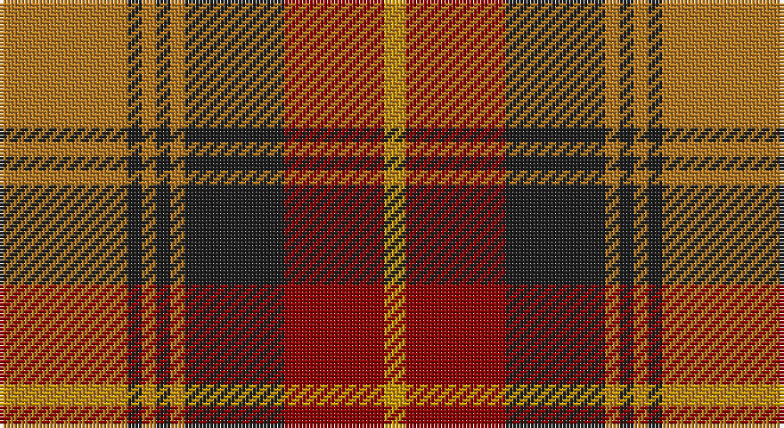

This page is one **sett** — a single exact thread-count. It belongs to the [tartan](/setts/o18dt2o2dt2o2dt14r14ly3/)
(the same proportion at any scale), whose colour order is pattern [RBRBRBRY](/stripes/rbrbrbry/).

Sourced from register-of-tartans.  It is a [8 stripe tartan](/stripes/stripes8/).

Original link https://www.tartanregister.gov.uk/tartanDetails.aspx?ref=4069

2 attestations — the source records this cloth was collapsed from (oldest owns this page)

<ul>
<li>01/01/2002 — Talladale (register-of-tartans, <a href="https://www.tartanregister.gov.uk/tartanDetails.aspx?ref=4069">record</a>)</li>
<li>pre 2002 — Talladale (Fashion) (tartans-authority, <a href="http://www.tartansauthority.com/tartan-ferret/display/5143/">record</a>)</li>
</ul>

## Register references

External register numbers recorded for this tartan.

- Scottish Register of Tartans: [4069](https://www.tartanregister.gov.uk/tartanDetails.aspx?ref=4069)
- Scottish Tartans Authority (ITI): 5143

## Thread count
LT/36 K4 LT4 K4 LT4 K28 DR28 DY/6

One full sett is **186 threads**.

## Palette

Palette: <strong>Tartan Register</strong> <small style="color:#888">(1 of 4 colours)</small>
<table><thead><tr><th>Colour</th><th>Threads</th><th>Shade</th><th>Base</th><th>OKLCh</th></tr></thead><tbody><tr><td>LT/</td><td style="text-align:right;font-variant-numeric:tabular-nums">36</td><td><code style="background-color:#B47820;">#B47820</code> <small style="color:#888">#B47820</small></td><td>R <code style="background-color:#CC0000;">#CC0000</code></td><td><small style="color:#888">oklch(62.1% 0.122 71.0)</small></td></tr><tr><td>K</td><td style="text-align:right;font-variant-numeric:tabular-nums">4</td><td><code style="background-color:#202020;">#202020</code> <small style="color:#888">#202020</small></td><td>B <code style="background-color:#2A418A;">#2A418A</code></td><td><small style="color:#888">oklch(24.4% 0.000 89.9)</small></td></tr><tr><td>LT</td><td style="text-align:right;font-variant-numeric:tabular-nums">4</td><td><code style="background-color:#B47820;">#B47820</code> <small style="color:#888">#B47820</small></td><td>R <code style="background-color:#CC0000;">#CC0000</code></td><td><small style="color:#888">oklch(62.1% 0.122 71.0)</small></td></tr><tr><td>K</td><td style="text-align:right;font-variant-numeric:tabular-nums">4</td><td><code style="background-color:#202020;">#202020</code> <small style="color:#888">#202020</small></td><td>B <code style="background-color:#2A418A;">#2A418A</code></td><td><small style="color:#888">oklch(24.4% 0.000 89.9)</small></td></tr><tr><td>LT</td><td style="text-align:right;font-variant-numeric:tabular-nums">4</td><td><code style="background-color:#B47820;">#B47820</code> <small style="color:#888">#B47820</small></td><td>R <code style="background-color:#CC0000;">#CC0000</code></td><td><small style="color:#888">oklch(62.1% 0.122 71.0)</small></td></tr><tr><td>K</td><td style="text-align:right;font-variant-numeric:tabular-nums">28</td><td><code style="background-color:#202020;">#202020</code> <small style="color:#888">#202020</small></td><td>B <code style="background-color:#2A418A;">#2A418A</code></td><td><small style="color:#888">oklch(24.4% 0.000 89.9)</small></td></tr><tr><td>DR</td><td style="text-align:right;font-variant-numeric:tabular-nums">28</td><td><code style="background-color:#8C0000;">#8C0000</code> <small style="color:#888">#8C0000</small></td><td>R <code style="background-color:#CC0000;">#CC0000</code></td><td><small style="color:#888">oklch(40.2% 0.165 29.2)</small></td></tr><tr><td>DY/</td><td style="text-align:right;font-variant-numeric:tabular-nums">6</td><td><code style="background-color:#C89800;">#C89800</code> <small style="color:#888">#C89800</small></td><td>Y <code style="background-color:#F2BF00;">#F2BF00</code></td><td><small style="color:#888">oklch(70.6% 0.144 85.9)</small></td></tr></tbody></table>

# Sample pattern

## Nearest tartans

The nearest existing variants by ΔTartan distance, with this tartan at the top so the swatches line up against it.

ΔTartan

Tartan

Sett

—

<a href="/ttd/edit/#slug=o18dt2o2dt2o2dt14r14ly3~x2">Talladale</a> <a class="nn-out" href="/variants/s8/o18dt2o2dt2o2dt14r14ly3~x2/" title="open its dictionary page">↗</a>

0.78

<a href="/ttd/edit/#slug=dg12k1dg1k1dg1ri5r10k1r2~x2&amp;base=o18dt2o2dt2o2dt14r14ly3~x2">Lindsay #3</a> <a class="nn-out" href="/variants/s9/dg12k1dg1k1dg1ri5r10k1r2~x2/" title="open its dictionary page">↗</a>

0.92

<a href="/ttd/edit/#slug=dp8r3ly1r3dg14r3ly1~x4&amp;base=o18dt2o2dt2o2dt14r14ly3~x2">Logan - 1819 (with yellow)</a> <a class="nn-out" href="/variants/s7/dp8r3ly1r3dg14r3ly1~x4/" title="open its dictionary page">↗</a>

0.94

<a href="/ttd/edit/#slug=k10y24r3y3r24dg3y6k6~x2&amp;base=o18dt2o2dt2o2dt14r14ly3~x2">Earle's Flame</a> <a class="nn-out" href="/variants/s8/k10y24r3y3r24dg3y6k6~x2/" title="open its dictionary page">↗</a>

0.97

<a href="/ttd/edit/#slug=db3k5r2g2r3g12r6k1r3~x4&amp;base=o18dt2o2dt2o2dt14r14ly3~x2">Fulton (1999) (Name)</a> <a class="nn-out" href="/variants/s9/db3k5r2g2r3g12r6k1r3~x4/" title="open its dictionary page">↗</a>

0.99

<a href="/ttd/edit/#slug=dp8r3ly1r3g14r3ly1~x4&amp;base=o18dt2o2dt2o2dt14r14ly3~x2">Logan with Yellow</a> <a class="nn-out" href="/variants/s7/dp8r3ly1r3g14r3ly1~x4/" title="open its dictionary page">↗</a>

1.01

<a href="/ttd/edit/#slug=y3dr18y4dr3y4r13y3y18dr2lo3~x2&amp;base=o18dt2o2dt2o2dt14r14ly3~x2">Leitrim</a> <a class="nn-out" href="/variants/s10/y3dr18y4dr3y4r13y3y18dr2lo3~x2/" title="open its dictionary page">↗</a>

1.02

<a href="/ttd/edit/#slug=y1k1r8dg8k6y4r8k1y1~x8&amp;base=o18dt2o2dt2o2dt14r14ly3~x2">Montrose (Graham)</a> <a class="nn-out" href="/variants/s9/y1k1r8dg8k6y4r8k1y1~x8/" title="open its dictionary page">↗</a>

1.04

<a href="/ttd/edit/#slug=dgi12dg1dgi1dg1dgi1k5r10k1r2~x2&amp;base=o18dt2o2dt2o2dt14r14ly3~x2">Lindsay #2</a> <a class="nn-out" href="/variants/s9/dgi12dg1dgi1dg1dgi1k5r10k1r2~x2/" title="open its dictionary page">↗</a>

1.06

<a href="/ttd/edit/#slug=r2ri1r10ri2g10lr1g2~x4&amp;base=o18dt2o2dt2o2dt14r14ly3~x2">Lennox</a> <a class="nn-out" href="/variants/s7/r2ri1r10ri2g10lr1g2~x4/" title="open its dictionary page">↗</a>

1.07

<a href="/ttd/edit/#slug=g3r9t1g9r1g1r9db9r1~x4&amp;base=o18dt2o2dt2o2dt14r14ly3~x2">Convention of the Baronage (Corp)</a> <a class="nn-out" href="/variants/s9/g3r9t1g9r1g1r9db9r1~x4/" title="open its dictionary page">↗</a>

## Neighbour map

Every grey dot is one of 14360 variants placed by the first two principal components of the ΔTartan feature space (44% of its variance). Red is this tartan; blue dots are its nearest — click one to open its page.

<svg viewBox="0 0 640 380" role="img" style="max-width:100%;height:auto;border:1px solid #e0e0e0;border-radius:4px;display:block" xmlns="http://www.w3.org/2000/svg"><image href="/nn/cloud.v1.png" width="640" height="380"/><a href="/variants/s9/dg12k1dg1k1dg1ri5r10k1r2~x2/"><circle cx="258.5" cy="167.8" r="4" fill="#3465a4"><title>Lindsay #3</title></circle></a><a href="/variants/s7/dp8r3ly1r3dg14r3ly1~x4/"><circle cx="248.0" cy="181.0" r="4" fill="#3465a4"><title>Logan - 1819 (with yellow)</title></circle></a><a href="/variants/s8/k10y24r3y3r24dg3y6k6~x2/"><circle cx="225.2" cy="202.4" r="4" fill="#3465a4"><title>Earle's Flame</title></circle></a><a href="/variants/s9/db3k5r2g2r3g12r6k1r3~x4/"><circle cx="209.4" cy="191.2" r="4" fill="#3465a4"><title>Fulton (1999) (Name)</title></circle></a><a href="/variants/s7/dp8r3ly1r3g14r3ly1~x4/"><circle cx="246.7" cy="178.7" r="4" fill="#3465a4"><title>Logan with Yellow</title></circle></a><a href="/variants/s10/y3dr18y4dr3y4r13y3y18dr2lo3~x2/"><circle cx="247.1" cy="186.3" r="4" fill="#3465a4"><title>Leitrim</title></circle></a><a href="/variants/s9/y1k1r8dg8k6y4r8k1y1~x8/"><circle cx="191.8" cy="200.0" r="4" fill="#3465a4"><title>Montrose (Graham)</title></circle></a><a href="/variants/s9/dgi12dg1dgi1dg1dgi1k5r10k1r2~x2/"><circle cx="246.9" cy="167.8" r="4" fill="#3465a4"><title>Lindsay #2</title></circle></a><a href="/variants/s7/r2ri1r10ri2g10lr1g2~x4/"><circle cx="284.3" cy="198.7" r="4" fill="#3465a4"><title>Lennox</title></circle></a><a href="/variants/s9/g3r9t1g9r1g1r9db9r1~x4/"><circle cx="251.2" cy="198.0" r="4" fill="#3465a4"><title>Convention of the Baronage (Corp)</title></circle></a><circle cx="220.9" cy="192.4" r="5" fill="#c00000"/></svg>

ID: /variants/s8/o18dt2o2dt2o2dt14r14ly3~x2/
