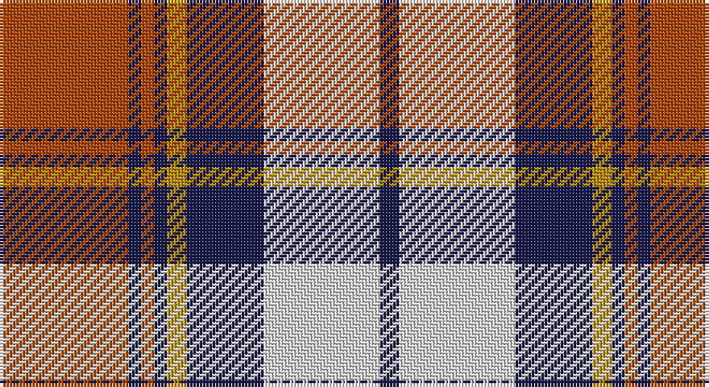

This page is one **sett** — a single exact thread-count. It belongs to the [tartan](/setts/o20db2o2db2lo3db12w18db3/)
(the same proportion at any scale), whose colour order is pattern [BWBYBRBR](/stripes/bwbybrbr/).

Sourced from register-of-tartans.  It is a [8 stripe tartan](/stripes/stripes8/).

Original link https://www.tartanregister.gov.uk/tartanDetails.aspx?ref=1692

2 attestations — the source records this cloth was collapsed from (oldest owns this page)

<ul>
<li>01/01/1999 — Heriot (register-of-tartans, <a href="https://www.tartanregister.gov.uk/tartanDetails.aspx?ref=1692">record</a>)</li>
<li>pre 1999 — Heriot (Fashion) (tartans-authority, <a href="http://www.tartansauthority.com/tartan-ferret/display/7258/">record</a>)</li>
</ul>

## Register references

External register numbers recorded for this tartan.

- Scottish Register of Tartans: [1692](https://www.tartanregister.gov.uk/tartanDetails.aspx?ref=1692)
- Scottish Tartans Authority (ITI): 7258
- Scottish Tartans World Register: 2776

## Thread count
DO/40 DB4 DO4 DB4 DY6 DB24 LN36 DB/6

One full sett is **202 threads**.

## Palette

Palette: <strong>Tartan Register</strong> <small style="color:#888">(4 of 5 colours)</small>
<table><thead><tr><th>Colour</th><th>Threads</th><th>Shade</th><th>Base</th><th>OKLCh</th></tr></thead><tbody><tr><td>DO/</td><td style="text-align:right;font-variant-numeric:tabular-nums">40</td><td><code style="background-color:#B04800;">#B04800</code> <small style="color:#888">#B04800</small></td><td>R <code style="background-color:#CC0000;">#CC0000</code></td><td><small style="color:#888">oklch(53.2% 0.151 45.4)</small></td></tr><tr><td>DB</td><td style="text-align:right;font-variant-numeric:tabular-nums">4</td><td><code style="background-color:#1C1C50;">#1C1C50</code> <small style="color:#888">#1C1C50</small></td><td>B <code style="background-color:#2A418A;">#2A418A</code></td><td><small style="color:#888">oklch(26.2% 0.093 277.9)</small></td></tr><tr><td>DO</td><td style="text-align:right;font-variant-numeric:tabular-nums">4</td><td><code style="background-color:#B04800;">#B04800</code> <small style="color:#888">#B04800</small></td><td>R <code style="background-color:#CC0000;">#CC0000</code></td><td><small style="color:#888">oklch(53.2% 0.151 45.4)</small></td></tr><tr><td>DB</td><td style="text-align:right;font-variant-numeric:tabular-nums">4</td><td><code style="background-color:#1C1C50;">#1C1C50</code> <small style="color:#888">#1C1C50</small></td><td>B <code style="background-color:#2A418A;">#2A418A</code></td><td><small style="color:#888">oklch(26.2% 0.093 277.9)</small></td></tr><tr><td>DY</td><td style="text-align:right;font-variant-numeric:tabular-nums">6</td><td><code style="background-color:#BC8C00;">#BC8C00</code> <small style="color:#888">#BC8C00</small></td><td>Y <code style="background-color:#F2BF00;">#F2BF00</code></td><td><small style="color:#888">oklch(66.8% 0.137 84.1)</small></td></tr><tr><td>DB</td><td style="text-align:right;font-variant-numeric:tabular-nums">24</td><td><code style="background-color:#1C1C50;">#1C1C50</code> <small style="color:#888">#1C1C50</small></td><td>B <code style="background-color:#2A418A;">#2A418A</code></td><td><small style="color:#888">oklch(26.2% 0.093 277.9)</small></td></tr><tr><td>LN</td><td style="text-align:right;font-variant-numeric:tabular-nums">36</td><td><code style="background-color:#E0E0E0;">#E0E0E0</code> <small style="color:#888">#E0E0E0</small></td><td>W <code style="background-color:#F7F7F7;">#F7F7F7</code></td><td><small style="color:#888">oklch(90.7% 0.000 89.9)</small></td></tr><tr><td>DB/</td><td style="text-align:right;font-variant-numeric:tabular-nums">6</td><td><code style="background-color:#1C1C50;">#1C1C50</code> <small style="color:#888">#1C1C50</small></td><td>B <code style="background-color:#2A418A;">#2A418A</code></td><td><small style="color:#888">oklch(26.2% 0.093 277.9)</small></td></tr></tbody></table>

# Sample pattern

## Nearest tartans

The nearest existing variants by ΔTartan distance, with this tartan at the top so the swatches line up against it.

ΔTartan

Tartan

Sett

—

<a href="/ttd/edit/#slug=o20db2o2db2lo3db12w18db3~x2">Heriot</a> <a class="nn-out" href="/variants/s8/o20db2o2db2lo3db12w18db3~x2/" title="open its dictionary page">↗</a>

0.70

<a href="/ttd/edit/#slug=db4dy3db21dy2w14o22dy3o4~x2&amp;base=o20db2o2db2lo3db12w18db3~x2">Bannock Bane M.407</a> <a class="nn-out" href="/variants/s8/db4dy3db21dy2w14o22dy3o4~x2/" title="open its dictionary page">↗</a>

0.94

<a href="/ttd/edit/#slug=db1r1k8r1db1r1w8r1db1~x6&amp;base=o20db2o2db2lo3db12w18db3~x2">MacPherson</a> <a class="nn-out" href="/variants/s9/db1r1k8r1db1r1w8r1db1~x6/" title="open its dictionary page">↗</a>

0.97

<a href="/ttd/edit/#slug=dt8w22dt5w4k24r6k2r6~x2&amp;base=o20db2o2db2lo3db12w18db3~x2">Unidentified (ex Tony Murray)</a> <a class="nn-out" href="/variants/s8/dt8w22dt5w4k24r6k2r6~x2/" title="open its dictionary page">↗</a>

0.97

<a href="/ttd/edit/#slug=dr4ly2dr13ly1w8t13ly2t4~x2&amp;base=o20db2o2db2lo3db12w18db3~x2">Bannockbane, Dark Tan</a> <a class="nn-out" href="/variants/s8/dr4ly2dr13ly1w8t13ly2t4~x2/" title="open its dictionary page">↗</a>

1.04

<a href="/ttd/edit/#slug=dr2r2dr15r1w10o15r2o2~x2&amp;base=o20db2o2db2lo3db12w18db3~x2">Bannockbane</a> <a class="nn-out" href="/variants/s8/dr2r2dr15r1w10o15r2o2~x2/" title="open its dictionary page">↗</a>

1.08

<a href="/ttd/edit/#slug=dg20r3y3r15w19dg3t2~x2&amp;base=o20db2o2db2lo3db12w18db3~x2">Glasgow</a> <a class="nn-out" href="/variants/s7/dg20r3y3r15w19dg3t2~x2/" title="open its dictionary page">↗</a>

1.09

<a href="/ttd/edit/#slug=do4r3do21r2w14o22r3o4~x2&amp;base=o20db2o2db2lo3db12w18db3~x2">Bannock Bane M.405</a> <a class="nn-out" href="/variants/s8/do4r3do21r2w14o22r3o4~x2/" title="open its dictionary page">↗</a>

1.12

<a href="/ttd/edit/#slug=r18ly2b6ly2b4ly2b12ly3r4g2~x2&amp;base=o20db2o2db2lo3db12w18db3~x2">Unnamed</a> <a class="nn-out" href="/variants/s10/r18ly2b6ly2b4ly2b12ly3r4g2~x2/" title="open its dictionary page">↗</a>

1.13

<a href="/ttd/edit/#slug=r2o20k5w10k10r2~x2&amp;base=o20db2o2db2lo3db12w18db3~x2">Thompson Grey Family Tartan</a> <a class="nn-out" href="/variants/s6/r2o20k5w10k10r2~x2/" title="open its dictionary page">↗</a>

1.14

<a href="/ttd/edit/#slug=lb13k3lb3k3lb3k15lo18r3~x2&amp;base=o20db2o2db2lo3db12w18db3~x2">Holden Beige (Corporate)</a> <a class="nn-out" href="/variants/s8/lb13k3lb3k3lb3k15lo18r3~x2/" title="open its dictionary page">↗</a>

## Neighbour map

Every grey dot is one of 14360 variants placed by the first two principal components of the ΔTartan feature space (44% of its variance). Red is this tartan; blue dots are its nearest — click one to open its page.

<svg viewBox="0 0 640 380" role="img" style="max-width:100%;height:auto;border:1px solid #e0e0e0;border-radius:4px;display:block" xmlns="http://www.w3.org/2000/svg"><image href="/nn/cloud.v1.png" width="640" height="380"/><a href="/variants/s8/db4dy3db21dy2w14o22dy3o4~x2/"><circle cx="158.8" cy="167.8" r="4" fill="#3465a4"><title>Bannock Bane M.407</title></circle></a><a href="/variants/s9/db1r1k8r1db1r1w8r1db1~x6/"><circle cx="151.1" cy="148.9" r="4" fill="#3465a4"><title>MacPherson</title></circle></a><a href="/variants/s8/dt8w22dt5w4k24r6k2r6~x2/"><circle cx="139.6" cy="165.6" r="4" fill="#3465a4"><title>Unidentified (ex Tony Murray)</title></circle></a><a href="/variants/s8/dr4ly2dr13ly1w8t13ly2t4~x2/"><circle cx="163.3" cy="171.8" r="4" fill="#3465a4"><title>Bannockbane, Dark Tan</title></circle></a><a href="/variants/s8/dr2r2dr15r1w10o15r2o2~x2/"><circle cx="190.6" cy="154.3" r="4" fill="#3465a4"><title>Bannockbane</title></circle></a><a href="/variants/s7/dg20r3y3r15w19dg3t2~x2/"><circle cx="133.9" cy="158.8" r="4" fill="#3465a4"><title>Glasgow</title></circle></a><a href="/variants/s8/do4r3do21r2w14o22r3o4~x2/"><circle cx="184.6" cy="172.0" r="4" fill="#3465a4"><title>Bannock Bane M.405</title></circle></a><a href="/variants/s10/r18ly2b6ly2b4ly2b12ly3r4g2~x2/"><circle cx="203.6" cy="168.1" r="4" fill="#3465a4"><title>Unnamed</title></circle></a><a href="/variants/s6/r2o20k5w10k10r2~x2/"><circle cx="173.9" cy="193.4" r="4" fill="#3465a4"><title>Thompson Grey Family Tartan</title></circle></a><a href="/variants/s8/lb13k3lb3k3lb3k15lo18r3~x2/"><circle cx="128.2" cy="192.3" r="4" fill="#3465a4"><title>Holden Beige (Corporate)</title></circle></a><circle cx="167.8" cy="162.4" r="5" fill="#c00000"/></svg>

ID: /variants/s8/o20db2o2db2lo3db12w18db3~x2/
