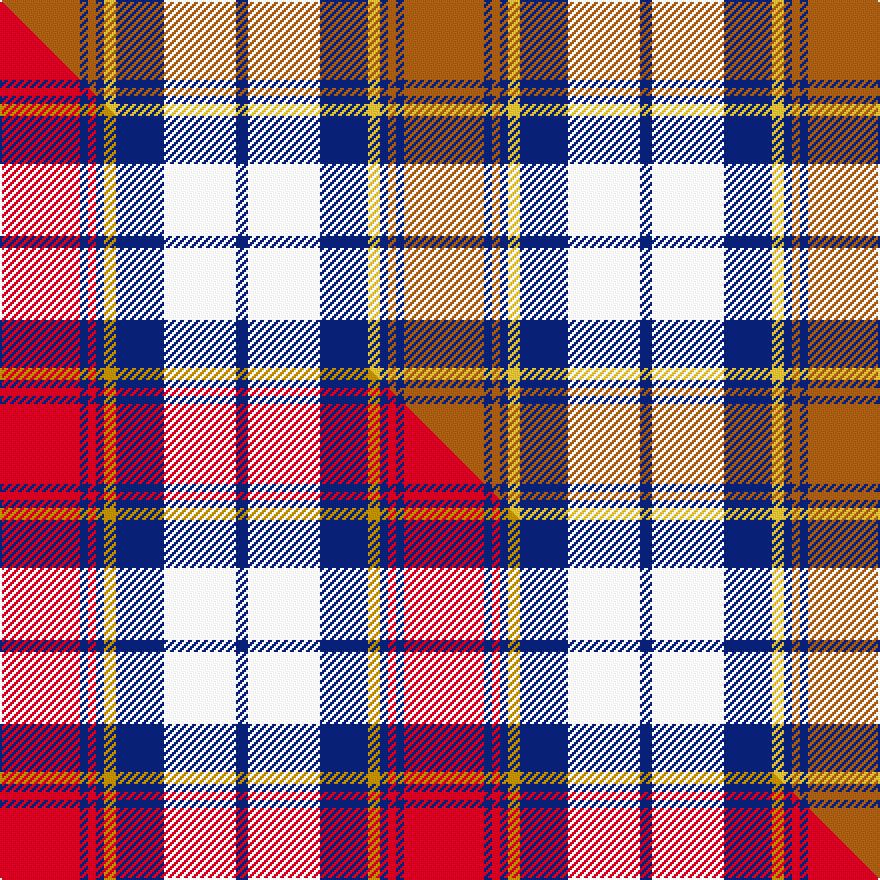

This page is one **sett** — a single exact thread-count. It belongs to the [tartan](/setts/o20db2o2db2ly3db12w18db3/)
(the same proportion at any scale), whose colour order is pattern [BWBYBRBR](/stripes/bwbybrbr/).

Part of the [Heriot](/tartans/heriot/) tartan — the named design grouping this sett with its other cloths.

Sourced from tartans-authority.  It is a [8 stripe tartan](/stripes/stripes8/).

Original link http://www.tartansauthority.com/tartan-ferret/display/7258/

## Register references

External register numbers recorded for this tartan.

- Scottish Tartans Authority (ITI): 7258

## Thread count
O/40 DB4 O4 DB4 LY6 DB24 W36 DB/6

One full sett is **202 threads**.

## Palette
<table><thead><tr><th>Colour</th><th>Shade</th><th>OKLCh</th></tr></thead><tbody><tr><td>DB</td><td><code style="background-color:#082077;">#082077</code> <small style="color:#888">#082077</small></td><td><small style="color:#888">oklch(30.0% 0.149 265.1)</small></td></tr><tr><td>O</td><td><code style="background-color:#A65C11;">#A65C11</code> <small style="color:#888">#A65C11</small></td><td><small style="color:#888">oklch(55.0% 0.125 58.3)</small></td></tr><tr><td>LY</td><td><code style="background-color:#DCBC32;">#DCBC32</code> <small style="color:#888">#DCBC32</small></td><td><small style="color:#888">oklch(80.0% 0.150 95.2)</small></td></tr><tr><td>W</td><td><code style="background-color:#F7F7F7;">#F7F7F7</code> <small style="color:#888">#F7F7F7</small></td><td><small style="color:#888">oklch(97.6% 0.000 89.9)</small></td></tr></tbody></table>

# Sample pattern

## Compared to the master

This cloth is one sett of its design; the master sett (the exemplar the design is anchored on) is below for comparison.

Its **ΔTartan distance** from the master is **1.03** — the same measure the nearest-tartans table ranks by (0 is identical; a re-scale of the same cloth is near 0, a recolour or a different proportion further).

<figure class="master-compare" style="margin:0">

this sett
master sett ★

<figcaption style="color:#888;font-size:smaller">One weave of this sett against the <a href="/setts/r20db2r2db2ly3db12w18db3/">master sett ★</a>, split on the diagonal: a shared proportion runs seamlessly across it with only the shades shifting; a different proportion breaks on it.</figcaption>
</figure>

## Nearest tartan variants

The nearest existing variants by ΔTartan distance, with this cloth at the top so the swatches line up against it.

ΔTartan

Threads

Variant

Sett

—

202

<a href="/variants/s8/o20db2o2db2ly3db12w18db3~x2/">Heriot (Fashion)</a>

<a href="/ttd/edit/#slug=r20db2r2db2ly3db12w18db3~x2~ly2705081&amp;base=o20db2o2db2ly3db12w18db3~x2" title="compare in the TTD">2.40</a>

202

<a href="/variants/s8/r20db2r2db2ly3db12w18db3~x2~ly2705081/">Heriot</a>

<a href="/ttd/edit/#slug=do4y2do13y1w8lb13y2lb4~x2&amp;base=o20db2o2db2ly3db12w18db3~x2" title="compare in the TTD">2.46</a>

172

<a href="/variants/s8/do4y2do13y1w8lb13y2lb4~x2/">Bannockbane, Dark Tan</a>

<a href="/ttd/edit/#slug=do4y2do13y1w13lb13y2lb4~x2&amp;base=o20db2o2db2ly3db12w18db3~x2" title="compare in the TTD">2.49</a>

192

<a href="/variants/s8/do4y2do13y1w13lb13y2lb4~x2/">Bannockbane Tan</a>

## Neighbour map

Every grey dot is one of 13620 variants placed by the first two principal components of the ΔTartan feature space (42% of its variance). Red is this tartan; blue dots are its nearest — click one to open its page.

<svg viewBox="0 0 640 380" role="img" style="max-width:100%;height:auto;border:1px solid #e0e0e0;border-radius:4px;display:block" xmlns="http://www.w3.org/2000/svg"><image href="/nn/cloud.v1.png" width="640" height="380"/><a href="/variants/s8/r20db2r2db2ly3db12w18db3~x2~ly2705081/"><circle cx="179.6" cy="183.5" r="4" fill="#3465a4"><title>Heriot</title></circle></a><a href="/variants/s8/do4y2do13y1w8lb13y2lb4~x2/"><circle cx="203.8" cy="209.3" r="4" fill="#3465a4"><title>Bannockbane, Dark Tan</title></circle></a><a href="/variants/s8/do4y2do13y1w13lb13y2lb4~x2/"><circle cx="186.4" cy="209.0" r="4" fill="#3465a4"><title>Bannockbane Tan</title></circle></a><circle cx="178.0" cy="189.0" r="5" fill="#c00000"/><text x="320" y="376" text-anchor="middle" font-size="11" fill="#999">ground</text><text x="11" y="190" text-anchor="middle" font-size="11" fill="#999" transform="rotate(-90 11 190)">complexity</text></svg>

ID: /variants/s8/o20db2o2db2ly3db12w18db3~x2/
