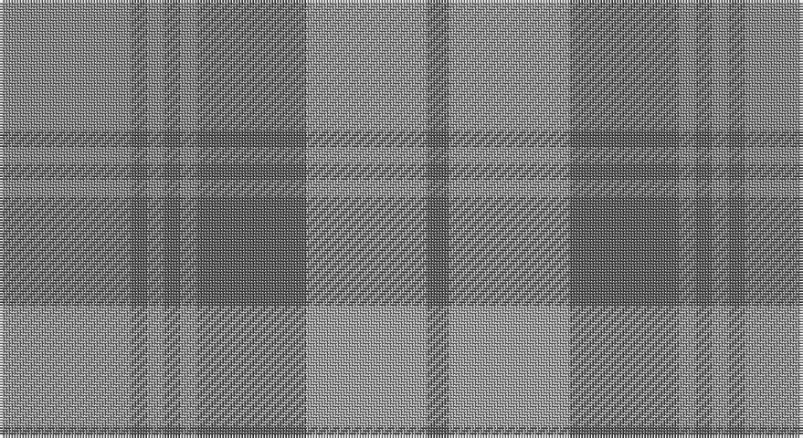

This page is one **sett** — a single exact thread-count. It belongs to the [tartan](/setts/o24n3o3n3o3n20lr22n4/)
(the same proportion at any scale), whose colour order is pattern [BYBRBRBR](/stripes/bybrbrbr/).

Part of the [Turnberry](/tartans/turnberry/) tartan — the named design grouping this sett with its other cloths.

Sourced from register-of-tartans.  It is a [8 stripe tartan](/stripes/stripes8/).

Original link https://www.tartanregister.gov.uk/tartanDetails.aspx?ref=4160

## Register references

External register numbers recorded for this tartan.

- Scottish Register of Tartans: [4160](https://www.tartanregister.gov.uk/tartanDetails.aspx?ref=4160)
- Scottish Tartans Authority (ITI): 1749
- Scottish Tartans World Register: 1749

## Thread count
Nb/48 Na6 Nb6 Na6 Nb6 Na40 N44 Na/8

One full sett is **272 threads**.

## Palette

Palette: <strong>Tartan Register</strong> <small style="color:#888">(2 of 3 colours)</small>
<table><thead><tr><th>Colour</th><th>Threads</th><th>Shade</th><th>Base</th><th>OKLCh</th></tr></thead><tbody><tr><td>Nb/</td><td style="text-align:right;font-variant-numeric:tabular-nums">48</td><td><code style="background-color:#888888;">#888888</code> <small style="color:#888">#888888</small></td><td>R <code style="background-color:#CC0000;">#CC0000</code></td><td><small style="color:#888">oklch(62.7% 0.000 89.9)</small></td></tr><tr><td>Na</td><td style="text-align:right;font-variant-numeric:tabular-nums">6</td><td><code style="background-color:#5C5C5C;">#5C5C5C</code> <small style="color:#888">#5C5C5C</small></td><td>B <code style="background-color:#2A418A;">#2A418A</code></td><td><small style="color:#888">oklch(47.5% 0.000 89.9)</small></td></tr><tr><td>Nb</td><td style="text-align:right;font-variant-numeric:tabular-nums">6</td><td><code style="background-color:#888888;">#888888</code> <small style="color:#888">#888888</small></td><td>R <code style="background-color:#CC0000;">#CC0000</code></td><td><small style="color:#888">oklch(62.7% 0.000 89.9)</small></td></tr><tr><td>Na</td><td style="text-align:right;font-variant-numeric:tabular-nums">6</td><td><code style="background-color:#5C5C5C;">#5C5C5C</code> <small style="color:#888">#5C5C5C</small></td><td>B <code style="background-color:#2A418A;">#2A418A</code></td><td><small style="color:#888">oklch(47.5% 0.000 89.9)</small></td></tr><tr><td>Nb</td><td style="text-align:right;font-variant-numeric:tabular-nums">6</td><td><code style="background-color:#888888;">#888888</code> <small style="color:#888">#888888</small></td><td>R <code style="background-color:#CC0000;">#CC0000</code></td><td><small style="color:#888">oklch(62.7% 0.000 89.9)</small></td></tr><tr><td>Na</td><td style="text-align:right;font-variant-numeric:tabular-nums">40</td><td><code style="background-color:#5C5C5C;">#5C5C5C</code> <small style="color:#888">#5C5C5C</small></td><td>B <code style="background-color:#2A418A;">#2A418A</code></td><td><small style="color:#888">oklch(47.5% 0.000 89.9)</small></td></tr><tr><td>N</td><td style="text-align:right;font-variant-numeric:tabular-nums">44</td><td><code style="background-color:#A0A0A0;">#A0A0A0</code> <small style="color:#888">#A0A0A0</small></td><td>Y <code style="background-color:#F2BF00;">#F2BF00</code></td><td><small style="color:#888">oklch(70.6% 0.000 89.9)</small></td></tr><tr><td>Na/</td><td style="text-align:right;font-variant-numeric:tabular-nums">8</td><td><code style="background-color:#5C5C5C;">#5C5C5C</code> <small style="color:#888">#5C5C5C</small></td><td>B <code style="background-color:#2A418A;">#2A418A</code></td><td><small style="color:#888">oklch(47.5% 0.000 89.9)</small></td></tr></tbody></table>

# Sample pattern

## Compared to the master

This cloth is one sett of its design; the master sett (the exemplar the design is anchored on) is below for comparison.

<figure style="margin:0"><figcaption style="color:#888;font-size:smaller">this sett</figcaption></figure>
<figure style="margin:0"><figcaption style="color:#888;font-size:smaller"><a href="/setts/lo3dy12do14r4do1w26do2dy1/">master sett →</a></figcaption></figure>

## Nearest tartans

The nearest existing variants by ΔTartan distance, with this tartan at the top so the swatches line up against it.

ΔTartan

Tartan

Sett

—

<a href="/ttd/edit/#slug=o24n3o3n3o3n20lr22n4~x2">Turnberry (MacArthur)</a> <a class="nn-out" href="/variants/s8/o24n3o3n3o3n20lr22n4~x2/" title="open its dictionary page">↗</a>

1.23

<a href="/ttd/edit/#slug=t22g3t3g3t3g9o28g3o6~x2&amp;base=o24n3o3n3o3n20lr22n4~x2">Manx Centenary</a> <a class="nn-out" href="/variants/s9/t22g3t3g3t3g9o28g3o6~x2/" title="open its dictionary page">↗</a>

1.33

<a href="/variants/s10/o5n3o22r3n6ni17r2ni4r2ni4~x2/">Clyde</a>

1.35

<a href="/ttd/edit/#slug=n1o6n6oi6n1oi1~x4&amp;base=o24n3o3n3o3n20lr22n4~x2">Glen Burns (WCWM-2)</a> <a class="nn-out" href="/variants/s6/n1o6n6oi6n1oi1~x4/" title="open its dictionary page">↗</a>

1.49

<a href="/ttd/edit/#slug=db5y15o4y4o24y4o4db5&amp;base=o24n3o3n3o3n20lr22n4~x2">Daks, (Muted Skye)</a> <a class="nn-out" href="/variants/s8/db5y15o4y4o24y4o4db5/" title="open its dictionary page">↗</a>

1.72

<a href="/ttd/edit/#slug=o7n6lb1lo6n1lo6n6lb1o6~x8&amp;base=o24n3o3n3o3n20lr22n4~x2">Outlander #2</a> <a class="nn-out" href="/variants/s9/o7n6lb1lo6n1lo6n6lb1o6~x8/" title="open its dictionary page">↗</a>

1.73

<a href="/ttd/edit/#slug=y7n6lt1lo6n1lo6n6lt1y6~x8&amp;base=o24n3o3n3o3n20lr22n4~x2">Outlander #2</a> <a class="nn-out" href="/variants/s9/y7n6lt1lo6n1lo6n6lt1y6~x8/" title="open its dictionary page">↗</a>

1.87

<a href="/ttd/edit/#slug=lo5y22m15lp11m5y2~x2&amp;base=o24n3o3n3o3n20lr22n4~x2">Scottish Ballet</a> <a class="nn-out" href="/variants/s6/lo5y22m15lp11m5y2~x2/" title="open its dictionary page">↗</a>

2.10

<a href="/ttd/edit/#slug=w3y36lp6b6lp6b12lp32w3&amp;base=o24n3o3n3o3n20lr22n4~x2">Tenmaya</a> <a class="nn-out" href="/variants/s8/w3y36lp6b6lp6b12lp32w3/" title="open its dictionary page">↗</a>

2.12

<a href="/ttd/edit/#slug=g6t8o2t2ly2t16g18t4g4t3~x2&amp;base=o24n3o3n3o3n20lr22n4~x2">Blue Ridge</a> <a class="nn-out" href="/variants/s10/g6t8o2t2ly2t16g18t4g4t3~x2/" title="open its dictionary page">↗</a>

2.12

<a href="/ttd/edit/#slug=g6t8o2t2ly2t16g18t4g4t3~x4&amp;base=o24n3o3n3o3n20lr22n4~x2">Blue Ridge (District)</a> <a class="nn-out" href="/variants/s10/g6t8o2t2ly2t16g18t4g4t3~x4/" title="open its dictionary page">↗</a>

## Neighbour map

Every grey dot is one of 14360 variants placed by the first two principal components of the ΔTartan feature space (44% of its variance). Red is this tartan; blue dots are its nearest — click one to open its page.

<svg viewBox="0 0 640 380" role="img" style="max-width:100%;height:auto;border:1px solid #e0e0e0;border-radius:4px;display:block" xmlns="http://www.w3.org/2000/svg"><image href="/nn/cloud.v1.png" width="640" height="380"/><a href="/variants/s9/t22g3t3g3t3g9o28g3o6~x2/"><circle cx="370.9" cy="267.5" r="4" fill="#3465a4"><title>Manx Centenary</title></circle></a><a href="/variants/s10/o5n3o22r3n6ni17r2ni4r2ni4~x2/"><circle cx="338.3" cy="236.9" r="4" fill="#3465a4"><title>Clyde</title></circle></a><a href="/variants/s6/n1o6n6oi6n1oi1~x4/"><circle cx="351.2" cy="326.9" r="4" fill="#3465a4"><title>Glen Burns (WCWM-2)</title></circle></a><a href="/variants/s8/db5y15o4y4o24y4o4db5/"><circle cx="415.1" cy="309.6" r="4" fill="#3465a4"><title>Daks, (Muted Skye)</title></circle></a><a href="/variants/s9/o7n6lb1lo6n1lo6n6lb1o6~x8/"><circle cx="264.4" cy="299.2" r="4" fill="#3465a4"><title>Outlander #2</title></circle></a><a href="/variants/s9/y7n6lt1lo6n1lo6n6lt1y6~x8/"><circle cx="264.9" cy="300.4" r="4" fill="#3465a4"><title>Outlander #2</title></circle></a><a href="/variants/s6/lo5y22m15lp11m5y2~x2/"><circle cx="309.4" cy="266.6" r="4" fill="#3465a4"><title>Scottish Ballet</title></circle></a><a href="/variants/s8/w3y36lp6b6lp6b12lp32w3/"><circle cx="341.0" cy="227.7" r="4" fill="#3465a4"><title>Tenmaya</title></circle></a><a href="/variants/s10/g6t8o2t2ly2t16g18t4g4t3~x2/"><circle cx="417.0" cy="273.4" r="4" fill="#3465a4"><title>Blue Ridge</title></circle></a><a href="/variants/s10/g6t8o2t2ly2t16g18t4g4t3~x4/"><circle cx="417.0" cy="273.4" r="4" fill="#3465a4"><title>Blue Ridge (District)</title></circle></a><circle cx="346.6" cy="283.0" r="5" fill="#c00000"/></svg>

ID: /variants/s8/o24n3o3n3o3n20lr22n4~x2/
