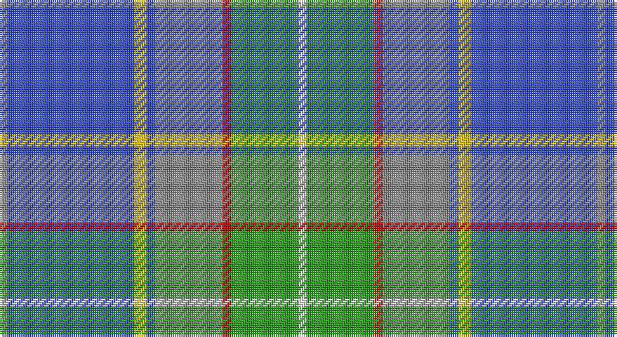

This page is one **sett** — a single exact thread-count. It belongs to the [tartan](/setts/o2b30ly3b2o16r2g16w2/)
(the same proportion at any scale), whose colour order is pattern [RBYBRRGW](/stripes/rbybrrgw/).

Sourced from tartans-authority.  It is a [8 stripe tartan](/stripes/stripes8/).

Original link http://www.tartansauthority.com/tartan-ferret/display/8259/

## Register references

External register numbers recorded for this tartan.

- Scottish Tartans Authority (ITI): 8259

## Thread count
N/4 B60 Y6 B4 N32 R4 G32 LN/4

One full sett is **284 threads**.

## Palette

Palette: <strong>Tartan Register</strong>
<table><thead><tr><th>Colour</th><th>Threads</th><th>Shade</th><th>Base</th><th>OKLCh</th></tr></thead><tbody><tr><td>N/</td><td style="text-align:right;font-variant-numeric:tabular-nums">4</td><td><code style="background-color:#888888;">#888888</code> <small style="color:#888">#888888</small></td><td>R <code style="background-color:#CC0000;">#CC0000</code></td><td><small style="color:#888">oklch(62.7% 0.000 89.9)</small></td></tr><tr><td>B</td><td style="text-align:right;font-variant-numeric:tabular-nums">60</td><td><code style="background-color:#3850C8;">#3850C8</code> <small style="color:#888">#3850C8</small></td><td>B <code style="background-color:#2A418A;">#2A418A</code></td><td><small style="color:#888">oklch(48.8% 0.188 269.4)</small></td></tr><tr><td>Y</td><td style="text-align:right;font-variant-numeric:tabular-nums">6</td><td><code style="background-color:#E8C000;">#E8C000</code> <small style="color:#888">#E8C000</small></td><td>Y <code style="background-color:#F2BF00;">#F2BF00</code></td><td><small style="color:#888">oklch(81.9% 0.168 93.7)</small></td></tr><tr><td>B</td><td style="text-align:right;font-variant-numeric:tabular-nums">4</td><td><code style="background-color:#3850C8;">#3850C8</code> <small style="color:#888">#3850C8</small></td><td>B <code style="background-color:#2A418A;">#2A418A</code></td><td><small style="color:#888">oklch(48.8% 0.188 269.4)</small></td></tr><tr><td>N</td><td style="text-align:right;font-variant-numeric:tabular-nums">32</td><td><code style="background-color:#888888;">#888888</code> <small style="color:#888">#888888</small></td><td>R <code style="background-color:#CC0000;">#CC0000</code></td><td><small style="color:#888">oklch(62.7% 0.000 89.9)</small></td></tr><tr><td>R</td><td style="text-align:right;font-variant-numeric:tabular-nums">4</td><td><code style="background-color:#C80000;">#C80000</code> <small style="color:#888">#C80000</small></td><td>R <code style="background-color:#CC0000;">#CC0000</code></td><td><small style="color:#888">oklch(52.3% 0.215 29.2)</small></td></tr><tr><td>G</td><td style="text-align:right;font-variant-numeric:tabular-nums">32</td><td><code style="background-color:#289C18;">#289C18</code> <small style="color:#888">#289C18</small></td><td>G <code style="background-color:#006100;">#006100</code></td><td><small style="color:#888">oklch(60.6% 0.191 141.6)</small></td></tr><tr><td>LN/</td><td style="text-align:right;font-variant-numeric:tabular-nums">4</td><td><code style="background-color:#E0E0E0;">#E0E0E0</code> <small style="color:#888">#E0E0E0</small></td><td>W <code style="background-color:#F7F7F7;">#F7F7F7</code></td><td><small style="color:#888">oklch(90.7% 0.000 89.9)</small></td></tr></tbody></table>

# Sample pattern

## Nearest tartans

The nearest existing variants by ΔTartan distance, with this tartan at the top so the swatches line up against it.

ΔTartan

Tartan

Sett

—

<a href="/ttd/edit/#slug=o2b30ly3b2o16r2g16w2~x2">WCWM 3947</a> <a class="nn-out" href="/variants/s8/o2b30ly3b2o16r2g16w2~x2/" title="open its dictionary page">↗</a>

0.85

<a href="/ttd/edit/#slug=b24w2b6g9r6b3r6g35k2ly2~x2&amp;base=o2b30ly3b2o16r2g16w2~x2">O'Donohue Personal)</a> <a class="nn-out" href="/variants/s10/b24w2b6g9r6b3r6g35k2ly2~x2/" title="open its dictionary page">↗</a>

0.96

<a href="/ttd/edit/#slug=ly1lt2n15k2lt2k2g12w2lt1~x2&amp;base=o2b30ly3b2o16r2g16w2~x2">Hek Family (Sunningdale, Berwick on Tweed)</a> <a class="nn-out" href="/variants/s9/ly1lt2n15k2lt2k2g12w2lt1~x2/" title="open its dictionary page">↗</a>

1.02

<a href="/ttd/edit/#slug=g5r1db10w1r1w1t10w1t10w1ly1~x4&amp;base=o2b30ly3b2o16r2g16w2~x2">Texas Blue Bonnet</a> <a class="nn-out" href="/variants/s11/g5r1db10w1r1w1t10w1t10w1ly1~x4/" title="open its dictionary page">↗</a>

1.08

<a href="/ttd/edit/#slug=lr5lbi3lb7lr5lb27b8dt43w3lb3&amp;base=o2b30ly3b2o16r2g16w2~x2">Queensferry High (School)</a> <a class="nn-out" href="/variants/s9/lr5lbi3lb7lr5lb27b8dt43w3lb3/" title="open its dictionary page">↗</a>

1.10

<a href="/ttd/edit/#slug=dp2g8r1ly1db6t15w1~x4&amp;base=o2b30ly3b2o16r2g16w2~x2">Manx National District Tartan</a> <a class="nn-out" href="/variants/s7/dp2g8r1ly1db6t15w1~x4/" title="open its dictionary page">↗</a>

1.12

<a href="/ttd/edit/#slug=ly4db24t5g2db3k5t33r2~x2&amp;base=o2b30ly3b2o16r2g16w2~x2">Los Angeles</a> <a class="nn-out" href="/variants/s8/ly4db24t5g2db3k5t33r2~x2/" title="open its dictionary page">↗</a>

1.12

<a href="/ttd/edit/#slug=t36db5g5w2ri4w2r9w22~x2&amp;base=o2b30ly3b2o16r2g16w2~x2">South Canterbury Jubillee (Corporate</a> <a class="nn-out" href="/variants/s8/t36db5g5w2ri4w2r9w22~x2/" title="open its dictionary page">↗</a>

1.13

<a href="/ttd/edit/#slug=db4g2db24g8b2r2b2ly2b10db2w3~x2&amp;base=o2b30ly3b2o16r2g16w2~x2">McCartney (Night)</a> <a class="nn-out" href="/variants/s11/db4g2db24g8b2r2b2ly2b10db2w3~x2/" title="open its dictionary page">↗</a>

1.22

<a href="/ttd/edit/#slug=o3db1o11w1k5n14lo3~x4&amp;base=o2b30ly3b2o16r2g16w2~x2">Glen Lyon (Fashion)</a> <a class="nn-out" href="/variants/s7/o3db1o11w1k5n14lo3~x4/" title="open its dictionary page">↗</a>

1.24

<a href="/ttd/edit/#slug=w2db20gi2g2gi2g4gi8ly2r1~x2&amp;base=o2b30ly3b2o16r2g16w2~x2">Nova Scotia (Province)</a> <a class="nn-out" href="/variants/s9/w2db20gi2g2gi2g4gi8ly2r1~x2/" title="open its dictionary page">↗</a>

## Neighbour map

Every grey dot is one of 14360 variants placed by the first two principal components of the ΔTartan feature space (44% of its variance). Red is this tartan; blue dots are its nearest — click one to open its page.

<svg viewBox="0 0 640 380" role="img" style="max-width:100%;height:auto;border:1px solid #e0e0e0;border-radius:4px;display:block" xmlns="http://www.w3.org/2000/svg"><image href="/nn/cloud.v1.png" width="640" height="380"/><a href="/variants/s10/b24w2b6g9r6b3r6g35k2ly2~x2/"><circle cx="241.1" cy="123.3" r="4" fill="#3465a4"><title>O'Donohue Personal)</title></circle></a><a href="/variants/s9/ly1lt2n15k2lt2k2g12w2lt1~x2/"><circle cx="181.9" cy="124.4" r="4" fill="#3465a4"><title>Hek Family (Sunningdale, Berwick on Tweed)</title></circle></a><a href="/variants/s11/g5r1db10w1r1w1t10w1t10w1ly1~x4/"><circle cx="199.9" cy="139.0" r="4" fill="#3465a4"><title>Texas Blue Bonnet</title></circle></a><a href="/variants/s9/lr5lbi3lb7lr5lb27b8dt43w3lb3/"><circle cx="196.4" cy="122.8" r="4" fill="#3465a4"><title>Queensferry High (School)</title></circle></a><a href="/variants/s7/dp2g8r1ly1db6t15w1~x4/"><circle cx="185.6" cy="131.4" r="4" fill="#3465a4"><title>Manx National District Tartan</title></circle></a><a href="/variants/s8/ly4db24t5g2db3k5t33r2~x2/"><circle cx="250.6" cy="128.9" r="4" fill="#3465a4"><title>Los Angeles</title></circle></a><a href="/variants/s8/t36db5g5w2ri4w2r9w22~x2/"><circle cx="193.7" cy="115.8" r="4" fill="#3465a4"><title>South Canterbury Jubillee (Corporate</title></circle></a><a href="/variants/s11/db4g2db24g8b2r2b2ly2b10db2w3~x2/"><circle cx="230.9" cy="129.4" r="4" fill="#3465a4"><title>McCartney (Night)</title></circle></a><a href="/variants/s7/o3db1o11w1k5n14lo3~x4/"><circle cx="181.2" cy="164.7" r="4" fill="#3465a4"><title>Glen Lyon (Fashion)</title></circle></a><a href="/variants/s9/w2db20gi2g2gi2g4gi8ly2r1~x2/"><circle cx="230.4" cy="114.4" r="4" fill="#3465a4"><title>Nova Scotia (Province)</title></circle></a><circle cx="215.9" cy="139.9" r="5" fill="#c00000"/></svg>

ID: /variants/s8/o2b30ly3b2o16r2g16w2~x2/
