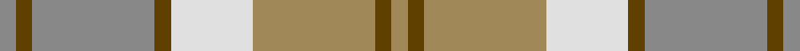
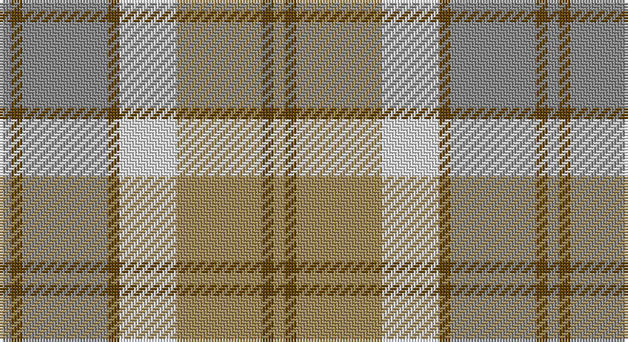

This page is one **sett** — a single exact thread-count. It belongs to the [tartan](/setts/o2dy2o15dy2w10lo15dy2lo2/)
(the same proportion at any scale), whose colour order is pattern [RGRGWYGY](/stripes/rgrgwygy/).

Part of the [Bannockbane](/tartans/bannockbane/) tartan — the named design grouping this sett with its other cloths.

Sourced from register-of-tartans.  It is a [8 stripe tartan](/stripes/stripes8/).

Original link https://www.tartanregister.gov.uk/tartanDetails.aspx?ref=199

## Also known as

This cloth is also recorded under:

- Bannockbane Blue
- Bannockbane Blue #1
- Bannockbane Blue #2
- Bannockbane Blue #3
- Bannockbane Brown #2
- Bannockbane Green
- Bannockbane Grey #1
- Bannockbane Grey #2
- Bannockbane Grey #3
- Bannockbane, Blue
- Bannockbane, Green
- Bannockbane, Grey
- Bannockbane, Light Tan

## Register references

External register numbers recorded for this tartan.

- Scottish Register of Tartans: [199](https://www.tartanregister.gov.uk/tartanDetails.aspx?ref=199)
- Scottish Tartans Authority (ITI): 1306
- Scottish Tartans World Register: 1306

## Thread count
N/4 T4 N30 T4 LN20 LT30 T4 LT/4

One full sett is **192 threads**.

## Palette

Palette: <strong>Tartan Register</strong>
<table><thead><tr><th>Colour</th><th>Threads</th><th>Shade</th><th>Base</th><th>OKLCh</th></tr></thead><tbody><tr><td>N/</td><td style="text-align:right;font-variant-numeric:tabular-nums">4</td><td><code style="background-color:#888888;">#888888</code> <small style="color:#888">#888888</small></td><td>R <code style="background-color:#CC0000;">#CC0000</code></td><td><small style="color:#888">oklch(62.7% 0.000 89.9)</small></td></tr><tr><td>T</td><td style="text-align:right;font-variant-numeric:tabular-nums">4</td><td><code style="background-color:#604000;">#604000</code> <small style="color:#888">#604000</small></td><td>G <code style="background-color:#006100;">#006100</code></td><td><small style="color:#888">oklch(39.8% 0.083 76.8)</small></td></tr><tr><td>N</td><td style="text-align:right;font-variant-numeric:tabular-nums">30</td><td><code style="background-color:#888888;">#888888</code> <small style="color:#888">#888888</small></td><td>R <code style="background-color:#CC0000;">#CC0000</code></td><td><small style="color:#888">oklch(62.7% 0.000 89.9)</small></td></tr><tr><td>T</td><td style="text-align:right;font-variant-numeric:tabular-nums">4</td><td><code style="background-color:#604000;">#604000</code> <small style="color:#888">#604000</small></td><td>G <code style="background-color:#006100;">#006100</code></td><td><small style="color:#888">oklch(39.8% 0.083 76.8)</small></td></tr><tr><td>LN</td><td style="text-align:right;font-variant-numeric:tabular-nums">20</td><td><code style="background-color:#E0E0E0;">#E0E0E0</code> <small style="color:#888">#E0E0E0</small></td><td>W <code style="background-color:#F7F7F7;">#F7F7F7</code></td><td><small style="color:#888">oklch(90.7% 0.000 89.9)</small></td></tr><tr><td>LT</td><td style="text-align:right;font-variant-numeric:tabular-nums">30</td><td><code style="background-color:#A08858;">#A08858</code> <small style="color:#888">#A08858</small></td><td>Y <code style="background-color:#F2BF00;">#F2BF00</code></td><td><small style="color:#888">oklch(63.7% 0.071 84.0)</small></td></tr><tr><td>T</td><td style="text-align:right;font-variant-numeric:tabular-nums">4</td><td><code style="background-color:#604000;">#604000</code> <small style="color:#888">#604000</small></td><td>G <code style="background-color:#006100;">#006100</code></td><td><small style="color:#888">oklch(39.8% 0.083 76.8)</small></td></tr><tr><td>LT/</td><td style="text-align:right;font-variant-numeric:tabular-nums">4</td><td><code style="background-color:#A08858;">#A08858</code> <small style="color:#888">#A08858</small></td><td>Y <code style="background-color:#F2BF00;">#F2BF00</code></td><td><small style="color:#888">oklch(63.7% 0.071 84.0)</small></td></tr></tbody></table>

# Sample pattern

## Nearest tartans

The nearest existing variants by ΔTartan distance, with this tartan at the top so the swatches line up against it.

ΔTartan

Tartan

Sett

—

<a href="/ttd/edit/#slug=o2dy2o15dy2w10lo15dy2lo2~x2">Bannockbane Grey #2</a> <a class="nn-out" href="/variants/s8/o2dy2o15dy2w10lo15dy2lo2~x2/" title="open its dictionary page">↗</a>

0.44

<a href="/ttd/edit/#slug=o2oi2o15w10oi2y15oi2y2~x2&amp;base=o2dy2o15dy2w10lo15dy2lo2~x2">Bannockbane, Grey</a> <a class="nn-out" href="/variants/s8/o2oi2o15w10oi2y15oi2y2~x2/" title="open its dictionary page">↗</a>

1.13

<a href="/ttd/edit/#slug=lb4n2lb18r2n5o16r2o2r2o2~x2&amp;base=o2dy2o15dy2w10lo15dy2lo2~x2">Clyde Trade Tartan</a> <a class="nn-out" href="/variants/s10/lb4n2lb18r2n5o16r2o2r2o2~x2/" title="open its dictionary page">↗</a>

1.27

<a href="/ttd/edit/#slug=lb4n2lb18r2n5y16r2y2r2y2~x2&amp;base=o2dy2o15dy2w10lo15dy2lo2~x2">Clyde</a> <a class="nn-out" href="/variants/s10/lb4n2lb18r2n5y16r2y2r2y2~x2/" title="open its dictionary page">↗</a>

1.37

<a href="/ttd/edit/#slug=b3r2o16r2b3r2g16r2b3~x4&amp;base=o2dy2o15dy2w10lo15dy2lo2~x2">MacPherson Gathering 1996</a> <a class="nn-out" href="/variants/s9/b3r2o16r2b3r2g16r2b3~x4/" title="open its dictionary page">↗</a>

1.66

<a href="/ttd/edit/#slug=y25w2t4lo7t4w2loi25w2t4lo7~x2&amp;base=o2dy2o15dy2w10lo15dy2lo2~x2">O'Monaghan (Personal)</a> <a class="nn-out" href="/variants/s10/y25w2t4lo7t4w2loi25w2t4lo7~x2/" title="open its dictionary page">↗</a>

1.71

<a href="/ttd/edit/#slug=y2w19lr2w2y3w3y3lr6ly25w2~x2&amp;base=o2dy2o15dy2w10lo15dy2lo2~x2">Llama (Fashion)</a> <a class="nn-out" href="/variants/s10/y2w19lr2w2y3w3y3lr6ly25w2~x2/" title="open its dictionary page">↗</a>

1.72

<a href="/ttd/edit/#slug=t24r27g20lo6g20r2w3~x2&amp;base=o2dy2o15dy2w10lo15dy2lo2~x2">Buchanhaven Heritage</a> <a class="nn-out" href="/variants/s7/t24r27g20lo6g20r2w3~x2/" title="open its dictionary page">↗</a>

1.74

<a href="/ttd/edit/#slug=o2w1lo17o14w15o2w2~x2&amp;base=o2dy2o15dy2w10lo15dy2lo2~x2">North American Sheep Breeders Association</a> <a class="nn-out" href="/variants/s7/o2w1lo17o14w15o2w2~x2/" title="open its dictionary page">↗</a>

1.74

<a href="/ttd/edit/#slug=n2w2ly7lb14n2w2~x2&amp;base=o2dy2o15dy2w10lo15dy2lo2~x2">Cairngorm</a> <a class="nn-out" href="/variants/s6/n2w2ly7lb14n2w2~x2/" title="open its dictionary page">↗</a>

1.79

<a href="/ttd/edit/#slug=g5lbi15lb11lbi2lb1lbi1g4~x4&amp;base=o2dy2o15dy2w10lo15dy2lo2~x2">Highlands Country Club (Corporate)</a> <a class="nn-out" href="/variants/s7/g5lbi15lb11lbi2lb1lbi1g4~x4/" title="open its dictionary page">↗</a>

## Neighbour map

Every grey dot is one of 14360 variants placed by the first two principal components of the ΔTartan feature space (44% of its variance). Red is this tartan; blue dots are its nearest — click one to open its page.

<svg viewBox="0 0 640 380" role="img" style="max-width:100%;height:auto;border:1px solid #e0e0e0;border-radius:4px;display:block" xmlns="http://www.w3.org/2000/svg"><image href="/nn/cloud.v1.png" width="640" height="380"/><a href="/variants/s8/o2oi2o15w10oi2y15oi2y2~x2/"><circle cx="220.4" cy="217.8" r="4" fill="#3465a4"><title>Bannockbane, Grey</title></circle></a><a href="/variants/s10/lb4n2lb18r2n5o16r2o2r2o2~x2/"><circle cx="263.0" cy="187.3" r="4" fill="#3465a4"><title>Clyde Trade Tartan</title></circle></a><a href="/variants/s10/lb4n2lb18r2n5y16r2y2r2y2~x2/"><circle cx="249.5" cy="180.8" r="4" fill="#3465a4"><title>Clyde</title></circle></a><a href="/variants/s9/b3r2o16r2b3r2g16r2b3~x4/"><circle cx="227.2" cy="212.7" r="4" fill="#3465a4"><title>MacPherson Gathering 1996</title></circle></a><a href="/variants/s10/y25w2t4lo7t4w2loi25w2t4lo7~x2/"><circle cx="212.2" cy="171.4" r="4" fill="#3465a4"><title>O'Monaghan (Personal)</title></circle></a><a href="/variants/s10/y2w19lr2w2y3w3y3lr6ly25w2~x2/"><circle cx="265.0" cy="156.0" r="4" fill="#3465a4"><title>Llama (Fashion)</title></circle></a><a href="/variants/s7/t24r27g20lo6g20r2w3~x2/"><circle cx="225.2" cy="209.0" r="4" fill="#3465a4"><title>Buchanhaven Heritage</title></circle></a><a href="/variants/s7/o2w1lo17o14w15o2w2~x2/"><circle cx="274.2" cy="202.0" r="4" fill="#3465a4"><title>North American Sheep Breeders Association</title></circle></a><a href="/variants/s6/n2w2ly7lb14n2w2~x2/"><circle cx="262.1" cy="214.3" r="4" fill="#3465a4"><title>Cairngorm</title></circle></a><a href="/variants/s7/g5lbi15lb11lbi2lb1lbi1g4~x4/"><circle cx="240.8" cy="191.8" r="4" fill="#3465a4"><title>Highlands Country Club (Corporate)</title></circle></a><circle cx="214.0" cy="214.8" r="5" fill="#c00000"/></svg>

ID: /variants/s8/o2dy2o15dy2w10lo15dy2lo2~x2/
