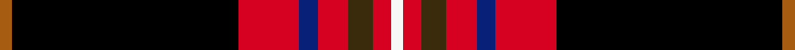
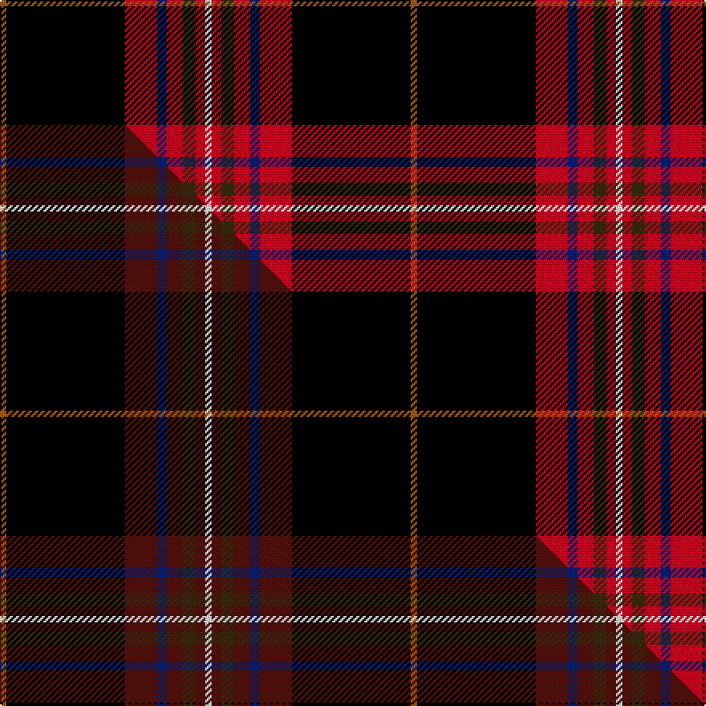

This page is one **sett** — a single exact thread-count. It belongs to the [tartan](/setts/o2k37r10db3r5dy4r3w2/)
(the same proportion at any scale), whose colour order is pattern [RKRBRGRW](/stripes/rkrbrgrw/).

Part of the [Westin Kierland](/tartans/westin-kierland/) tartan — the named design grouping this sett with its other cloths.

Sourced from tartans-authority.  It is a [8 stripe tartan](/stripes/stripes8/).

Original link https://www.tartanregister.gov.uk/tartanDetails.aspx?ref=11059

Dataset <small>— provenance for this record, inherited from the source manifest</small>

<dl class="dataset-prov">
<dt>source</dt><dd><a href="/sources/tartans-authority/">Scottish Tartans Authority</a></dd>
<dt>data captured from</dt><dd><a href="https://github.com/thetartan/tartan-database/blob/master/data/tartans-authority/data.csv">https://github.com/thetartan/tartan-database/blob/master/data/tartans-authority/data.csv</a></dd>
<dt>data date</dt><dd>2014 <small>(this record)</small></dd>
<dt>licence</dt><dd><a href="https://creativecommons.org/licenses/by-nc-nd/4.0/">CC BY-NC-ND 4.0</a></dd>
</dl>

Capture chain <small>— the hands this data passed through, oldest first; each capture carries its own licence</small>

<ol class="capture-chain">
<li><a href="https://www.tartansauthority.com/">Scottish Tartans Authority</a> <small>the heritage body's archive — its tartan-ferret record browser is retired (links repaired to the SRT, above)</small></li>
<li><a href="https://github.com/thetartan/tartan-database">thetartan/tartan-database</a> <small>2016-2017</small> · <a href="https://creativecommons.org/licenses/by-nc-nd/4.0/">CC BY-NC-ND 4.0</a> <small>Levko Kravets's frozen compilation — the capture we vendored, and where its CC licence text came from</small></li>
<li>this dictionary <small>captured 2026-06-10 · commit 5bf86c7566</small> <small>each re-capture is a git commit to data/sources</small></li>
</ol>

## Register references

External register numbers recorded for this tartan.

- Scottish Register of Tartans: [11059](https://www.tartanregister.gov.uk/tartanDetails?ref=11059)
- Scottish Tartans Authority (ITI): 11059

## Thread count
O/4 K74 R20 DB6 R10 DY8 R6 W/4

One full sett is **256 threads**.

## Palette
<table><thead><tr><th>Colour</th><th>Shade</th><th>OKLCh</th></tr></thead><tbody><tr><td>DB</td><td><code style="background-color:#082077;">#082077</code> <small style="color:#888">#082077</small></td><td><small style="color:#888">oklch(30.0% 0.149 265.1)</small></td></tr><tr><td>O</td><td><code style="background-color:#A65C11;">#A65C11</code> <small style="color:#888">#A65C11</small></td><td><small style="color:#888">oklch(55.0% 0.125 58.3)</small></td></tr><tr><td>K</td><td><code style="background-color:#000000;">#000000</code> <small style="color:#888">#000000</small></td><td><small style="color:#888">oklch(0.0% 0.000 0.0)</small></td></tr><tr><td>R</td><td><code style="background-color:#D60020;">#D60020</code> <small style="color:#888">#D60020</small></td><td><small style="color:#888">oklch(55.2% 0.224 25.5)</small></td></tr><tr><td>W</td><td><code style="background-color:#F7F7F7;">#F7F7F7</code> <small style="color:#888">#F7F7F7</small></td><td><small style="color:#888">oklch(97.6% 0.000 89.9)</small></td></tr><tr><td>DY</td><td><code style="background-color:#3A2B0D;">#3A2B0D</code> <small style="color:#888">#3A2B0D</small></td><td><small style="color:#888">oklch(30.0% 0.049 82.0)</small></td></tr></tbody></table>

# Sample pattern

## Compared to the master

This cloth is one sett of its design; the master sett (the exemplar the design is anchored on) is below for comparison.

Its **ΔTartan distance** from the master is **0.13** — the same measure the nearest-tartans table ranks by (0 is identical; a re-scale of the same cloth is near 0, a recolour or a different proportion further).

<figure class="master-compare" style="margin:0">

this sett
master sett ★

<figcaption style="color:#888;font-size:smaller">One weave of this sett against the <a href="/setts/o2k37dr10db3dr5dy4dr3w2/">master sett ★</a>, split on the diagonal: a shared proportion runs seamlessly across it with only the shades shifting; a different proportion breaks on it.</figcaption>
</figure>

## Nearest tartan variants

The nearest existing variants by ΔTartan distance, with this cloth at the top so the swatches line up against it.

ΔTartan

Threads

Variant

Sett

—

256

<a href="/variants/s8/o2k37r10db3r5dy4r3w2~x2/">Westin Kierland</a>

<a href="/ttd/edit/#slug=o2k37dr10db3dr5dy4dr3w2~x2&amp;base=o2k37r10db3r5dy4r3w2~x2" title="compare in the TTD">0.13</a>

256

<a href="/variants/s8/o2k37dr10db3dr5dy4dr3w2~x2/">Westin Kierland</a>

<a href="/ttd/edit/#slug=w2dr3lyi4dr5db3dr10k38ly2~x2~lyi3407090-ly2705081&amp;base=o2k37r10db3r5dy4r3w2~x2" title="compare in the TTD">0.69</a>

260

<a href="/variants/s8/w2dr3lyi4dr5db3dr10k38ly2~x2~lyi3407090-ly2705081/">Westin Kierland (Corporate)</a>

<a href="/ttd/edit/#slug=k51r21y4r12g8db4r5~x2&amp;base=o2k37r10db3r5dy4r3w2~x2" title="compare in the TTD">1.58</a>

308

<a href="/variants/s7/k51r21y4r12g8db4r5~x2/">Totté (from Hofstade de Baerebeeck) (Personal)</a>

<a href="/ttd/edit/#slug=k51r21ly4r12g8db4r5~x2&amp;base=o2k37r10db3r5dy4r3w2~x2" title="compare in the TTD">1.58</a>

308

<a href="/variants/s7/k51r21ly4r12g8db4r5~x2/">Tott (Personal))</a>

<a href="/ttd/edit/#slug=r9k3r9k2b4k4dp4k3dp2k32g6~x2&amp;base=o2k37r10db3r5dy4r3w2~x2" title="compare in the TTD">2.62</a>

282

<a href="/variants/s11/r9k3r9k2b4k4dp4k3dp2k32g6~x2/">Brotherhood of Dirk, The</a>

<a href="/ttd/edit/#slug=r9k3r9k2t4k4dp4k3dp2k32g6~x2&amp;base=o2k37r10db3r5dy4r3w2~x2" title="compare in the TTD">2.63</a>

282

<a href="/variants/s11/r9k3r9k2t4k4dp4k3dp2k32g6~x2/">Brotherhood of Dirk (Corporate)</a>

<a href="/ttd/edit/#slug=w3o18k18y1r2t2r2y1o18t2~x2&amp;base=o2k37r10db3r5dy4r3w2~x2" title="compare in the TTD">2.66</a>

258

<a href="/variants/s10/w3o18k18y1r2t2r2y1o18t2~x2/">Selkirk High (Corporate)</a>

<a href="/ttd/edit/#slug=k60w2r10dg6w4r15y10~x2&amp;base=o2k37r10db3r5dy4r3w2~x2" title="compare in the TTD">2.72</a>

288

<a href="/variants/s7/k60w2r10dg6w4r15y10~x2/">Iberia Dress, Black (Fashion)</a>

<a href="/ttd/edit/#slug=db6w3r14k3y2k2w2k38w2k2y2~x2&amp;base=o2k37r10db3r5dy4r3w2~x2" title="compare in the TTD">2.72</a>

288

<a href="/variants/s11/db6w3r14k3y2k2w2k38w2k2y2~x2/">Norwegian Night</a>

<a href="/ttd/edit/#slug=k30db3k4dp2k2dp2k2dg10r6k2r3w2~x2&amp;base=o2k37r10db3r5dy4r3w2~x2" title="compare in the TTD">2.82</a>

208

<a href="/variants/s12/k30db3k4dp2k2dp2k2dg10r6k2r3w2~x2/">Braveheart Commemorative Tartan</a>

## Neighbour map

Every grey dot is one of 13620 variants placed by the first two principal components of the ΔTartan feature space (42% of its variance). Red is this tartan; blue dots are its nearest — click one to open its page.

<svg viewBox="0 0 640 380" role="img" style="max-width:100%;height:auto;border:1px solid #e0e0e0;border-radius:4px;display:block" xmlns="http://www.w3.org/2000/svg"><image href="/nn/cloud.v1.png" width="640" height="380"/><a href="/variants/s8/o2k37dr10db3dr5dy4dr3w2~x2/"><circle cx="284.8" cy="96.8" r="4" fill="#3465a4"><title>Westin Kierland</title></circle></a><a href="/variants/s8/w2dr3lyi4dr5db3dr10k38ly2~x2~lyi3407090-ly2705081/"><circle cx="266.5" cy="89.3" r="4" fill="#3465a4"><title>Westin Kierland (Corporate)</title></circle></a><a href="/variants/s7/k51r21y4r12g8db4r5~x2/"><circle cx="216.4" cy="133.9" r="4" fill="#3465a4"><title>Totté (from Hofstade de Baerebeeck) (Personal)</title></circle></a><a href="/variants/s7/k51r21ly4r12g8db4r5~x2/"><circle cx="213.9" cy="133.5" r="4" fill="#3465a4"><title>Tott (Personal))</title></circle></a><a href="/variants/s11/r9k3r9k2b4k4dp4k3dp2k32g6~x2/"><circle cx="246.1" cy="100.6" r="4" fill="#3465a4"><title>Brotherhood of Dirk, The</title></circle></a><a href="/variants/s11/r9k3r9k2t4k4dp4k3dp2k32g6~x2/"><circle cx="245.6" cy="100.9" r="4" fill="#3465a4"><title>Brotherhood of Dirk (Corporate)</title></circle></a><a href="/variants/s10/w3o18k18y1r2t2r2y1o18t2~x2/"><circle cx="224.0" cy="95.1" r="4" fill="#3465a4"><title>Selkirk High (Corporate)</title></circle></a><a href="/variants/s7/k60w2r10dg6w4r15y10~x2/"><circle cx="272.9" cy="91.6" r="4" fill="#3465a4"><title>Iberia Dress, Black (Fashion)</title></circle></a><a href="/variants/s11/db6w3r14k3y2k2w2k38w2k2y2~x2/"><circle cx="270.1" cy="74.1" r="4" fill="#3465a4"><title>Norwegian Night</title></circle></a><a href="/variants/s12/k30db3k4dp2k2dp2k2dg10r6k2r3w2~x2/"><circle cx="252.4" cy="79.7" r="4" fill="#3465a4"><title>Braveheart Commemorative Tartan</title></circle></a><circle cx="252.2" cy="82.2" r="5" fill="#c00000"/><text x="320" y="376" text-anchor="middle" font-size="11" fill="#999">ground</text><text x="11" y="190" text-anchor="middle" font-size="11" fill="#999" transform="rotate(-90 11 190)">complexity</text></svg>

ID: /variants/s8/o2k37r10db3r5dy4r3w2~x2/
