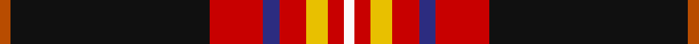
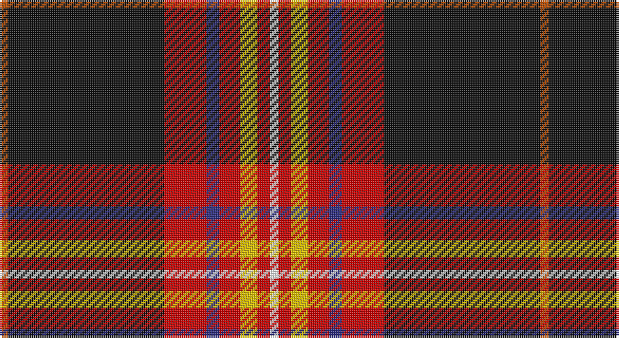

This page is one **sett** — a single exact thread-count. It belongs to the [tartan](/setts/o2k37r10db3r5ly4r3w2/)
(the same proportion at any scale), whose colour order is pattern [RKRBRYRW](/stripes/rkrbryrw/).

Sourced from tartans-authority.  It is a [8 stripe tartan](/stripes/stripes8/).

Original link http://www.tartansauthority.com/tartan-ferret/display/11059/

## Register references

External register numbers recorded for this tartan.

- Scottish Register of Tartans: [11059](https://www.tartanregister.gov.uk/tartanDetails?ref=11059)
- Scottish Tartans Authority (ITI): 11059

## Thread count
DO/4 K74 R20 DB6 R10 Y8 R6 W/4

One full sett is **256 threads**.

## Palette

Palette: <strong>Tartan Register</strong> <small style="color:#888">(5 of 6 colours)</small>
<table><thead><tr><th>Colour</th><th>Threads</th><th>Shade</th><th>Base</th><th>OKLCh</th></tr></thead><tbody><tr><td>DO/</td><td style="text-align:right;font-variant-numeric:tabular-nums">4</td><td><code style="background-color:#B84C00;">#B84C00</code> <small style="color:#888">#B84C00</small></td><td>R <code style="background-color:#CC0000;">#CC0000</code></td><td><small style="color:#888">oklch(55.1% 0.156 45.5)</small></td></tr><tr><td>K</td><td style="text-align:right;font-variant-numeric:tabular-nums">74</td><td><code style="background-color:#101010;">#101010</code> <small style="color:#888">#101010</small></td><td>K <code style="background-color:#000000;">#000000</code></td><td><small style="color:#888">oklch(17.3% 0.000 89.9)</small></td></tr><tr><td>R</td><td style="text-align:right;font-variant-numeric:tabular-nums">20</td><td><code style="background-color:#C80000;">#C80000</code> <small style="color:#888">#C80000</small></td><td>R <code style="background-color:#CC0000;">#CC0000</code></td><td><small style="color:#888">oklch(52.3% 0.215 29.2)</small></td></tr><tr><td>DB</td><td style="text-align:right;font-variant-numeric:tabular-nums">6</td><td><code style="background-color:#2C2C80;">#2C2C80</code> <small style="color:#888">#2C2C80</small></td><td>B <code style="background-color:#2A418A;">#2A418A</code></td><td><small style="color:#888">oklch(35.0% 0.138 276.6)</small></td></tr><tr><td>R</td><td style="text-align:right;font-variant-numeric:tabular-nums">10</td><td><code style="background-color:#C80000;">#C80000</code> <small style="color:#888">#C80000</small></td><td>R <code style="background-color:#CC0000;">#CC0000</code></td><td><small style="color:#888">oklch(52.3% 0.215 29.2)</small></td></tr><tr><td>Y</td><td style="text-align:right;font-variant-numeric:tabular-nums">8</td><td><code style="background-color:#E8C000;">#E8C000</code> <small style="color:#888">#E8C000</small></td><td>Y <code style="background-color:#F2BF00;">#F2BF00</code></td><td><small style="color:#888">oklch(81.9% 0.168 93.7)</small></td></tr><tr><td>R</td><td style="text-align:right;font-variant-numeric:tabular-nums">6</td><td><code style="background-color:#C80000;">#C80000</code> <small style="color:#888">#C80000</small></td><td>R <code style="background-color:#CC0000;">#CC0000</code></td><td><small style="color:#888">oklch(52.3% 0.215 29.2)</small></td></tr><tr><td>W/</td><td style="text-align:right;font-variant-numeric:tabular-nums">4</td><td><code style="background-color:#FCFCFC;">#FCFCFC</code> <small style="color:#888">#FCFCFC</small></td><td>W <code style="background-color:#F7F7F7;">#F7F7F7</code></td><td><small style="color:#888">oklch(99.1% 0.000 89.9)</small></td></tr></tbody></table>

# Sample pattern

## Nearest tartans

The nearest existing variants by ΔTartan distance, with this tartan at the top so the swatches line up against it.

ΔTartan

Tartan

Sett

—

<a href="/ttd/edit/#slug=o2k37r10db3r5ly4r3w2~x2">Westin Kierland</a> <a class="nn-out" href="/variants/s8/o2k37r10db3r5ly4r3w2~x2/" title="open its dictionary page">↗</a>

0.26

<a href="/ttd/edit/#slug=o2k37r10db3r5lo4r3w2~x2&amp;base=o2k37r10db3r5ly4r3w2~x2">Westin Kierland</a> <a class="nn-out" href="/variants/s8/o2k37r10db3r5lo4r3w2~x2/" title="open its dictionary page">↗</a>

0.59

<a href="/ttd/edit/#slug=lo2k38r10db3r5ly4r3lb2~x2&amp;base=o2k37r10db3r5ly4r3w2~x2">Westin Kierland (Corporate)</a> <a class="nn-out" href="/variants/s8/lo2k38r10db3r5ly4r3lb2~x2/" title="open its dictionary page">↗</a>

0.71

<a href="/ttd/edit/#slug=do62ly7g7r3w3db13w3r5~x2&amp;base=o2k37r10db3r5ly4r3w2~x2">Legion of Frontiersmen</a> <a class="nn-out" href="/variants/s8/do62ly7g7r3w3db13w3r5~x2/" title="open its dictionary page">↗</a>

0.73

<a href="/ttd/edit/#slug=dr62ly7g7r3w3db13w3r5~x2&amp;base=o2k37r10db3r5ly4r3w2~x2">Legion of Frontiersmen</a> <a class="nn-out" href="/variants/s8/dr62ly7g7r3w3db13w3r5~x2/" title="open its dictionary page">↗</a>

1.20

<a href="/ttd/edit/#slug=db6w3r14k3lo2k2w2k38w2k2lo2~x2&amp;base=o2k37r10db3r5ly4r3w2~x2">Norwegian Night</a> <a class="nn-out" href="/variants/s11/db6w3r14k3lo2k2w2k38w2k2lo2~x2/" title="open its dictionary page">↗</a>

1.25

<a href="/ttd/edit/#slug=k60w2r10dg6w4r15ly10~x2&amp;base=o2k37r10db3r5ly4r3w2~x2">Iberia Dress, Black (Fashion)</a> <a class="nn-out" href="/variants/s7/k60w2r10dg6w4r15ly10~x2/" title="open its dictionary page">↗</a>

1.27

<a href="/ttd/edit/#slug=g18gi2dbi5r45db3dbi18db3r5w2&amp;base=o2k37r10db3r5ly4r3w2~x2">MacNiven</a> <a class="nn-out" href="/variants/s9/g18gi2dbi5r45db3dbi18db3r5w2/" title="open its dictionary page">↗</a>

1.39

<a href="/ttd/edit/#slug=dp3lo2r19ri4dpi6k36dpi2lo3~x2&amp;base=o2k37r10db3r5ly4r3w2~x2">Hyland Evening (Personal)</a> <a class="nn-out" href="/variants/s8/dp3lo2r19ri4dpi6k36dpi2lo3~x2/" title="open its dictionary page">↗</a>

1.43

<a href="/ttd/edit/#slug=k1w1ly2dg1k10db1r2w1~x10&amp;base=o2k37r10db3r5ly4r3w2~x2">Kaptain Family (Personal)</a> <a class="nn-out" href="/variants/s8/k1w1ly2dg1k10db1r2w1~x10/" title="open its dictionary page">↗</a>

1.44

<a href="/ttd/edit/#slug=k3r24k4ly1k2w1db4g6r3k1r2w1~x2&amp;base=o2k37r10db3r5ly4r3w2~x2">Stewart of Galloway</a> <a class="nn-out" href="/variants/s12/k3r24k4ly1k2w1db4g6r3k1r2w1~x2/" title="open its dictionary page">↗</a>

## Neighbour map

Every grey dot is one of 14360 variants placed by the first two principal components of the ΔTartan feature space (44% of its variance). Red is this tartan; blue dots are its nearest — click one to open its page.

<svg viewBox="0 0 640 380" role="img" style="max-width:100%;height:auto;border:1px solid #e0e0e0;border-radius:4px;display:block" xmlns="http://www.w3.org/2000/svg"><image href="/nn/cloud.v1.png" width="640" height="380"/><a href="/variants/s8/o2k37r10db3r5lo4r3w2~x2/"><circle cx="299.4" cy="102.6" r="4" fill="#3465a4"><title>Westin Kierland</title></circle></a><a href="/variants/s8/lo2k38r10db3r5ly4r3lb2~x2/"><circle cx="312.5" cy="109.0" r="4" fill="#3465a4"><title>Westin Kierland (Corporate)</title></circle></a><a href="/variants/s8/do62ly7g7r3w3db13w3r5~x2/"><circle cx="315.0" cy="91.5" r="4" fill="#3465a4"><title>Legion of Frontiersmen</title></circle></a><a href="/variants/s8/dr62ly7g7r3w3db13w3r5~x2/"><circle cx="325.8" cy="92.4" r="4" fill="#3465a4"><title>Legion of Frontiersmen</title></circle></a><a href="/variants/s11/db6w3r14k3lo2k2w2k38w2k2lo2~x2/"><circle cx="316.6" cy="91.2" r="4" fill="#3465a4"><title>Norwegian Night</title></circle></a><a href="/variants/s7/k60w2r10dg6w4r15ly10~x2/"><circle cx="315.5" cy="109.8" r="4" fill="#3465a4"><title>Iberia Dress, Black (Fashion)</title></circle></a><a href="/variants/s9/g18gi2dbi5r45db3dbi18db3r5w2/"><circle cx="256.4" cy="94.7" r="4" fill="#3465a4"><title>MacNiven</title></circle></a><a href="/variants/s8/dp3lo2r19ri4dpi6k36dpi2lo3~x2/"><circle cx="253.7" cy="113.6" r="4" fill="#3465a4"><title>Hyland Evening (Personal)</title></circle></a><a href="/variants/s8/k1w1ly2dg1k10db1r2w1~x10/"><circle cx="243.5" cy="123.6" r="4" fill="#3465a4"><title>Kaptain Family (Personal)</title></circle></a><a href="/variants/s12/k3r24k4ly1k2w1db4g6r3k1r2w1~x2/"><circle cx="288.0" cy="59.6" r="4" fill="#3465a4"><title>Stewart of Galloway</title></circle></a><circle cx="296.4" cy="100.8" r="5" fill="#c00000"/></svg>

ID: /variants/s8/o2k37r10db3r5ly4r3w2~x2/
