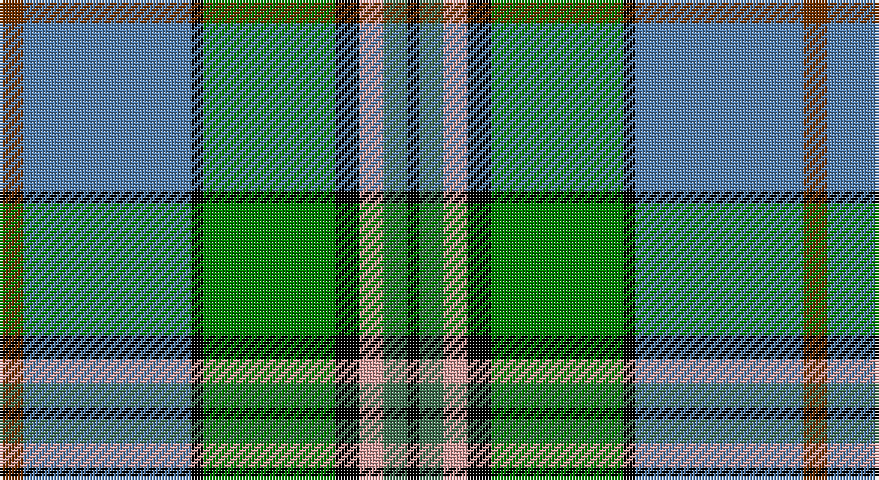

This page is one **sett** — a single exact thread-count. It belongs to the [tartan](/setts/o2t14k1g11k2lr2gi2k1/)
(the same proportion at any scale), whose colour order is pattern [KGYKGKBR](/stripes/kgykgkbr/).

Part of the [Mission](/tartans/mission/) tartan — the named design grouping this sett with its other cloths.

Sourced from weddslist.  It is a [8 stripe tartan](/stripes/stripes8/).

Original link http://www.weddslist.com/cgi-bin/tartans/pg.pl?source=sts

## Thread count
T/8 B56 K4 Ga44 K8 LR8 G8 K/4

One full sett is **268 threads**.

## Palette

Palette: <strong>Ingles Buchan</strong> <small style="color:#888">(1 of 6 colours)</small>
<table><thead><tr><th>Colour</th><th>Threads</th><th>Shade</th><th>Base</th><th>OKLCh</th></tr></thead><tbody><tr><td>T/</td><td style="text-align:right;font-variant-numeric:tabular-nums">8</td><td><code style="background-color:#703000;">#703000</code> <small style="color:#888">#703000</small></td><td>R <code style="background-color:#CC0000;">#CC0000</code></td><td><small style="color:#888">oklch(39.1% 0.105 49.1)</small></td></tr><tr><td>B</td><td style="text-align:right;font-variant-numeric:tabular-nums">56</td><td><code style="background-color:#5480B0;">#5480B0</code> <small style="color:#888">#5480B0</small></td><td>B <code style="background-color:#2A418A;">#2A418A</code></td><td><small style="color:#888">oklch(58.8% 0.089 251.5)</small></td></tr><tr><td>K</td><td style="text-align:right;font-variant-numeric:tabular-nums">4</td><td><code style="background-color:#000000;">#000000</code> <small style="color:#888">#000000</small></td><td>K <code style="background-color:#000000;">#000000</code></td><td><small style="color:#888">oklch(0.0% 0.000 0.0)</small></td></tr><tr><td>Ga</td><td style="text-align:right;font-variant-numeric:tabular-nums">44</td><td><code style="background-color:#008000;">#008000</code> <small style="color:#888">#008000</small></td><td>G <code style="background-color:#006100;">#006100</code></td><td><small style="color:#888">oklch(52.0% 0.177 142.5)</small></td></tr><tr><td>K</td><td style="text-align:right;font-variant-numeric:tabular-nums">8</td><td><code style="background-color:#000000;">#000000</code> <small style="color:#888">#000000</small></td><td>K <code style="background-color:#000000;">#000000</code></td><td><small style="color:#888">oklch(0.0% 0.000 0.0)</small></td></tr><tr><td>LR</td><td style="text-align:right;font-variant-numeric:tabular-nums">8</td><td><code style="background-color:#E0A0A0;">#E0A0A0</code> <small style="color:#888">#E0A0A0</small></td><td>Y <code style="background-color:#F2BF00;">#F2BF00</code></td><td><small style="color:#888">oklch(76.7% 0.077 19.0)</small></td></tr><tr><td>G</td><td style="text-align:right;font-variant-numeric:tabular-nums">8</td><td><code style="background-color:#407050;">#407050</code> <small style="color:#888">#407050</small></td><td>G <code style="background-color:#006100;">#006100</code></td><td><small style="color:#888">oklch(50.1% 0.074 153.7)</small></td></tr><tr><td>K/</td><td style="text-align:right;font-variant-numeric:tabular-nums">4</td><td><code style="background-color:#000000;">#000000</code> <small style="color:#888">#000000</small></td><td>K <code style="background-color:#000000;">#000000</code></td><td><small style="color:#888">oklch(0.0% 0.000 0.0)</small></td></tr></tbody></table>

# Sample pattern

## Compared to the master

This cloth is one sett of its design; the master sett (the exemplar the design is anchored on) is below for comparison.

<figure style="margin:0"><figcaption style="color:#888;font-size:smaller">this sett</figcaption></figure>
<figure style="margin:0"><figcaption style="color:#888;font-size:smaller"><a href="/setts/lo2t14k1gi11k2w2g2k1/">master sett →</a></figcaption></figure>

## Nearest tartans

The nearest existing variants by ΔTartan distance, with this tartan at the top so the swatches line up against it.

ΔTartan

Tartan

Sett

—

<a href="/ttd/edit/#slug=o2t14k1g11k2lr2gi2k1~x4">Mission</a> <a class="nn-out" href="/variants/s8/o2t14k1g11k2lr2gi2k1~x4/" title="open its dictionary page">↗</a>

0.50

<a href="/ttd/edit/#slug=lo2t14k1gi11k2w2g2k1~x4&amp;base=o2t14k1g11k2lr2gi2k1~x4">Mission</a> <a class="nn-out" href="/variants/s8/lo2t14k1gi11k2w2g2k1~x4/" title="open its dictionary page">↗</a>

0.79

<a href="/ttd/edit/#slug=t34r3t8db4t8k24g34k2w6&amp;base=o2t14k1g11k2lr2gi2k1~x4">Hogg Dress (Name)</a> <a class="nn-out" href="/variants/s9/t34r3t8db4t8k24g34k2w6/" title="open its dictionary page">↗</a>

0.79

<a href="/ttd/edit/#slug=w3t25k3r3k3r8g21k3k2~x2&amp;base=o2t14k1g11k2lr2gi2k1~x4">Dunedin (USA) (District)</a> <a class="nn-out" href="/variants/s9/w3t25k3r3k3r8g21k3k2~x2/" title="open its dictionary page">↗</a>

0.87

<a href="/ttd/edit/#slug=w1db16ly1r3ly1gi6g2gi6w1~x2&amp;base=o2t14k1g11k2lr2gi2k1~x4">Kleto, Susan (Personal)</a> <a class="nn-out" href="/variants/s9/w1db16ly1r3ly1gi6g2gi6w1~x2/" title="open its dictionary page">↗</a>

0.93

<a href="/ttd/edit/#slug=t34r3t8dt4t8k24g34k2w6&amp;base=o2t14k1g11k2lr2gi2k1~x4">Hogg Dress</a> <a class="nn-out" href="/variants/s9/t34r3t8dt4t8k24g34k2w6/" title="open its dictionary page">↗</a>

0.93

<a href="/ttd/edit/#slug=g18lg6dy3w1dy3w1lt6db6~x2&amp;base=o2t14k1g11k2lr2gi2k1~x4">Iroquois Falls Centenary</a> <a class="nn-out" href="/variants/s8/g18lg6dy3w1dy3w1lt6db6~x2/" title="open its dictionary page">↗</a>

0.94

<a href="/ttd/edit/#slug=t6db17p4db2k11g33ly4~x2&amp;base=o2t14k1g11k2lr2gi2k1~x4">East Lothian</a> <a class="nn-out" href="/variants/s7/t6db17p4db2k11g33ly4~x2/" title="open its dictionary page">↗</a>

0.99

<a href="/ttd/edit/#slug=r2k1lo2g3lo4g3db12k1lb2~x4&amp;base=o2t14k1g11k2lr2gi2k1~x4">Federated Women's Institutes of</a> <a class="nn-out" href="/variants/s9/r2k1lo2g3lo4g3db12k1lb2~x4/" title="open its dictionary page">↗</a>

1.01

<a href="/ttd/edit/#slug=r6b2g20k3db8gi2b4~x2&amp;base=o2t14k1g11k2lr2gi2k1~x4">Royal British Legion, The</a> <a class="nn-out" href="/variants/s7/r6b2g20k3db8gi2b4~x2/" title="open its dictionary page">↗</a>

1.06

<a href="/ttd/edit/#slug=r3w6r2g32db36k2db4ly2~x2&amp;base=o2t14k1g11k2lr2gi2k1~x4">Canadian Centennial</a> <a class="nn-out" href="/variants/s8/r3w6r2g32db36k2db4ly2~x2/" title="open its dictionary page">↗</a>

## Neighbour map

Every grey dot is one of 14360 variants placed by the first two principal components of the ΔTartan feature space (44% of its variance). Red is this tartan; blue dots are its nearest — click one to open its page.

<svg viewBox="0 0 640 380" role="img" style="max-width:100%;height:auto;border:1px solid #e0e0e0;border-radius:4px;display:block" xmlns="http://www.w3.org/2000/svg"><image href="/nn/cloud.v1.png" width="640" height="380"/><a href="/variants/s8/lo2t14k1gi11k2w2g2k1~x4/"><circle cx="181.2" cy="137.3" r="4" fill="#3465a4"><title>Mission</title></circle></a><a href="/variants/s9/t34r3t8db4t8k24g34k2w6/"><circle cx="181.2" cy="142.3" r="4" fill="#3465a4"><title>Hogg Dress (Name)</title></circle></a><a href="/variants/s9/w3t25k3r3k3r8g21k3k2~x2/"><circle cx="139.8" cy="131.9" r="4" fill="#3465a4"><title>Dunedin (USA) (District)</title></circle></a><a href="/variants/s9/w1db16ly1r3ly1gi6g2gi6w1~x2/"><circle cx="198.2" cy="121.5" r="4" fill="#3465a4"><title>Kleto, Susan (Personal)</title></circle></a><a href="/variants/s9/t34r3t8dt4t8k24g34k2w6/"><circle cx="167.7" cy="137.0" r="4" fill="#3465a4"><title>Hogg Dress</title></circle></a><a href="/variants/s8/g18lg6dy3w1dy3w1lt6db6~x2/"><circle cx="146.5" cy="129.6" r="4" fill="#3465a4"><title>Iroquois Falls Centenary</title></circle></a><a href="/variants/s7/t6db17p4db2k11g33ly4~x2/"><circle cx="170.3" cy="145.3" r="4" fill="#3465a4"><title>East Lothian</title></circle></a><a href="/variants/s9/r2k1lo2g3lo4g3db12k1lb2~x4/"><circle cx="141.6" cy="137.7" r="4" fill="#3465a4"><title>Federated Women's Institutes of</title></circle></a><a href="/variants/s7/r6b2g20k3db8gi2b4~x2/"><circle cx="168.2" cy="164.9" r="4" fill="#3465a4"><title>Royal British Legion, The</title></circle></a><a href="/variants/s8/r3w6r2g32db36k2db4ly2~x2/"><circle cx="242.8" cy="121.0" r="4" fill="#3465a4"><title>Canadian Centennial</title></circle></a><circle cx="174.2" cy="136.0" r="5" fill="#c00000"/></svg>

ID: /variants/s8/o2t14k1g11k2lr2gi2k1~x4/
