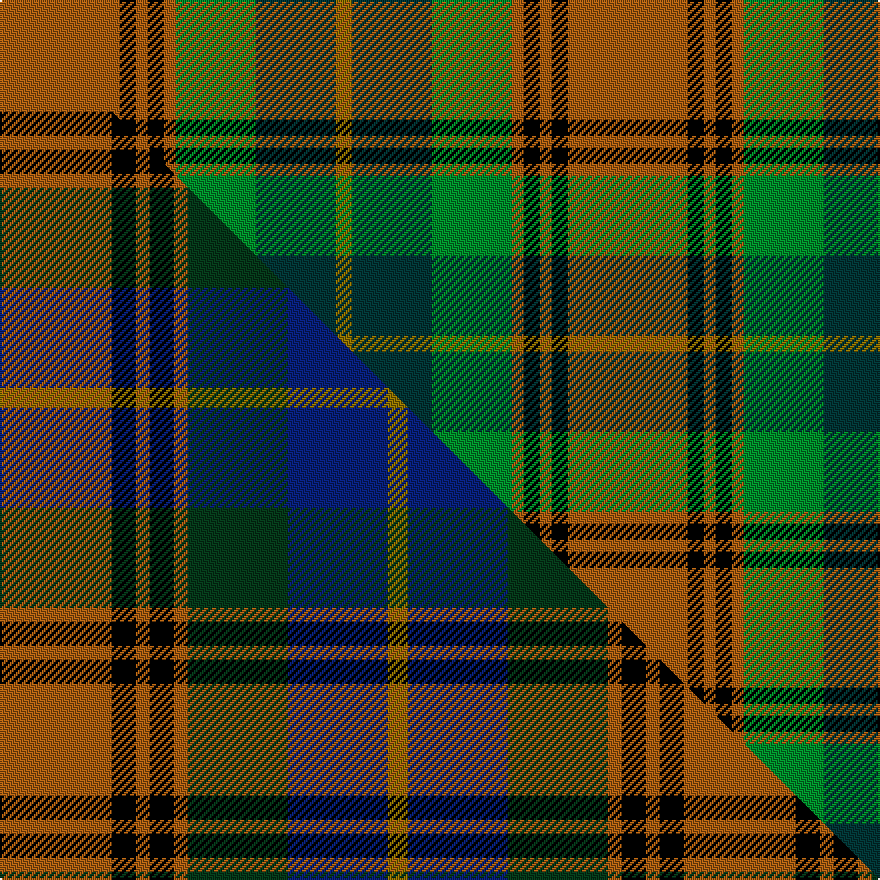

This page is one **sett** — a single exact thread-count. It belongs to the [tartan](/setts/o30k4o3k4o3g20dt20y4/)
(the same proportion at any scale), whose colour order is pattern [GBGRKRKR](/stripes/gbgrkrkr/).

Part of the [Sikh](/tartans/sikh/) tartan — the named design grouping this sett with its other cloths.

Sourced from tartans-authority.  It is a [8 stripe tartan](/stripes/stripes8/).

Original link http://www.tartansauthority.com/tartan-ferret/display/2654/

## Register references

External register numbers recorded for this tartan.

- Scottish Tartans Authority (ITI): 2654

## Thread count
O/60 K8 O6 K8 O6 G40 DT40 Y/8

One full sett is **284 threads**.

## Palette
<table><thead><tr><th>Colour</th><th>Shade</th><th>OKLCh</th></tr></thead><tbody><tr><td>DT</td><td><code style="background-color:#023535;">#023535</code> <small style="color:#888">#023535</small></td><td><small style="color:#888">oklch(29.8% 0.050 194.8)</small></td></tr><tr><td>O</td><td><code style="background-color:#A65C11;">#A65C11</code> <small style="color:#888">#A65C11</small></td><td><small style="color:#888">oklch(55.0% 0.125 58.3)</small></td></tr><tr><td>G</td><td><code style="background-color:#008B2A;">#008B2A</code> <small style="color:#888">#008B2A</small></td><td><small style="color:#888">oklch(55.4% 0.170 145.9)</small></td></tr><tr><td>K</td><td><code style="background-color:#000000;">#000000</code> <small style="color:#888">#000000</small></td><td><small style="color:#888">oklch(0.0% 0.000 0.0)</small></td></tr><tr><td>Y</td><td><code style="background-color:#8B6E00;">#8B6E00</code> <small style="color:#888">#8B6E00</small></td><td><small style="color:#888">oklch(55.1% 0.113 90.4)</small></td></tr></tbody></table>

# Sample pattern

## Compared to the master

This cloth is one sett of its design; the master sett (the exemplar the design is anchored on) is below for comparison.

Its **ΔTartan distance** from the master is **2.51** — the same measure the nearest-tartans table ranks by (0 is identical; a re-scale of the same cloth is near 0, a recolour or a different proportion further).

<figure class="master-compare" style="margin:0">

this sett
master sett ★

<figcaption style="color:#888;font-size:smaller">One weave of this sett against the <a href="/setts/o56k12o7k12o7dg50db50y10/">master sett ★</a>, split on the diagonal: a shared proportion runs seamlessly across it with only the shades shifting; a different proportion breaks on it.</figcaption>
</figure>

## Nearest tartan variants

The nearest existing variants by ΔTartan distance, with this cloth at the top so the swatches line up against it.

ΔTartan

Threads

Variant

Sett

—

284

<a href="/variants/s8/o30k4o3k4o3g20dt20y4~x2/">Sikh (Corporate)</a>

<a href="/ttd/edit/#slug=db4dr11db1g8dr2g4k1lo2~x4&amp;base=o30k4o3k4o3g20dt20y4~x2" title="compare in the TTD">2.10</a>

240

<a href="/variants/s8/db4dr11db1g8dr2g4k1lo2~x4/">Craik of Assington (Personal)</a>

<a href="/ttd/edit/#slug=o9k2o2r2g6k1y1k1g6r3~x2&amp;base=o30k4o3k4o3g20dt20y4~x2" title="compare in the TTD">2.20</a>

108

<a href="/variants/s10/o9k2o2r2g6k1y1k1g6r3~x2/">MacAart</a>

<a href="/ttd/edit/#slug=dy9k2dy2r2g6k1y1k1g6r3~x2&amp;base=o30k4o3k4o3g20dt20y4~x2" title="compare in the TTD">2.20</a>

108

<a href="/variants/s10/dy9k2dy2r2g6k1y1k1g6r3~x2/">MacAart Family Tartan</a>

<a href="/ttd/edit/#slug=dy9k2dy2dr2g6k1lo1k1g6dr3~x4&amp;base=o30k4o3k4o3g20dt20y4~x2" title="compare in the TTD">2.26</a>

216

<a href="/variants/s10/dy9k2dy2dr2g6k1lo1k1g6dr3~x4/">MacAart (Personal)</a>

<a href="/ttd/edit/#slug=o56k12o7k12o7dg50db50y10&amp;base=o30k4o3k4o3g20dt20y4~x2" title="compare in the TTD">2.51</a>

342

<a href="/variants/s8/o56k12o7k12o7dg50db50y10/">Sikh</a>

<a href="/ttd/edit/#slug=y15k10n30o11w3y5~x2&amp;base=o30k4o3k4o3g20dt20y4~x2" title="compare in the TTD">2.61</a>

256

<a href="/variants/s6/y15k10n30o11w3y5~x2/">McHale (Personal)</a>

<a href="/ttd/edit/#slug=k3r9k4dy9y3dy9k4g26k2y3~x2&amp;base=o30k4o3k4o3g20dt20y4~x2" title="compare in the TTD">2.65</a>

276

<a href="/variants/s10/k3r9k4dy9y3dy9k4g26k2y3~x2/">Cavan, County</a>

<a href="/ttd/edit/#slug=db4r11db1g8r2g4k1y2~x4&amp;base=o30k4o3k4o3g20dt20y4~x2" title="compare in the TTD">2.68</a>

240

<a href="/variants/s8/db4r11db1g8r2g4k1y2~x4/">Craik, of Assington</a>

<a href="/ttd/edit/#slug=dr3g6k1lo1k1g6dr2dy2k2dy9k2~x4&amp;base=o30k4o3k4o3g20dt20y4~x2" title="compare in the TTD">2.88</a>

260

<a href="/variants/s11/dr3g6k1lo1k1g6dr2dy2k2dy9k2~x4/">MacAart (Personal)</a>

<a href="/ttd/edit/#slug=dg5g32dp5k10dg8dr3dg8dp3~x2&amp;base=o30k4o3k4o3g20dt20y4~x2" title="compare in the TTD">2.90</a>

280

<a href="/variants/s8/dg5g32dp5k10dg8dr3dg8dp3~x2/">Scottish Power (Corporate)</a>

## Neighbour map

Every grey dot is one of 13620 variants placed by the first two principal components of the ΔTartan feature space (42% of its variance). Red is this tartan; blue dots are its nearest — click one to open its page.

<svg viewBox="0 0 640 380" role="img" style="max-width:100%;height:auto;border:1px solid #e0e0e0;border-radius:4px;display:block" xmlns="http://www.w3.org/2000/svg"><image href="/nn/cloud.v1.png" width="640" height="380"/><a href="/variants/s8/db4dr11db1g8dr2g4k1lo2~x4/"><circle cx="183.4" cy="178.8" r="4" fill="#3465a4"><title>Craik of Assington (Personal)</title></circle></a><a href="/variants/s10/o9k2o2r2g6k1y1k1g6r3~x2/"><circle cx="147.4" cy="177.7" r="4" fill="#3465a4"><title>MacAart</title></circle></a><a href="/variants/s10/dy9k2dy2r2g6k1y1k1g6r3~x2/"><circle cx="141.6" cy="177.6" r="4" fill="#3465a4"><title>MacAart Family Tartan</title></circle></a><a href="/variants/s10/dy9k2dy2dr2g6k1lo1k1g6dr3~x4/"><circle cx="152.4" cy="183.7" r="4" fill="#3465a4"><title>MacAart (Personal)</title></circle></a><a href="/variants/s8/o56k12o7k12o7dg50db50y10/"><circle cx="139.8" cy="189.3" r="4" fill="#3465a4"><title>Sikh</title></circle></a><a href="/variants/s6/y15k10n30o11w3y5~x2/"><circle cx="183.1" cy="205.9" r="4" fill="#3465a4"><title>McHale (Personal)</title></circle></a><a href="/variants/s10/k3r9k4dy9y3dy9k4g26k2y3~x2/"><circle cx="137.8" cy="146.6" r="4" fill="#3465a4"><title>Cavan, County</title></circle></a><a href="/variants/s8/db4r11db1g8r2g4k1y2~x4/"><circle cx="183.4" cy="174.3" r="4" fill="#3465a4"><title>Craik, of Assington</title></circle></a><a href="/variants/s11/dr3g6k1lo1k1g6dr2dy2k2dy9k2~x4/"><circle cx="129.3" cy="176.3" r="4" fill="#3465a4"><title>MacAart (Personal)</title></circle></a><a href="/variants/s8/dg5g32dp5k10dg8dr3dg8dp3~x2/"><circle cx="195.0" cy="172.0" r="4" fill="#3465a4"><title>Scottish Power (Corporate)</title></circle></a><circle cx="188.6" cy="176.8" r="5" fill="#c00000"/><text x="320" y="376" text-anchor="middle" font-size="11" fill="#999">ground</text><text x="11" y="190" text-anchor="middle" font-size="11" fill="#999" transform="rotate(-90 11 190)">complexity</text></svg>

ID: /variants/s8/o30k4o3k4o3g20dt20y4~x2/
