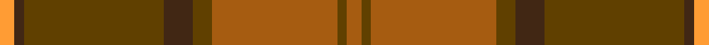

This is one **variant** — a specific cloth: this exact thread count and colourway, with its own
provenance below. It is one weaving of the [sett](/tartans/h/hy/hyland-day/) (the scale-free proportion — the
same cloth at any scale or shade), whose colour order is pattern [RGRGBGBY](/stripes/rgrgbgby/).

Part of the [Hyland Day](/tartans/h/hy/hyland-day/) tartan — the named design grouping this sett with its other cloths.

Sourced from register-of-tartans.  It is a [8 stripe tartan](/stripes/stripes8/).

Original link [https://www.tartanregister.gov.uk/tartanDetails.aspx?ref=1804](https://www.tartanregister.gov.uk/tartanDetails.aspx?ref=1804)

2 attestations — the source records this cloth was collapsed from (oldest owns this page)

<ul>
<li>28/05/2002 — Hyland Day (Personal) (register-of-tartans, <a href="https://www.tartanregister.gov.uk/tartanDetails.aspx?ref=1804">record</a>)  <em>Erica Randall of House of Edgar for Christopher Hyland of New York. A private family tartan based on the Maxwell Hunting as Mr Hyland's Mother was a 'Kirk'. Recorded Scottish Tartans Authority.</em></li>
<li>May 2002 — Hyland Day (Personal) (tartans-authority, <a href="https://web.archive.org/web/*/http://www.tartansauthority.com/tartan-ferret/display/3830/*">record</a>)  <em>Erica Randall of House of Edgar for Christopher Hyland of New York. A private family tartan based on the Maxwell Hunting as Mr Hyland's Mother was a 'Kirk'. Recorded STA 28th May 2002.</em></li>
</ul>

Dataset <small>— provenance for this record, inherited from the source manifest</small>

<dl class="dataset-prov">
<dt>source</dt><dd><a href="/sources/register-of-tartans/">Scottish Register of Tartans</a></dd>
<dt>data captured from</dt><dd><a href="https://github.com/thetartan/tartan-database/blob/master/data/register-of-tartans/data.csv">https://github.com/thetartan/tartan-database/blob/master/data/register-of-tartans/data.csv</a></dd>
<dt>data date</dt><dd>28/05/2002 <small>(this record)</small></dd>
<dt>licence</dt><dd><a href="https://www.tartanregister.gov.uk/copyright">Crown copyright</a></dd>
</dl>

Capture chain <small>— the hands this data passed through, oldest first; each capture carries its own licence</small>

<ol class="capture-chain">
<li><a href="https://www.tartanregister.gov.uk/">Scottish Register of Tartans</a> · <a href="https://www.tartanregister.gov.uk/copyright">Crown copyright</a> <small>the living register — still published by National Records of Scotland</small></li>
<li><a href="https://github.com/thetartan/tartan-database">thetartan/tartan-database</a> <small>2016-2017</small> · <a href="https://creativecommons.org/licenses/by-nc-nd/4.0/">CC BY-NC-ND 4.0</a> <small>Levko Kravets's frozen compilation — the capture we vendored, and where its CC licence text came from</small></li>
<li>this dictionary <small>captured 2026-06-10 · commit 5bf86c7566</small> <small>each re-capture is a git commit to data/sources</small></li>
</ol>

## Register references

External register numbers recorded for this tartan.

- Scottish Register of Tartans: [1804](https://www.tartanregister.gov.uk/tartanDetails.aspx?ref=1804)
- Scottish Tartans Authority (ITI): 3830
- Scottish Tartans World Register: 2914

## Thread count
O/6 DY4 O52 DY8 DO12 DY58 DO4 LO/6

One full sett is **288 threads**.

The source recorded this cloth as LO/6 DO4 DY58 DO12 DY8 O52 DY4 O6 DY4 O52 DY8 DO12 DY58 DO/4 — 566 threads; it folds to the canonical 288-thread sett above.

## Palette
<table><thead><tr><th>Colour</th><th>Shade</th><th>OKLCh</th></tr></thead><tbody><tr><td>DO</td><td><code style="background-color:#412714;">#412714</code> <small style="color:#888">#412714</small></td><td><small style="color:#888">oklch(30.1% 0.050 55.7)</small></td></tr><tr><td>LO</td><td><code style="background-color:#FF9C34;">#FF9C34</code> <small style="color:#888">#FF9C34</small></td><td><small style="color:#888">oklch(77.9% 0.161 61.8)</small></td></tr><tr><td>O</td><td><code style="background-color:#A65C11;">#A65C11</code> <small style="color:#888">#A65C11</small></td><td><small style="color:#888">oklch(55.0% 0.125 58.3)</small></td></tr><tr><td>DY</td><td><code style="background-color:#604000;">#604000</code> <small style="color:#888">#604000</small></td><td><small style="color:#888">oklch(39.8% 0.083 76.8)</small></td></tr><tr><td>DY</td><td><code style="background-color:#604000;">#604000</code> <small style="color:#888">#604000</small></td><td><small style="color:#888">oklch(39.8% 0.083 76.8)</small></td></tr></tbody></table>

# Sample pattern

## Nearest tartan variants

The nearest existing variants by ΔTartan distance, with this cloth at the top so the swatches line up against it.

ΔTartan

Threads

Variant

Sett

—

566

<a href="/variants/s8/o3dy2o26dy4do6dy29do2lo3~x2~dy3908078/">Hyland Day (Personal)</a>

<a href="/ttd/edit/#slug=do44oii5o8oii2o2oii2o2oii14oi9o2oi4oii2~x2~oii5309063-o3910048-oi5105048&amp;base=o3dy2o26dy4do6dy29do2lo3~x2~dy3908078" title="compare in the TTD">3.71</a>

292

<a href="/variants/s12/do44oii5o8oii2o2oii2o2oii14oi9o2oi4oii2~x2~oii5309063-o3910048-oi5105048/">Waverly, Check</a>

## Neighbour map

Every grey dot is one of 13662 variants placed by the first two principal components of the ΔTartan feature space (42% of its variance). Red is this tartan; blue dots are its nearest — click one to open its page. The map is a flat projection of a many-dimensional space — [how to read it](/posts/neighbourhood-maps/).

<svg viewBox="0 0 640 380" role="img" style="max-width:100%;height:auto;border:1px solid #e0e0e0;border-radius:4px;display:block" xmlns="http://www.w3.org/2000/svg"><image href="/nn/cloud.v1.png" width="640" height="380"/><a href="/variants/s12/do44oii5o8oii2o2oii2o2oii14oi9o2oi4oii2~x2~oii5309063-o3910048-oi5105048/"><circle cx="452.1" cy="176.0" r="4" fill="#3465a4"><title>Waverly, Check</title></circle></a><circle cx="408.4" cy="203.1" r="5" fill="#c00000"/><text x="320" y="376" text-anchor="middle" font-size="11" fill="#999">ground</text><text x="11" y="190" text-anchor="middle" font-size="11" fill="#999" transform="rotate(-90 11 190)">complexity</text></svg>

ID: /variants/s8/o3dy2o26dy4do6dy29do2lo3~x2~dy3908078/
