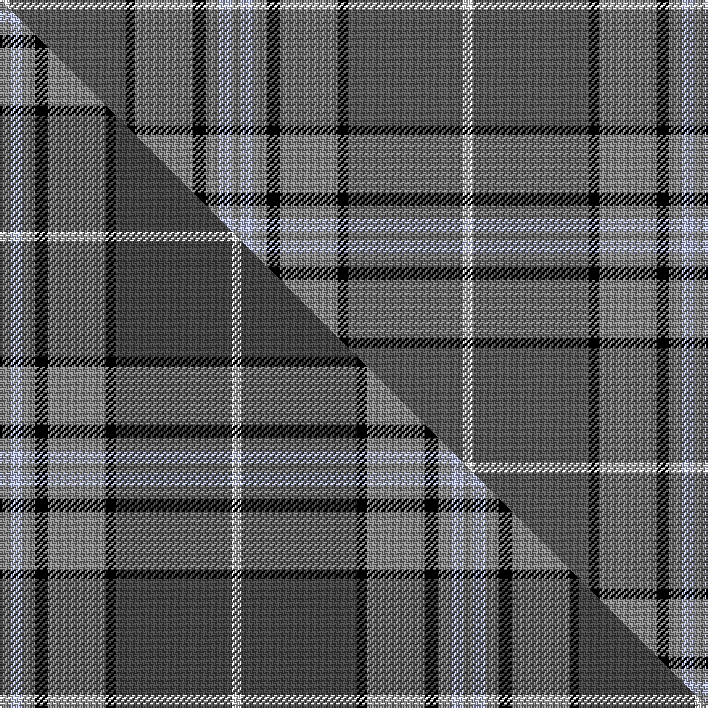

This is one **variant** — a specific cloth: this exact thread count and colourway, with its own
provenance below. It is one weaving of the [sett](/tartans/h/he/hebridean-granite-2/) (the scale-free proportion — the
same cloth at any scale or shade), whose colour order is pattern [RWRKRKBW](/stripes/rwrkrkbw/).

Part of the [Hebridean Granite](/tartans/h/he/hebridean-granite-2/) tartan — the named design grouping this sett with its other cloths.

Sourced from tartans-authority.  It is a [8 stripe tartan](/stripes/stripes8/).

Original link <code>http://www.tartansauthority.com/tartan-ferret/display/6821/</code> — retired · [Internet Archive copy](https://web.archive.org/web/*/http://www.tartansauthority.com/tartan-ferret/display/6821/*)

Dataset <small>— provenance for this record, inherited from the source manifest</small>

<dl class="dataset-prov">
<dt>source</dt><dd><a href="/sources/tartans-authority/">Scottish Tartans Authority</a></dd>
<dt>data captured from</dt><dd><a href="https://github.com/thetartan/tartan-database/blob/master/data/tartans-authority/data.csv">https://github.com/thetartan/tartan-database/blob/master/data/tartans-authority/data.csv</a></dd>
<dt>data date</dt><dd>2005 December <small>(this record)</small></dd>
<dt>licence</dt><dd><a href="https://creativecommons.org/licenses/by-nc-nd/4.0/">CC BY-NC-ND 4.0</a></dd>
</dl>

Capture chain <small>— the hands this data passed through, oldest first; each capture carries its own licence</small>

<ol class="capture-chain">
<li><a href="https://www.tartansauthority.com/">Scottish Tartans Authority</a> <small>the heritage body’s archive — its tartan-ferret record browser is retired; dead record links are shown unlinked, with an Internet Archive copy (ITI numbers are not SRT references)</small></li>
<li><a href="https://github.com/thetartan/tartan-database">thetartan/tartan-database</a> <small>2016-2017</small> · <a href="https://creativecommons.org/licenses/by-nc-nd/4.0/">CC BY-NC-ND 4.0</a> <small>Levko Kravets's frozen compilation — the capture we vendored, and where its CC licence text came from</small></li>
<li>this dictionary <small>captured 2026-06-10 · commit 5bf86c7566</small> <small>each re-capture is a git commit to data/sources</small></li>
</ol>

## Register references

External register numbers recorded for this tartan.

- Scottish Tartans Authority (ITI): 6821

## Thread count
W/6 N72 K6 O36 K8 O8 LB8 O/6

One full sett is **288 threads**.

## Palette
<table><thead><tr><th>Colour</th><th>Shade</th><th>OKLCh</th></tr></thead><tbody><tr><td>K</td><td><code style="background-color:#000000;">#000000</code> <small style="color:#888">#000000</small></td><td><small style="color:#888">oklch(0.0% 0.000 0.0)</small></td></tr><tr><td>LB</td><td><code style="background-color:#B5BBDE;">#B5BBDE</code> <small style="color:#888">#B5BBDE</small></td><td><small style="color:#888">oklch(79.9% 0.050 277.6)</small></td></tr><tr><td>N</td><td><code style="background-color:#5C5C5C;">#5C5C5C</code> <small style="color:#888">#5C5C5C</small></td><td><small style="color:#888">oklch(47.5% 0.000 89.9)</small></td></tr><tr><td>O</td><td><code style="background-color:#888888;">#888888</code> <small style="color:#888">#888888</small></td><td><small style="color:#888">oklch(62.7% 0.000 89.9)</small></td></tr><tr><td>W</td><td><code style="background-color:#F7F7F7;">#F7F7F7</code> <small style="color:#888">#F7F7F7</small></td><td><small style="color:#888">oklch(97.6% 0.000 89.9)</small></td></tr></tbody></table>

# Sample pattern

## Compared to the master

This cloth is one sett of its design; the master sett (the exemplar the design is anchored on) is below for comparison.

Its **ΔTartan distance** from the master is **0.08** — the same measure the nearest-tartans table ranks by (0 is identical; a re-scale of the same cloth is near 0, a recolour or a different proportion further).

<figure class="master-compare" style="margin:0">

this sett
master sett ★

<figcaption style="color:#888;font-size:smaller">One weave of this sett against the <a href="/setts/o3lb4o4k4o18k3dt36w3/">master sett ★</a>, split on the diagonal: a shared proportion runs seamlessly across it with only the shades shifting; a different proportion breaks on it.</figcaption>
</figure>

## Nearest tartan variants

The nearest existing variants by ΔTartan distance, with this cloth at the top so the swatches line up against it.

ΔTartan

Threads

Variant

Sett

—

288

<a href="/variants/s8/o3lb4o4k4o18k3n36w3~x2~o2500000-n1900000/">Hebridean Granite (Fashion)</a>

<a href="/ttd/edit/#slug=o3lb4o4k4o18k3dt36w3~x2~o2500000-dt1600000-w3600000&amp;base=o3lb4o4k4o18k3n36w3~x2~o2500000-n1900000" title="compare in the TTD">0.08</a>

288

<a href="/variants/s8/o3lb4o4k4o18k3dt36w3~x2~o2500000-dt1600000-w3600000/">Hebridean Granite Fashion Tartan</a>

<a href="/ttd/edit/#slug=n4lb4n4k4n18k3dt38w3~x2~dt1500000&amp;base=o3lb4o4k4o18k3n36w3~x2~o2500000-n1900000" title="compare in the TTD">0.20</a>

298

<a href="/variants/s8/n4lb4n4k4n18k3dt38w3~x2~dt1500000/">Scotch Mist</a>

<a href="/ttd/edit/#slug=r3w2o7n25k8o15dg2~x2~o2500000-n1900000&amp;base=o3lb4o4k4o18k3n36w3~x2~o2500000-n1900000" title="compare in the TTD">2.41</a>

238

<a href="/variants/s7/r3w2o7n25k8o15dg2~x2~o2500000-n1900000/">Allman-Jones (Personal)</a>

<a href="/ttd/edit/#slug=r3w2y7dt25k8y15dg2~x2~y2400000-dt1700000&amp;base=o3lb4o4k4o18k3n36w3~x2~o2500000-n1900000" title="compare in the TTD">2.42</a>

238

<a href="/variants/s7/r3w2y7n25k8y15dg2~x2~y2400000-n1700000/">Allman-Jones (Personal)</a>

<a href="/ttd/edit/#slug=lb4o4k4o18k3n36w3n36k3o18k4o4lb4o3~x2~o2500000-n1900000&amp;base=o3lb4o4k4o18k3n36w3~x2~o2500000-n1900000" title="compare in the TTD">2.52</a>

562

<a href="/variants/s14/lb4o4k4o18k3n36w3n36k3o18k4o4lb4o3~x2~o2500000-n1900000/">Hebridean Granite</a>

<a href="/ttd/edit/#slug=dp4lb2dp2lb8k3dp8dg3dp4dg24g2~x2~dg1806142-g2408144&amp;base=o3lb4o4k4o18k3n36w3~x2~o2500000-n1900000" title="compare in the TTD">2.90</a>

228

<a href="/variants/s10/dp4lb2dp2lb8k3dp8dg3dp4dg24g2~x2~dg1806142-g2408144/">Jones Htg (Name)</a>

<a href="/ttd/edit/#slug=y19k2w2k2dt5k2dt5~x4~y2400000-dt1700000&amp;base=o3lb4o4k4o18k3n36w3~x2~o2500000-n1900000" title="compare in the TTD">2.96</a>

200

<a href="/variants/s7/y19k2w2k2n5k2n5~x4~y2400000-n1700000/">Kyle</a>

<a href="/ttd/edit/#slug=o3dr3o4dr4o20k5n4k3o3k2n25w3~x2~o2500000-n1900000&amp;base=o3lb4o4k4o18k3n36w3~x2~o2500000-n1900000" title="compare in the TTD">2.99</a>

304

<a href="/variants/s12/o3dr3o4dr4o20k5n4k3o3k2n25w3~x2~o2500000-n1900000/">MacLellan of Gartbreck (Personal)</a>

<a href="/ttd/edit/#slug=n32k3n3k3t5k8o21k4~x2~n1900000-o2500000&amp;base=o3lb4o4k4o18k3n36w3~x2~o2500000-n1900000" title="compare in the TTD">3.07</a>

244

<a href="/variants/s8/n32k3n3k3t5k8o21k4~x2~n1900000-o2500000/">Speyside Blue (Fashion)</a>

<a href="/ttd/edit/#slug=n32k3n3k3o5k8oi21k4~x2~n1900000-oi2500000&amp;base=o3lb4o4k4o18k3n36w3~x2~o2500000-n1900000" title="compare in the TTD">3.10</a>

244

<a href="/variants/s8/n32k3n3k3o5k8oi21k4~x2~n1900000-oi2500000/">Speyside Grey (Fashion)</a>

## Neighbour map

Every grey dot is one of 13657 variants placed by the first two principal components of the ΔTartan feature space (42% of its variance). Red is this tartan; blue dots are its nearest — click one to open its page. The map is a flat projection of a many-dimensional space — [how to read it](/posts/neighbourhood-maps/).

<svg viewBox="0 0 640 380" role="img" style="max-width:100%;height:auto;border:1px solid #e0e0e0;border-radius:4px;display:block" xmlns="http://www.w3.org/2000/svg"><image href="/nn/cloud.v1.png" width="640" height="380"/><a href="/variants/s8/o3lb4o4k4o18k3dt36w3~x2~o2500000-dt1600000-w3600000/"><circle cx="246.3" cy="144.0" r="4" fill="#3465a4"><title>Hebridean Granite Fashion Tartan</title></circle></a><a href="/variants/s8/n4lb4n4k4n18k3dt38w3~x2~dt1500000/"><circle cx="280.2" cy="153.4" r="4" fill="#3465a4"><title>Scotch Mist</title></circle></a><a href="/variants/s7/r3w2o7n25k8o15dg2~x2~o2500000-n1900000/"><circle cx="177.7" cy="156.8" r="4" fill="#3465a4"><title>Allman-Jones (Personal)</title></circle></a><a href="/variants/s7/r3w2y7n25k8y15dg2~x2~y2400000-n1700000/"><circle cx="184.0" cy="159.7" r="4" fill="#3465a4"><title>Allman-Jones (Personal)</title></circle></a><a href="/variants/s14/lb4o4k4o18k3n36w3n36k3o18k4o4lb4o3~x2~o2500000-n1900000/"><circle cx="255.2" cy="131.2" r="4" fill="#3465a4"><title>Hebridean Granite</title></circle></a><a href="/variants/s10/dp4lb2dp2lb8k3dp8dg3dp4dg24g2~x2~dg1806142-g2408144/"><circle cx="206.0" cy="146.1" r="4" fill="#3465a4"><title>Jones Htg (Name)</title></circle></a><a href="/variants/s7/y19k2w2k2n5k2n5~x4~y2400000-n1700000/"><circle cx="253.0" cy="173.2" r="4" fill="#3465a4"><title>Kyle</title></circle></a><a href="/variants/s12/o3dr3o4dr4o20k5n4k3o3k2n25w3~x2~o2500000-n1900000/"><circle cx="182.0" cy="133.0" r="4" fill="#3465a4"><title>MacLellan of Gartbreck (Personal)</title></circle></a><a href="/variants/s8/n32k3n3k3t5k8o21k4~x2~n1900000-o2500000/"><circle cx="215.4" cy="169.1" r="4" fill="#3465a4"><title>Speyside Blue (Fashion)</title></circle></a><a href="/variants/s8/n32k3n3k3o5k8oi21k4~x2~n1900000-oi2500000/"><circle cx="216.0" cy="167.9" r="4" fill="#3465a4"><title>Speyside Grey (Fashion)</title></circle></a><circle cx="254.2" cy="147.7" r="5" fill="#c00000"/><text x="320" y="376" text-anchor="middle" font-size="11" fill="#999">ground</text><text x="11" y="190" text-anchor="middle" font-size="11" fill="#999" transform="rotate(-90 11 190)">complexity</text></svg>

ID: /variants/s8/o3lb4o4k4o18k3n36w3~x2~o2500000-n1900000/
