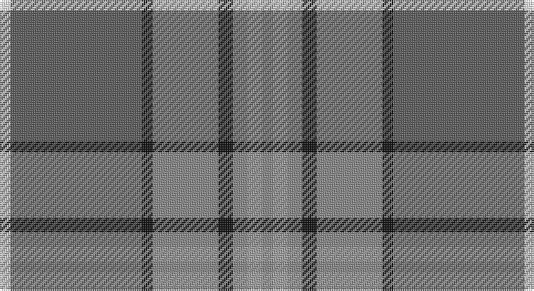

This page is one **sett** — a single exact thread-count. It belongs to the [tartan](/setts/o3lr4o4k4o18k3n36w3/)
(the same proportion at any scale), whose colour order is pattern [RYRKRKBW](/stripes/ryrkrkbw/).

Part of the [Hebridean Granite](/tartans/hebridean-granite/) tartan — the named design grouping this sett with its other cloths.

Sourced from tartans-authority.  It is a [8 stripe tartan](/stripes/stripes8/).

Original link http://www.tartansauthority.com/tartan-ferret/display/6821/

## Register references

External register numbers recorded for this tartan.

- Scottish Tartans Authority (ITI): 6821

## Thread count
W/6 Na72 K6 Nb36 K8 Nb8 N8 Nb/6

One full sett is **288 threads**.

## Palette

Palette: <strong>Tartan Register</strong> <small style="color:#888">(4 of 5 colours)</small>
<table><thead><tr><th>Colour</th><th>Threads</th><th>Shade</th><th>Base</th><th>OKLCh</th></tr></thead><tbody><tr><td>W/</td><td style="text-align:right;font-variant-numeric:tabular-nums">6</td><td><code style="background-color:#F8F8F8;">#F8F8F8</code> <small style="color:#888">#F8F8F8</small></td><td>W <code style="background-color:#F7F7F7;">#F7F7F7</code></td><td><small style="color:#888">oklch(97.9% 0.000 89.9)</small></td></tr><tr><td>Na</td><td style="text-align:right;font-variant-numeric:tabular-nums">72</td><td><code style="background-color:#5C5C5C;">#5C5C5C</code> <small style="color:#888">#5C5C5C</small></td><td>B <code style="background-color:#2A418A;">#2A418A</code></td><td><small style="color:#888">oklch(47.5% 0.000 89.9)</small></td></tr><tr><td>K</td><td style="text-align:right;font-variant-numeric:tabular-nums">6</td><td><code style="background-color:#101010;">#101010</code> <small style="color:#888">#101010</small></td><td>K <code style="background-color:#000000;">#000000</code></td><td><small style="color:#888">oklch(17.3% 0.000 89.9)</small></td></tr><tr><td>Nb</td><td style="text-align:right;font-variant-numeric:tabular-nums">36</td><td><code style="background-color:#888888;">#888888</code> <small style="color:#888">#888888</small></td><td>R <code style="background-color:#CC0000;">#CC0000</code></td><td><small style="color:#888">oklch(62.7% 0.000 89.9)</small></td></tr><tr><td>K</td><td style="text-align:right;font-variant-numeric:tabular-nums">8</td><td><code style="background-color:#101010;">#101010</code> <small style="color:#888">#101010</small></td><td>K <code style="background-color:#000000;">#000000</code></td><td><small style="color:#888">oklch(17.3% 0.000 89.9)</small></td></tr><tr><td>Nb</td><td style="text-align:right;font-variant-numeric:tabular-nums">8</td><td><code style="background-color:#888888;">#888888</code> <small style="color:#888">#888888</small></td><td>R <code style="background-color:#CC0000;">#CC0000</code></td><td><small style="color:#888">oklch(62.7% 0.000 89.9)</small></td></tr><tr><td>N</td><td style="text-align:right;font-variant-numeric:tabular-nums">8</td><td><code style="background-color:#A0A0A0;">#A0A0A0</code> <small style="color:#888">#A0A0A0</small></td><td>Y <code style="background-color:#F2BF00;">#F2BF00</code></td><td><small style="color:#888">oklch(70.6% 0.000 89.9)</small></td></tr><tr><td>Nb/</td><td style="text-align:right;font-variant-numeric:tabular-nums">6</td><td><code style="background-color:#888888;">#888888</code> <small style="color:#888">#888888</small></td><td>R <code style="background-color:#CC0000;">#CC0000</code></td><td><small style="color:#888">oklch(62.7% 0.000 89.9)</small></td></tr></tbody></table>

# Sample pattern

## Compared to the master

This cloth is one sett of its design; the master sett (the exemplar the design is anchored on) is below for comparison.

<figure style="margin:0"><figcaption style="color:#888;font-size:smaller">this sett</figcaption></figure>
<figure style="margin:0"><figcaption style="color:#888;font-size:smaller"><a href="/setts/lr4o4k4o18k3n36w3n36k3o18k4o4lr4o3/">master sett →</a></figcaption></figure>

## Nearest tartans

The nearest existing variants by ΔTartan distance, with this tartan at the top so the swatches line up against it.

ΔTartan

Tartan

Sett

—

<a href="/ttd/edit/#slug=o3lr4o4k4o18k3n36w3~x2">Hebridean Granite (Fashion)</a> <a class="nn-out" href="/variants/s8/o3lr4o4k4o18k3n36w3~x2/" title="open its dictionary page">↗</a>

0.40

<a href="/ttd/edit/#slug=o3lr4o4do4o18do3n36w3~x2&amp;base=o3lr4o4k4o18k3n36w3~x2">Hebridean Granite Fashion Tartan</a> <a class="nn-out" href="/variants/s8/o3lr4o4do4o18do3n36w3~x2/" title="open its dictionary page">↗</a>

1.03

<a href="/ttd/edit/#slug=m2lr1dg12y1dg1y1dg3y4m3y4ly2~x4&amp;base=o3lr4o4k4o18k3n36w3~x2">Tasmanian</a> <a class="nn-out" href="/variants/s11/m2lr1dg12y1dg1y1dg3y4m3y4ly2~x4/" title="open its dictionary page">↗</a>

1.10

<a href="/ttd/edit/#slug=t4r1ly1t12do4y10ly1r3~x4&amp;base=o3lr4o4k4o18k3n36w3~x2">Hawaii (District)</a> <a class="nn-out" href="/variants/s8/t4r1ly1t12do4y10ly1r3~x4/" title="open its dictionary page">↗</a>

1.11

<a href="/ttd/edit/#slug=r1g4lo1g3r4n15w1~x4&amp;base=o3lr4o4k4o18k3n36w3~x2">Bressuire (District)</a> <a class="nn-out" href="/variants/s7/r1g4lo1g3r4n15w1~x4/" title="open its dictionary page">↗</a>

1.20

<a href="/ttd/edit/#slug=m4g10m2g2m24g2m2g16m2g1~x2&amp;base=o3lr4o4k4o18k3n36w3~x2">Hilton Hotel Hong Kong (Corporate)</a> <a class="nn-out" href="/variants/s10/m4g10m2g2m24g2m2g16m2g1~x2/" title="open its dictionary page">↗</a>

1.20

<a href="/ttd/edit/#slug=db3g13lr1o3lr1db10lo1~x2&amp;base=o3lr4o4k4o18k3n36w3~x2">Graeme Heckenberg Hunting</a> <a class="nn-out" href="/variants/s7/db3g13lr1o3lr1db10lo1~x2/" title="open its dictionary page">↗</a>

1.23

<a href="/ttd/edit/#slug=lr4o4k4o18k3n36w3n36k3o18k4o4lr4o3~x2&amp;base=o3lr4o4k4o18k3n36w3~x2">Hebridean Granite</a> <a class="nn-out" href="/variants/s14/lr4o4k4o18k3n36w3n36k3o18k4o4lr4o3~x2/" title="open its dictionary page">↗</a>

1.23

<a href="/ttd/edit/#slug=n2r10n10o3r2lr24w2~x2&amp;base=o3lr4o4k4o18k3n36w3~x2">Un-named Dutch</a> <a class="nn-out" href="/variants/s7/n2r10n10o3r2lr24w2~x2/" title="open its dictionary page">↗</a>

1.24

<a href="/ttd/edit/#slug=t32r3t3r3t3r10g24ri3~x2&amp;base=o3lr4o4k4o18k3n36w3~x2">Gammell (Personal)</a> <a class="nn-out" href="/variants/s8/t32r3t3r3t3r10g24ri3~x2/" title="open its dictionary page">↗</a>

1.28

<a href="/ttd/edit/#slug=n32k3n3k3b5k8o21k4~x2&amp;base=o3lr4o4k4o18k3n36w3~x2">Speyside Blue (Fashion)</a> <a class="nn-out" href="/variants/s8/n32k3n3k3b5k8o21k4~x2/" title="open its dictionary page">↗</a>

## Neighbour map

Every grey dot is one of 14360 variants placed by the first two principal components of the ΔTartan feature space (44% of its variance). Red is this tartan; blue dots are its nearest — click one to open its page.

<svg viewBox="0 0 640 380" role="img" style="max-width:100%;height:auto;border:1px solid #e0e0e0;border-radius:4px;display:block" xmlns="http://www.w3.org/2000/svg"><image href="/nn/cloud.v1.png" width="640" height="380"/><a href="/variants/s8/o3lr4o4do4o18do3n36w3~x2/"><circle cx="302.6" cy="173.7" r="4" fill="#3465a4"><title>Hebridean Granite Fashion Tartan</title></circle></a><a href="/variants/s11/m2lr1dg12y1dg1y1dg3y4m3y4ly2~x4/"><circle cx="267.9" cy="168.8" r="4" fill="#3465a4"><title>Tasmanian</title></circle></a><a href="/variants/s8/t4r1ly1t12do4y10ly1r3~x4/"><circle cx="249.5" cy="191.4" r="4" fill="#3465a4"><title>Hawaii (District)</title></circle></a><a href="/variants/s7/r1g4lo1g3r4n15w1~x4/"><circle cx="332.3" cy="183.6" r="4" fill="#3465a4"><title>Bressuire (District)</title></circle></a><a href="/variants/s10/m4g10m2g2m24g2m2g16m2g1~x2/"><circle cx="295.0" cy="135.4" r="4" fill="#3465a4"><title>Hilton Hotel Hong Kong (Corporate)</title></circle></a><a href="/variants/s7/db3g13lr1o3lr1db10lo1~x2/"><circle cx="261.5" cy="191.5" r="4" fill="#3465a4"><title>Graeme Heckenberg Hunting</title></circle></a><a href="/variants/s14/lr4o4k4o18k3n36w3n36k3o18k4o4lr4o3~x2/"><circle cx="299.6" cy="154.3" r="4" fill="#3465a4"><title>Hebridean Granite</title></circle></a><a href="/variants/s7/n2r10n10o3r2lr24w2~x2/"><circle cx="250.7" cy="170.5" r="4" fill="#3465a4"><title>Un-named Dutch</title></circle></a><a href="/variants/s8/t32r3t3r3t3r10g24ri3~x2/"><circle cx="303.4" cy="202.2" r="4" fill="#3465a4"><title>Gammell (Personal)</title></circle></a><a href="/variants/s8/n32k3n3k3b5k8o21k4~x2/"><circle cx="266.9" cy="198.4" r="4" fill="#3465a4"><title>Speyside Blue (Fashion)</title></circle></a><circle cx="291.1" cy="167.2" r="5" fill="#c00000"/></svg>

ID: /variants/s8/o3lr4o4k4o18k3n36w3~x2/
