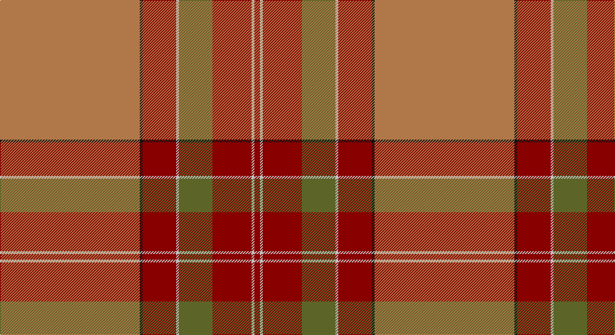

This page is one **sett** — a single exact thread-count. It belongs to the [tartan](/setts/o50k1r12lb1y12r14lb1r2/)
(the same proportion at any scale), whose colour order is pattern [RKRWGRWR](/stripes/rkrwgrwr/).

Sourced from tartans-authority.  It is a [8 stripe tartan](/stripes/stripes8/).

Original link http://www.tartansauthority.com/tartan-ferret/display/3323/

## Register references

External register numbers recorded for this tartan.

- Scottish Tartans Authority (ITI): 3323

## Thread count
LT/200 K4 DR48 N4 G48 DR56 N4 DR/8

One full sett is **536 threads**.

## Palette

Palette: <strong>Tartan Register</strong> <small style="color:#888">(4 of 5 colours)</small>
<table><thead><tr><th>Colour</th><th>Threads</th><th>Shade</th><th>Base</th><th>OKLCh</th></tr></thead><tbody><tr><td>LT/</td><td style="text-align:right;font-variant-numeric:tabular-nums">200</td><td><code style="background-color:#B07848;">#B07848</code> <small style="color:#888">#B07848</small></td><td>R <code style="background-color:#CC0000;">#CC0000</code></td><td><small style="color:#888">oklch(62.0% 0.095 60.3)</small></td></tr><tr><td>K</td><td style="text-align:right;font-variant-numeric:tabular-nums">4</td><td><code style="background-color:#101010;">#101010</code> <small style="color:#888">#101010</small></td><td>K <code style="background-color:#000000;">#000000</code></td><td><small style="color:#888">oklch(17.3% 0.000 89.9)</small></td></tr><tr><td>DR</td><td style="text-align:right;font-variant-numeric:tabular-nums">48</td><td><code style="background-color:#880000;">#880000</code> <small style="color:#888">#880000</small></td><td>R <code style="background-color:#CC0000;">#CC0000</code></td><td><small style="color:#888">oklch(39.4% 0.162 29.2)</small></td></tr><tr><td>N</td><td style="text-align:right;font-variant-numeric:tabular-nums">4</td><td><code style="background-color:#C0C0C0;">#C0C0C0</code> <small style="color:#888">#C0C0C0</small></td><td>W <code style="background-color:#F7F7F7;">#F7F7F7</code></td><td><small style="color:#888">oklch(80.8% 0.000 89.9)</small></td></tr><tr><td>G</td><td style="text-align:right;font-variant-numeric:tabular-nums">48</td><td><code style="background-color:#5C6428;">#5C6428</code> <small style="color:#888">#5C6428</small></td><td>G <code style="background-color:#006100;">#006100</code></td><td><small style="color:#888">oklch(48.3% 0.084 116.0)</small></td></tr><tr><td>DR</td><td style="text-align:right;font-variant-numeric:tabular-nums">56</td><td><code style="background-color:#880000;">#880000</code> <small style="color:#888">#880000</small></td><td>R <code style="background-color:#CC0000;">#CC0000</code></td><td><small style="color:#888">oklch(39.4% 0.162 29.2)</small></td></tr><tr><td>N</td><td style="text-align:right;font-variant-numeric:tabular-nums">4</td><td><code style="background-color:#C0C0C0;">#C0C0C0</code> <small style="color:#888">#C0C0C0</small></td><td>W <code style="background-color:#F7F7F7;">#F7F7F7</code></td><td><small style="color:#888">oklch(80.8% 0.000 89.9)</small></td></tr><tr><td>DR/</td><td style="text-align:right;font-variant-numeric:tabular-nums">8</td><td><code style="background-color:#880000;">#880000</code> <small style="color:#888">#880000</small></td><td>R <code style="background-color:#CC0000;">#CC0000</code></td><td><small style="color:#888">oklch(39.4% 0.162 29.2)</small></td></tr></tbody></table>

# Sample pattern

## Nearest tartans

The nearest existing variants by ΔTartan distance, with this tartan at the top so the swatches line up against it.

ΔTartan

Tartan

Sett

—

<a href="/ttd/edit/#slug=o50k1r12lb1y12r14lb1r2~x4">MacByrd (Personal)</a> <a class="nn-out" href="/variants/s8/o50k1r12lb1y12r14lb1r2~x4/" title="open its dictionary page">↗</a>

1.02

<a href="/ttd/edit/#slug=lo57k1r12lb1g12r14lb1r2~x2&amp;base=o50k1r12lb1y12r14lb1r2~x4">MacBrair Hunting</a> <a class="nn-out" href="/variants/s8/lo57k1r12lb1g12r14lb1r2~x2/" title="open its dictionary page">↗</a>

1.17

<a href="/ttd/edit/#slug=y50k1r12lb1yi12r14lb1r2~x4&amp;base=o50k1r12lb1y12r14lb1r2~x4">MacByrd (Personal)</a> <a class="nn-out" href="/variants/s8/y50k1r12lb1yi12r14lb1r2~x4/" title="open its dictionary page">↗</a>

1.28

<a href="/ttd/edit/#slug=lo60w1r15w1lo9r15w1y9w1r15~x2&amp;base=o50k1r12lb1y12r14lb1r2~x4">Smith Hunting (Name)</a> <a class="nn-out" href="/variants/s10/lo60w1r15w1lo9r15w1y9w1r15~x2/" title="open its dictionary page">↗</a>

1.52

<a href="/ttd/edit/#slug=lo64g4o1g4o1g4o64dr2o2dr8~x2&amp;base=o50k1r12lb1y12r14lb1r2~x4">Connacht</a> <a class="nn-out" href="/variants/s10/lo64g4o1g4o1g4o64dr2o2dr8~x2/" title="open its dictionary page">↗</a>

1.56

<a href="/ttd/edit/#slug=r5n2r2dg42r5n36r70n2ly2r7dg2~x2&amp;base=o50k1r12lb1y12r14lb1r2~x4">MacPherson Of Cluny</a> <a class="nn-out" href="/variants/s11/r5n2r2dg42r5n36r70n2ly2r7dg2~x2/" title="open its dictionary page">↗</a>

1.56

<a href="/ttd/edit/#slug=r5n2r2dg42r5n36r70n2ly2r7dg2&amp;base=o50k1r12lb1y12r14lb1r2~x4">MacPherson Of Cluny</a> <a class="nn-out" href="/variants/s11/r5n2r2dg42r5n36r70n2ly2r7dg2/" title="open its dictionary page">↗</a>

1.64

<a href="/ttd/edit/#slug=do7r4do4r25dp1y32dp4y2w2y5~x2&amp;base=o50k1r12lb1y12r14lb1r2~x4">Bell of Ardbel (Personal)</a> <a class="nn-out" href="/variants/s10/do7r4do4r25dp1y32dp4y2w2y5~x2/" title="open its dictionary page">↗</a>

1.67

<a href="/ttd/edit/#slug=oi64dr9o11dr4lb2lo2n5dr2lo13~x2&amp;base=o50k1r12lb1y12r14lb1r2~x4">Down, County</a> <a class="nn-out" href="/variants/s9/oi64dr9o11dr4lb2lo2n5dr2lo13~x2/" title="open its dictionary page">↗</a>

1.71

<a href="/ttd/edit/#slug=dg2lo1dg11r50lo12db2lo4db2~x2&amp;base=o50k1r12lb1y12r14lb1r2~x4">Slessor (Personal)</a> <a class="nn-out" href="/variants/s8/dg2lo1dg11r50lo12db2lo4db2~x2/" title="open its dictionary page">↗</a>

1.73

<a href="/ttd/edit/#slug=o65dr9r11o5t2lo2y5o2lo13~x2&amp;base=o50k1r12lb1y12r14lb1r2~x4">Down</a> <a class="nn-out" href="/variants/s9/o65dr9r11o5t2lo2y5o2lo13~x2/" title="open its dictionary page">↗</a>

## Neighbour map

Every grey dot is one of 14360 variants placed by the first two principal components of the ΔTartan feature space (44% of its variance). Red is this tartan; blue dots are its nearest — click one to open its page.

<svg viewBox="0 0 640 380" role="img" style="max-width:100%;height:auto;border:1px solid #e0e0e0;border-radius:4px;display:block" xmlns="http://www.w3.org/2000/svg"><image href="/nn/cloud.v1.png" width="640" height="380"/><a href="/variants/s8/lo57k1r12lb1g12r14lb1r2~x2/"><circle cx="441.2" cy="104.5" r="4" fill="#3465a4"><title>MacBrair Hunting</title></circle></a><a href="/variants/s8/y50k1r12lb1yi12r14lb1r2~x4/"><circle cx="450.1" cy="133.7" r="4" fill="#3465a4"><title>MacByrd (Personal)</title></circle></a><a href="/variants/s10/lo60w1r15w1lo9r15w1y9w1r15~x2/"><circle cx="460.9" cy="127.5" r="4" fill="#3465a4"><title>Smith Hunting (Name)</title></circle></a><a href="/variants/s10/lo64g4o1g4o1g4o64dr2o2dr8~x2/"><circle cx="408.4" cy="110.8" r="4" fill="#3465a4"><title>Connacht</title></circle></a><a href="/variants/s11/r5n2r2dg42r5n36r70n2ly2r7dg2~x2/"><circle cx="420.5" cy="135.5" r="4" fill="#3465a4"><title>MacPherson Of Cluny</title></circle></a><a href="/variants/s11/r5n2r2dg42r5n36r70n2ly2r7dg2/"><circle cx="420.5" cy="135.5" r="4" fill="#3465a4"><title>MacPherson Of Cluny</title></circle></a><a href="/variants/s10/do7r4do4r25dp1y32dp4y2w2y5~x2/"><circle cx="338.3" cy="130.4" r="4" fill="#3465a4"><title>Bell of Ardbel (Personal)</title></circle></a><a href="/variants/s9/oi64dr9o11dr4lb2lo2n5dr2lo13~x2/"><circle cx="389.9" cy="96.8" r="4" fill="#3465a4"><title>Down, County</title></circle></a><a href="/variants/s8/dg2lo1dg11r50lo12db2lo4db2~x2/"><circle cx="458.8" cy="116.0" r="4" fill="#3465a4"><title>Slessor (Personal)</title></circle></a><a href="/variants/s9/o65dr9r11o5t2lo2y5o2lo13~x2/"><circle cx="459.1" cy="116.7" r="4" fill="#3465a4"><title>Down</title></circle></a><circle cx="424.8" cy="114.0" r="5" fill="#c00000"/></svg>

ID: /variants/s8/o50k1r12lb1y12r14lb1r2~x4/
