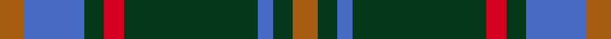

This is one **variant** — a specific cloth: this exact thread count and colourway, with its own
provenance below. It is one weaving of the [sett](/setts/o5b12dg4r4dg27b3dg4o5/) (the scale-free proportion — the
same cloth at any scale or shade), whose colour order is pattern [RBGRGBGR](/stripes/rbgrgbgr/).

Sourced from weddslist.  It is a [8 stripe tartan](/stripes/stripes8/).

Original link [http://www.weddslist.com/cgi-bin/tartans/pg.pl?source=sts](http://www.weddslist.com/cgi-bin/tartans/pg.pl?source=sts)

Dataset <small>— provenance for this record, inherited from the source manifest</small>

<dl class="dataset-prov">
<dt>source</dt><dd><a href="/sources/weddslist/">Weddslist</a></dd>
<dt>data captured from</dt><dd><a href="https://github.com/thetartan/tartan-database/blob/master/data/weddslist/data.csv">https://github.com/thetartan/tartan-database/blob/master/data/weddslist/data.csv</a></dd>
<dt>data date</dt><dd>2016-11-17 <small>(dataset default)</small></dd>
<dt>licence</dt><dd><a href="https://creativecommons.org/licenses/by-nc-nd/4.0/">CC BY-NC-ND 4.0</a></dd>
</dl>

Capture chain <small>— the hands this data passed through, oldest first; each capture carries its own licence</small>

<ol class="capture-chain">
<li><a href="https://www.weddslist.com/tartans/">Weddslist</a> <small>the living privately compiled reference</small></li>
<li><a href="https://github.com/thetartan/tartan-database">thetartan/tartan-database</a> <small>2016-2017</small> · <a href="https://creativecommons.org/licenses/by-nc-nd/4.0/">CC BY-NC-ND 4.0</a> <small>Levko Kravets's frozen compilation — the capture we vendored, and where its CC licence text came from</small></li>
<li>this dictionary <small>captured 2026-06-10 · commit 5bf86c7566</small> <small>each re-capture is a git commit to data/sources</small></li>
</ol>

## Thread count
O/5 B12 DG4 R4 DG27 B3 DG4 O/5

One full sett is **118 threads**.

## Palette
<table><thead><tr><th>Colour</th><th>Shade</th><th>OKLCh</th></tr></thead><tbody><tr><td>DG</td><td><code style="background-color:#053819;">#053819</code> <small style="color:#888">#053819</small></td><td><small style="color:#888">oklch(30.0% 0.075 151.3)</small></td></tr><tr><td>B</td><td><code style="background-color:#466CC8;">#466CC8</code> <small style="color:#888">#466CC8</small></td><td><small style="color:#888">oklch(55.1% 0.149 265.0)</small></td></tr><tr><td>O</td><td><code style="background-color:#A65C11;">#A65C11</code> <small style="color:#888">#A65C11</small></td><td><small style="color:#888">oklch(55.0% 0.125 58.3)</small></td></tr><tr><td>R</td><td><code style="background-color:#D60020;">#D60020</code> <small style="color:#888">#D60020</small></td><td><small style="color:#888">oklch(55.2% 0.224 25.5)</small></td></tr></tbody></table>

# Sample pattern

## Nearest tartan variants

The nearest existing variants by ΔTartan distance, with this cloth at the top so the swatches line up against it.

ΔTartan

Threads

Variant

Sett

—

118

<a href="/variants/s8/o5b12dg4r4dg27b3dg4o5/">Daks, Muted Loden</a>

<a href="/ttd/edit/#slug=dy15r5dy30t32dy4lo3~x2&amp;base=o5b12dg4r4dg27b3dg4o5" title="compare in the TTD">2.16</a>

320

<a href="/variants/s6/dy15r5dy30t32dy4lo3~x2/">Cameron Hunting</a>

<a href="/ttd/edit/#slug=dy5db9r3db5dy2db4dy26lb3r4~x2&amp;base=o5b12dg4r4dg27b3dg4o5" title="compare in the TTD">2.59</a>

226

<a href="/variants/s9/dy5db9r3db5dy2db4dy26lb3r4~x2/">Bracken (Fashion)</a>

<a href="/ttd/edit/#slug=dg40r3dg4r3dg12db32lo4r3~x2&amp;base=o5b12dg4r4dg27b3dg4o5" title="compare in the TTD">2.61</a>

318

<a href="/variants/s8/dg40r3dg4r3dg12db32lo4r3~x2/">U.S. Marine Corps (Military?)</a>

<a href="/ttd/edit/#slug=db8y1dg5y12r1dg2~x6&amp;base=o5b12dg4r4dg27b3dg4o5" title="compare in the TTD">2.69</a>

288

<a href="/variants/s6/db8y1dg5y12r1dg2~x6/">McCabe (2016)</a>

<a href="/ttd/edit/#slug=y20dt27r6dt15y8dt11y78db10r12~dt1204274-db1406275&amp;base=o5b12dg4r4dg27b3dg4o5" title="compare in the TTD">2.75</a>

342

<a href="/variants/s9/y20db27r6db15y8db11y78dbi10r12~db1204274-dbi1406275/">Braken Tartan</a>

<a href="/ttd/edit/#slug=k3n6k2n8dt20o3dt2o2dt3~x2~n1900000-o2500000&amp;base=o5b12dg4r4dg27b3dg4o5" title="compare in the TTD">2.77</a>

184

<a href="/variants/s9/k3n6k2n8dt20o3dt2o2dt3~x2~n1900000-o2500000/">Scottish Monuments (Corporate)</a>

<a href="/ttd/edit/#slug=r2t13dr3t3dr16lb2~x4&amp;base=o5b12dg4r4dg27b3dg4o5" title="compare in the TTD">2.89</a>

296

<a href="/variants/s6/r2t13dr3t3dr16lb2~x4/">MacArthur-Fox Blue (Personal)</a>

<a href="/ttd/edit/#slug=g24dp3g3dp3g3dp7dg20r3~x2~g2205128-dg1303152&amp;base=o5b12dg4r4dg27b3dg4o5" title="compare in the TTD">2.92</a>

210

<a href="/variants/s8/g24dp3g3dp3g3dp7dg20r3~x2~g2205128-dg1303152/">Crantock</a>

<a href="/ttd/edit/#slug=dp4db18r2db2r2db9g20db3g4~x2~dp1607327-r1606028&amp;base=o5b12dg4r4dg27b3dg4o5" title="compare in the TTD">2.95</a>

240

<a href="/variants/s9/dp4db18r2db2r2db9g20db3g4~x2~dp1607327-r1606028/">St. Andrews New Golf Club</a>

<a href="/ttd/edit/#slug=dt6r15dg41r15dt20dg41db6~dt1204274-db1106275&amp;base=o5b12dg4r4dg27b3dg4o5" title="compare in the TTD">2.96</a>

276

<a href="/variants/s7/db6dg41dbi20r15dg41r15dbi6~db1106275-dbi1204274/">Bean Hunting Clan Tartan</a>

## Neighbour map

Every grey dot is one of 13621 variants placed by the first two principal components of the ΔTartan feature space (42% of its variance). Red is this tartan; blue dots are its nearest — click one to open its page.

<svg viewBox="0 0 640 380" role="img" style="max-width:100%;height:auto;border:1px solid #e0e0e0;border-radius:4px;display:block" xmlns="http://www.w3.org/2000/svg"><image href="/nn/cloud.v1.png" width="640" height="380"/><a href="/variants/s6/dy15r5dy30t32dy4lo3~x2/"><circle cx="343.0" cy="223.7" r="4" fill="#3465a4"><title>Cameron Hunting</title></circle></a><a href="/variants/s9/dy5db9r3db5dy2db4dy26lb3r4~x2/"><circle cx="347.3" cy="182.7" r="4" fill="#3465a4"><title>Bracken (Fashion)</title></circle></a><a href="/variants/s8/dg40r3dg4r3dg12db32lo4r3~x2/"><circle cx="366.9" cy="187.0" r="4" fill="#3465a4"><title>U.S. Marine Corps (Military?)</title></circle></a><a href="/variants/s6/db8y1dg5y12r1dg2~x6/"><circle cx="289.7" cy="222.3" r="4" fill="#3465a4"><title>McCabe (2016)</title></circle></a><a href="/variants/s9/y20db27r6db15y8db11y78dbi10r12~db1204274-dbi1406275/"><circle cx="357.8" cy="183.5" r="4" fill="#3465a4"><title>Braken Tartan</title></circle></a><a href="/variants/s9/k3n6k2n8dt20o3dt2o2dt3~x2~n1900000-o2500000/"><circle cx="309.8" cy="193.1" r="4" fill="#3465a4"><title>Scottish Monuments (Corporate)</title></circle></a><a href="/variants/s6/r2t13dr3t3dr16lb2~x4/"><circle cx="304.2" cy="225.7" r="4" fill="#3465a4"><title>MacArthur-Fox Blue (Personal)</title></circle></a><a href="/variants/s8/g24dp3g3dp3g3dp7dg20r3~x2~g2205128-dg1303152/"><circle cx="298.9" cy="221.8" r="4" fill="#3465a4"><title>Crantock</title></circle></a><a href="/variants/s9/dp4db18r2db2r2db9g20db3g4~x2~dp1607327-r1606028/"><circle cx="296.9" cy="200.8" r="4" fill="#3465a4"><title>St. Andrews New Golf Club</title></circle></a><a href="/variants/s7/db6dg41dbi20r15dg41r15dbi6~db1106275-dbi1204274/"><circle cx="323.9" cy="250.2" r="4" fill="#3465a4"><title>Bean Hunting Clan Tartan</title></circle></a><circle cx="321.9" cy="207.3" r="5" fill="#c00000"/><text x="320" y="376" text-anchor="middle" font-size="11" fill="#999">ground</text><text x="11" y="190" text-anchor="middle" font-size="11" fill="#999" transform="rotate(-90 11 190)">complexity</text></svg>

ID: /variants/s8/o5b12dg4r4dg27b3dg4o5/
