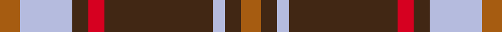

This page is one **sett** — a single exact thread-count. It belongs to the [tartan](/setts/o5lb13do4r4do27lb3do4o5/)
(the same proportion at any scale), whose colour order is pattern [RBWBRBWR](/stripes/rbwbrbwr/).

Sourced from weddslist.  It is a [8 stripe tartan](/stripes/stripes8/).

Original link http://www.weddslist.com/cgi-bin/tartans/pg.pl?source=sts

## Thread count
O/5 LB13 DO4 R4 DO27 LB3 DO4 O/5

One full sett is **120 threads**.

## Palette
<table><thead><tr><th>Colour</th><th>Shade</th><th>OKLCh</th></tr></thead><tbody><tr><td>LB</td><td><code style="background-color:#B5BBDE;">#B5BBDE</code> <small style="color:#888">#B5BBDE</small></td><td><small style="color:#888">oklch(79.9% 0.050 277.6)</small></td></tr><tr><td>DO</td><td><code style="background-color:#412714;">#412714</code> <small style="color:#888">#412714</small></td><td><small style="color:#888">oklch(30.1% 0.050 55.7)</small></td></tr><tr><td>R</td><td><code style="background-color:#D60020;">#D60020</code> <small style="color:#888">#D60020</small></td><td><small style="color:#888">oklch(55.2% 0.224 25.5)</small></td></tr><tr><td>O</td><td><code style="background-color:#A65C11;">#A65C11</code> <small style="color:#888">#A65C11</small></td><td><small style="color:#888">oklch(55.0% 0.125 58.3)</small></td></tr></tbody></table>

# Sample pattern

## Nearest variants

The nearest existing variants by ΔTartan distance, with this cloth at the top so the swatches line up against it.

ΔTartan

Threads

Variant

Sett

—

120

<a href="/variants/s8/o5lb13do4r4do27lb3do4o5/">Daks, Blue Loden</a>

<a href="/ttd/edit/#slug=ly3lb7do2r2do14lb2do2ly3~x2&amp;base=o5lb13do4r4do27lb3do4o5" title="compare in the TTD">2.31</a>

128

<a href="/variants/s8/ly3lb7do2r2do14lb2do2ly3~x2/">Daks (Blue Loden)</a>

## Neighbour map

Every grey dot is one of 13620 variants placed by the first two principal components of the ΔTartan feature space (42% of its variance). Red is this tartan; blue dots are its nearest — click one to open its page.

<svg viewBox="0 0 640 380" role="img" style="max-width:100%;height:auto;border:1px solid #e0e0e0;border-radius:4px;display:block" xmlns="http://www.w3.org/2000/svg"><image href="/nn/cloud.v1.png" width="640" height="380"/><a href="/variants/s8/ly3lb7do2r2do14lb2do2ly3~x2/"><circle cx="247.0" cy="203.7" r="4" fill="#3465a4"><title>Daks (Blue Loden)</title></circle></a><circle cx="282.0" cy="189.9" r="5" fill="#c00000"/><text x="320" y="376" text-anchor="middle" font-size="11" fill="#999">ground</text><text x="11" y="190" text-anchor="middle" font-size="11" fill="#999" transform="rotate(-90 11 190)">complexity</text></svg>

ID: /variants/s8/o5lb13do4r4do27lb3do4o5/
