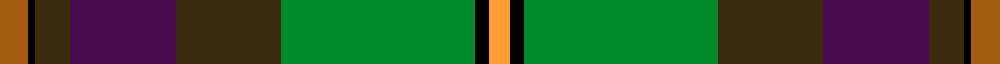

This is one **variant** — a specific cloth: this exact thread count and colourway, with its own
provenance below. It is one weaving of the [sett](/tartans/a/ab/aberuchill-2/) (the scale-free proportion — the
same cloth at any scale or shade), whose colour order is pattern [RKGBGGKY](/stripes/rkgbggky/).

Part of the [Aberuchill](/tartans/a/ab/aberuchill-2/) tartan — the named design grouping this sett with its other cloths.

Sourced from register-of-tartans.  It is a [8 stripe tartan](/stripes/stripes8/).

Original link [https://www.tartanregister.gov.uk/tartanDetails.aspx?ref=23](https://www.tartanregister.gov.uk/tartanDetails.aspx?ref=23)

2 attestations — the source records this cloth was collapsed from (oldest owns this page)

<ul>
<li>01/11/2005 — Aberuchill (register-of-tartans, <a href="https://www.tartanregister.gov.uk/tartanDetails.aspx?ref=23">record</a>)  <em>Designed by Blair Urquhart, House of Tartan, to commemorate the village of Comrie, Perthshire. Aberuchil lends its name to the area south of the village where the rivers Ruchil and Earn meet.</em></li>
<li>2005 November — Aberuchill (Fashion) (tartans-authority, <a href="https://web.archive.org/web/*/http://www.tartansauthority.com/tartan-ferret/display/6814/*">record</a>)  <em>Designed by Blair Urquhart of the House of Tartan as a memento of the village of Comrie in Perthshire. Aberuchill lends its name to the area south of the village where the rivers Ruchil and Earn meet. Woven sample.</em></li>
</ul>

Dataset <small>— provenance for this record, inherited from the source manifest</small>

<dl class="dataset-prov">
<dt>source</dt><dd><a href="/sources/register-of-tartans/">Scottish Register of Tartans</a></dd>
<dt>data captured from</dt><dd><a href="https://github.com/thetartan/tartan-database/blob/master/data/register-of-tartans/data.csv">https://github.com/thetartan/tartan-database/blob/master/data/register-of-tartans/data.csv</a></dd>
<dt>data date</dt><dd>01/11/2005 <small>(this record)</small></dd>
<dt>licence</dt><dd><a href="https://www.tartanregister.gov.uk/copyright">Crown copyright</a></dd>
</dl>

Capture chain <small>— the hands this data passed through, oldest first; each capture carries its own licence</small>

<ol class="capture-chain">
<li><a href="https://www.tartanregister.gov.uk/">Scottish Register of Tartans</a> · <a href="https://www.tartanregister.gov.uk/copyright">Crown copyright</a> <small>the living register — still published by National Records of Scotland</small></li>
<li><a href="https://github.com/thetartan/tartan-database">thetartan/tartan-database</a> <small>2016-2017</small> · <a href="https://creativecommons.org/licenses/by-nc-nd/4.0/">CC BY-NC-ND 4.0</a> <small>Levko Kravets's frozen compilation — the capture we vendored, and where its CC licence text came from</small></li>
<li>this dictionary <small>captured 2026-06-10 · commit 5bf86c7566</small> <small>each re-capture is a git commit to data/sources</small></li>
</ol>

## Register references

External register numbers recorded for this tartan.

- Scottish Register of Tartans: [23](https://www.tartanregister.gov.uk/tartanDetails.aspx?ref=23)
- Scottish Tartans Authority (ITI): 6814

## Thread count
O/8 K2 DY10 DP30 DY30 G55 K4 LO/6

One full sett is **276 threads**.

## Palette
<table><thead><tr><th>Colour</th><th>Shade</th><th>OKLCh</th></tr></thead><tbody><tr><td>DP</td><td><code style="background-color:#4B0B4F;">#4B0B4F</code> <small style="color:#888">#4B0B4F</small></td><td><small style="color:#888">oklch(30.1% 0.125 325.4)</small></td></tr><tr><td>G</td><td><code style="background-color:#008B2A;">#008B2A</code> <small style="color:#888">#008B2A</small></td><td><small style="color:#888">oklch(55.4% 0.170 145.9)</small></td></tr><tr><td>K</td><td><code style="background-color:#000000;">#000000</code> <small style="color:#888">#000000</small></td><td><small style="color:#888">oklch(0.0% 0.000 0.0)</small></td></tr><tr><td>LO</td><td><code style="background-color:#FF9C34;">#FF9C34</code> <small style="color:#888">#FF9C34</small></td><td><small style="color:#888">oklch(77.9% 0.161 61.8)</small></td></tr><tr><td>O</td><td><code style="background-color:#A65C11;">#A65C11</code> <small style="color:#888">#A65C11</small></td><td><small style="color:#888">oklch(55.0% 0.125 58.3)</small></td></tr><tr><td>DY</td><td><code style="background-color:#3A2B0D;">#3A2B0D</code> <small style="color:#888">#3A2B0D</small></td><td><small style="color:#888">oklch(30.0% 0.049 82.0)</small></td></tr></tbody></table>

# Sample pattern

## Nearest tartan variants

The nearest existing variants by ΔTartan distance, with this cloth at the top so the swatches line up against it.

ΔTartan

Threads

Variant

Sett

—

276

<a href="/variants/s8/o8k2dy10dp30dy30g55k4lo6/">Aberuchill</a>

<a href="/ttd/edit/#slug=oi8k2g10dp30g30dg55k4o6~oi2404317-g1803114-dg1806142-o2206047&amp;base=o8k2dy10dp30dy30g55k4lo6" title="compare in the TTD">0.66</a>

276

<a href="/variants/s8/oi8k2g10dp30g30dg55k4o6~oi2404317-g1803114-dg1806142-o2206047/">Aberuchill District Tartan</a>

<a href="/ttd/edit/#slug=r4lb1g6dg25k8db15lb2~x2~g1903114-dg1806142-db1406275&amp;base=o8k2dy10dp30dy30g55k4lo6" title="compare in the TTD">2.04</a>

232

<a href="/variants/s7/r4lb1g6dg25k8db15lb2~x2~g1903114-dg1806142-db1406275/">Jones</a>

<a href="/ttd/edit/#slug=r4lb1g6dg25k8db15lb2~x2~g1903114-dg1806142&amp;base=o8k2dy10dp30dy30g55k4lo6" title="compare in the TTD">2.34</a>

232

<a href="/variants/s7/r4lb1g6dg25k8db15lb2~x2~g1903114-dg1806142/">Jones (Name)</a>

<a href="/ttd/edit/#slug=dg23r7g25y5dg17k5y1w1r1~x2&amp;base=o8k2dy10dp30dy30g55k4lo6" title="compare in the TTD">2.50</a>

292

<a href="/variants/s9/dg23r7g25y5dg17k5y1w1r1~x2/">Cates Hunting</a>

<a href="/ttd/edit/#slug=dr4g4k2g17do5g5do17g6lb1db22dr2~x2&amp;base=o8k2dy10dp30dy30g55k4lo6" title="compare in the TTD">2.54</a>

328

<a href="/variants/s11/dr4g4k2g17do5g5do17g6lb1db22dr2~x2/">Adams (Name)</a>

<a href="/ttd/edit/#slug=k2w1g25dy11r12w1y12k1w2~x2&amp;base=o8k2dy10dp30dy30g55k4lo6" title="compare in the TTD">2.56</a>

260

<a href="/variants/s9/k2w1g25dy11r12w1y12k1w2~x2/">Leaf Peeper</a>

<a href="/ttd/edit/#slug=dr4g4k2g15do5g5do15g6w1db19dr2~x2&amp;base=o8k2dy10dp30dy30g55k4lo6" title="compare in the TTD">2.66</a>

300

<a href="/variants/s11/dr4g4k2g15do5g5do15g6w1db19dr2~x2/">Adams</a>

<a href="/ttd/edit/#slug=k5t3dy4ly1db13dy13g29w2~x2&amp;base=o8k2dy10dp30dy30g55k4lo6" title="compare in the TTD">2.83</a>

266

<a href="/variants/s8/k5t3dy4ly1db13dy13g29w2~x2/">Teviotdale</a>

<a href="/ttd/edit/#slug=dy12n2k2n42k13g25n6k2r4k10~x2&amp;base=o8k2dy10dp30dy30g55k4lo6" title="compare in the TTD">2.89</a>

428

<a href="/variants/s10/dy12n2k2n42k13g25n6k2r4k10~x2/">Dinwoodie (Name)</a>

<a href="/ttd/edit/#slug=db16k1r7k1r7k1db7g24y4~x2&amp;base=o8k2dy10dp30dy30g55k4lo6" title="compare in the TTD">2.95</a>

232

<a href="/variants/s9/db16k1r7k1r7k1db7g24y4~x2/">Knockando Woolmill</a>

## Neighbour map

Every grey dot is one of 13656 variants placed by the first two principal components of the ΔTartan feature space (42% of its variance). Red is this tartan; blue dots are its nearest — click one to open its page. The map is a flat projection of a many-dimensional space — [how to read it](/posts/neighbourhood-maps/).

<svg viewBox="0 0 640 380" role="img" style="max-width:100%;height:auto;border:1px solid #e0e0e0;border-radius:4px;display:block" xmlns="http://www.w3.org/2000/svg"><image href="/nn/cloud.v1.png" width="640" height="380"/><a href="/variants/s8/oi8k2g10dp30g30dg55k4o6~oi2404317-g1803114-dg1806142-o2206047/"><circle cx="244.0" cy="142.1" r="4" fill="#3465a4"><title>Aberuchill District Tartan</title></circle></a><a href="/variants/s7/r4lb1g6dg25k8db15lb2~x2~g1903114-dg1806142-db1406275/"><circle cx="184.0" cy="133.7" r="4" fill="#3465a4"><title>Jones</title></circle></a><a href="/variants/s7/r4lb1g6dg25k8db15lb2~x2~g1903114-dg1806142/"><circle cx="180.2" cy="133.1" r="4" fill="#3465a4"><title>Jones (Name)</title></circle></a><a href="/variants/s9/dg23r7g25y5dg17k5y1w1r1~x2/"><circle cx="233.9" cy="124.7" r="4" fill="#3465a4"><title>Cates Hunting</title></circle></a><a href="/variants/s11/dr4g4k2g17do5g5do17g6lb1db22dr2~x2/"><circle cx="187.7" cy="131.3" r="4" fill="#3465a4"><title>Adams (Name)</title></circle></a><a href="/variants/s9/k2w1g25dy11r12w1y12k1w2~x2/"><circle cx="169.7" cy="114.9" r="4" fill="#3465a4"><title>Leaf Peeper</title></circle></a><a href="/variants/s11/dr4g4k2g15do5g5do15g6w1db19dr2~x2/"><circle cx="175.1" cy="140.1" r="4" fill="#3465a4"><title>Adams</title></circle></a><a href="/variants/s8/k5t3dy4ly1db13dy13g29w2~x2/"><circle cx="175.5" cy="105.5" r="4" fill="#3465a4"><title>Teviotdale</title></circle></a><a href="/variants/s10/dy12n2k2n42k13g25n6k2r4k10~x2/"><circle cx="195.0" cy="123.0" r="4" fill="#3465a4"><title>Dinwoodie (Name)</title></circle></a><a href="/variants/s9/db16k1r7k1r7k1db7g24y4~x2/"><circle cx="177.9" cy="127.8" r="4" fill="#3465a4"><title>Knockando Woolmill</title></circle></a><circle cx="190.2" cy="123.1" r="5" fill="#c00000"/><text x="320" y="376" text-anchor="middle" font-size="11" fill="#999">ground</text><text x="11" y="190" text-anchor="middle" font-size="11" fill="#999" transform="rotate(-90 11 190)">complexity</text></svg>

ID: /variants/s8/o8k2dy10dp30dy30g55k4lo6/
