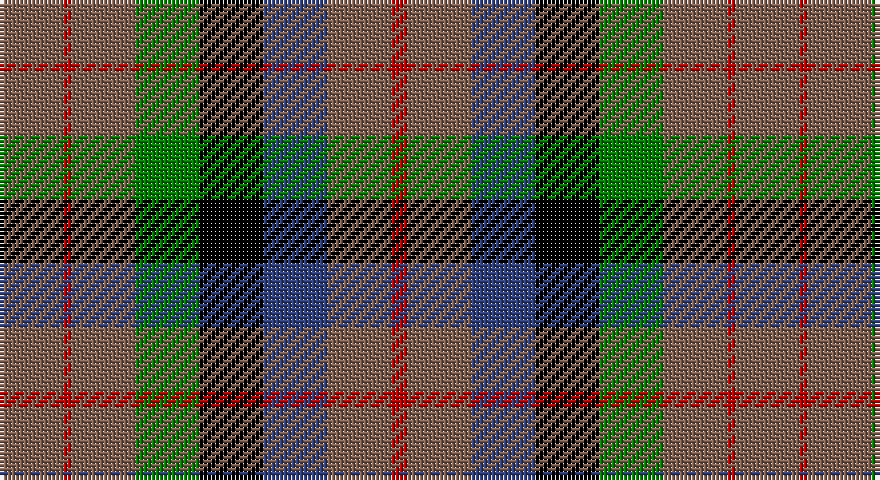

This page is one **sett** — a single exact thread-count. It belongs to the [tartan](/setts/o8r1o8g8k8db8o8r2/)
(the same proportion at any scale), whose colour order is pattern [RRBKGRRR](/stripes/rrbkgrrr/).

Part of the [MacDuff Hunting](/tartans/macduff-hunting/) tartan — the named design grouping this sett with its other cloths.

Sourced from weddslist.  It is a [8 stripe tartan](/stripes/stripes8/).

Original link http://www.weddslist.com/cgi-bin/tartans/pg.pl?source=sts

## Also known as

This cloth is also recorded under:

- MacDuff Htg
- MacDuff, hunting

## Thread count
LT/16 R2 LT16 G16 K16 B16 LT16 R/4

One full sett is **184 threads**.

## Palette

Palette: <strong>Ingles Buchan</strong> <small style="color:#888">(1 of 5 colours)</small>
<table><thead><tr><th>Colour</th><th>Threads</th><th>Shade</th><th>Base</th><th>OKLCh</th></tr></thead><tbody><tr><td>LT/</td><td style="text-align:right;font-variant-numeric:tabular-nums">16</td><td><code style="background-color:#806050;">#806050</code> <small style="color:#888">#806050</small></td><td>R <code style="background-color:#CC0000;">#CC0000</code></td><td><small style="color:#888">oklch(51.7% 0.049 47.8)</small></td></tr><tr><td>R</td><td style="text-align:right;font-variant-numeric:tabular-nums">2</td><td><code style="background-color:#C00000;">#C00000</code> <small style="color:#888">#C00000</small></td><td>R <code style="background-color:#CC0000;">#CC0000</code></td><td><small style="color:#888">oklch(50.7% 0.208 29.2)</small></td></tr><tr><td>LT</td><td style="text-align:right;font-variant-numeric:tabular-nums">16</td><td><code style="background-color:#806050;">#806050</code> <small style="color:#888">#806050</small></td><td>R <code style="background-color:#CC0000;">#CC0000</code></td><td><small style="color:#888">oklch(51.7% 0.049 47.8)</small></td></tr><tr><td>G</td><td style="text-align:right;font-variant-numeric:tabular-nums">16</td><td><code style="background-color:#008000;">#008000</code> <small style="color:#888">#008000</small></td><td>G <code style="background-color:#006100;">#006100</code></td><td><small style="color:#888">oklch(52.0% 0.177 142.5)</small></td></tr><tr><td>K</td><td style="text-align:right;font-variant-numeric:tabular-nums">16</td><td><code style="background-color:#000000;">#000000</code> <small style="color:#888">#000000</small></td><td>K <code style="background-color:#000000;">#000000</code></td><td><small style="color:#888">oklch(0.0% 0.000 0.0)</small></td></tr><tr><td>B</td><td style="text-align:right;font-variant-numeric:tabular-nums">16</td><td><code style="background-color:#304080;">#304080</code> <small style="color:#888">#304080</small></td><td>B <code style="background-color:#2A418A;">#2A418A</code></td><td><small style="color:#888">oklch(39.4% 0.109 270.2)</small></td></tr><tr><td>LT</td><td style="text-align:right;font-variant-numeric:tabular-nums">16</td><td><code style="background-color:#806050;">#806050</code> <small style="color:#888">#806050</small></td><td>R <code style="background-color:#CC0000;">#CC0000</code></td><td><small style="color:#888">oklch(51.7% 0.049 47.8)</small></td></tr><tr><td>R/</td><td style="text-align:right;font-variant-numeric:tabular-nums">4</td><td><code style="background-color:#C00000;">#C00000</code> <small style="color:#888">#C00000</small></td><td>R <code style="background-color:#CC0000;">#CC0000</code></td><td><small style="color:#888">oklch(50.7% 0.208 29.2)</small></td></tr></tbody></table>

# Sample pattern

## Compared to the master

This cloth is one sett of its design; the master sett (the exemplar the design is anchored on) is below for comparison.

<figure style="margin:0"><figcaption style="color:#888;font-size:smaller">this sett</figcaption></figure>
<figure style="margin:0"><figcaption style="color:#888;font-size:smaller"><a href="/setts/do10r2do10g17k12db9do9r2/">master sett →</a></figcaption></figure>

## Nearest tartans

The nearest existing variants by ΔTartan distance, with this tartan at the top so the swatches line up against it.

ΔTartan

Tartan

Sett

—

<a href="/ttd/edit/#slug=o8r1o8g8k8db8o8r2~x2">MacDuff, hunting</a> <a class="nn-out" href="/variants/s8/o8r1o8g8k8db8o8r2~x2/" title="open its dictionary page">↗</a>

1.02

<a href="/ttd/edit/#slug=r2k8lo1k8g8t8r2~x4&amp;base=o8r1o8g8k8db8o8r2~x2">Brodie Hunting</a> <a class="nn-out" href="/variants/s7/r2k8lo1k8g8t8r2~x4/" title="open its dictionary page">↗</a>

1.08

<a href="/ttd/edit/#slug=g14dp11y3k5y3dp11g14ly2~x2&amp;base=o8r1o8g8k8db8o8r2~x2">Wilson's No.124</a> <a class="nn-out" href="/variants/s8/g14dp11y3k5y3dp11g14ly2~x2/" title="open its dictionary page">↗</a>

1.09

<a href="/variants/s8/k8t3g13dp12ly2~x2/">Wilson's No.176</a>

1.11

<a href="/ttd/edit/#slug=dg14dp11t3k5t3dp11dg14w2~x2&amp;base=o8r1o8g8k8db8o8r2~x2">Wilson's No.229</a> <a class="nn-out" href="/variants/s8/dg14dp11t3k5t3dp11dg14w2~x2/" title="open its dictionary page">↗</a>

1.12

<a href="/ttd/edit/#slug=db14g18k3g18r20k14lo3~x2&amp;base=o8r1o8g8k8db8o8r2~x2">Scottish Parliament (unofficial)</a> <a class="nn-out" href="/variants/s7/db14g18k3g18r20k14lo3~x2/" title="open its dictionary page">↗</a>

1.22

<a href="/ttd/edit/#slug=dp6k6g6w1g6k6g6w1g6k6dp6y1~x4&amp;base=o8r1o8g8k8db8o8r2~x2">Wilson's No.233</a> <a class="nn-out" href="/variants/s12/dp6k6g6w1g6k6g6w1g6k6dp6y1~x4/" title="open its dictionary page">↗</a>

1.24

<a href="/ttd/edit/#slug=k11g12w2g12k12dp12r3~x2&amp;base=o8r1o8g8k8db8o8r2~x2">Cunningham / Wilson's No 120</a> <a class="nn-out" href="/variants/s7/k11g12w2g12k12dp12r3~x2/" title="open its dictionary page">↗</a>

1.35

<a href="/ttd/edit/#slug=db16r14g16ly3g16r14db16w3~x2&amp;base=o8r1o8g8k8db8o8r2~x2">Forrester (James) (Personal)</a> <a class="nn-out" href="/variants/s8/db16r14g16ly3g16r14db16w3~x2/" title="open its dictionary page">↗</a>

1.38

<a href="/variants/s8/dp11y2k10g10lo2~x2/">Selkirk (Personal) Original</a>

1.39

<a href="/ttd/edit/#slug=r4do15g11do3lb11do3lb11do3g11do15b4~x2&amp;base=o8r1o8g8k8db8o8r2~x2">Fraser Hunting Dress</a> <a class="nn-out" href="/variants/s11/r4do15g11do3lb11do3lb11do3g11do15b4~x2/" title="open its dictionary page">↗</a>

## Neighbour map

Every grey dot is one of 14360 variants placed by the first two principal components of the ΔTartan feature space (44% of its variance). Red is this tartan; blue dots are its nearest — click one to open its page.

<svg viewBox="0 0 640 380" role="img" style="max-width:100%;height:auto;border:1px solid #e0e0e0;border-radius:4px;display:block" xmlns="http://www.w3.org/2000/svg"><image href="/nn/cloud.v1.png" width="640" height="380"/><a href="/variants/s7/r2k8lo1k8g8t8r2~x4/"><circle cx="155.3" cy="219.1" r="4" fill="#3465a4"><title>Brodie Hunting</title></circle></a><a href="/variants/s8/g14dp11y3k5y3dp11g14ly2~x2/"><circle cx="184.5" cy="221.6" r="4" fill="#3465a4"><title>Wilson's No.124</title></circle></a><a href="/variants/s8/k8t3g13dp12ly2~x2/"><circle cx="150.3" cy="234.7" r="4" fill="#3465a4"><title>Wilson's No.176</title></circle></a><a href="/variants/s8/dg14dp11t3k5t3dp11dg14w2~x2/"><circle cx="183.0" cy="219.7" r="4" fill="#3465a4"><title>Wilson's No.229</title></circle></a><a href="/variants/s7/db14g18k3g18r20k14lo3~x2/"><circle cx="143.2" cy="247.0" r="4" fill="#3465a4"><title>Scottish Parliament (unofficial)</title></circle></a><a href="/variants/s12/dp6k6g6w1g6k6g6w1g6k6dp6y1~x4/"><circle cx="133.3" cy="230.8" r="4" fill="#3465a4"><title>Wilson's No.233</title></circle></a><a href="/variants/s7/k11g12w2g12k12dp12r3~x2/"><circle cx="131.2" cy="256.3" r="4" fill="#3465a4"><title>Cunningham / Wilson's No 120</title></circle></a><a href="/variants/s8/db16r14g16ly3g16r14db16w3~x2/"><circle cx="92.7" cy="241.0" r="4" fill="#3465a4"><title>Forrester (James) (Personal)</title></circle></a><a href="/variants/s8/dp11y2k10g10lo2~x2/"><circle cx="118.9" cy="237.5" r="4" fill="#3465a4"><title>Selkirk (Personal) Original</title></circle></a><a href="/variants/s11/r4do15g11do3lb11do3lb11do3g11do15b4~x2/"><circle cx="120.7" cy="209.9" r="4" fill="#3465a4"><title>Fraser Hunting Dress</title></circle></a><circle cx="155.5" cy="231.9" r="5" fill="#c00000"/></svg>

ID: /variants/s8/o8r1o8g8k8db8o8r2~x2/
