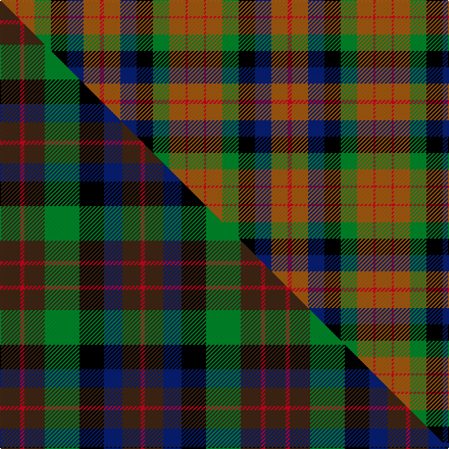

This is one **variant** — a specific cloth: this exact thread count and colourway, with its own
provenance below. It is one weaving of the [sett](/tartans/m/ma/macduff-hunting/) (the scale-free proportion — the
same cloth at any scale or shade), whose colour order is pattern [RRBKGRRR](/stripes/rrbkgrrr/).

Part of the [MacDuff Hunting](/tartans/m/ma/macduff-hunting/) tartan — the named design grouping this sett with its other cloths.

Sourced from weddslist.  It is a [8 stripe tartan](/stripes/stripes8/).

Original link [http://www.weddslist.com/cgi-bin/tartans/pg.pl?source=sts](http://www.weddslist.com/cgi-bin/tartans/pg.pl?source=sts)

Dataset <small>— provenance for this record, inherited from the source manifest</small>

<dl class="dataset-prov">
<dt>source</dt><dd><a href="/sources/weddslist/">Weddslist</a></dd>
<dt>data captured from</dt><dd><a href="https://github.com/thetartan/tartan-database/blob/master/data/weddslist/data.csv">https://github.com/thetartan/tartan-database/blob/master/data/weddslist/data.csv</a></dd>
<dt>data date</dt><dd>2016-11-17 <small>(dataset default)</small></dd>
<dt>licence</dt><dd><a href="https://creativecommons.org/licenses/by-nc-nd/4.0/">CC BY-NC-ND 4.0</a></dd>
</dl>

Capture chain <small>— the hands this data passed through, oldest first; each capture carries its own licence</small>

<ol class="capture-chain">
<li><a href="https://www.weddslist.com/tartans/">Weddslist</a> <small>the living privately compiled reference</small></li>
<li><a href="https://github.com/thetartan/tartan-database">thetartan/tartan-database</a> <small>2016-2017</small> · <a href="https://creativecommons.org/licenses/by-nc-nd/4.0/">CC BY-NC-ND 4.0</a> <small>Levko Kravets's frozen compilation — the capture we vendored, and where its CC licence text came from</small></li>
<li>this dictionary <small>captured 2026-06-10 · commit 5bf86c7566</small> <small>each re-capture is a git commit to data/sources</small></li>
</ol>

## Thread count
O/16 R2 O16 G16 K16 DB16 O16 R/4

One full sett is **184 threads**.

## Palette
<table><thead><tr><th>Colour</th><th>Shade</th><th>OKLCh</th></tr></thead><tbody><tr><td>DB</td><td><code style="background-color:#082077;">#082077</code> <small style="color:#888">#082077</small></td><td><small style="color:#888">oklch(30.0% 0.149 265.1)</small></td></tr><tr><td>G</td><td><code style="background-color:#008B2A;">#008B2A</code> <small style="color:#888">#008B2A</small></td><td><small style="color:#888">oklch(55.4% 0.170 145.9)</small></td></tr><tr><td>K</td><td><code style="background-color:#000000;">#000000</code> <small style="color:#888">#000000</small></td><td><small style="color:#888">oklch(0.0% 0.000 0.0)</small></td></tr><tr><td>O</td><td><code style="background-color:#A65C11;">#A65C11</code> <small style="color:#888">#A65C11</small></td><td><small style="color:#888">oklch(55.0% 0.125 58.3)</small></td></tr><tr><td>R</td><td><code style="background-color:#D60020;">#D60020</code> <small style="color:#888">#D60020</small></td><td><small style="color:#888">oklch(55.2% 0.224 25.5)</small></td></tr></tbody></table>

# Sample pattern

## Compared to the master

This cloth is one sett of its design; the master sett (the exemplar the design is anchored on) is below for comparison.

Its **ΔTartan distance** from the master is **0.71** — the same measure the nearest-tartans table ranks by (0 is identical; a re-scale of the same cloth is near 0, a recolour or a different proportion further).

<figure class="master-compare" style="margin:0">

this sett
master sett ★

<figcaption style="color:#888;font-size:smaller">One weave of this sett against the <a href="/setts/do10r2do10g17k12db9do9r2/">master sett ★</a>, split on the diagonal: a shared proportion runs seamlessly across it with only the shades shifting; a different proportion breaks on it.</figcaption>
</figure>

## Nearest tartan variants

The nearest existing variants by ΔTartan distance, with this cloth at the top so the swatches line up against it.

ΔTartan

Threads

Variant

Sett

—

184

<a href="/variants/s8/o8r1o8g8k8db8o8r2~x2/">MacDuff, hunting</a>

<a href="/ttd/edit/#slug=do10r2do10g17k12db9do9r2~x2&amp;base=o8r1o8g8k8db8o8r2~x2" title="compare in the TTD">0.71</a>

260

<a href="/variants/s8/do10r2do10g17k12db9do9r2~x2/">MacDuff Hunting</a>

<a href="/ttd/edit/#slug=r1do7g7k7t7do7r1~x4&amp;base=o8r1o8g8k8db8o8r2~x2" title="compare in the TTD">1.39</a>

288

<a href="/variants/s7/r1do7g7k7t7do7r1~x4/">Tennant (Clan)</a>

<a href="/ttd/edit/#slug=r1do7db7k7g7do7r1~x4&amp;base=o8r1o8g8k8db8o8r2~x2" title="compare in the TTD">1.39</a>

288

<a href="/variants/s7/r1do7db7k7g7do7r1~x4/">Tennant</a>

<a href="/ttd/edit/#slug=db8k3db18g6k8g6o12r5o12r3~x2&amp;base=o8r1o8g8k8db8o8r2~x2" title="compare in the TTD">2.55</a>

302

<a href="/variants/s10/db8k3db18g6k8g6o12r5o12r3~x2/">Longford</a>

<a href="/ttd/edit/#slug=dr5db1dr3db1dr5db4g3k3g3lo2~x4&amp;base=o8r1o8g8k8db8o8r2~x2" title="compare in the TTD">2.61</a>

212

<a href="/variants/s10/dr5db1dr3db1dr5db4g3k3g3lo2~x4/">MacGaugh (Name)</a>

<a href="/ttd/edit/#slug=g14dp11y3k5y3dp11g14ly2~x2~dp1607327&amp;base=o8r1o8g8k8db8o8r2~x2" title="compare in the TTD">2.61</a>

220

<a href="/variants/s8/g14dp11y3k5y3dp11g14ly2~x2~dp1607327/">Wilson's No.124</a>

<a href="/ttd/edit/#slug=dt6ly2r6lb3k2ly6dt10r2dt3r2~x4&amp;base=o8r1o8g8k8db8o8r2~x2" title="compare in the TTD">2.94</a>

304

<a href="/variants/s10/dt6ly2r6lb3k2ly6dt10r2dt3r2~x4/">Commonwealth</a>

<a href="/ttd/edit/#slug=dy8r1dy8g8k8db8dy8r2~x2&amp;base=o8r1o8g8k8db8o8r2~x2" title="compare in the TTD">3.09</a>

184

<a href="/variants/s8/dy8r1dy8g8k8db8dy8r2~x2/">MacDuff Hunting Clan Tartan</a>

<a href="/ttd/edit/#slug=dp9k7g5r4g7k1y1~x2&amp;base=o8r1o8g8k8db8o8r2~x2" title="compare in the TTD">3.15</a>

116

<a href="/variants/s7/dp9k7g5r4g7k1y1~x2/">MacLaren #2</a>

<a href="/ttd/edit/#slug=g8r11k3y2dp8g15r5w2~x2&amp;base=o8r1o8g8k8db8o8r2~x2" title="compare in the TTD">3.16</a>

196

<a href="/variants/s8/g8r11k3y2dp8g15r5w2~x2/">Wilson's, No 109</a>

## Neighbour map

Every grey dot is one of 13656 variants placed by the first two principal components of the ΔTartan feature space (42% of its variance). Red is this tartan; blue dots are its nearest — click one to open its page. The map is a flat projection of a many-dimensional space — [how to read it](/posts/neighbourhood-maps/).

<svg viewBox="0 0 640 380" role="img" style="max-width:100%;height:auto;border:1px solid #e0e0e0;border-radius:4px;display:block" xmlns="http://www.w3.org/2000/svg"><image href="/nn/cloud.v1.png" width="640" height="380"/><a href="/variants/s8/do10r2do10g17k12db9do9r2~x2/"><circle cx="140.5" cy="217.4" r="4" fill="#3465a4"><title>MacDuff Hunting</title></circle></a><a href="/variants/s7/r1do7g7k7t7do7r1~x4/"><circle cx="110.6" cy="229.5" r="4" fill="#3465a4"><title>Tennant (Clan)</title></circle></a><a href="/variants/s7/r1do7db7k7g7do7r1~x4/"><circle cx="123.6" cy="231.9" r="4" fill="#3465a4"><title>Tennant</title></circle></a><a href="/variants/s10/db8k3db18g6k8g6o12r5o12r3~x2/"><circle cx="76.5" cy="212.8" r="4" fill="#3465a4"><title>Longford</title></circle></a><a href="/variants/s10/dr5db1dr3db1dr5db4g3k3g3lo2~x4/"><circle cx="118.1" cy="233.7" r="4" fill="#3465a4"><title>MacGaugh (Name)</title></circle></a><a href="/variants/s8/g14dp11y3k5y3dp11g14ly2~x2~dp1607327/"><circle cx="164.9" cy="210.6" r="4" fill="#3465a4"><title>Wilson's No.124</title></circle></a><a href="/variants/s10/dt6ly2r6lb3k2ly6dt10r2dt3r2~x4/"><circle cx="133.4" cy="209.7" r="4" fill="#3465a4"><title>Commonwealth</title></circle></a><a href="/variants/s8/dy8r1dy8g8k8db8dy8r2~x2/"><circle cx="169.9" cy="232.0" r="4" fill="#3465a4"><title>MacDuff Hunting Clan Tartan</title></circle></a><a href="/variants/s7/dp9k7g5r4g7k1y1~x2/"><circle cx="105.1" cy="203.1" r="4" fill="#3465a4"><title>MacLaren #2</title></circle></a><a href="/variants/s8/g8r11k3y2dp8g15r5w2~x2/"><circle cx="128.8" cy="185.4" r="4" fill="#3465a4"><title>Wilson's, No 109</title></circle></a><circle cx="143.9" cy="220.6" r="5" fill="#c00000"/><text x="320" y="376" text-anchor="middle" font-size="11" fill="#999">ground</text><text x="11" y="190" text-anchor="middle" font-size="11" fill="#999" transform="rotate(-90 11 190)">complexity</text></svg>

ID: /variants/s8/o8r1o8g8k8db8o8r2~x2/
