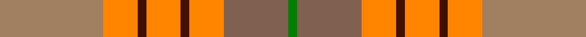
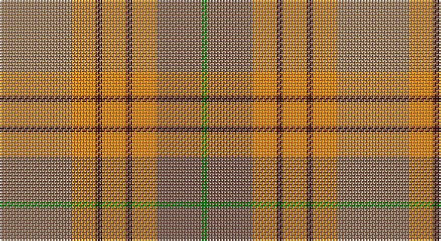

This page is one **sett** — a single exact thread-count. It belongs to the [tartan](/setts/oi24lo8dr2lo8dr2lo8o15g2/)
(the same proportion at any scale), whose colour order is pattern [GRYBYBYR](/stripes/grybybyr/).

Part of the [Unidentified from Winnipeg](/tartans/unidentified-from-winnipeg/) tartan — the named design grouping this sett with its other cloths.

Sourced from weddslist.  It is a [8 stripe tartan](/stripes/stripes8/).

Original link http://www.weddslist.com/cgi-bin/tartans/pg.pl?source=sts

## Thread count
LT/48 O16 DR4 O16 DR4 O16 LTa30 G/4

One full sett is **224 threads**.

## Palette

Palette: <strong>custom</strong>
<table><thead><tr><th>Colour</th><th>Threads</th><th>Shade</th><th>Base</th><th>OKLCh</th></tr></thead><tbody><tr><td>LT/</td><td style="text-align:right;font-variant-numeric:tabular-nums">48</td><td><code style="background-color:#A08060;">#A08060</code> <small style="color:#888">#A08060</small></td><td>R <code style="background-color:#CC0000;">#CC0000</code></td><td><small style="color:#888">oklch(62.2% 0.060 66.3)</small></td></tr><tr><td>O</td><td style="text-align:right;font-variant-numeric:tabular-nums">16</td><td><code style="background-color:#FF8500;">#FF8500</code> <small style="color:#888">#FF8500</small></td><td>Y <code style="background-color:#F2BF00;">#F2BF00</code></td><td><small style="color:#888">oklch(74.0% 0.183 55.1)</small></td></tr><tr><td>DR</td><td style="text-align:right;font-variant-numeric:tabular-nums">4</td><td><code style="background-color:#401000;">#401000</code> <small style="color:#888">#401000</small></td><td>B <code style="background-color:#2A418A;">#2A418A</code></td><td><small style="color:#888">oklch(25.3% 0.079 39.9)</small></td></tr><tr><td>O</td><td style="text-align:right;font-variant-numeric:tabular-nums">16</td><td><code style="background-color:#FF8500;">#FF8500</code> <small style="color:#888">#FF8500</small></td><td>Y <code style="background-color:#F2BF00;">#F2BF00</code></td><td><small style="color:#888">oklch(74.0% 0.183 55.1)</small></td></tr><tr><td>DR</td><td style="text-align:right;font-variant-numeric:tabular-nums">4</td><td><code style="background-color:#401000;">#401000</code> <small style="color:#888">#401000</small></td><td>B <code style="background-color:#2A418A;">#2A418A</code></td><td><small style="color:#888">oklch(25.3% 0.079 39.9)</small></td></tr><tr><td>O</td><td style="text-align:right;font-variant-numeric:tabular-nums">16</td><td><code style="background-color:#FF8500;">#FF8500</code> <small style="color:#888">#FF8500</small></td><td>Y <code style="background-color:#F2BF00;">#F2BF00</code></td><td><small style="color:#888">oklch(74.0% 0.183 55.1)</small></td></tr><tr><td>LTa</td><td style="text-align:right;font-variant-numeric:tabular-nums">30</td><td><code style="background-color:#806050;">#806050</code> <small style="color:#888">#806050</small></td><td>R <code style="background-color:#CC0000;">#CC0000</code></td><td><small style="color:#888">oklch(51.7% 0.049 47.8)</small></td></tr><tr><td>G/</td><td style="text-align:right;font-variant-numeric:tabular-nums">4</td><td><code style="background-color:#008000;">#008000</code> <small style="color:#888">#008000</small></td><td>G <code style="background-color:#006100;">#006100</code></td><td><small style="color:#888">oklch(52.0% 0.177 142.5)</small></td></tr></tbody></table>

# Sample pattern

## Compared to the master

This cloth is one sett of its design; the master sett (the exemplar the design is anchored on) is below for comparison.

<figure style="margin:0"><figcaption style="color:#888;font-size:smaller">this sett</figcaption></figure>
<figure style="margin:0"><figcaption style="color:#888;font-size:smaller"><a href="/setts/w24r8dy2r8dy2r8dyi15dg2/">master sett →</a></figcaption></figure>

## Nearest tartans

The nearest existing variants by ΔTartan distance, with this tartan at the top so the swatches line up against it.

ΔTartan

Tartan

Sett

—

<a href="/ttd/edit/#slug=oi24lo8dr2lo8dr2lo8o15g2~x2">Unidentified from Winnipeg</a> <a class="nn-out" href="/variants/s8/oi24lo8dr2lo8dr2lo8o15g2~x2/" title="open its dictionary page">↗</a>

1.49

<a href="/ttd/edit/#slug=oi2lo14o14r1oi2r2b2r2oi20b2~x4&amp;base=oi24lo8dr2lo8dr2lo8o15g2~x2">Star Is Born, A</a> <a class="nn-out" href="/variants/s10/oi2lo14o14r1oi2r2b2r2oi20b2~x4/" title="open its dictionary page">↗</a>

1.50

<a href="/ttd/edit/#slug=w6lri27dr6o40lr44w8o4&amp;base=oi24lo8dr2lo8dr2lo8o15g2~x2">Susan G Komen 06</a> <a class="nn-out" href="/variants/s7/w6lri27dr6o40lr44w8o4/" title="open its dictionary page">↗</a>

1.58

<a href="/ttd/edit/#slug=r5lp2y24lr2y2lr2y6lr8r6lr8ly4~x2&amp;base=oi24lo8dr2lo8dr2lo8o15g2~x2">Tasmanian</a> <a class="nn-out" href="/variants/s11/r5lp2y24lr2y2lr2y6lr8r6lr8ly4~x2/" title="open its dictionary page">↗</a>

1.61

<a href="/ttd/edit/#slug=loi36do15loi9r31lo5do4r16~x2&amp;base=oi24lo8dr2lo8dr2lo8o15g2~x2">Manhattan Ethnic</a> <a class="nn-out" href="/variants/s7/loi36do15loi9r31lo5do4r16~x2/" title="open its dictionary page">↗</a>

1.62

<a href="/ttd/edit/#slug=lr2oi1r10o12oi10lr6r10oi1lr2~x2&amp;base=oi24lo8dr2lo8dr2lo8o15g2~x2">Unidentified, Sett</a> <a class="nn-out" href="/variants/s9/lr2oi1r10o12oi10lr6r10oi1lr2~x2/" title="open its dictionary page">↗</a>

1.65

<a href="/ttd/edit/#slug=t24r27g20lo6g20r2w3~x2&amp;base=oi24lo8dr2lo8dr2lo8o15g2~x2">Buchanhaven Heritage</a> <a class="nn-out" href="/variants/s7/t24r27g20lo6g20r2w3~x2/" title="open its dictionary page">↗</a>

1.67

<a href="/ttd/edit/#slug=k2y1dg12y12ri12k1r2~x4&amp;base=oi24lo8dr2lo8dr2lo8o15g2~x2">PSD: Operation Iraqi Freedom</a> <a class="nn-out" href="/variants/s7/k2y1dg12y12ri12k1r2~x4/" title="open its dictionary page">↗</a>

1.68

<a href="/ttd/edit/#slug=g28lo18db4lo18r3ri2r3ri2r3ri2r3~x2&amp;base=oi24lo8dr2lo8dr2lo8o15g2~x2">Commonwealth Games - 2014</a> <a class="nn-out" href="/variants/s11/g28lo18db4lo18r3ri2r3ri2r3ri2r3~x2/" title="open its dictionary page">↗</a>

1.69

<a href="/ttd/edit/#slug=o24r24w3g21ly2r1ly2o6r2~x2&amp;base=oi24lo8dr2lo8dr2lo8o15g2~x2">Henry, W.A.</a> <a class="nn-out" href="/variants/s9/o24r24w3g21ly2r1ly2o6r2~x2/" title="open its dictionary page">↗</a>

1.69

<a href="/ttd/edit/#slug=lr2dy1r10o12dy10lr6r10dy1lr2~x2&amp;base=oi24lo8dr2lo8dr2lo8o15g2~x2">Unidentified Sett</a> <a class="nn-out" href="/variants/s9/lr2dy1r10o12dy10lr6r10dy1lr2~x2/" title="open its dictionary page">↗</a>

## Neighbour map

Every grey dot is one of 14360 variants placed by the first two principal components of the ΔTartan feature space (44% of its variance). Red is this tartan; blue dots are its nearest — click one to open its page.

<svg viewBox="0 0 640 380" role="img" style="max-width:100%;height:auto;border:1px solid #e0e0e0;border-radius:4px;display:block" xmlns="http://www.w3.org/2000/svg"><image href="/nn/cloud.v1.png" width="640" height="380"/><a href="/variants/s10/oi2lo14o14r1oi2r2b2r2oi20b2~x4/"><circle cx="276.1" cy="137.3" r="4" fill="#3465a4"><title>Star Is Born, A</title></circle></a><a href="/variants/s7/w6lri27dr6o40lr44w8o4/"><circle cx="218.6" cy="196.1" r="4" fill="#3465a4"><title>Susan G Komen 06</title></circle></a><a href="/variants/s11/r5lp2y24lr2y2lr2y6lr8r6lr8ly4~x2/"><circle cx="292.5" cy="176.4" r="4" fill="#3465a4"><title>Tasmanian</title></circle></a><a href="/variants/s7/loi36do15loi9r31lo5do4r16~x2/"><circle cx="244.3" cy="220.8" r="4" fill="#3465a4"><title>Manhattan Ethnic</title></circle></a><a href="/variants/s9/lr2oi1r10o12oi10lr6r10oi1lr2~x2/"><circle cx="260.4" cy="220.5" r="4" fill="#3465a4"><title>Unidentified, Sett</title></circle></a><a href="/variants/s7/t24r27g20lo6g20r2w3~x2/"><circle cx="225.2" cy="209.0" r="4" fill="#3465a4"><title>Buchanhaven Heritage</title></circle></a><a href="/variants/s7/k2y1dg12y12ri12k1r2~x4/"><circle cx="214.5" cy="201.7" r="4" fill="#3465a4"><title>PSD: Operation Iraqi Freedom</title></circle></a><a href="/variants/s11/g28lo18db4lo18r3ri2r3ri2r3ri2r3~x2/"><circle cx="252.4" cy="139.2" r="4" fill="#3465a4"><title>Commonwealth Games - 2014</title></circle></a><a href="/variants/s9/o24r24w3g21ly2r1ly2o6r2~x2/"><circle cx="246.2" cy="137.8" r="4" fill="#3465a4"><title>Henry, W.A.</title></circle></a><a href="/variants/s9/lr2dy1r10o12dy10lr6r10dy1lr2~x2/"><circle cx="214.2" cy="191.8" r="4" fill="#3465a4"><title>Unidentified Sett</title></circle></a><circle cx="229.9" cy="188.1" r="5" fill="#c00000"/></svg>

ID: /variants/s8/oi24lo8dr2lo8dr2lo8o15g2~x2/
