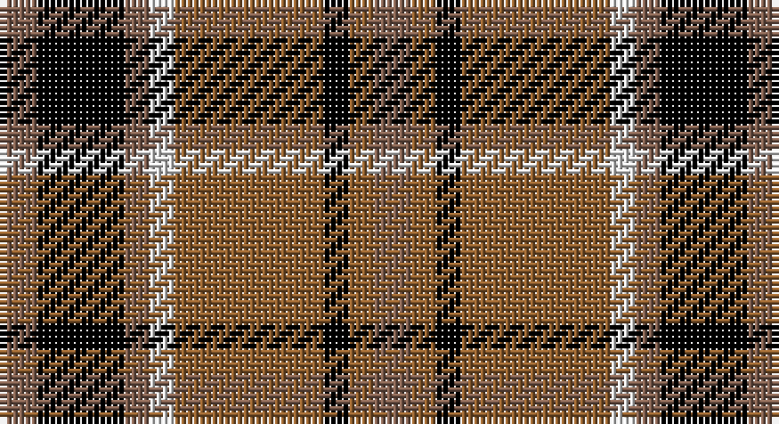

This page is one **sett** — a single exact thread-count. It belongs to the [tartan](/setts/oi3k7oi2w2o12k2o2oi3/)
(the same proportion at any scale), whose colour order is pattern [RKRWRKRR](/stripes/rkrwrkrr/).

Part of the [Daks](/tartans/daks/) tartan — the named design grouping this sett with its other cloths.

Sourced from weddslist.  It is a [8 stripe tartan](/stripes/stripes8/).

Original link http://www.weddslist.com/cgi-bin/tartans/pg.pl?source=sts

## Also known as

This cloth is also recorded under:

- Daks Muted blue
- Daks, Black
- Daks, Muted blue

## Thread count
LTa/6 K14 LTa4 LN4 LT24 K4 LT4 LTa/6

One full sett is **120 threads**.

## Palette

Palette: <strong>Tartan Register</strong> <small style="color:#888">(2 of 4 colours)</small>
<table><thead><tr><th>Colour</th><th>Threads</th><th>Shade</th><th>Base</th><th>OKLCh</th></tr></thead><tbody><tr><td>LTa/</td><td style="text-align:right;font-variant-numeric:tabular-nums">6</td><td><code style="background-color:#806050;">#806050</code> <small style="color:#888">#806050</small></td><td>R <code style="background-color:#CC0000;">#CC0000</code></td><td><small style="color:#888">oklch(51.7% 0.049 47.8)</small></td></tr><tr><td>K</td><td style="text-align:right;font-variant-numeric:tabular-nums">14</td><td><code style="background-color:#000000;">#000000</code> <small style="color:#888">#000000</small></td><td>K <code style="background-color:#000000;">#000000</code></td><td><small style="color:#888">oklch(0.0% 0.000 0.0)</small></td></tr><tr><td>LTa</td><td style="text-align:right;font-variant-numeric:tabular-nums">4</td><td><code style="background-color:#806050;">#806050</code> <small style="color:#888">#806050</small></td><td>R <code style="background-color:#CC0000;">#CC0000</code></td><td><small style="color:#888">oklch(51.7% 0.049 47.8)</small></td></tr><tr><td>LN</td><td style="text-align:right;font-variant-numeric:tabular-nums">4</td><td><code style="background-color:#E0E0E0;">#E0E0E0</code> <small style="color:#888">#E0E0E0</small></td><td>W <code style="background-color:#F7F7F7;">#F7F7F7</code></td><td><small style="color:#888">oklch(90.7% 0.000 89.9)</small></td></tr><tr><td>LT</td><td style="text-align:right;font-variant-numeric:tabular-nums">24</td><td><code style="background-color:#906030;">#906030</code> <small style="color:#888">#906030</small></td><td>R <code style="background-color:#CC0000;">#CC0000</code></td><td><small style="color:#888">oklch(53.1% 0.089 63.7)</small></td></tr><tr><td>K</td><td style="text-align:right;font-variant-numeric:tabular-nums">4</td><td><code style="background-color:#000000;">#000000</code> <small style="color:#888">#000000</small></td><td>K <code style="background-color:#000000;">#000000</code></td><td><small style="color:#888">oklch(0.0% 0.000 0.0)</small></td></tr><tr><td>LT</td><td style="text-align:right;font-variant-numeric:tabular-nums">4</td><td><code style="background-color:#906030;">#906030</code> <small style="color:#888">#906030</small></td><td>R <code style="background-color:#CC0000;">#CC0000</code></td><td><small style="color:#888">oklch(53.1% 0.089 63.7)</small></td></tr><tr><td>LTa/</td><td style="text-align:right;font-variant-numeric:tabular-nums">6</td><td><code style="background-color:#806050;">#806050</code> <small style="color:#888">#806050</small></td><td>R <code style="background-color:#CC0000;">#CC0000</code></td><td><small style="color:#888">oklch(51.7% 0.049 47.8)</small></td></tr></tbody></table>

# Sample pattern

## Compared to the master

This cloth is one sett of its design; the master sett (the exemplar the design is anchored on) is below for comparison.

<figure style="margin:0"><figcaption style="color:#888;font-size:smaller">this sett</figcaption></figure>
<figure style="margin:0"><figcaption style="color:#888;font-size:smaller"><a href="/setts/db3dy7g2y2g14dy2g2db3/">master sett →</a></figcaption></figure>

## Nearest tartans

The nearest existing variants by ΔTartan distance, with this tartan at the top so the swatches line up against it.

ΔTartan

Tartan

Sett

—

<a href="/ttd/edit/#slug=oi3k7oi2w2o12k2o2oi3~x2">Daks</a> <a class="nn-out" href="/variants/s8/oi3k7oi2w2o12k2o2oi3~x2/" title="open its dictionary page">↗</a>

0.78

<a href="/ttd/edit/#slug=dy3k7dy2w2lo12k2lo2dy3~x2&amp;base=oi3k7oi2w2o12k2o2oi3~x2">Daks (Brown)</a> <a class="nn-out" href="/variants/s8/dy3k7dy2w2lo12k2lo2dy3~x2/" title="open its dictionary page">↗</a>

0.89

<a href="/ttd/edit/#slug=g1r9g3k3g3r1k9w1~x2&amp;base=oi3k7oi2w2o12k2o2oi3~x2">Manson Family Tartan</a> <a class="nn-out" href="/variants/s8/g1r9g3k3g3r1k9w1~x2/" title="open its dictionary page">↗</a>

0.89

<a href="/ttd/edit/#slug=lb13k3lb3k3lb3k15dy18r3~x2&amp;base=oi3k7oi2w2o12k2o2oi3~x2">Holden Brown (Corporate)</a> <a class="nn-out" href="/variants/s8/lb13k3lb3k3lb3k15dy18r3~x2/" title="open its dictionary page">↗</a>

0.93

<a href="/ttd/edit/#slug=lb2r12k4r2k2r2k6g5lb2~x2&amp;base=oi3k7oi2w2o12k2o2oi3~x2">O'Neill (District)</a> <a class="nn-out" href="/variants/s9/lb2r12k4r2k2r2k6g5lb2~x2/" title="open its dictionary page">↗</a>

0.99

<a href="/ttd/edit/#slug=g3k15r8g2o8k2~x4&amp;base=oi3k7oi2w2o12k2o2oi3~x2">Thompson Black (Fashion)</a> <a class="nn-out" href="/variants/s6/g3k15r8g2o8k2~x4/" title="open its dictionary page">↗</a>

1.02

<a href="/ttd/edit/#slug=b2k2r14dg15k8b7r14k2b2~x2&amp;base=oi3k7oi2w2o12k2o2oi3~x2">Montrose</a> <a class="nn-out" href="/variants/s9/b2k2r14dg15k8b7r14k2b2~x2/" title="open its dictionary page">↗</a>

1.02

<a href="/ttd/edit/#slug=b2k2r14dg15k8b7r14k2b2&amp;base=oi3k7oi2w2o12k2o2oi3~x2">Montrose</a> <a class="nn-out" href="/variants/s9/b2k2r14dg15k8b7r14k2b2/" title="open its dictionary page">↗</a>

1.03

<a href="/ttd/edit/#slug=lb5o34k24o4r24o4~x2&amp;base=oi3k7oi2w2o12k2o2oi3~x2">Wcwm 759-3</a> <a class="nn-out" href="/variants/s6/lb5o34k24o4r24o4~x2/" title="open its dictionary page">↗</a>

1.08

<a href="/ttd/edit/#slug=lb2k2r14dg15k8lb7r14k2lb2&amp;base=oi3k7oi2w2o12k2o2oi3~x2">Montrose</a> <a class="nn-out" href="/variants/s9/lb2k2r14dg15k8lb7r14k2lb2/" title="open its dictionary page">↗</a>

1.14

<a href="/ttd/edit/#slug=g8r2g12k6g3db6r24k4~x2&amp;base=oi3k7oi2w2o12k2o2oi3~x2">Dickie</a> <a class="nn-out" href="/variants/s8/g8r2g12k6g3db6r24k4~x2/" title="open its dictionary page">↗</a>

## Neighbour map

Every grey dot is one of 14360 variants placed by the first two principal components of the ΔTartan feature space (44% of its variance). Red is this tartan; blue dots are its nearest — click one to open its page.

<svg viewBox="0 0 640 380" role="img" style="max-width:100%;height:auto;border:1px solid #e0e0e0;border-radius:4px;display:block" xmlns="http://www.w3.org/2000/svg"><image href="/nn/cloud.v1.png" width="640" height="380"/><a href="/variants/s8/dy3k7dy2w2lo12k2lo2dy3~x2/"><circle cx="178.8" cy="205.2" r="4" fill="#3465a4"><title>Daks (Brown)</title></circle></a><a href="/variants/s8/g1r9g3k3g3r1k9w1~x2/"><circle cx="202.7" cy="193.3" r="4" fill="#3465a4"><title>Manson Family Tartan</title></circle></a><a href="/variants/s8/lb13k3lb3k3lb3k15dy18r3~x2/"><circle cx="132.4" cy="196.7" r="4" fill="#3465a4"><title>Holden Brown (Corporate)</title></circle></a><a href="/variants/s9/lb2r12k4r2k2r2k6g5lb2~x2/"><circle cx="196.5" cy="212.6" r="4" fill="#3465a4"><title>O'Neill (District)</title></circle></a><a href="/variants/s6/g3k15r8g2o8k2~x4/"><circle cx="200.8" cy="224.2" r="4" fill="#3465a4"><title>Thompson Black (Fashion)</title></circle></a><a href="/variants/s9/b2k2r14dg15k8b7r14k2b2~x2/"><circle cx="183.7" cy="204.2" r="4" fill="#3465a4"><title>Montrose</title></circle></a><a href="/variants/s9/b2k2r14dg15k8b7r14k2b2/"><circle cx="183.7" cy="204.2" r="4" fill="#3465a4"><title>Montrose</title></circle></a><a href="/variants/s6/lb5o34k24o4r24o4~x2/"><circle cx="190.3" cy="203.2" r="4" fill="#3465a4"><title>Wcwm 759-3</title></circle></a><a href="/variants/s9/lb2k2r14dg15k8lb7r14k2lb2/"><circle cx="158.4" cy="185.1" r="4" fill="#3465a4"><title>Montrose</title></circle></a><a href="/variants/s8/g8r2g12k6g3db6r24k4~x2/"><circle cx="200.1" cy="181.3" r="4" fill="#3465a4"><title>Dickie</title></circle></a><circle cx="174.2" cy="203.5" r="5" fill="#c00000"/></svg>

ID: /variants/s8/oi3k7oi2w2o12k2o2oi3~x2/
