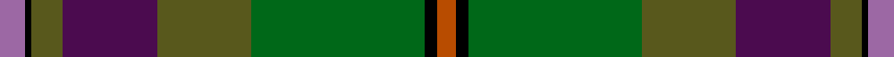

This is one **variant** — a specific cloth: this exact thread count and colourway, with its own
provenance below. It is one weaving of the [sett](/tartans/a/ab/aberuchill/) (the scale-free proportion — the
same cloth at any scale or shade), whose colour order is pattern [RKGBGGKR](/stripes/rkgbggkr/).

Part of the [Aberuchill](/tartans/a/ab/aberuchill/) tartan — the named design grouping this sett with its other cloths.

Sourced from house-of-tartan.  It is a [8 stripe tartan](/stripes/stripes8/).

Original link [http://www.house-of-tartan.scotland.net/house/TartanViewjs.asp?colr=Def&tnam=6814](http://www.house-of-tartan.scotland.net/house/TartanViewjs.asp?colr=Def&tnam=6814)

## Provenance

Earliest known date: 2005 Aberuchill lends it name to the area south of Comrie where the river Ruchil meets the river Earn. The two rivers form the boundaries of the Aberuchill Estate for which this tartan was created.

Dataset <small>— provenance for this record, inherited from the source manifest</small>

<dl class="dataset-prov">
<dt>source</dt><dd><a href="/sources/house-of-tartan/">House of Tartan</a></dd>
<dt>data captured from</dt><dd><a href="https://github.com/thetartan/tartan-database/blob/master/data/house-of-tartan/data.csv">https://github.com/thetartan/tartan-database/blob/master/data/house-of-tartan/data.csv</a></dd>
<dt>data date</dt><dd>2005 <small>(this record)</small></dd>
<dt>licence</dt><dd><a href="https://creativecommons.org/licenses/by-nc-nd/4.0/">CC BY-NC-ND 4.0</a></dd>
</dl>

Capture chain <small>— the hands this data passed through, oldest first; each capture carries its own licence</small>

<ol class="capture-chain">
<li><a href="http://www.house-of-tartan.scotland.net/">House of Tartan</a> <small>the weaver/retailer's database — the site is now offline; the URL is kept as the ultimate source's identity</small></li>
<li><a href="https://github.com/thetartan/tartan-database">thetartan/tartan-database</a> <small>2016-2017</small> · <a href="https://creativecommons.org/licenses/by-nc-nd/4.0/">CC BY-NC-ND 4.0</a> <small>Levko Kravets's frozen compilation — the capture we vendored, and where its CC licence text came from</small></li>
<li>this dictionary <small>captured 2026-06-10 · commit 5bf86c7566</small> <small>each re-capture is a git commit to data/sources</small></li>
</ol>

## Thread count
Oi/8 K2 G10 DP30 G30 DG55 K4 O/6

One full sett is **276 threads**.

## Palette
<table><thead><tr><th>Colour</th><th>Shade</th><th>OKLCh</th></tr></thead><tbody><tr><td>DG</td><td><code style="background-color:#003820;">#003820</code> <small style="color:#888">#003820</small></td><td><small style="color:#888">oklch(30.0% 0.070 158.3)</small></td></tr><tr><td>O</td><td><code style="background-color:#B84C00;">#B84C00</code> <small style="color:#888">#B84C00</small></td><td><small style="color:#888">oklch(55.1% 0.156 45.5)</small></td></tr><tr><td>DP</td><td><code style="background-color:#4B0B4F;">#4B0B4F</code> <small style="color:#888">#4B0B4F</small></td><td><small style="color:#888">oklch(30.1% 0.125 325.4)</small></td></tr><tr><td>DR</td><td><code style="background-color:#55120C;">#55120C</code> <small style="color:#888">#55120C</small></td><td><small style="color:#888">oklch(30.0% 0.099 29.3)</small></td></tr><tr><td>DG</td><td><code style="background-color:#006818;">#006818</code> <small style="color:#888">#006818</small></td><td><small style="color:#888">oklch(45.0% 0.142 145.0)</small></td></tr><tr><td>DG</td><td><code style="background-color:#285800;">#285800</code> <small style="color:#888">#285800</small></td><td><small style="color:#888">oklch(41.0% 0.122 135.8)</small></td></tr><tr><td>G</td><td><code style="background-color:#58581C;">#58581C</code> <small style="color:#888">#58581C</small></td><td><small style="color:#888">oklch(44.7% 0.081 109.3)</small></td></tr><tr><td>K</td><td><code style="background-color:#000000;">#000000</code> <small style="color:#888">#000000</small></td><td><small style="color:#888">oklch(0.0% 0.000 0.0)</small></td></tr><tr><td>O</td><td><code style="background-color:#9C68A4;">#9C68A4</code> <small style="color:#888">#9C68A4</small></td><td><small style="color:#888">oklch(59.4% 0.107 322.0)</small></td></tr><tr><td>Y</td><td><code style="background-color:#8B6E00;">#8B6E00</code> <small style="color:#888">#8B6E00</small></td><td><small style="color:#888">oklch(55.1% 0.113 90.4)</small></td></tr></tbody></table>

# Sample pattern

## Nearest tartan variants

The nearest existing variants by ΔTartan distance, with this cloth at the top so the swatches line up against it.

ΔTartan

Threads

Variant

Sett

—

276

<a href="/variants/s8/oi8k2g10dp30g30dg55k4o6~oi2404317-g1803114-dg1806142-o2206047/">Aberuchill District Tartan</a>

<a href="/ttd/edit/#slug=o8k2dy10dp30dy30g55k4lo6&amp;base=oi8k2g10dp30g30dg55k4o6~oi2404317-g1803114-dg1806142-o2206047" title="compare in the TTD">0.66</a>

276

<a href="/variants/s8/o8k2dy10dp30dy30g55k4lo6/">Aberuchill</a>

<a href="/ttd/edit/#slug=dpi10k2dg10dp30dg30dgi55k4dr8~dpi1607327-dp1105325-dgi1605139&amp;base=oi8k2g10dp30g30dg55k4o6~oi2404317-g1803114-dg1806142-o2206047" title="compare in the TTD">2.40</a>

280

<a href="/variants/s8/dpi10k2dg10dp30dg30dgi55k4dr8~dpi1607327-dp1105325-dgi1605139/">Batten of Argyll (Baddenach)</a>

<a href="/ttd/edit/#slug=dpi5k1g5dp15dg15dgi28k2r4~x2~dpi1607327-g1903114-dp1105325-dgi1806142&amp;base=oi8k2g10dp30g30dg55k4o6~oi2404317-g1803114-dg1806142-o2206047" title="compare in the TTD">2.53</a>

282

<a href="/variants/s8/dpi5k1g5dp15dg15dgi28k2r4~x2~dpi1607327-g1903114-dp1105325-dgi1806142/">Batten of Argyll Clan Tartan</a>

<a href="/ttd/edit/#slug=r3k1g8ly1dyi7ly1g19dy25k1~x2~dyi1603076-dy1503076&amp;base=oi8k2g10dp30g30dg55k4o6~oi2404317-g1803114-dg1806142-o2206047" title="compare in the TTD">2.97</a>

256

<a href="/variants/s9/r3k1g8ly1dyi7ly1g19dy25k1~x2~dyi1603076-dy1503076/">The Broons (Corporate)</a>

<a href="/ttd/edit/#slug=r3k1g8ly1dy7ly1g19y25k1~x2~ly3507098-dy1503057-y2104086&amp;base=oi8k2g10dp30g30dg55k4o6~oi2404317-g1803114-dg1806142-o2206047" title="compare in the TTD">3.56</a>

256

<a href="/variants/s9/r3k1g8ly1dy7ly1g19y25k1~x2~ly3507098-dy1503057-y2104086/">Broons, The (DC Thomson)</a>

<a href="/ttd/edit/#slug=n38y8db3n20y44k2g6k2y5w2db10y2k6~n1800000-y2101120&amp;base=oi8k2g10dp30g30dg55k4o6~oi2404317-g1803114-dg1806142-o2206047" title="compare in the TTD">3.62</a>

252

<a href="/variants/s13/n38y8db3n20y44k2g6k2y5w2db10y2k6~n1800000-y2101120/">Giants Causeway, The</a>

<a href="/ttd/edit/#slug=k2dy30g4w2g14dr13y2~x2&amp;base=oi8k2g10dp30g30dg55k4o6~oi2404317-g1803114-dg1806142-o2206047" title="compare in the TTD">3.63</a>

260

<a href="/variants/s7/k2dy30g4w2g14dr13y2~x2/">Red Rum Commemorative Tartan</a>

<a href="/ttd/edit/#slug=k3n3k1dg26k10y1k3dp5n4ly2~x2~k0603284-n1802249&amp;base=oi8k2g10dp30g30dg55k4o6~oi2404317-g1803114-dg1806142-o2206047" title="compare in the TTD">3.65</a>

222

<a href="/variants/s10/k3n3k1dg26k10y1k3dp5n4ly2~x2~k0603284-n1802249/">Rikaco Heirloom</a>

<a href="/ttd/edit/#slug=o5dr8dp13dgi21dg34g55o3~dgi1104144&amp;base=oi8k2g10dp30g30dg55k4o6~oi2404317-g1803114-dg1806142-o2206047" title="compare in the TTD">3.71</a>

270

<a href="/variants/s7/o5dr8dp13dgi21dg34g55o3~dgi1104144/">Lunting Papi (Personal)</a>

<a href="/ttd/edit/#slug=n19o4t2n10o22k1g3k1o3w1t5o1k3~x2~n1900000-o2500000&amp;base=oi8k2g10dp30g30dg55k4o6~oi2404317-g1803114-dg1806142-o2206047" title="compare in the TTD">3.75</a>

256

<a href="/variants/s13/n19o4t2n10o22k1g3k1o3w1t5o1k3~x2~n1900000-o2500000/">Giants Causeway (District)</a>

## Neighbour map

Every grey dot is one of 13656 variants placed by the first two principal components of the ΔTartan feature space (42% of its variance). Red is this tartan; blue dots are its nearest — click one to open its page. The map is a flat projection of a many-dimensional space — [how to read it](/posts/neighbourhood-maps/).

<svg viewBox="0 0 640 380" role="img" style="max-width:100%;height:auto;border:1px solid #e0e0e0;border-radius:4px;display:block" xmlns="http://www.w3.org/2000/svg"><image href="/nn/cloud.v1.png" width="640" height="380"/><a href="/variants/s8/o8k2dy10dp30dy30g55k4lo6/"><circle cx="190.2" cy="123.1" r="4" fill="#3465a4"><title>Aberuchill</title></circle></a><a href="/variants/s8/dpi10k2dg10dp30dg30dgi55k4dr8~dpi1607327-dp1105325-dgi1605139/"><circle cx="265.9" cy="156.3" r="4" fill="#3465a4"><title>Batten of Argyll (Baddenach)</title></circle></a><a href="/variants/s8/dpi5k1g5dp15dg15dgi28k2r4~x2~dpi1607327-g1903114-dp1105325-dgi1806142/"><circle cx="194.5" cy="123.7" r="4" fill="#3465a4"><title>Batten of Argyll Clan Tartan</title></circle></a><a href="/variants/s9/r3k1g8ly1dyi7ly1g19dy25k1~x2~dyi1603076-dy1503076/"><circle cx="266.4" cy="125.6" r="4" fill="#3465a4"><title>The Broons (Corporate)</title></circle></a><a href="/variants/s9/r3k1g8ly1dy7ly1g19y25k1~x2~ly3507098-dy1503057-y2104086/"><circle cx="276.2" cy="130.4" r="4" fill="#3465a4"><title>Broons, The (DC Thomson)</title></circle></a><a href="/variants/s13/n38y8db3n20y44k2g6k2y5w2db10y2k6~n1800000-y2101120/"><circle cx="278.8" cy="123.3" r="4" fill="#3465a4"><title>Giants Causeway, The</title></circle></a><a href="/variants/s7/k2dy30g4w2g14dr13y2~x2/"><circle cx="235.6" cy="153.3" r="4" fill="#3465a4"><title>Red Rum Commemorative Tartan</title></circle></a><a href="/variants/s10/k3n3k1dg26k10y1k3dp5n4ly2~x2~k0603284-n1802249/"><circle cx="290.1" cy="116.9" r="4" fill="#3465a4"><title>Rikaco Heirloom</title></circle></a><a href="/variants/s7/o5dr8dp13dgi21dg34g55o3~dgi1104144/"><circle cx="236.5" cy="181.8" r="4" fill="#3465a4"><title>Lunting Papi (Personal)</title></circle></a><a href="/variants/s13/n19o4t2n10o22k1g3k1o3w1t5o1k3~x2~n1900000-o2500000/"><circle cx="258.7" cy="117.5" r="4" fill="#3465a4"><title>Giants Causeway (District)</title></circle></a><circle cx="244.0" cy="142.1" r="5" fill="#c00000"/><text x="320" y="376" text-anchor="middle" font-size="11" fill="#999">ground</text><text x="11" y="190" text-anchor="middle" font-size="11" fill="#999" transform="rotate(-90 11 190)">complexity</text></svg>

ID: /variants/s8/oi8k2g10dp30g30dg55k4o6~oi2404317-g1803114-dg1806142-o2206047/
