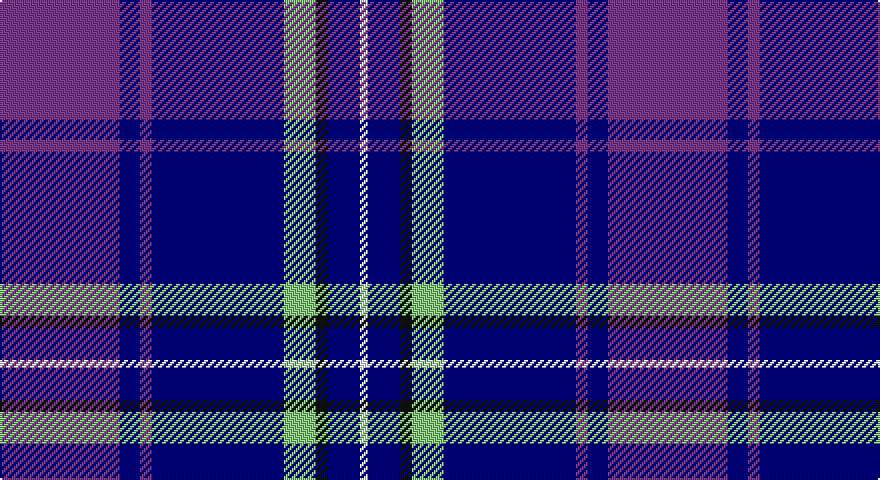

This page is one **sett** — a single exact thread-count. It belongs to the [tartan](/setts/p30db5p3db33lg8k3db8w2/)
(the same proportion at any scale), whose colour order is pattern [BBBBYKBW](/stripes/bbbbykbw/).

Sourced from register-of-tartans.  It is a [8 stripe tartan](/stripes/stripes8/).

Original link https://www.tartanregister.gov.uk/tartanDetails.aspx?ref=10441

## Register references

External register numbers recorded for this tartan.

- Scottish Register of Tartans: [10441](https://www.tartanregister.gov.uk/tartanDetails.aspx?ref=10441)

## Thread count
P/60 DB10 P6 DB66 LG16 K6 DB16 W/4

One full sett is **304 threads**.

## Palette

Palette: <strong>Tartan Register</strong> <small style="color:#888">(3 of 5 colours)</small>
<table><thead><tr><th>Colour</th><th>Threads</th><th>Shade</th><th>Base</th><th>OKLCh</th></tr></thead><tbody><tr><td>P/</td><td style="text-align:right;font-variant-numeric:tabular-nums">60</td><td><code style="background-color:#7A378B;">#7A378B</code> <small style="color:#888">#7A378B</small></td><td>B <code style="background-color:#2A418A;">#2A418A</code></td><td><small style="color:#888">oklch(46.2% 0.146 319.1)</small></td></tr><tr><td>DB</td><td style="text-align:right;font-variant-numeric:tabular-nums">10</td><td><code style="background-color:#000080;">#000080</code> <small style="color:#888">#000080</small></td><td>B <code style="background-color:#2A418A;">#2A418A</code></td><td><small style="color:#888">oklch(27.1% 0.188 264.1)</small></td></tr><tr><td>P</td><td style="text-align:right;font-variant-numeric:tabular-nums">6</td><td><code style="background-color:#7A378B;">#7A378B</code> <small style="color:#888">#7A378B</small></td><td>B <code style="background-color:#2A418A;">#2A418A</code></td><td><small style="color:#888">oklch(46.2% 0.146 319.1)</small></td></tr><tr><td>DB</td><td style="text-align:right;font-variant-numeric:tabular-nums">66</td><td><code style="background-color:#000080;">#000080</code> <small style="color:#888">#000080</small></td><td>B <code style="background-color:#2A418A;">#2A418A</code></td><td><small style="color:#888">oklch(27.1% 0.188 264.1)</small></td></tr><tr><td>LG</td><td style="text-align:right;font-variant-numeric:tabular-nums">16</td><td><code style="background-color:#86C67C;">#86C67C</code> <small style="color:#888">#86C67C</small></td><td>Y <code style="background-color:#F2BF00;">#F2BF00</code></td><td><small style="color:#888">oklch(76.5% 0.122 141.1)</small></td></tr><tr><td>K</td><td style="text-align:right;font-variant-numeric:tabular-nums">6</td><td><code style="background-color:#101010;">#101010</code> <small style="color:#888">#101010</small></td><td>K <code style="background-color:#000000;">#000000</code></td><td><small style="color:#888">oklch(17.3% 0.000 89.9)</small></td></tr><tr><td>DB</td><td style="text-align:right;font-variant-numeric:tabular-nums">16</td><td><code style="background-color:#000080;">#000080</code> <small style="color:#888">#000080</small></td><td>B <code style="background-color:#2A418A;">#2A418A</code></td><td><small style="color:#888">oklch(27.1% 0.188 264.1)</small></td></tr><tr><td>W/</td><td style="text-align:right;font-variant-numeric:tabular-nums">4</td><td><code style="background-color:#FFFFFF;">#FFFFFF</code> <small style="color:#888">#FFFFFF</small></td><td>W <code style="background-color:#F7F7F7;">#F7F7F7</code></td><td><small style="color:#888">oklch(100.0% 0.000 89.9)</small></td></tr></tbody></table>

# Sample pattern

## Nearest tartans

The nearest existing variants by ΔTartan distance, with this tartan at the top so the swatches line up against it.

ΔTartan

Tartan

Sett

—

<a href="/ttd/edit/#slug=p30db5p3db33lg8k3db8w2~x2">Saint Margaret of Scotland Youth Group</a> <a class="nn-out" href="/variants/s8/p30db5p3db33lg8k3db8w2~x2/" title="open its dictionary page">↗</a>

1.24

<a href="/ttd/edit/#slug=db4p2dp3db24b24w3~x2&amp;base=p30db5p3db33lg8k3db8w2~x2">Aberdeen Academy of Performing Arts</a> <a class="nn-out" href="/variants/s6/db4p2dp3db24b24w3~x2/" title="open its dictionary page">↗</a>

1.24

<a href="/variants/s6/g6ni16db49n14db2w6~x2/">Gorman Family (Canada) (Personal)</a>

1.34

<a href="/ttd/edit/#slug=ly6db3k3db36k10n18db6k2g4k3~x2&amp;base=p30db5p3db33lg8k3db8w2~x2">Dinwiddie Hunting</a> <a class="nn-out" href="/variants/s10/ly6db3k3db36k10n18db6k2g4k3~x2/" title="open its dictionary page">↗</a>

1.37

<a href="/ttd/edit/#slug=db6lb2db2lb3db16b26r2~x2&amp;base=p30db5p3db33lg8k3db8w2~x2">Federal Bureau of Investigation</a> <a class="nn-out" href="/variants/s7/db6lb2db2lb3db16b26r2~x2/" title="open its dictionary page">↗</a>

1.38

<a href="/variants/s9/db44k3ki20r3db8lg34db3db2lg15~x2/">US Air Force Reserve Pipe Band Military Tartan</a>

1.39

<a href="/ttd/edit/#slug=db7r3db26t2db2t26ly4~x2&amp;base=p30db5p3db33lg8k3db8w2~x2">Int. Police Association (Official)</a> <a class="nn-out" href="/variants/s7/db7r3db26t2db2t26ly4~x2/" title="open its dictionary page">↗</a>

1.39

<a href="/ttd/edit/#slug=db4dpi2dp3db24t24w3~x2&amp;base=p30db5p3db33lg8k3db8w2~x2">Aberdeen Academy of Performing Art</a> <a class="nn-out" href="/variants/s6/db4dpi2dp3db24t24w3~x2/" title="open its dictionary page">↗</a>

1.39

<a href="/ttd/edit/#slug=t14lb1t3lo2t3lb1t4db24r3~x4&amp;base=p30db5p3db33lg8k3db8w2~x2">Musselburgh</a> <a class="nn-out" href="/variants/s9/t14lb1t3lo2t3lb1t4db24r3~x4/" title="open its dictionary page">↗</a>

1.39

<a href="/ttd/edit/#slug=db40r3k10lo2lr15w2lr4~x2&amp;base=p30db5p3db33lg8k3db8w2~x2">U.S. Forces Thurso (Military)</a> <a class="nn-out" href="/variants/s7/db40r3k10lo2lr15w2lr4~x2/" title="open its dictionary page">↗</a>

1.41

<a href="/ttd/edit/#slug=db44lo3k20r3db8lg34db3db2lg15~x2&amp;base=p30db5p3db33lg8k3db8w2~x2">US Air Force Reserve Pipe Band</a> <a class="nn-out" href="/variants/s9/db44lo3k20r3db8lg34db3db2lg15~x2/" title="open its dictionary page">↗</a>

## Neighbour map

Every grey dot is one of 14360 variants placed by the first two principal components of the ΔTartan feature space (44% of its variance). Red is this tartan; blue dots are its nearest — click one to open its page.

<svg viewBox="0 0 640 380" role="img" style="max-width:100%;height:auto;border:1px solid #e0e0e0;border-radius:4px;display:block" xmlns="http://www.w3.org/2000/svg"><image href="/nn/cloud.v1.png" width="640" height="380"/><a href="/variants/s6/db4p2dp3db24b24w3~x2/"><circle cx="264.3" cy="188.9" r="4" fill="#3465a4"><title>Aberdeen Academy of Performing Arts</title></circle></a><a href="/variants/s6/g6ni16db49n14db2w6~x2/"><circle cx="305.6" cy="159.9" r="4" fill="#3465a4"><title>Gorman Family (Canada) (Personal)</title></circle></a><a href="/variants/s10/ly6db3k3db36k10n18db6k2g4k3~x2/"><circle cx="237.8" cy="134.0" r="4" fill="#3465a4"><title>Dinwiddie Hunting</title></circle></a><a href="/variants/s7/db6lb2db2lb3db16b26r2~x2/"><circle cx="288.2" cy="191.5" r="4" fill="#3465a4"><title>Federal Bureau of Investigation</title></circle></a><a href="/variants/s9/db44k3ki20r3db8lg34db3db2lg15~x2/"><circle cx="230.4" cy="139.9" r="4" fill="#3465a4"><title>US Air Force Reserve Pipe Band Military Tartan</title></circle></a><a href="/variants/s7/db7r3db26t2db2t26ly4~x2/"><circle cx="288.1" cy="180.6" r="4" fill="#3465a4"><title>Int. Police Association (Official)</title></circle></a><a href="/variants/s6/db4dpi2dp3db24t24w3~x2/"><circle cx="265.6" cy="184.4" r="4" fill="#3465a4"><title>Aberdeen Academy of Performing Art</title></circle></a><a href="/variants/s9/t14lb1t3lo2t3lb1t4db24r3~x4/"><circle cx="273.4" cy="123.2" r="4" fill="#3465a4"><title>Musselburgh</title></circle></a><a href="/variants/s7/db40r3k10lo2lr15w2lr4~x2/"><circle cx="259.3" cy="121.2" r="4" fill="#3465a4"><title>U.S. Forces Thurso (Military)</title></circle></a><a href="/variants/s9/db44lo3k20r3db8lg34db3db2lg15~x2/"><circle cx="230.8" cy="139.2" r="4" fill="#3465a4"><title>US Air Force Reserve Pipe Band</title></circle></a><circle cx="279.6" cy="157.8" r="5" fill="#c00000"/></svg>

ID: /variants/s8/p30db5p3db33lg8k3db8w2~x2/
