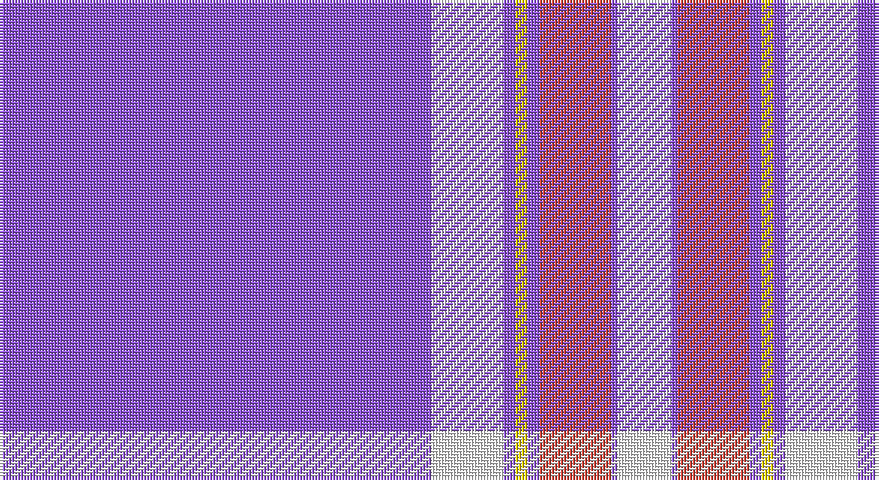

This page is one **sett** — a single exact thread-count. It belongs to the [tartan](/setts/p72w12p2ly2p2r12p1w9/)
(the same proportion at any scale), whose colour order is pattern [BWBYBRBW](/stripes/bwbybrbw/).

Sourced from tartans-authority.  It is a [8 stripe tartan](/stripes/stripes8/).

Original link http://www.tartansauthority.com/tartan-ferret/display/8586/

## Register references

External register numbers recorded for this tartan.

- Scottish Tartans Authority (ITI): 8586

## Thread count
P/144 W24 P4 Y4 P4 R24 P2 W/18

One full sett is **286 threads**.

## Palette

Palette: <strong>Tartan Register</strong> <small style="color:#888">(3 of 4 colours)</small>
<table><thead><tr><th>Colour</th><th>Threads</th><th>Shade</th><th>Base</th><th>OKLCh</th></tr></thead><tbody><tr><td>P/</td><td style="text-align:right;font-variant-numeric:tabular-nums">144</td><td><code style="background-color:#9058D8;">#9058D8</code> <small style="color:#888">#9058D8</small></td><td>B <code style="background-color:#2A418A;">#2A418A</code></td><td><small style="color:#888">oklch(58.4% 0.190 300.8)</small></td></tr><tr><td>W</td><td style="text-align:right;font-variant-numeric:tabular-nums">24</td><td><code style="background-color:#FCFCFC;">#FCFCFC</code> <small style="color:#888">#FCFCFC</small></td><td>W <code style="background-color:#F7F7F7;">#F7F7F7</code></td><td><small style="color:#888">oklch(99.1% 0.000 89.9)</small></td></tr><tr><td>P</td><td style="text-align:right;font-variant-numeric:tabular-nums">4</td><td><code style="background-color:#9058D8;">#9058D8</code> <small style="color:#888">#9058D8</small></td><td>B <code style="background-color:#2A418A;">#2A418A</code></td><td><small style="color:#888">oklch(58.4% 0.190 300.8)</small></td></tr><tr><td>Y</td><td style="text-align:right;font-variant-numeric:tabular-nums">4</td><td><code style="background-color:#FCCC00;">#FCCC00</code> <small style="color:#888">#FCCC00</small></td><td>Y <code style="background-color:#F2BF00;">#F2BF00</code></td><td><small style="color:#888">oklch(86.2% 0.176 91.5)</small></td></tr><tr><td>P</td><td style="text-align:right;font-variant-numeric:tabular-nums">4</td><td><code style="background-color:#9058D8;">#9058D8</code> <small style="color:#888">#9058D8</small></td><td>B <code style="background-color:#2A418A;">#2A418A</code></td><td><small style="color:#888">oklch(58.4% 0.190 300.8)</small></td></tr><tr><td>R</td><td style="text-align:right;font-variant-numeric:tabular-nums">24</td><td><code style="background-color:#CC4438;">#CC4438</code> <small style="color:#888">#CC4438</small></td><td>R <code style="background-color:#CC0000;">#CC0000</code></td><td><small style="color:#888">oklch(57.7% 0.174 28.7)</small></td></tr><tr><td>P</td><td style="text-align:right;font-variant-numeric:tabular-nums">2</td><td><code style="background-color:#9058D8;">#9058D8</code> <small style="color:#888">#9058D8</small></td><td>B <code style="background-color:#2A418A;">#2A418A</code></td><td><small style="color:#888">oklch(58.4% 0.190 300.8)</small></td></tr><tr><td>W/</td><td style="text-align:right;font-variant-numeric:tabular-nums">18</td><td><code style="background-color:#FCFCFC;">#FCFCFC</code> <small style="color:#888">#FCFCFC</small></td><td>W <code style="background-color:#F7F7F7;">#F7F7F7</code></td><td><small style="color:#888">oklch(99.1% 0.000 89.9)</small></td></tr></tbody></table>

# Sample pattern

## Nearest tartans

The nearest existing variants by ΔTartan distance, with this tartan at the top so the swatches line up against it.

ΔTartan

Tartan

Sett

—

<a href="/ttd/edit/#slug=p72w12p2ly2p2r12p1w9~x2">Tennessee Pioneer Blanket</a> <a class="nn-out" href="/variants/s8/p72w12p2ly2p2r12p1w9~x2/" title="open its dictionary page">↗</a>

1.82

<a href="/ttd/edit/#slug=dp2g3lp21dp42w1g2~x2&amp;base=p72w12p2ly2p2r12p1w9~x2">SiMBA</a> <a class="nn-out" href="/variants/s6/dp2g3lp21dp42w1g2~x2/" title="open its dictionary page">↗</a>

1.95

<a href="/ttd/edit/#slug=dp120w10k4w11k3w5k3w19&amp;base=p72w12p2ly2p2r12p1w9~x2">Menzies Mauve and White</a> <a class="nn-out" href="/variants/s8/dp120w10k4w11k3w5k3w19/" title="open its dictionary page">↗</a>

2.01

<a href="/ttd/edit/#slug=p120w10k4w11k3w5k3w19&amp;base=p72w12p2ly2p2r12p1w9~x2">Menzies, Mauve and White</a> <a class="nn-out" href="/variants/s8/p120w10k4w11k3w5k3w19/" title="open its dictionary page">↗</a>

2.23

<a href="/ttd/edit/#slug=w3db1w30db1p28w1p1w3~x2&amp;base=p72w12p2ly2p2r12p1w9~x2">Dunlop, dress</a> <a class="nn-out" href="/variants/s8/w3db1w30db1p28w1p1w3~x2/" title="open its dictionary page">↗</a>

2.47

<a href="/ttd/edit/#slug=db28o3w1o3db4w2p1w5~x4&amp;base=p72w12p2ly2p2r12p1w9~x2">Baker</a> <a class="nn-out" href="/variants/s8/db28o3w1o3db4w2p1w5~x4/" title="open its dictionary page">↗</a>

2.48

<a href="/ttd/edit/#slug=db28ly3w1ly3db4w2r1w5~x4&amp;base=p72w12p2ly2p2r12p1w9~x2">Baker Dress Family Tartan</a> <a class="nn-out" href="/variants/s8/db28ly3w1ly3db4w2r1w5~x4/" title="open its dictionary page">↗</a>

2.49

<a href="/ttd/edit/#slug=w3db1w30db1dp28w1dp1w3~x2&amp;base=p72w12p2ly2p2r12p1w9~x2">Dunlop Dress</a> <a class="nn-out" href="/variants/s8/w3db1w30db1dp28w1dp1w3~x2/" title="open its dictionary page">↗</a>

2.52

<a href="/ttd/edit/#slug=oii32dp8oii1dp1w1oii1w1o1oii1dp1oi1oii4dp1~x4&amp;base=p72w12p2ly2p2r12p1w9~x2">Florence (Fashion)</a> <a class="nn-out" href="/variants/s13/oii32dp8oii1dp1w1oii1w1o1oii1dp1oi1oii4dp1~x4/" title="open its dictionary page">↗</a>

2.52

<a href="/ttd/edit/#slug=g5ly2dp40w1db15w1db1w1~x2&amp;base=p72w12p2ly2p2r12p1w9~x2">Jackson (Personal)</a> <a class="nn-out" href="/variants/s8/g5ly2dp40w1db15w1db1w1~x2/" title="open its dictionary page">↗</a>

2.52

<a href="/ttd/edit/#slug=p30k5r2k1r10w1r1w1k3w2~x4&amp;base=p72w12p2ly2p2r12p1w9~x2">Masai Shuka 11 (Artefact)</a> <a class="nn-out" href="/variants/s10/p30k5r2k1r10w1r1w1k3w2~x4/" title="open its dictionary page">↗</a>

## Neighbour map

Every grey dot is one of 14360 variants placed by the first two principal components of the ΔTartan feature space (44% of its variance). Red is this tartan; blue dots are its nearest — click one to open its page.

<svg viewBox="0 0 640 380" role="img" style="max-width:100%;height:auto;border:1px solid #e0e0e0;border-radius:4px;display:block" xmlns="http://www.w3.org/2000/svg"><image href="/nn/cloud.v1.png" width="640" height="380"/><a href="/variants/s6/dp2g3lp21dp42w1g2~x2/"><circle cx="440.6" cy="122.2" r="4" fill="#3465a4"><title>SiMBA</title></circle></a><a href="/variants/s8/dp120w10k4w11k3w5k3w19/"><circle cx="474.4" cy="99.5" r="4" fill="#3465a4"><title>Menzies Mauve and White</title></circle></a><a href="/variants/s8/p120w10k4w11k3w5k3w19/"><circle cx="478.5" cy="92.0" r="4" fill="#3465a4"><title>Menzies, Mauve and White</title></circle></a><a href="/variants/s8/w3db1w30db1p28w1p1w3~x2/"><circle cx="375.1" cy="107.8" r="4" fill="#3465a4"><title>Dunlop, dress</title></circle></a><a href="/variants/s8/db28o3w1o3db4w2p1w5~x4/"><circle cx="434.7" cy="125.4" r="4" fill="#3465a4"><title>Baker</title></circle></a><a href="/variants/s8/db28ly3w1ly3db4w2r1w5~x4/"><circle cx="411.7" cy="112.9" r="4" fill="#3465a4"><title>Baker Dress Family Tartan</title></circle></a><a href="/variants/s8/w3db1w30db1dp28w1dp1w3~x2/"><circle cx="361.3" cy="101.7" r="4" fill="#3465a4"><title>Dunlop Dress</title></circle></a><a href="/variants/s13/oii32dp8oii1dp1w1oii1w1o1oii1dp1oi1oii4dp1~x4/"><circle cx="523.3" cy="79.1" r="4" fill="#3465a4"><title>Florence (Fashion)</title></circle></a><a href="/variants/s8/g5ly2dp40w1db15w1db1w1~x2/"><circle cx="415.2" cy="95.0" r="4" fill="#3465a4"><title>Jackson (Personal)</title></circle></a><a href="/variants/s10/p30k5r2k1r10w1r1w1k3w2~x4/"><circle cx="342.6" cy="88.6" r="4" fill="#3465a4"><title>Masai Shuka 11 (Artefact)</title></circle></a><circle cx="474.9" cy="81.5" r="5" fill="#c00000"/></svg>

ID: /variants/s8/p72w12p2ly2p2r12p1w9~x2/
