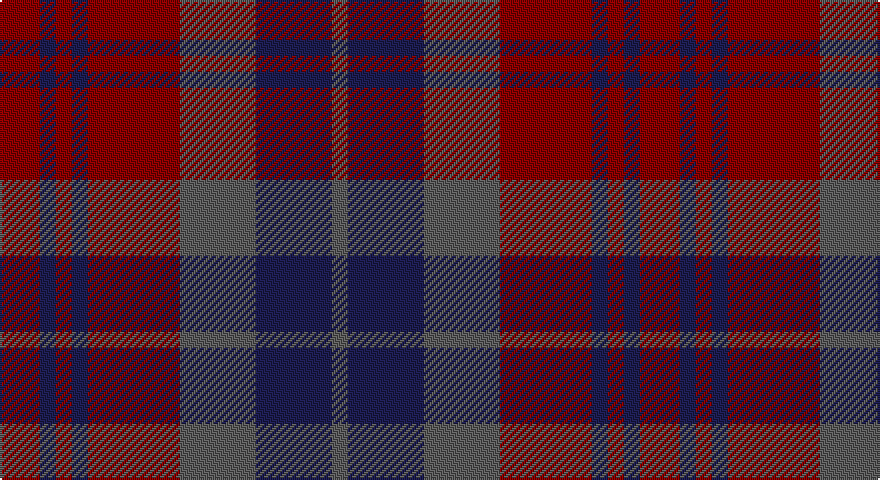

This page is one **sett** — a single exact thread-count. It belongs to the [tartan](/setts/r10db4r4db4r23n19db19n4/)
(the same proportion at any scale), whose colour order is pattern [BBBRBRBR](/stripes/bbbrbrbr/).

Part of the [Chindecella Ruadh](/tartans/chindecella-ruadh/) tartan — the named design grouping this sett with its other cloths.

Sourced from tartans-authority.  It is a [8 stripe tartan](/stripes/stripes8/).

Original link http://www.tartansauthority.com/tartan-ferret/display/10253/

## Register references

External register numbers recorded for this tartan.

- Scottish Register of Tartans: [10253](https://www.tartanregister.gov.uk/tartanDetails?ref=10253)
- Scottish Tartans Authority (ITI): 10253

## Thread count
DR/20 DB8 DR8 DB8 DR46 N38 DB38 N/8

One full sett is **320 threads**.

## Palette

Palette: <strong>Tartan Register</strong> <small style="color:#888">(2 of 3 colours)</small>
<table><thead><tr><th>Colour</th><th>Threads</th><th>Shade</th><th>Base</th><th>OKLCh</th></tr></thead><tbody><tr><td>DR/</td><td style="text-align:right;font-variant-numeric:tabular-nums">20</td><td><code style="background-color:#880000;">#880000</code> <small style="color:#888">#880000</small></td><td>R <code style="background-color:#CC0000;">#CC0000</code></td><td><small style="color:#888">oklch(39.4% 0.162 29.2)</small></td></tr><tr><td>DB</td><td style="text-align:right;font-variant-numeric:tabular-nums">8</td><td><code style="background-color:#1C1C50;">#1C1C50</code> <small style="color:#888">#1C1C50</small></td><td>B <code style="background-color:#2A418A;">#2A418A</code></td><td><small style="color:#888">oklch(26.2% 0.093 277.9)</small></td></tr><tr><td>DR</td><td style="text-align:right;font-variant-numeric:tabular-nums">8</td><td><code style="background-color:#880000;">#880000</code> <small style="color:#888">#880000</small></td><td>R <code style="background-color:#CC0000;">#CC0000</code></td><td><small style="color:#888">oklch(39.4% 0.162 29.2)</small></td></tr><tr><td>DB</td><td style="text-align:right;font-variant-numeric:tabular-nums">8</td><td><code style="background-color:#1C1C50;">#1C1C50</code> <small style="color:#888">#1C1C50</small></td><td>B <code style="background-color:#2A418A;">#2A418A</code></td><td><small style="color:#888">oklch(26.2% 0.093 277.9)</small></td></tr><tr><td>DR</td><td style="text-align:right;font-variant-numeric:tabular-nums">46</td><td><code style="background-color:#880000;">#880000</code> <small style="color:#888">#880000</small></td><td>R <code style="background-color:#CC0000;">#CC0000</code></td><td><small style="color:#888">oklch(39.4% 0.162 29.2)</small></td></tr><tr><td>N</td><td style="text-align:right;font-variant-numeric:tabular-nums">38</td><td><code style="background-color:#5C5C5C;">#5C5C5C</code> <small style="color:#888">#5C5C5C</small></td><td>B <code style="background-color:#2A418A;">#2A418A</code></td><td><small style="color:#888">oklch(47.5% 0.000 89.9)</small></td></tr><tr><td>DB</td><td style="text-align:right;font-variant-numeric:tabular-nums">38</td><td><code style="background-color:#1C1C50;">#1C1C50</code> <small style="color:#888">#1C1C50</small></td><td>B <code style="background-color:#2A418A;">#2A418A</code></td><td><small style="color:#888">oklch(26.2% 0.093 277.9)</small></td></tr><tr><td>N/</td><td style="text-align:right;font-variant-numeric:tabular-nums">8</td><td><code style="background-color:#5C5C5C;">#5C5C5C</code> <small style="color:#888">#5C5C5C</small></td><td>B <code style="background-color:#2A418A;">#2A418A</code></td><td><small style="color:#888">oklch(47.5% 0.000 89.9)</small></td></tr></tbody></table>

# Sample pattern

## Compared to the master

This cloth is one sett of its design; the master sett (the exemplar the design is anchored on) is below for comparison.

<figure style="margin:0"><figcaption style="color:#888;font-size:smaller">this sett</figcaption></figure>
<figure style="margin:0"><figcaption style="color:#888;font-size:smaller"><a href="/setts/dr9do4dr4do4dr24dy19do19dy4/">master sett →</a></figcaption></figure>

## Nearest tartans

The nearest existing variants by ΔTartan distance, with this tartan at the top so the swatches line up against it.

ΔTartan

Tartan

Sett

—

<a href="/ttd/edit/#slug=r10db4r4db4r23n19db19n4~x2">Chindecella Ruadh (Personal)</a> <a class="nn-out" href="/variants/s8/r10db4r4db4r23n19db19n4~x2/" title="open its dictionary page">↗</a>

1.36

<a href="/ttd/edit/#slug=dp3dg14r2dp10dg2r14dp3~x2&amp;base=r10db4r4db4r23n19db19n4~x2">Scottish Netball Association</a> <a class="nn-out" href="/variants/s7/dp3dg14r2dp10dg2r14dp3~x2/" title="open its dictionary page">↗</a>

1.38

<a href="/ttd/edit/#slug=o9do4o4do4o24dy19do19dy4~x2&amp;base=r10db4r4db4r23n19db19n4~x2">Chindecella Gorse (Kemete Heil)</a> <a class="nn-out" href="/variants/s8/o9do4o4do4o24dy19do19dy4~x2/" title="open its dictionary page">↗</a>

1.42

<a href="/ttd/edit/#slug=r3dp14dg14dp2r14dp2r14dg14dp2ly3~x2&amp;base=r10db4r4db4r23n19db19n4~x2">Clare, County</a> <a class="nn-out" href="/variants/s10/r3dp14dg14dp2r14dp2r14dg14dp2ly3~x2/" title="open its dictionary page">↗</a>

1.47

<a href="/ttd/edit/#slug=dp3g14m2dp10g2m14dp3~x2&amp;base=r10db4r4db4r23n19db19n4~x2">Scottish Netball (1986) (Corporate)</a> <a class="nn-out" href="/variants/s7/dp3g14m2dp10g2m14dp3~x2/" title="open its dictionary page">↗</a>

1.58

<a href="/ttd/edit/#slug=r2db13ri3db3ri16t2~x4&amp;base=r10db4r4db4r23n19db19n4~x2">MacArthur-Fox, dress</a> <a class="nn-out" href="/variants/s6/r2db13ri3db3ri16t2~x4/" title="open its dictionary page">↗</a>

1.59

<a href="/ttd/edit/#slug=dg14k5db2r21dg18k4db18r9k2r12&amp;base=r10db4r4db4r23n19db19n4~x2">Ruben Delanghe (Personal)</a> <a class="nn-out" href="/variants/s10/dg14k5db2r21dg18k4db18r9k2r12/" title="open its dictionary page">↗</a>

1.60

<a href="/ttd/edit/#slug=dg24db3dg3db3dg3db9m24dg3m4~x2&amp;base=r10db4r4db4r23n19db19n4~x2">Lindsay (Chisholm Red)</a> <a class="nn-out" href="/variants/s9/dg24db3dg3db3dg3db9m24dg3m4~x2/" title="open its dictionary page">↗</a>

1.62

<a href="/ttd/edit/#slug=dg24dt3dg3dt3dg3dt9m24dg3m4~x2&amp;base=r10db4r4db4r23n19db19n4~x2">Lindsay</a> <a class="nn-out" href="/variants/s9/dg24dt3dg3dt3dg3dt9m24dg3m4~x2/" title="open its dictionary page">↗</a>

1.63

<a href="/ttd/edit/#slug=r5o3r19dr6o5dr6n12n5n12n3~x2&amp;base=r10db4r4db4r23n19db19n4~x2">Roscommon</a> <a class="nn-out" href="/variants/s10/r5o3r19dr6o5dr6n12n5n12n3~x2/" title="open its dictionary page">↗</a>

1.68

<a href="/ttd/edit/#slug=dr8k5dr8dg27dr13dg3dr13o27dr8o3dr3~x2&amp;base=r10db4r4db4r23n19db19n4~x2">McCall/MacCall</a> <a class="nn-out" href="/variants/s11/dr8k5dr8dg27dr13dg3dr13o27dr8o3dr3~x2/" title="open its dictionary page">↗</a>

## Neighbour map

Every grey dot is one of 14360 variants placed by the first two principal components of the ΔTartan feature space (44% of its variance). Red is this tartan; blue dots are its nearest — click one to open its page.

<svg viewBox="0 0 640 380" role="img" style="max-width:100%;height:auto;border:1px solid #e0e0e0;border-radius:4px;display:block" xmlns="http://www.w3.org/2000/svg"><image href="/nn/cloud.v1.png" width="640" height="380"/><a href="/variants/s7/dp3dg14r2dp10dg2r14dp3~x2/"><circle cx="243.4" cy="257.6" r="4" fill="#3465a4"><title>Scottish Netball Association</title></circle></a><a href="/variants/s8/o9do4o4do4o24dy19do19dy4~x2/"><circle cx="281.2" cy="274.7" r="4" fill="#3465a4"><title>Chindecella Gorse (Kemete Heil)</title></circle></a><a href="/variants/s10/r3dp14dg14dp2r14dp2r14dg14dp2ly3~x2/"><circle cx="232.0" cy="237.3" r="4" fill="#3465a4"><title>Clare, County</title></circle></a><a href="/variants/s7/dp3g14m2dp10g2m14dp3~x2/"><circle cx="239.4" cy="251.1" r="4" fill="#3465a4"><title>Scottish Netball (1986) (Corporate)</title></circle></a><a href="/variants/s6/r2db13ri3db3ri16t2~x4/"><circle cx="347.6" cy="245.6" r="4" fill="#3465a4"><title>MacArthur-Fox, dress</title></circle></a><a href="/variants/s10/dg14k5db2r21dg18k4db18r9k2r12/"><circle cx="242.7" cy="232.7" r="4" fill="#3465a4"><title>Ruben Delanghe (Personal)</title></circle></a><a href="/variants/s9/dg24db3dg3db3dg3db9m24dg3m4~x2/"><circle cx="342.1" cy="251.9" r="4" fill="#3465a4"><title>Lindsay (Chisholm Red)</title></circle></a><a href="/variants/s9/dg24dt3dg3dt3dg3dt9m24dg3m4~x2/"><circle cx="336.5" cy="248.7" r="4" fill="#3465a4"><title>Lindsay</title></circle></a><a href="/variants/s10/r5o3r19dr6o5dr6n12n5n12n3~x2/"><circle cx="231.8" cy="236.8" r="4" fill="#3465a4"><title>Roscommon</title></circle></a><a href="/variants/s11/dr8k5dr8dg27dr13dg3dr13o27dr8o3dr3~x2/"><circle cx="265.3" cy="215.3" r="4" fill="#3465a4"><title>McCall/MacCall</title></circle></a><circle cx="290.5" cy="278.6" r="5" fill="#c00000"/></svg>

ID: /variants/s8/r10db4r4db4r23n19db19n4~x2/
