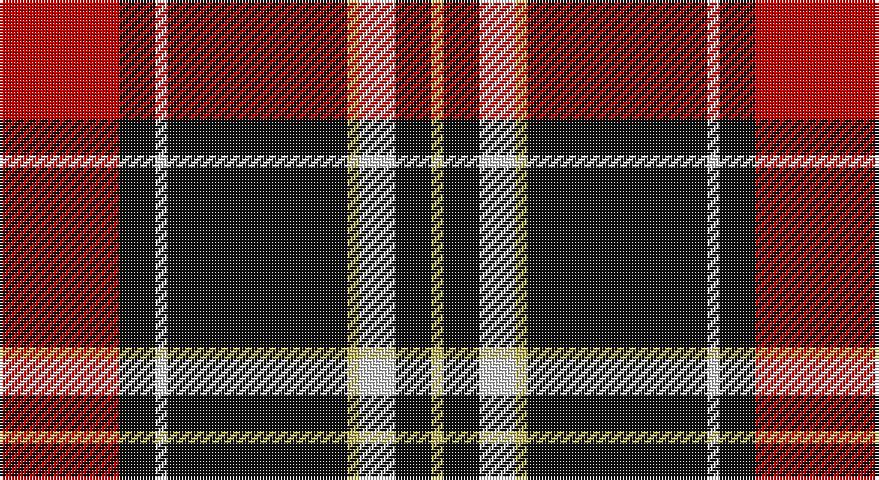

This page is one **sett** — a single exact thread-count. It belongs to the [tartan](/setts/r10k3w1k15ly1w3k3ly1/)
(the same proportion at any scale), whose colour order is pattern [RKWKYWKY](/stripes/rkwkywky/).

Sourced from register-of-tartans.  It is a [8 stripe tartan](/stripes/stripes8/).

Original link https://www.tartanregister.gov.uk/tartanDetails.aspx?ref=11296

## Provenance

Earliest known date: 2015 The Cunard on the Clyde tartan has been created to celebrate the historical link between the Cunard and the Clyde as part of the Cunard's 175th anniversary celebrations. It was presented to Cunard by Peel Ports on May 21st 2015.

## Also known as

This cloth is also recorded under:

- Cunard o' the Clyde

2 attestations — the source records this cloth was collapsed from (oldest owns this page)

<ul>
<li>15/05/2015 — Cunard o' the Clyde (register-of-tartans, <a href="https://www.tartanregister.gov.uk/tartanDetails.aspx?ref=11296">record</a>)</li>
<li>undated — Cunard O' The Clyde Corporate Tartan (house-of-tartan, <a href="http://www.house-of-tartan.scotland.net/house/TartanViewjs.asp?colr=Def&tnam=11296">record</a>)</li>
</ul>

## Register references

External register numbers recorded for this tartan.

- Scottish Register of Tartans: [11296](https://www.tartanregister.gov.uk/tartanDetails.aspx?ref=11296)

## Thread count
R/40 K12 LN4 K60 LG4 LN12 K12 LG/4

One full sett is **252 threads**.

## Palette

Palette: <strong>Tartan Register</strong>
<table><thead><tr><th>Colour</th><th>Threads</th><th>Shade</th><th>Base</th><th>OKLCh</th></tr></thead><tbody><tr><td>R/</td><td style="text-align:right;font-variant-numeric:tabular-nums">40</td><td><code style="background-color:#C80000;">#C80000</code> <small style="color:#888">#C80000</small></td><td>R <code style="background-color:#CC0000;">#CC0000</code></td><td><small style="color:#888">oklch(52.3% 0.215 29.2)</small></td></tr><tr><td>K</td><td style="text-align:right;font-variant-numeric:tabular-nums">12</td><td><code style="background-color:#101010;">#101010</code> <small style="color:#888">#101010</small></td><td>K <code style="background-color:#000000;">#000000</code></td><td><small style="color:#888">oklch(17.3% 0.000 89.9)</small></td></tr><tr><td>LN</td><td style="text-align:right;font-variant-numeric:tabular-nums">4</td><td><code style="background-color:#E0E0E0;">#E0E0E0</code> <small style="color:#888">#E0E0E0</small></td><td>W <code style="background-color:#F7F7F7;">#F7F7F7</code></td><td><small style="color:#888">oklch(90.7% 0.000 89.9)</small></td></tr><tr><td>K</td><td style="text-align:right;font-variant-numeric:tabular-nums">60</td><td><code style="background-color:#101010;">#101010</code> <small style="color:#888">#101010</small></td><td>K <code style="background-color:#000000;">#000000</code></td><td><small style="color:#888">oklch(17.3% 0.000 89.9)</small></td></tr><tr><td>LG</td><td style="text-align:right;font-variant-numeric:tabular-nums">4</td><td><code style="background-color:#C4BC68;">#C4BC68</code> <small style="color:#888">#C4BC68</small></td><td>Y <code style="background-color:#F2BF00;">#F2BF00</code></td><td><small style="color:#888">oklch(78.4% 0.107 103.7)</small></td></tr><tr><td>LN</td><td style="text-align:right;font-variant-numeric:tabular-nums">12</td><td><code style="background-color:#E0E0E0;">#E0E0E0</code> <small style="color:#888">#E0E0E0</small></td><td>W <code style="background-color:#F7F7F7;">#F7F7F7</code></td><td><small style="color:#888">oklch(90.7% 0.000 89.9)</small></td></tr><tr><td>K</td><td style="text-align:right;font-variant-numeric:tabular-nums">12</td><td><code style="background-color:#101010;">#101010</code> <small style="color:#888">#101010</small></td><td>K <code style="background-color:#000000;">#000000</code></td><td><small style="color:#888">oklch(17.3% 0.000 89.9)</small></td></tr><tr><td>LG/</td><td style="text-align:right;font-variant-numeric:tabular-nums">4</td><td><code style="background-color:#C4BC68;">#C4BC68</code> <small style="color:#888">#C4BC68</small></td><td>Y <code style="background-color:#F2BF00;">#F2BF00</code></td><td><small style="color:#888">oklch(78.4% 0.107 103.7)</small></td></tr></tbody></table>

# Sample pattern

## Nearest tartans

The nearest existing variants by ΔTartan distance, with this tartan at the top so the swatches line up against it.

ΔTartan

Tartan

Sett

—

<a href="/ttd/edit/#slug=r10k3w1k15ly1w3k3ly1~x4">Cunard o' the Clyde</a> <a class="nn-out" href="/variants/s8/r10k3w1k15ly1w3k3ly1~x4/" title="open its dictionary page">↗</a>

1.00

<a href="/ttd/edit/#slug=o1k1o11k1o5k1oi3k5w2oi1~x4&amp;base=r10k3w1k15ly1w3k3ly1~x4">Braemar, or Blair Atholl</a> <a class="nn-out" href="/variants/s10/o1k1o11k1o5k1oi3k5w2oi1~x4/" title="open its dictionary page">↗</a>

1.05

<a href="/ttd/edit/#slug=k43r10w3k3w15db3~x2&amp;base=r10k3w1k15ly1w3k3ly1~x4">Bro-Wened</a> <a class="nn-out" href="/variants/s6/k43r10w3k3w15db3~x2/" title="open its dictionary page">↗</a>

1.08

<a href="/ttd/edit/#slug=r6k3w3k3w3k34r6g5r6k5~x2&amp;base=r10k3w1k15ly1w3k3ly1~x4">Woodberry Forest School (Corporate)</a> <a class="nn-out" href="/variants/s10/r6k3w3k3w3k34r6g5r6k5~x2/" title="open its dictionary page">↗</a>

1.10

<a href="/ttd/edit/#slug=ly2k2r2w8k14r1k1r1k1r1~x2&amp;base=r10k3w1k15ly1w3k3ly1~x4">Barbecue Plaid (Fashion)</a> <a class="nn-out" href="/variants/s10/ly2k2r2w8k14r1k1r1k1r1~x2/" title="open its dictionary page">↗</a>

1.12

<a href="/ttd/edit/#slug=r12k2w8k4n16r2k31n2&amp;base=r10k3w1k15ly1w3k3ly1~x4">Distripress Annual Congress 2012</a> <a class="nn-out" href="/variants/s8/r12k2w8k4n16r2k31n2/" title="open its dictionary page">↗</a>

1.17

<a href="/ttd/edit/#slug=w3dr10k38o11dr6k2w3~x2&amp;base=r10k3w1k15ly1w3k3ly1~x4">Phantom (Corporate)</a> <a class="nn-out" href="/variants/s7/w3dr10k38o11dr6k2w3~x2/" title="open its dictionary page">↗</a>

1.20

<a href="/ttd/edit/#slug=r10k15g2k2w1k1w1~x4&amp;base=r10k3w1k15ly1w3k3ly1~x4">Ikelman No 4</a> <a class="nn-out" href="/variants/s7/r10k15g2k2w1k1w1~x4/" title="open its dictionary page">↗</a>

1.21

<a href="/ttd/edit/#slug=do1lr2k5do3k1o4k1o10k1o1~x4&amp;base=r10k3w1k15ly1w3k3ly1~x4">Campbell 'Camel'</a> <a class="nn-out" href="/variants/s10/do1lr2k5do3k1o4k1o10k1o1~x4/" title="open its dictionary page">↗</a>

1.22

<a href="/variants/s7/w3o10k38wi11o6k2w3~x2/">Phantom</a>

1.23

<a href="/ttd/edit/#slug=k24db2k24db14ly3r36k18ly5r3~x2&amp;base=r10k3w1k15ly1w3k3ly1~x4">Craigholme (Corporate)</a> <a class="nn-out" href="/variants/s9/k24db2k24db14ly3r36k18ly5r3~x2/" title="open its dictionary page">↗</a>

## Neighbour map

Every grey dot is one of 14360 variants placed by the first two principal components of the ΔTartan feature space (44% of its variance). Red is this tartan; blue dots are its nearest — click one to open its page.

<svg viewBox="0 0 640 380" role="img" style="max-width:100%;height:auto;border:1px solid #e0e0e0;border-radius:4px;display:block" xmlns="http://www.w3.org/2000/svg"><image href="/nn/cloud.v1.png" width="640" height="380"/><a href="/variants/s10/o1k1o11k1o5k1oi3k5w2oi1~x4/"><circle cx="269.5" cy="160.2" r="4" fill="#3465a4"><title>Braemar, or Blair Atholl</title></circle></a><a href="/variants/s6/k43r10w3k3w15db3~x2/"><circle cx="316.3" cy="163.0" r="4" fill="#3465a4"><title>Bro-Wened</title></circle></a><a href="/variants/s10/r6k3w3k3w3k34r6g5r6k5~x2/"><circle cx="324.7" cy="150.8" r="4" fill="#3465a4"><title>Woodberry Forest School (Corporate)</title></circle></a><a href="/variants/s10/ly2k2r2w8k14r1k1r1k1r1~x2/"><circle cx="270.4" cy="127.7" r="4" fill="#3465a4"><title>Barbecue Plaid (Fashion)</title></circle></a><a href="/variants/s8/r12k2w8k4n16r2k31n2/"><circle cx="237.0" cy="151.0" r="4" fill="#3465a4"><title>Distripress Annual Congress 2012</title></circle></a><a href="/variants/s7/w3dr10k38o11dr6k2w3~x2/"><circle cx="314.2" cy="157.6" r="4" fill="#3465a4"><title>Phantom (Corporate)</title></circle></a><a href="/variants/s7/r10k15g2k2w1k1w1~x4/"><circle cx="317.4" cy="159.6" r="4" fill="#3465a4"><title>Ikelman No 4</title></circle></a><a href="/variants/s10/do1lr2k5do3k1o4k1o10k1o1~x4/"><circle cx="240.8" cy="162.8" r="4" fill="#3465a4"><title>Campbell 'Camel'</title></circle></a><a href="/variants/s7/w3o10k38wi11o6k2w3~x2/"><circle cx="285.9" cy="140.9" r="4" fill="#3465a4"><title>Phantom</title></circle></a><a href="/variants/s9/k24db2k24db14ly3r36k18ly5r3~x2/"><circle cx="275.7" cy="169.0" r="4" fill="#3465a4"><title>Craigholme (Corporate)</title></circle></a><circle cx="302.4" cy="152.8" r="5" fill="#c00000"/></svg>

ID: /variants/s8/r10k3w1k15ly1w3k3ly1~x4/
