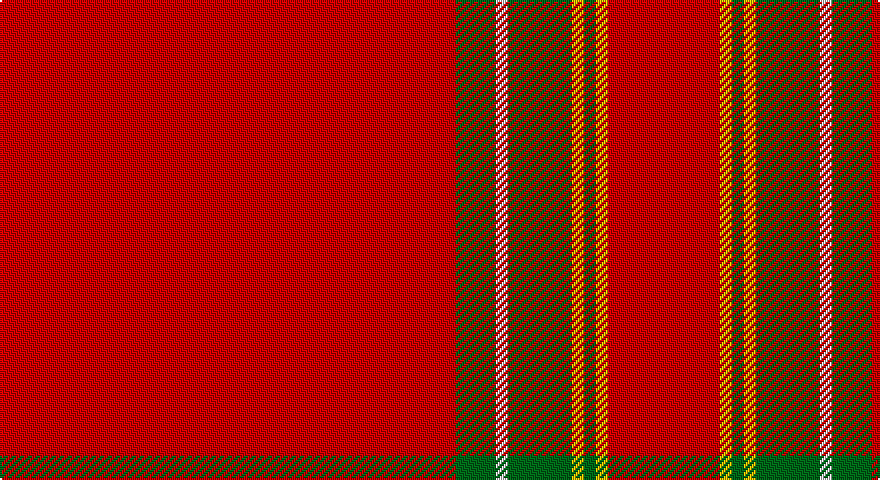

This page is one **sett** — a single exact thread-count. It belongs to the [tartan](/setts/r114g10w3g16ly3g3ly3r28/)
(the same proportion at any scale), whose colour order is pattern [RGWGYGYR](/stripes/rgwgygyr/).

Part of the [Duke of Sussex](/tartans/duke-of-sussex/) tartan — the named design grouping this sett with its other cloths.

Sourced from logan-1831.  It is a [8 stripe tartan](/stripes/stripes8/).

Original link /posts/logans-scottish-gael/

## Provenance

James Logan recorded the **Duke of Sussex (Earl of Inverness)** sett in 1831, on the hand-coloured plate facing page 401 in *The Scottish Gaël* — the earliest systematic published collection of clan setts. Logan gives the stripe widths in eighths of an inch, measured across the cloth and reflected about each end (a half-sett):

> 28½ red · 2½ green · ¾ white · 4 green · ¾ yellow · ¾ green · ¾ yellow · 7 red

In threads (at 8 to the eighth-inch) that is `R/228 G20 W6 G32 Y6 G6 Y6 R/56`. Logan named his colours rather than dyeing to a standard, so the palette here is the Dictionary's modern reading of his names.

See [Logan's Scottish Gaël](/posts/logans-scottish-gael/) for the full table and method.

## Related setts

Later records of the **Duke of Sussex** name adjusted Logan's counts: [Duke of Sussex](/setts/s7/r18g1k5g1k1g1r9~g289c18-k000000-rc80000~x2/). Compare their thread counts with Logan's above.

## Also known as

This cloth is also recorded under:

- Inverness, Augustus

## Thread count
R/228 G20 LN6 G32 Y6 G6 Y6 R/56

One full sett is **436 threads**.

## Palette

Palette: <strong>Tartan Register</strong>
<table><thead><tr><th>Colour</th><th>Threads</th><th>Shade</th><th>Base</th><th>OKLCh</th></tr></thead><tbody><tr><td>R/</td><td style="text-align:right;font-variant-numeric:tabular-nums">228</td><td><code style="background-color:#C80000;">#C80000</code> <small style="color:#888">#C80000</small></td><td>R <code style="background-color:#CC0000;">#CC0000</code></td><td><small style="color:#888">oklch(52.3% 0.215 29.2)</small></td></tr><tr><td>G</td><td style="text-align:right;font-variant-numeric:tabular-nums">20</td><td><code style="background-color:#006818;">#006818</code> <small style="color:#888">#006818</small></td><td>G <code style="background-color:#006100;">#006100</code></td><td><small style="color:#888">oklch(45.0% 0.142 145.0)</small></td></tr><tr><td>LN</td><td style="text-align:right;font-variant-numeric:tabular-nums">6</td><td><code style="background-color:#E0E0E0;">#E0E0E0</code> <small style="color:#888">#E0E0E0</small></td><td>W <code style="background-color:#F7F7F7;">#F7F7F7</code></td><td><small style="color:#888">oklch(90.7% 0.000 89.9)</small></td></tr><tr><td>G</td><td style="text-align:right;font-variant-numeric:tabular-nums">32</td><td><code style="background-color:#006818;">#006818</code> <small style="color:#888">#006818</small></td><td>G <code style="background-color:#006100;">#006100</code></td><td><small style="color:#888">oklch(45.0% 0.142 145.0)</small></td></tr><tr><td>Y</td><td style="text-align:right;font-variant-numeric:tabular-nums">6</td><td><code style="background-color:#E8C000;">#E8C000</code> <small style="color:#888">#E8C000</small></td><td>Y <code style="background-color:#F2BF00;">#F2BF00</code></td><td><small style="color:#888">oklch(81.9% 0.168 93.7)</small></td></tr><tr><td>G</td><td style="text-align:right;font-variant-numeric:tabular-nums">6</td><td><code style="background-color:#006818;">#006818</code> <small style="color:#888">#006818</small></td><td>G <code style="background-color:#006100;">#006100</code></td><td><small style="color:#888">oklch(45.0% 0.142 145.0)</small></td></tr><tr><td>Y</td><td style="text-align:right;font-variant-numeric:tabular-nums">6</td><td><code style="background-color:#E8C000;">#E8C000</code> <small style="color:#888">#E8C000</small></td><td>Y <code style="background-color:#F2BF00;">#F2BF00</code></td><td><small style="color:#888">oklch(81.9% 0.168 93.7)</small></td></tr><tr><td>R/</td><td style="text-align:right;font-variant-numeric:tabular-nums">56</td><td><code style="background-color:#C80000;">#C80000</code> <small style="color:#888">#C80000</small></td><td>R <code style="background-color:#CC0000;">#CC0000</code></td><td><small style="color:#888">oklch(52.3% 0.215 29.2)</small></td></tr></tbody></table>

# Sample pattern

## Compared to the master

This cloth is one sett of its design; the master sett (the exemplar the design is anchored on) is below for comparison.

<figure style="margin:0"><figcaption style="color:#888;font-size:smaller">this sett</figcaption></figure>
<figure style="margin:0"><figcaption style="color:#888;font-size:smaller"><a href="/setts/r18g1k5g1k1g1r9/">master sett →</a></figcaption></figure>

## Nearest tartans

The nearest existing variants by ΔTartan distance, with this tartan at the top so the swatches line up against it.

ΔTartan

Tartan

Sett

—

<a href="/ttd/edit/#slug=r114g10w3g16ly3g3ly3r28~x2">Duke of Sussex (Earl of Inverness)</a> <a class="nn-out" href="/variants/s8/r114g10w3g16ly3g3ly3r28~x2/" title="open its dictionary page">↗</a>

0.60

<a href="/ttd/edit/#slug=r65w2r3ri4g11r3g3r11~x2&amp;base=r114g10w3g16ly3g3ly3r28~x2">Gudbrandsdalen, Rondastakken</a> <a class="nn-out" href="/variants/s8/r65w2r3ri4g11r3g3r11~x2/" title="open its dictionary page">↗</a>

0.63

<a href="/ttd/edit/#slug=r65w2r3ri4dg11r3dg3r11&amp;base=r114g10w3g16ly3g3ly3r28~x2">Gudbrandsdalen, Rondastakken</a> <a class="nn-out" href="/variants/s8/r65w2r3ri4dg11r3dg3r11/" title="open its dictionary page">↗</a>

0.85

<a href="/ttd/edit/#slug=r42db4ly1db6dg1db1dg1r12~x2&amp;base=r114g10w3g16ly3g3ly3r28~x2">Inverness Earl of</a> <a class="nn-out" href="/variants/s8/r42db4ly1db6dg1db1dg1r12~x2/" title="open its dictionary page">↗</a>

0.90

<a href="/ttd/edit/#slug=r42db4ly1db6g1db1g1r12~x2&amp;base=r114g10w3g16ly3g3ly3r28~x2">Inverness, Earl of</a> <a class="nn-out" href="/variants/s8/r42db4ly1db6g1db1g1r12~x2/" title="open its dictionary page">↗</a>

0.90

<a href="/ttd/edit/#slug=r65w1r6k8g8r6k3r11~x2&amp;base=r114g10w3g16ly3g3ly3r28~x2">Gudbrandsdalen, Rondastakken #2</a> <a class="nn-out" href="/variants/s8/r65w1r6k8g8r6k3r11~x2/" title="open its dictionary page">↗</a>

0.98

<a href="/ttd/edit/#slug=r72k8r4g16r7o2~x2&amp;base=r114g10w3g16ly3g3ly3r28~x2">MacAndrew Dress (Name)</a> <a class="nn-out" href="/variants/s6/r72k8r4g16r7o2~x2/" title="open its dictionary page">↗</a>

1.02

<a href="/ttd/edit/#slug=r42dp4ly1dp6g1dp1g1r12~x2&amp;base=r114g10w3g16ly3g3ly3r28~x2">Earl of Inverness (Artefact)</a> <a class="nn-out" href="/variants/s8/r42dp4ly1dp6g1dp1g1r12~x2/" title="open its dictionary page">↗</a>

1.23

<a href="/ttd/edit/#slug=r45k3ly4k3r45k1dp2k1r2g8r2~x2&amp;base=r114g10w3g16ly3g3ly3r28~x2">O'Malley (Name?)</a> <a class="nn-out" href="/variants/s11/r45k3ly4k3r45k1dp2k1r2g8r2~x2/" title="open its dictionary page">↗</a>

1.23

<a href="/ttd/edit/#slug=r36db3w1db6g1k1g1r9~x2&amp;base=r114g10w3g16ly3g3ly3r28~x2">Inverness</a> <a class="nn-out" href="/variants/s8/r36db3w1db6g1k1g1r9~x2/" title="open its dictionary page">↗</a>

1.26

<a href="/ttd/edit/#slug=r114db10w3db16ly3k3ly3r28~x2&amp;base=r114g10w3g16ly3g3ly3r28~x2">Inverness #2</a> <a class="nn-out" href="/variants/s8/r114db10w3db16ly3k3ly3r28~x2/" title="open its dictionary page">↗</a>

## Neighbour map

Every grey dot is one of 14360 variants placed by the first two principal components of the ΔTartan feature space (44% of its variance). Red is this tartan; blue dots are its nearest — click one to open its page.

<svg viewBox="0 0 640 380" role="img" style="max-width:100%;height:auto;border:1px solid #e0e0e0;border-radius:4px;display:block" xmlns="http://www.w3.org/2000/svg"><image href="/nn/cloud.v1.png" width="640" height="380"/><a href="/variants/s8/r65w2r3ri4g11r3g3r11~x2/"><circle cx="619.0" cy="121.8" r="4" fill="#3465a4"><title>Gudbrandsdalen, Rondastakken</title></circle></a><a href="/variants/s8/r65w2r3ri4dg11r3dg3r11/"><circle cx="611.8" cy="119.8" r="4" fill="#3465a4"><title>Gudbrandsdalen, Rondastakken</title></circle></a><a href="/variants/s8/r42db4ly1db6dg1db1dg1r12~x2/"><circle cx="605.6" cy="102.8" r="4" fill="#3465a4"><title>Inverness Earl of</title></circle></a><a href="/variants/s8/r42db4ly1db6g1db1g1r12~x2/"><circle cx="621.3" cy="115.7" r="4" fill="#3465a4"><title>Inverness, Earl of</title></circle></a><a href="/variants/s8/r65w1r6k8g8r6k3r11~x2/"><circle cx="614.9" cy="101.1" r="4" fill="#3465a4"><title>Gudbrandsdalen, Rondastakken #2</title></circle></a><a href="/variants/s6/r72k8r4g16r7o2~x2/"><circle cx="561.8" cy="132.8" r="4" fill="#3465a4"><title>MacAndrew Dress (Name)</title></circle></a><a href="/variants/s8/r42dp4ly1dp6g1dp1g1r12~x2/"><circle cx="621.5" cy="111.6" r="4" fill="#3465a4"><title>Earl of Inverness (Artefact)</title></circle></a><a href="/variants/s11/r45k3ly4k3r45k1dp2k1r2g8r2~x2/"><circle cx="591.5" cy="73.4" r="4" fill="#3465a4"><title>O'Malley (Name?)</title></circle></a><a href="/variants/s8/r36db3w1db6g1k1g1r9~x2/"><circle cx="561.3" cy="96.4" r="4" fill="#3465a4"><title>Inverness</title></circle></a><a href="/variants/s8/r114db10w3db16ly3k3ly3r28~x2/"><circle cx="569.3" cy="83.2" r="4" fill="#3465a4"><title>Inverness #2</title></circle></a><circle cx="599.5" cy="109.3" r="5" fill="#c00000"/></svg>

ID: /variants/s8/r114g10w3g16ly3g3ly3r28~x2/
