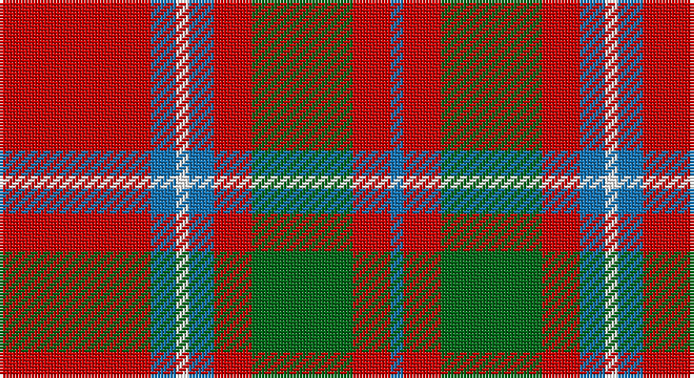

This page is one **sett** — a single exact thread-count. It belongs to the [tartan](/setts/r12b2w1b2r3g8r3b1/)
(the same proportion at any scale), whose colour order is pattern [BRGRBWBR](/stripes/brgrbwbr/).

Sourced from register-of-tartans.  It is a [8 stripe tartan](/stripes/stripes8/).

Original link https://www.tartanregister.gov.uk/tartanDetails.aspx?ref=643

## Register references

External register numbers recorded for this tartan.

- Scottish Register of Tartans: [643](https://www.tartanregister.gov.uk/tartanDetails.aspx?ref=643)
- Scottish Tartans Authority (ITI): 532
- Scottish Tartans World Register: 532

## Thread count
R/48 B8 W4 B8 R12 G32 R12 B/4

One full sett is **204 threads**.

## Palette

Palette: <strong>Tartan Register</strong>
<table><thead><tr><th>Colour</th><th>Threads</th><th>Shade</th><th>Base</th><th>OKLCh</th></tr></thead><tbody><tr><td>R/</td><td style="text-align:right;font-variant-numeric:tabular-nums">48</td><td><code style="background-color:#C80000;">#C80000</code> <small style="color:#888">#C80000</small></td><td>R <code style="background-color:#CC0000;">#CC0000</code></td><td><small style="color:#888">oklch(52.3% 0.215 29.2)</small></td></tr><tr><td>B</td><td style="text-align:right;font-variant-numeric:tabular-nums">8</td><td><code style="background-color:#1474B4;">#1474B4</code> <small style="color:#888">#1474B4</small></td><td>B <code style="background-color:#2A418A;">#2A418A</code></td><td><small style="color:#888">oklch(54.0% 0.129 245.1)</small></td></tr><tr><td>W</td><td style="text-align:right;font-variant-numeric:tabular-nums">4</td><td><code style="background-color:#FCFCFC;">#FCFCFC</code> <small style="color:#888">#FCFCFC</small></td><td>W <code style="background-color:#F7F7F7;">#F7F7F7</code></td><td><small style="color:#888">oklch(99.1% 0.000 89.9)</small></td></tr><tr><td>B</td><td style="text-align:right;font-variant-numeric:tabular-nums">8</td><td><code style="background-color:#1474B4;">#1474B4</code> <small style="color:#888">#1474B4</small></td><td>B <code style="background-color:#2A418A;">#2A418A</code></td><td><small style="color:#888">oklch(54.0% 0.129 245.1)</small></td></tr><tr><td>R</td><td style="text-align:right;font-variant-numeric:tabular-nums">12</td><td><code style="background-color:#C80000;">#C80000</code> <small style="color:#888">#C80000</small></td><td>R <code style="background-color:#CC0000;">#CC0000</code></td><td><small style="color:#888">oklch(52.3% 0.215 29.2)</small></td></tr><tr><td>G</td><td style="text-align:right;font-variant-numeric:tabular-nums">32</td><td><code style="background-color:#006818;">#006818</code> <small style="color:#888">#006818</small></td><td>G <code style="background-color:#006100;">#006100</code></td><td><small style="color:#888">oklch(45.0% 0.142 145.0)</small></td></tr><tr><td>R</td><td style="text-align:right;font-variant-numeric:tabular-nums">12</td><td><code style="background-color:#C80000;">#C80000</code> <small style="color:#888">#C80000</small></td><td>R <code style="background-color:#CC0000;">#CC0000</code></td><td><small style="color:#888">oklch(52.3% 0.215 29.2)</small></td></tr><tr><td>B/</td><td style="text-align:right;font-variant-numeric:tabular-nums">4</td><td><code style="background-color:#1474B4;">#1474B4</code> <small style="color:#888">#1474B4</small></td><td>B <code style="background-color:#2A418A;">#2A418A</code></td><td><small style="color:#888">oklch(54.0% 0.129 245.1)</small></td></tr></tbody></table>

# Sample pattern

## Nearest tartans

The nearest existing variants by ΔTartan distance, with this tartan at the top so the swatches line up against it.

ΔTartan

Tartan

Sett

—

<a href="/ttd/edit/#slug=r12b2w1b2r3g8r3b1~x4">Chisholm, The</a> <a class="nn-out" href="/variants/s8/r12b2w1b2r3g8r3b1~x4/" title="open its dictionary page">↗</a>

0.20

<a href="/ttd/edit/#slug=r12db2w1db2r3g8r3db1~x2&amp;base=r12b2w1b2r3g8r3b1~x4">Chisholm, The</a> <a class="nn-out" href="/variants/s8/r12db2w1db2r3g8r3db1~x2/" title="open its dictionary page">↗</a>

0.68

<a href="/ttd/edit/#slug=r12dp2lb1dp2r3dg8r3dp1&amp;base=r12b2w1b2r3g8r3b1~x4">Chisholm</a> <a class="nn-out" href="/variants/s8/r12dp2lb1dp2r3dg8r3dp1/" title="open its dictionary page">↗</a>

0.76

<a href="/ttd/edit/#slug=db10r2w2r16g6r1g2r1g3r6~x2&amp;base=r12b2w1b2r3g8r3b1~x4">Harkness</a> <a class="nn-out" href="/variants/s10/db10r2w2r16g6r1g2r1g3r6~x2/" title="open its dictionary page">↗</a>

0.79

<a href="/ttd/edit/#slug=b10r2w2r16g6r1g2r1g3r6~x4&amp;base=r12b2w1b2r3g8r3b1~x4">Harkness Dress (Name)</a> <a class="nn-out" href="/variants/s10/b10r2w2r16g6r1g2r1g3r6~x4/" title="open its dictionary page">↗</a>

0.85

<a href="/ttd/edit/#slug=r3g16r4k6r28g2lo3~x2&amp;base=r12b2w1b2r3g8r3b1~x4">McInally (Name)</a> <a class="nn-out" href="/variants/s7/r3g16r4k6r28g2lo3~x2/" title="open its dictionary page">↗</a>

0.86

<a href="/ttd/edit/#slug=r2db10r2g10r25w2~x2&amp;base=r12b2w1b2r3g8r3b1~x4">Grant of Lurg</a> <a class="nn-out" href="/variants/s6/r2db10r2g10r25w2~x2/" title="open its dictionary page">↗</a>

0.95

<a href="/ttd/edit/#slug=g3r2db2r13t1db4r2g7r2db2~x2&amp;base=r12b2w1b2r3g8r3b1~x4">MacKillop</a> <a class="nn-out" href="/variants/s10/g3r2db2r13t1db4r2g7r2db2~x2/" title="open its dictionary page">↗</a>

0.96

<a href="/ttd/edit/#slug=db2r30g8r3g8r6db4r3db12w2~x2&amp;base=r12b2w1b2r3g8r3b1~x4">Jenkins (Name)</a> <a class="nn-out" href="/variants/s10/db2r30g8r3g8r6db4r3db12w2~x2/" title="open its dictionary page">↗</a>

0.98

<a href="/ttd/edit/#slug=r8w2m30g12m3g12m3~x2&amp;base=r12b2w1b2r3g8r3b1~x4">Wasko (Personal)</a> <a class="nn-out" href="/variants/s7/r8w2m30g12m3g12m3~x2/" title="open its dictionary page">↗</a>

1.03

<a href="/ttd/edit/#slug=dg28r7m7dg14m7r48k4~x2&amp;base=r12b2w1b2r3g8r3b1~x4">MacNab (Crimson)</a> <a class="nn-out" href="/variants/s7/dg28r7m7dg14m7r48k4~x2/" title="open its dictionary page">↗</a>

## Neighbour map

Every grey dot is one of 14360 variants placed by the first two principal components of the ΔTartan feature space (44% of its variance). Red is this tartan; blue dots are its nearest — click one to open its page.

<svg viewBox="0 0 640 380" role="img" style="max-width:100%;height:auto;border:1px solid #e0e0e0;border-radius:4px;display:block" xmlns="http://www.w3.org/2000/svg"><image href="/nn/cloud.v1.png" width="640" height="380"/><a href="/variants/s8/r12db2w1db2r3g8r3db1~x2/"><circle cx="323.2" cy="178.7" r="4" fill="#3465a4"><title>Chisholm, The</title></circle></a><a href="/variants/s8/r12dp2lb1dp2r3dg8r3dp1/"><circle cx="329.1" cy="178.7" r="4" fill="#3465a4"><title>Chisholm</title></circle></a><a href="/variants/s10/db10r2w2r16g6r1g2r1g3r6~x2/"><circle cx="305.6" cy="156.1" r="4" fill="#3465a4"><title>Harkness</title></circle></a><a href="/variants/s10/b10r2w2r16g6r1g2r1g3r6~x4/"><circle cx="301.0" cy="153.6" r="4" fill="#3465a4"><title>Harkness Dress (Name)</title></circle></a><a href="/variants/s7/r3g16r4k6r28g2lo3~x2/"><circle cx="344.4" cy="171.9" r="4" fill="#3465a4"><title>McInally (Name)</title></circle></a><a href="/variants/s6/r2db10r2g10r25w2~x2/"><circle cx="327.2" cy="179.7" r="4" fill="#3465a4"><title>Grant of Lurg</title></circle></a><a href="/variants/s10/g3r2db2r13t1db4r2g7r2db2~x2/"><circle cx="291.4" cy="172.9" r="4" fill="#3465a4"><title>MacKillop</title></circle></a><a href="/variants/s10/db2r30g8r3g8r6db4r3db12w2~x2/"><circle cx="314.4" cy="150.6" r="4" fill="#3465a4"><title>Jenkins (Name)</title></circle></a><a href="/variants/s7/r8w2m30g12m3g12m3~x2/"><circle cx="330.6" cy="186.9" r="4" fill="#3465a4"><title>Wasko (Personal)</title></circle></a><a href="/variants/s7/dg28r7m7dg14m7r48k4~x2/"><circle cx="297.3" cy="188.5" r="4" fill="#3465a4"><title>MacNab (Crimson)</title></circle></a><circle cx="320.2" cy="176.8" r="5" fill="#c00000"/></svg>

ID: /variants/s8/r12b2w1b2r3g8r3b1~x4/
