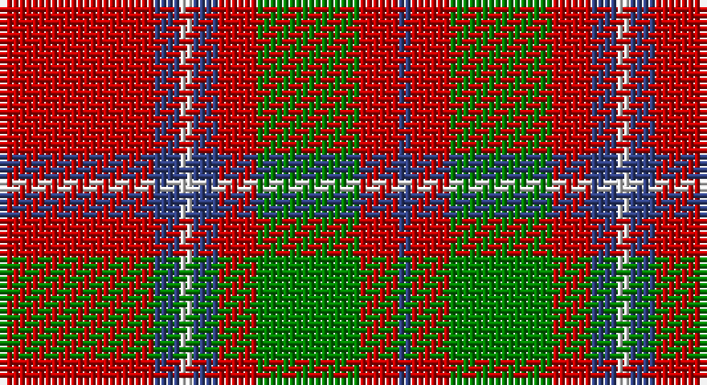

This page is one **sett** — a single exact thread-count. It belongs to the [tartan](/setts/r12db2w1db2r3g8r3db1/)
(the same proportion at any scale), whose colour order is pattern [BRGRBWBR](/stripes/brgrbwbr/).

Part of the [Chisholm](/tartans/chisholm/) tartan — the named design grouping this sett with its other cloths.

Sourced from weddslist.  It is a [8 stripe tartan](/stripes/stripes8/).

Original link http://www.weddslist.com/cgi-bin/tartans/pg.pl?source=sts

## Provenance

Earliest known date: 1800 This is without doubt the oldest of the Chisholm tartans, dating from around 1800 and which appears in a portrait of the clan heroine 'Mary Chisholm' of about that date. She was famous for having sided with the clansmen during the clearances. D.C.Stewart says it is a variation of one of the MacIntosh setts, said to have been found in a cave at Achnacarry in 1746. Cockburn Collection No.40 (1800 - 10). Logan (1831)

## Also known as

This cloth is also recorded under:

- Chisholm #2
- Chisholm Hunting #2
- Chisholm The..
- Chisholm, The

2 attestations — the source records this cloth was collapsed from (oldest owns this page)

<ul>
<li>undated — Chisholm, The (weddslist, <a href="http://www.weddslist.com/cgi-bin/tartans/pg.pl?source=sts">record</a>)</li>
<li>undated — Chisholm (Portrait) The.. Clan Tartan (house-of-tartan, <a href="http://www.house-of-tartan.scotland.net/house/TartanViewjs.asp?colr=Def&tnam=532">record</a>)</li>
</ul>

## Thread count
R/24 B4 LN2 B4 R6 G16 R6 B/2

One full sett is **102 threads**.

## Palette

Palette: <strong>Tartan Dictionary</strong> <small style="color:#888">(1 of 4 colours)</small>
<table><thead><tr><th>Colour</th><th>Threads</th><th>Shade</th><th>Base</th><th>OKLCh</th></tr></thead><tbody><tr><td>R/</td><td style="text-align:right;font-variant-numeric:tabular-nums">24</td><td><code style="background-color:#C00000;">#C00000</code> <small style="color:#888">#C00000</small></td><td>R <code style="background-color:#CC0000;">#CC0000</code></td><td><small style="color:#888">oklch(50.7% 0.208 29.2)</small></td></tr><tr><td>B</td><td style="text-align:right;font-variant-numeric:tabular-nums">4</td><td><code style="background-color:#304080;">#304080</code> <small style="color:#888">#304080</small></td><td>B <code style="background-color:#2A418A;">#2A418A</code></td><td><small style="color:#888">oklch(39.4% 0.109 270.2)</small></td></tr><tr><td>LN</td><td style="text-align:right;font-variant-numeric:tabular-nums">2</td><td><code style="background-color:#E0E0E0;">#E0E0E0</code> <small style="color:#888">#E0E0E0</small></td><td>W <code style="background-color:#F7F7F7;">#F7F7F7</code></td><td><small style="color:#888">oklch(90.7% 0.000 89.9)</small></td></tr><tr><td>B</td><td style="text-align:right;font-variant-numeric:tabular-nums">4</td><td><code style="background-color:#304080;">#304080</code> <small style="color:#888">#304080</small></td><td>B <code style="background-color:#2A418A;">#2A418A</code></td><td><small style="color:#888">oklch(39.4% 0.109 270.2)</small></td></tr><tr><td>R</td><td style="text-align:right;font-variant-numeric:tabular-nums">6</td><td><code style="background-color:#C00000;">#C00000</code> <small style="color:#888">#C00000</small></td><td>R <code style="background-color:#CC0000;">#CC0000</code></td><td><small style="color:#888">oklch(50.7% 0.208 29.2)</small></td></tr><tr><td>G</td><td style="text-align:right;font-variant-numeric:tabular-nums">16</td><td><code style="background-color:#008000;">#008000</code> <small style="color:#888">#008000</small></td><td>G <code style="background-color:#006100;">#006100</code></td><td><small style="color:#888">oklch(52.0% 0.177 142.5)</small></td></tr><tr><td>R</td><td style="text-align:right;font-variant-numeric:tabular-nums">6</td><td><code style="background-color:#C00000;">#C00000</code> <small style="color:#888">#C00000</small></td><td>R <code style="background-color:#CC0000;">#CC0000</code></td><td><small style="color:#888">oklch(50.7% 0.208 29.2)</small></td></tr><tr><td>B/</td><td style="text-align:right;font-variant-numeric:tabular-nums">2</td><td><code style="background-color:#304080;">#304080</code> <small style="color:#888">#304080</small></td><td>B <code style="background-color:#2A418A;">#2A418A</code></td><td><small style="color:#888">oklch(39.4% 0.109 270.2)</small></td></tr></tbody></table>

# Sample pattern

## Nearest tartans

The nearest existing variants by ΔTartan distance, with this tartan at the top so the swatches line up against it.

ΔTartan

Tartan

Sett

—

<a href="/ttd/edit/#slug=r12db2w1db2r3g8r3db1~x2">Chisholm, The</a> <a class="nn-out" href="/variants/s8/r12db2w1db2r3g8r3db1~x2/" title="open its dictionary page">↗</a>

0.20

<a href="/ttd/edit/#slug=r12b2w1b2r3g8r3b1~x4&amp;base=r12db2w1db2r3g8r3db1~x2">Chisholm, The</a> <a class="nn-out" href="/variants/s8/r12b2w1b2r3g8r3b1~x4/" title="open its dictionary page">↗</a>

0.65

<a href="/ttd/edit/#slug=r12dp2lb1dp2r3dg8r3dp1&amp;base=r12db2w1db2r3g8r3db1~x2">Chisholm</a> <a class="nn-out" href="/variants/s8/r12dp2lb1dp2r3dg8r3dp1/" title="open its dictionary page">↗</a>

0.72

<a href="/ttd/edit/#slug=r3g16r4k6r28g2lo3~x2&amp;base=r12db2w1db2r3g8r3db1~x2">McInally (Name)</a> <a class="nn-out" href="/variants/s7/r3g16r4k6r28g2lo3~x2/" title="open its dictionary page">↗</a>

0.77

<a href="/ttd/edit/#slug=db10r2w2r16g6r1g2r1g3r6~x2&amp;base=r12db2w1db2r3g8r3db1~x2">Harkness</a> <a class="nn-out" href="/variants/s10/db10r2w2r16g6r1g2r1g3r6~x2/" title="open its dictionary page">↗</a>

0.87

<a href="/ttd/edit/#slug=b10r2w2r16g6r1g2r1g3r6~x4&amp;base=r12db2w1db2r3g8r3db1~x2">Harkness Dress (Name)</a> <a class="nn-out" href="/variants/s10/b10r2w2r16g6r1g2r1g3r6~x4/" title="open its dictionary page">↗</a>

0.91

<a href="/ttd/edit/#slug=r2db10r2g10r25w2~x2&amp;base=r12db2w1db2r3g8r3db1~x2">Grant of Lurg</a> <a class="nn-out" href="/variants/s6/r2db10r2g10r25w2~x2/" title="open its dictionary page">↗</a>

0.92

<a href="/ttd/edit/#slug=dg28r7m7dg14m7r48k4~x2&amp;base=r12db2w1db2r3g8r3db1~x2">MacNab (Crimson)</a> <a class="nn-out" href="/variants/s7/dg28r7m7dg14m7r48k4~x2/" title="open its dictionary page">↗</a>

0.92

<a href="/ttd/edit/#slug=g3r2db2r13t1db4r2g7r2db2~x2&amp;base=r12db2w1db2r3g8r3db1~x2">MacKillop</a> <a class="nn-out" href="/variants/s10/g3r2db2r13t1db4r2g7r2db2~x2/" title="open its dictionary page">↗</a>

0.93

<a href="/ttd/edit/#slug=r8w2m30g12m3g12m3~x2&amp;base=r12db2w1db2r3g8r3db1~x2">Wasko (Personal)</a> <a class="nn-out" href="/variants/s7/r8w2m30g12m3g12m3~x2/" title="open its dictionary page">↗</a>

0.96

<a href="/ttd/edit/#slug=db2r30g8r3g8r6db4r3db12w2~x2&amp;base=r12db2w1db2r3g8r3db1~x2">Jenkins (Name)</a> <a class="nn-out" href="/variants/s10/db2r30g8r3g8r6db4r3db12w2~x2/" title="open its dictionary page">↗</a>

## Neighbour map

Every grey dot is one of 14360 variants placed by the first two principal components of the ΔTartan feature space (44% of its variance). Red is this tartan; blue dots are its nearest — click one to open its page.

<svg viewBox="0 0 640 380" role="img" style="max-width:100%;height:auto;border:1px solid #e0e0e0;border-radius:4px;display:block" xmlns="http://www.w3.org/2000/svg"><image href="/nn/cloud.v1.png" width="640" height="380"/><a href="/variants/s8/r12b2w1b2r3g8r3b1~x4/"><circle cx="320.2" cy="176.8" r="4" fill="#3465a4"><title>Chisholm, The</title></circle></a><a href="/variants/s8/r12dp2lb1dp2r3dg8r3dp1/"><circle cx="329.1" cy="178.7" r="4" fill="#3465a4"><title>Chisholm</title></circle></a><a href="/variants/s7/r3g16r4k6r28g2lo3~x2/"><circle cx="344.4" cy="171.9" r="4" fill="#3465a4"><title>McInally (Name)</title></circle></a><a href="/variants/s10/db10r2w2r16g6r1g2r1g3r6~x2/"><circle cx="305.6" cy="156.1" r="4" fill="#3465a4"><title>Harkness</title></circle></a><a href="/variants/s10/b10r2w2r16g6r1g2r1g3r6~x4/"><circle cx="301.0" cy="153.6" r="4" fill="#3465a4"><title>Harkness Dress (Name)</title></circle></a><a href="/variants/s6/r2db10r2g10r25w2~x2/"><circle cx="327.2" cy="179.7" r="4" fill="#3465a4"><title>Grant of Lurg</title></circle></a><a href="/variants/s7/dg28r7m7dg14m7r48k4~x2/"><circle cx="297.3" cy="188.5" r="4" fill="#3465a4"><title>MacNab (Crimson)</title></circle></a><a href="/variants/s10/g3r2db2r13t1db4r2g7r2db2~x2/"><circle cx="291.4" cy="172.9" r="4" fill="#3465a4"><title>MacKillop</title></circle></a><a href="/variants/s7/r8w2m30g12m3g12m3~x2/"><circle cx="330.6" cy="186.9" r="4" fill="#3465a4"><title>Wasko (Personal)</title></circle></a><a href="/variants/s10/db2r30g8r3g8r6db4r3db12w2~x2/"><circle cx="314.4" cy="150.6" r="4" fill="#3465a4"><title>Jenkins (Name)</title></circle></a><circle cx="323.2" cy="178.7" r="5" fill="#c00000"/></svg>

ID: /variants/s8/r12db2w1db2r3g8r3db1~x2/
