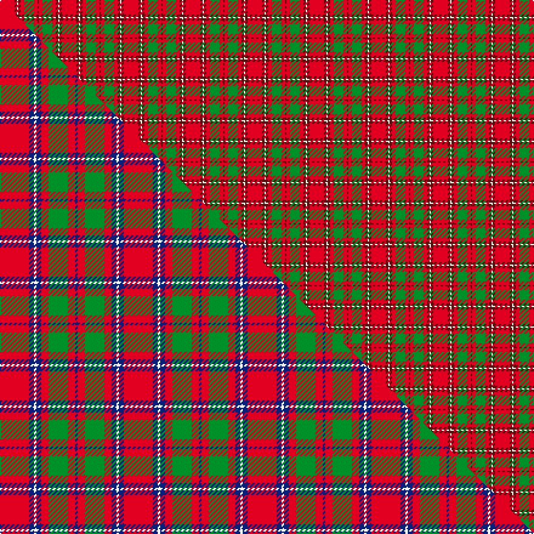

This is one **variant** — a specific cloth: this exact thread count and colourway, with its own
provenance below. It is one weaving of the [sett](/tartans/c/ch/chisholm/) (the scale-free proportion — the
same cloth at any scale or shade), whose colour order is pattern [BRGRBWBR](/stripes/brgrbwbr/).

Part of the [Chisholm](/tartans/c/ch/chisholm/) tartan — the named design grouping this sett with its other cloths.

Sourced from weddslist.  It is a [8 stripe tartan](/stripes/stripes8/).

Original link [http://www.weddslist.com/cgi-bin/tartans/pg.pl?source=x](http://www.weddslist.com/cgi-bin/tartans/pg.pl?source=x)

Dataset <small>— provenance for this record, inherited from the source manifest</small>

<dl class="dataset-prov">
<dt>source</dt><dd><a href="/sources/weddslist/">Weddslist</a></dd>
<dt>data captured from</dt><dd><a href="https://github.com/thetartan/tartan-database/blob/master/data/weddslist/data.csv">https://github.com/thetartan/tartan-database/blob/master/data/weddslist/data.csv</a></dd>
<dt>data date</dt><dd>2016-11-17 <small>(dataset default)</small></dd>
<dt>licence</dt><dd><a href="https://creativecommons.org/licenses/by-nc-nd/4.0/">CC BY-NC-ND 4.0</a></dd>
</dl>

Capture chain <small>— the hands this data passed through, oldest first; each capture carries its own licence</small>

<ol class="capture-chain">
<li><a href="https://www.weddslist.com/tartans/">Weddslist</a> <small>the living privately compiled reference</small></li>
<li><a href="https://github.com/thetartan/tartan-database">thetartan/tartan-database</a> <small>2016-2017</small> · <a href="https://creativecommons.org/licenses/by-nc-nd/4.0/">CC BY-NC-ND 4.0</a> <small>Levko Kravets's frozen compilation — the capture we vendored, and where its CC licence text came from</small></li>
<li>this dictionary <small>captured 2026-06-10 · commit 5bf86c7566</small> <small>each re-capture is a git commit to data/sources</small></li>
</ol>

## Thread count
R/12 DR2 W1 DR2 R3 G8 R3 DR/1

One full sett is **51 threads**.

## Palette
<table><thead><tr><th>Colour</th><th>Shade</th><th>OKLCh</th></tr></thead><tbody><tr><td>G</td><td><code style="background-color:#008B2A;">#008B2A</code> <small style="color:#888">#008B2A</small></td><td><small style="color:#888">oklch(55.4% 0.170 145.9)</small></td></tr><tr><td>R</td><td><code style="background-color:#D60020;">#D60020</code> <small style="color:#888">#D60020</small></td><td><small style="color:#888">oklch(55.2% 0.224 25.5)</small></td></tr><tr><td>DR</td><td><code style="background-color:#55120C;">#55120C</code> <small style="color:#888">#55120C</small></td><td><small style="color:#888">oklch(30.0% 0.099 29.3)</small></td></tr><tr><td>W</td><td><code style="background-color:#F7F7F7;">#F7F7F7</code> <small style="color:#888">#F7F7F7</small></td><td><small style="color:#888">oklch(97.6% 0.000 89.9)</small></td></tr></tbody></table>

# Sample pattern

## Compared to the master

This cloth is one sett of its design; the master sett (the exemplar the design is anchored on) is below for comparison.

Its **ΔTartan distance** from the master is **1.86** — the same measure the nearest-tartans table ranks by (0 is identical; a re-scale of the same cloth is near 0, a recolour or a different proportion further).

<figure class="master-compare" style="margin:0">

this sett
master sett ★

<figcaption style="color:#888;font-size:smaller">One weave of this sett against the <a href="/setts/r12db2w1db2r3g8r3db1/">master sett ★</a>, split on the diagonal: a shared proportion runs seamlessly across it with only the shades shifting; a different proportion breaks on it.</figcaption>
</figure>

## Nearest tartan variants

The nearest existing variants by ΔTartan distance, with this cloth at the top so the swatches line up against it.

ΔTartan

Threads

Variant

Sett

—

51

<a href="/variants/s8/r12dr2w1dr2r3g8r3dr1/">Chisholm</a>

<a href="/ttd/edit/#slug=r12dr2w1dr2r3g8r3dr1~x2&amp;base=r12dr2w1dr2r3g8r3dr1" title="compare in the TTD">0.00</a>

102

<a href="/variants/s8/r12dr2w1dr2r3g8r3dr1~x2/">Chisholm</a>

<a href="/ttd/edit/#slug=r12t2w1t2r3g8r3t1~x4&amp;base=r12dr2w1dr2r3g8r3dr1" title="compare in the TTD">1.58</a>

204

<a href="/variants/s8/r12t2w1t2r3g8r3t1~x4/">Chisholm, The</a>

<a href="/ttd/edit/#slug=r12db2w1db2r3g8r3db1~x2&amp;base=r12dr2w1dr2r3g8r3dr1" title="compare in the TTD">1.86</a>

102

<a href="/variants/s8/r12db2w1db2r3g8r3db1~x2/">Chisholm (Portrait) The.. Clan Tartan</a>

<a href="/ttd/edit/#slug=r12db2w1db2r3g8r3db1&amp;base=r12dr2w1dr2r3g8r3dr1" title="compare in the TTD">1.86</a>

51

<a href="/variants/s8/r12db2w1db2r3g8r3db1/">Chisholm</a>

<a href="/ttd/edit/#slug=r21g3r21g16y3w2y3~x2&amp;base=r12dr2w1dr2r3g8r3dr1" title="compare in the TTD">2.11</a>

228

<a href="/variants/s7/r21g3r21g16y3w2y3~x2/">Claus of the North Pole (Restricted)</a>

<a href="/ttd/edit/#slug=ly4r21ly1r21g8dt4g5dt4g4ly4~dt1204274&amp;base=r12dr2w1dr2r3g8r3dr1" title="compare in the TTD">2.26</a>

144

<a href="/variants/s10/ly4r21ly1r21g8db4g5db4g4ly4~db1204274/">Rice Welsh Name Tartan</a>

<a href="/ttd/edit/#slug=r32lb5g17r4g5w2~x2&amp;base=r12dr2w1dr2r3g8r3dr1" title="compare in the TTD">2.27</a>

192

<a href="/variants/s6/r32lb5g17r4g5w2~x2/">Wilson's, No 5</a>

<a href="/ttd/edit/#slug=r3g3r3g14r3g3r3db5r18y2r8y2~x2&amp;base=r12dr2w1dr2r3g8r3dr1" title="compare in the TTD">2.29</a>

258

<a href="/variants/s12/r3g3r3g14r3g3r3db5r18y2r8y2~x2/">Burns Family Tartan</a>

<a href="/ttd/edit/#slug=r2g6y1g6r3g2r16db1~x4&amp;base=r12dr2w1dr2r3g8r3dr1" title="compare in the TTD">2.30</a>

284

<a href="/variants/s8/r2g6y1g6r3g2r16db1~x4/">Burnett</a>

<a href="/ttd/edit/#slug=r2g2r2g8r2g2r2db2r11y1r4y1~x4&amp;base=r12dr2w1dr2r3g8r3dr1" title="compare in the TTD">2.30</a>

300

<a href="/variants/s12/r2g2r2g8r2g2r2db2r11y1r4y1~x4/">Burns 1930</a>

## Neighbour map

Every grey dot is one of 13657 variants placed by the first two principal components of the ΔTartan feature space (42% of its variance). Red is this tartan; blue dots are its nearest — click one to open its page. The map is a flat projection of a many-dimensional space — [how to read it](/posts/neighbourhood-maps/).

<svg viewBox="0 0 640 380" role="img" style="max-width:100%;height:auto;border:1px solid #e0e0e0;border-radius:4px;display:block" xmlns="http://www.w3.org/2000/svg"><image href="/nn/cloud.v1.png" width="640" height="380"/><a href="/variants/s8/r12dr2w1dr2r3g8r3dr1~x2/"><circle cx="332.5" cy="184.0" r="4" fill="#3465a4"><title>Chisholm</title></circle></a><a href="/variants/s8/r12t2w1t2r3g8r3t1~x4/"><circle cx="337.1" cy="189.5" r="4" fill="#3465a4"><title>Chisholm, The</title></circle></a><a href="/variants/s8/r12db2w1db2r3g8r3db1~x2/"><circle cx="313.4" cy="179.7" r="4" fill="#3465a4"><title>Chisholm (Portrait) The.. Clan Tartan</title></circle></a><a href="/variants/s8/r12db2w1db2r3g8r3db1/"><circle cx="313.4" cy="179.7" r="4" fill="#3465a4"><title>Chisholm</title></circle></a><a href="/variants/s7/r21g3r21g16y3w2y3~x2/"><circle cx="377.7" cy="206.6" r="4" fill="#3465a4"><title>Claus of the North Pole (Restricted)</title></circle></a><a href="/variants/s10/ly4r21ly1r21g8db4g5db4g4ly4~db1204274/"><circle cx="324.5" cy="155.7" r="4" fill="#3465a4"><title>Rice Welsh Name Tartan</title></circle></a><a href="/variants/s6/r32lb5g17r4g5w2~x2/"><circle cx="355.9" cy="183.9" r="4" fill="#3465a4"><title>Wilson's, No 5</title></circle></a><a href="/variants/s12/r3g3r3g14r3g3r3db5r18y2r8y2~x2/"><circle cx="326.1" cy="186.0" r="4" fill="#3465a4"><title>Burns Family Tartan</title></circle></a><a href="/variants/s8/r2g6y1g6r3g2r16db1~x4/"><circle cx="380.1" cy="173.4" r="4" fill="#3465a4"><title>Burnett</title></circle></a><a href="/variants/s12/r2g2r2g8r2g2r2db2r11y1r4y1~x4/"><circle cx="354.1" cy="177.8" r="4" fill="#3465a4"><title>Burns 1930</title></circle></a><circle cx="332.5" cy="184.0" r="5" fill="#c00000"/><text x="320" y="376" text-anchor="middle" font-size="11" fill="#999">ground</text><text x="11" y="190" text-anchor="middle" font-size="11" fill="#999" transform="rotate(-90 11 190)">complexity</text></svg>

ID: /variants/s8/r12dr2w1dr2r3g8r3dr1/
