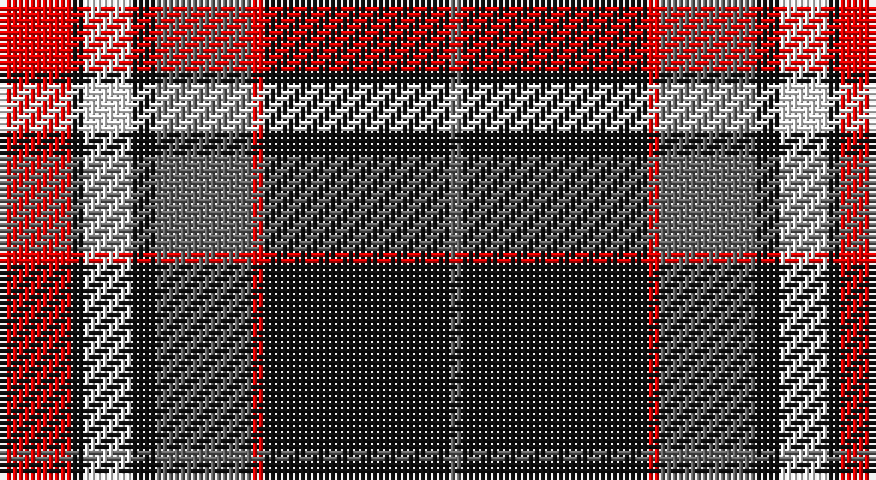

This page is one **sett** — a single exact thread-count. It belongs to the [tartan](/setts/r12k2w8k4n16r2k31n2/)
(the same proportion at any scale), whose colour order is pattern [BKRBKWKR](/stripes/bkrbkwkr/).

Sourced from register-of-tartans.  It is a [8 stripe tartan](/stripes/stripes8/).

Original link https://www.tartanregister.gov.uk/tartanDetails.aspx?ref=10697

## Provenance

Earliest known date: 13 September 2012 Designed for the 2012 Distripress Annual Congress held in Glasgow, Scotland. Distripress (association for the promotion of the global circulation of the press) is a non-political and nonprofit making association of companies, non profit organisations and individuals of repute, engaged in the national and international circulation of publications (newspapers, magazines, periodicals and paperback books etc). The Distripress association colours of black, red and white are used here with added greys. The central broad red line is twelve threads wide denoting the conference year 2012.

2 attestations — the source records this cloth was collapsed from (oldest owns this page)

<ul>
<li>22/08/2012 — Distripress Annual Congress 2012 (register-of-tartans, <a href="https://www.tartanregister.gov.uk/tartanDetails.aspx?ref=10697">record</a>)</li>
<li>undated — Distripress Annual Congress 2012 Corporate Tartan (house-of-tartan, <a href="http://www.house-of-tartan.scotland.net/house/TartanViewjs.asp?colr=Def&tnam=10697">record</a>)</li>
</ul>

## Register references

External register numbers recorded for this tartan.

- Scottish Register of Tartans: [10697](https://www.tartanregister.gov.uk/tartanDetails.aspx?ref=10697)

## Thread count
R/12 K2 W8 K4 N16 R2 K31 N/2

One full sett is **140 threads**.

## Palette

Palette: <strong>Tartan Register</strong> <small style="color:#888">(3 of 4 colours)</small>
<table><thead><tr><th>Colour</th><th>Threads</th><th>Shade</th><th>Base</th><th>OKLCh</th></tr></thead><tbody><tr><td>R/</td><td style="text-align:right;font-variant-numeric:tabular-nums">12</td><td><code style="background-color:#FF0000;">#FF0000</code> <small style="color:#888">#FF0000</small></td><td>R <code style="background-color:#CC0000;">#CC0000</code></td><td><small style="color:#888">oklch(62.8% 0.258 29.2)</small></td></tr><tr><td>K</td><td style="text-align:right;font-variant-numeric:tabular-nums">2</td><td><code style="background-color:#101010;">#101010</code> <small style="color:#888">#101010</small></td><td>K <code style="background-color:#000000;">#000000</code></td><td><small style="color:#888">oklch(17.3% 0.000 89.9)</small></td></tr><tr><td>W</td><td style="text-align:right;font-variant-numeric:tabular-nums">8</td><td><code style="background-color:#FFFFFF;">#FFFFFF</code> <small style="color:#888">#FFFFFF</small></td><td>W <code style="background-color:#F7F7F7;">#F7F7F7</code></td><td><small style="color:#888">oklch(100.0% 0.000 89.9)</small></td></tr><tr><td>K</td><td style="text-align:right;font-variant-numeric:tabular-nums">4</td><td><code style="background-color:#101010;">#101010</code> <small style="color:#888">#101010</small></td><td>K <code style="background-color:#000000;">#000000</code></td><td><small style="color:#888">oklch(17.3% 0.000 89.9)</small></td></tr><tr><td>N</td><td style="text-align:right;font-variant-numeric:tabular-nums">16</td><td><code style="background-color:#666666;">#666666</code> <small style="color:#888">#666666</small></td><td>B <code style="background-color:#2A418A;">#2A418A</code></td><td><small style="color:#888">oklch(51.0% 0.000 89.9)</small></td></tr><tr><td>R</td><td style="text-align:right;font-variant-numeric:tabular-nums">2</td><td><code style="background-color:#FF0000;">#FF0000</code> <small style="color:#888">#FF0000</small></td><td>R <code style="background-color:#CC0000;">#CC0000</code></td><td><small style="color:#888">oklch(62.8% 0.258 29.2)</small></td></tr><tr><td>K</td><td style="text-align:right;font-variant-numeric:tabular-nums">31</td><td><code style="background-color:#101010;">#101010</code> <small style="color:#888">#101010</small></td><td>K <code style="background-color:#000000;">#000000</code></td><td><small style="color:#888">oklch(17.3% 0.000 89.9)</small></td></tr><tr><td>N/</td><td style="text-align:right;font-variant-numeric:tabular-nums">2</td><td><code style="background-color:#666666;">#666666</code> <small style="color:#888">#666666</small></td><td>B <code style="background-color:#2A418A;">#2A418A</code></td><td><small style="color:#888">oklch(51.0% 0.000 89.9)</small></td></tr></tbody></table>

# Sample pattern

## Nearest tartans

The nearest existing variants by ΔTartan distance, with this tartan at the top so the swatches line up against it.

ΔTartan

Tartan

Sett

—

<a href="/ttd/edit/#slug=r12k2w8k4n16r2k31n2">Distripress Annual Congress 2012</a> <a class="nn-out" href="/variants/s8/r12k2w8k4n16r2k31n2/" title="open its dictionary page">↗</a>

0.75

<a href="/ttd/edit/#slug=r2w8k14o25w2k2w2~x2&amp;base=r12k2w8k4n16r2k31n2">Merric, Dark Camel..</a> <a class="nn-out" href="/variants/s7/r2w8k14o25w2k2w2~x2/" title="open its dictionary page">↗</a>

0.80

<a href="/ttd/edit/#slug=do2w2k6do3k2o14k1o1~x4&amp;base=r12k2w8k4n16r2k31n2">Braemar or Blair Atholl</a> <a class="nn-out" href="/variants/s8/do2w2k6do3k2o14k1o1~x4/" title="open its dictionary page">↗</a>

0.82

<a href="/ttd/edit/#slug=r10w2k10w10o35k5~x2&amp;base=r12k2w8k4n16r2k31n2">Loch Ness</a> <a class="nn-out" href="/variants/s6/r10w2k10w10o35k5~x2/" title="open its dictionary page">↗</a>

0.89

<a href="/ttd/edit/#slug=r2w8k14dy25w2k2w2~x2&amp;base=r12k2w8k4n16r2k31n2">Merric Dark Camel.. Trade Tartan</a> <a class="nn-out" href="/variants/s7/r2w8k14dy25w2k2w2~x2/" title="open its dictionary page">↗</a>

0.93

<a href="/ttd/edit/#slug=k10w10k10o32k2w2k2w2r5~x2&amp;base=r12k2w8k4n16r2k31n2">Burberry (Counterfeit #4)</a> <a class="nn-out" href="/variants/s9/k10w10k10o32k2w2k2w2r5~x2/" title="open its dictionary page">↗</a>

0.95

<a href="/ttd/edit/#slug=k30w2lr4lo10w9k3lr5~x2&amp;base=r12k2w8k4n16r2k31n2">Virginia Commonwealth University</a> <a class="nn-out" href="/variants/s7/k30w2lr4lo10w9k3lr5~x2/" title="open its dictionary page">↗</a>

0.96

<a href="/ttd/edit/#slug=r10w2k10w10dy35k5~x2&amp;base=r12k2w8k4n16r2k31n2">Loch Ness</a> <a class="nn-out" href="/variants/s6/r10w2k10w10dy35k5~x2/" title="open its dictionary page">↗</a>

0.98

<a href="/ttd/edit/#slug=w4k6r3k15r3k6r27db9w2~x2&amp;base=r12k2w8k4n16r2k31n2">Memery (Reston, USA)</a> <a class="nn-out" href="/variants/s9/w4k6r3k15r3k6r27db9w2~x2/" title="open its dictionary page">↗</a>

0.99

<a href="/ttd/edit/#slug=k3r1k3w5k5w3k5dy23r3~x2&amp;base=r12k2w8k4n16r2k31n2">Southdown (Fashion)</a> <a class="nn-out" href="/variants/s9/k3r1k3w5k5w3k5dy23r3~x2/" title="open its dictionary page">↗</a>

0.99

<a href="/ttd/edit/#slug=k40w25k10ly8k3ly8k10r25w4~x2&amp;base=r12k2w8k4n16r2k31n2">Buchanan Old Dress</a> <a class="nn-out" href="/variants/s9/k40w25k10ly8k3ly8k10r25w4~x2/" title="open its dictionary page">↗</a>

## Neighbour map

Every grey dot is one of 14360 variants placed by the first two principal components of the ΔTartan feature space (44% of its variance). Red is this tartan; blue dots are its nearest — click one to open its page.

<svg viewBox="0 0 640 380" role="img" style="max-width:100%;height:auto;border:1px solid #e0e0e0;border-radius:4px;display:block" xmlns="http://www.w3.org/2000/svg"><image href="/nn/cloud.v1.png" width="640" height="380"/><a href="/variants/s7/r2w8k14o25w2k2w2~x2/"><circle cx="220.8" cy="157.3" r="4" fill="#3465a4"><title>Merric, Dark Camel..</title></circle></a><a href="/variants/s8/do2w2k6do3k2o14k1o1~x4/"><circle cx="255.7" cy="155.3" r="4" fill="#3465a4"><title>Braemar or Blair Atholl</title></circle></a><a href="/variants/s6/r10w2k10w10o35k5~x2/"><circle cx="240.1" cy="161.7" r="4" fill="#3465a4"><title>Loch Ness</title></circle></a><a href="/variants/s7/r2w8k14dy25w2k2w2~x2/"><circle cx="233.4" cy="163.7" r="4" fill="#3465a4"><title>Merric Dark Camel.. Trade Tartan</title></circle></a><a href="/variants/s9/k10w10k10o32k2w2k2w2r5~x2/"><circle cx="212.4" cy="131.3" r="4" fill="#3465a4"><title>Burberry (Counterfeit #4)</title></circle></a><a href="/variants/s7/k30w2lr4lo10w9k3lr5~x2/"><circle cx="247.3" cy="153.2" r="4" fill="#3465a4"><title>Virginia Commonwealth University</title></circle></a><a href="/variants/s6/r10w2k10w10dy35k5~x2/"><circle cx="252.3" cy="170.0" r="4" fill="#3465a4"><title>Loch Ness</title></circle></a><a href="/variants/s9/w4k6r3k15r3k6r27db9w2~x2/"><circle cx="224.7" cy="152.1" r="4" fill="#3465a4"><title>Memery (Reston, USA)</title></circle></a><a href="/variants/s9/k3r1k3w5k5w3k5dy23r3~x2/"><circle cx="252.7" cy="127.8" r="4" fill="#3465a4"><title>Southdown (Fashion)</title></circle></a><a href="/variants/s9/k40w25k10ly8k3ly8k10r25w4~x2/"><circle cx="199.1" cy="158.0" r="4" fill="#3465a4"><title>Buchanan Old Dress</title></circle></a><circle cx="237.0" cy="151.0" r="5" fill="#c00000"/></svg>

ID: /variants/s8/r12k2w8k4n16r2k31n2/
