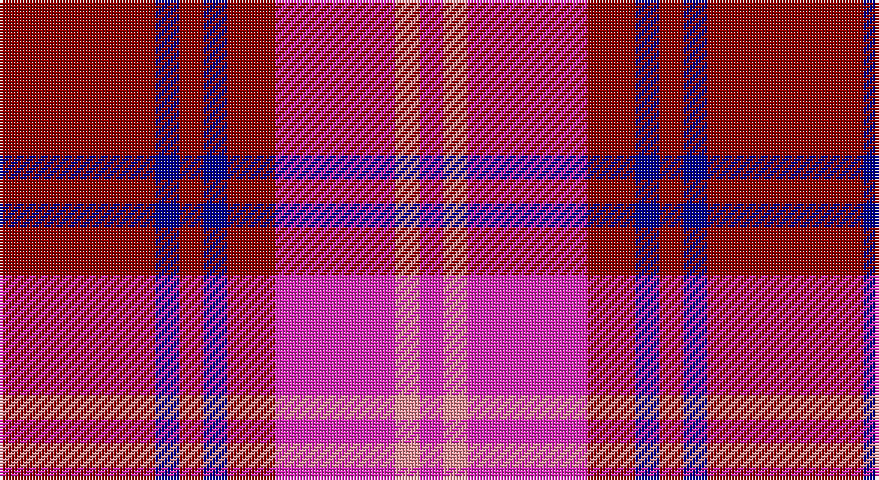

This page is one **sett** — a single exact thread-count. It belongs to the [tartan](/setts/r13db2r2db2r4m10lr2m2/)
(the same proportion at any scale), whose colour order is pattern [RBRBRRYR](/stripes/rbrbrryr/).

Part of the [Oakwood](/tartans/oakwood/) tartan — the named design grouping this sett with its other cloths.

Sourced from tartans-authority.  It is a [8 stripe tartan](/stripes/stripes8/).

Original link http://www.tartansauthority.com/tartan-ferret/display/5531/

## Also known as

This cloth is also recorded under:

- Oakwood Purple

## Register references

External register numbers recorded for this tartan.

- Scottish Tartans Authority (ITI): 5531

## Thread count
DR/52 DB8 DR8 DB8 DR16 LRa40 LR8 LRa/8

One full sett is **236 threads**.

## Palette

Palette: <strong>Tartan Register</strong> <small style="color:#888">(1 of 4 colours)</small>
<table><thead><tr><th>Colour</th><th>Threads</th><th>Shade</th><th>Base</th><th>OKLCh</th></tr></thead><tbody><tr><td>DR/</td><td style="text-align:right;font-variant-numeric:tabular-nums">52</td><td><code style="background-color:#8C0000;">#8C0000</code> <small style="color:#888">#8C0000</small></td><td>R <code style="background-color:#CC0000;">#CC0000</code></td><td><small style="color:#888">oklch(40.2% 0.165 29.2)</small></td></tr><tr><td>DB</td><td style="text-align:right;font-variant-numeric:tabular-nums">8</td><td><code style="background-color:#00008C;">#00008C</code> <small style="color:#888">#00008C</small></td><td>B <code style="background-color:#2A418A;">#2A418A</code></td><td><small style="color:#888">oklch(28.9% 0.200 264.1)</small></td></tr><tr><td>DR</td><td style="text-align:right;font-variant-numeric:tabular-nums">8</td><td><code style="background-color:#8C0000;">#8C0000</code> <small style="color:#888">#8C0000</small></td><td>R <code style="background-color:#CC0000;">#CC0000</code></td><td><small style="color:#888">oklch(40.2% 0.165 29.2)</small></td></tr><tr><td>DB</td><td style="text-align:right;font-variant-numeric:tabular-nums">8</td><td><code style="background-color:#00008C;">#00008C</code> <small style="color:#888">#00008C</small></td><td>B <code style="background-color:#2A418A;">#2A418A</code></td><td><small style="color:#888">oklch(28.9% 0.200 264.1)</small></td></tr><tr><td>DR</td><td style="text-align:right;font-variant-numeric:tabular-nums">16</td><td><code style="background-color:#8C0000;">#8C0000</code> <small style="color:#888">#8C0000</small></td><td>R <code style="background-color:#CC0000;">#CC0000</code></td><td><small style="color:#888">oklch(40.2% 0.165 29.2)</small></td></tr><tr><td>LRa</td><td style="text-align:right;font-variant-numeric:tabular-nums">40</td><td><code style="background-color:#E02CB8;">#E02CB8</code> <small style="color:#888">#E02CB8</small></td><td>R <code style="background-color:#CC0000;">#CC0000</code></td><td><small style="color:#888">oklch(62.9% 0.248 339.3)</small></td></tr><tr><td>LR</td><td style="text-align:right;font-variant-numeric:tabular-nums">8</td><td><code style="background-color:#FC949C;">#FC949C</code> <small style="color:#888">#FC949C</small></td><td>Y <code style="background-color:#F2BF00;">#F2BF00</code></td><td><small style="color:#888">oklch(77.8% 0.125 15.5)</small></td></tr><tr><td>LRa/</td><td style="text-align:right;font-variant-numeric:tabular-nums">8</td><td><code style="background-color:#E02CB8;">#E02CB8</code> <small style="color:#888">#E02CB8</small></td><td>R <code style="background-color:#CC0000;">#CC0000</code></td><td><small style="color:#888">oklch(62.9% 0.248 339.3)</small></td></tr></tbody></table>

# Sample pattern

## Compared to the master

This cloth is one sett of its design; the master sett (the exemplar the design is anchored on) is below for comparison.

<figure style="margin:0"><figcaption style="color:#888;font-size:smaller">this sett</figcaption></figure>
<figure style="margin:0"><figcaption style="color:#888;font-size:smaller"><a href="/setts/dg13ly2dg2ly2dg4r10g2r2/">master sett →</a></figcaption></figure>

## Nearest tartans

The nearest existing variants by ΔTartan distance, with this tartan at the top so the swatches line up against it.

ΔTartan

Tartan

Sett

—

<a href="/ttd/edit/#slug=r13db2r2db2r4m10lr2m2~x4">Oakwood Purple (Fashion)</a> <a class="nn-out" href="/variants/s8/r13db2r2db2r4m10lr2m2~x4/" title="open its dictionary page">↗</a>

1.58

<a href="/ttd/edit/#slug=dg12r11dp12ri3r32dp8dg8dp8~x2&amp;base=r13db2r2db2r4m10lr2m2~x4">Fiddes</a> <a class="nn-out" href="/variants/s8/dg12r11dp12ri3r32dp8dg8dp8~x2/" title="open its dictionary page">↗</a>

1.61

<a href="/ttd/edit/#slug=r9k1g1k1dp6k1dp6ly1k2~x6&amp;base=r13db2r2db2r4m10lr2m2~x4">Red Chapeau</a> <a class="nn-out" href="/variants/s9/r9k1g1k1dp6k1dp6ly1k2~x6/" title="open its dictionary page">↗</a>

1.79

<a href="/ttd/edit/#slug=ri3b3ri18r2ri2r3ri2r4b18ly2~x2&amp;base=r13db2r2db2r4m10lr2m2~x4">FC Barcelona (Corporate)</a> <a class="nn-out" href="/variants/s10/ri3b3ri18r2ri2r3ri2r4b18ly2~x2/" title="open its dictionary page">↗</a>

1.81

<a href="/ttd/edit/#slug=k3r11db3w1db3w1~x4&amp;base=r13db2r2db2r4m10lr2m2~x4">Suntan (Masai Shuka) (District?)</a> <a class="nn-out" href="/variants/s6/k3r11db3w1db3w1~x4/" title="open its dictionary page">↗</a>

1.81

<a href="/ttd/edit/#slug=r15db8r2db8r2db8r15w2~x4&amp;base=r13db2r2db2r4m10lr2m2~x4">Hamilton</a> <a class="nn-out" href="/variants/s8/r15db8r2db8r2db8r15w2~x4/" title="open its dictionary page">↗</a>

1.82

<a href="/ttd/edit/#slug=m3dg8m3db8m20w2m2~x4&amp;base=r13db2r2db2r4m10lr2m2~x4">Unnamed C21st (Lady's Jacket) (Fash)</a> <a class="nn-out" href="/variants/s7/m3dg8m3db8m20w2m2~x4/" title="open its dictionary page">↗</a>

1.90

<a href="/ttd/edit/#slug=r6g3r6db1w1db1r2db8r4~x2&amp;base=r13db2r2db2r4m10lr2m2~x4">Cameron of Lochiel</a> <a class="nn-out" href="/variants/s9/r6g3r6db1w1db1r2db8r4~x2/" title="open its dictionary page">↗</a>

1.95

<a href="/ttd/edit/#slug=r3db15r3g8r20k2~x2&amp;base=r13db2r2db2r4m10lr2m2~x4">Finnigan (Estimated threadcount)</a> <a class="nn-out" href="/variants/s6/r3db15r3g8r20k2~x2/" title="open its dictionary page">↗</a>

1.95

<a href="/ttd/edit/#slug=r2ri2r14db2r2db5r2db2r2db12r1ly1~x4&amp;base=r13db2r2db2r4m10lr2m2~x4">Cutter (Name)</a> <a class="nn-out" href="/variants/s12/r2ri2r14db2r2db5r2db2r2db12r1ly1~x4/" title="open its dictionary page">↗</a>

1.95

<a href="/ttd/edit/#slug=db15w2r20db2r4~x2&amp;base=r13db2r2db2r4m10lr2m2~x4">Masai Shuka 25 (Artefact)</a> <a class="nn-out" href="/variants/s5/db15w2r20db2r4~x2/" title="open its dictionary page">↗</a>

## Neighbour map

Every grey dot is one of 14360 variants placed by the first two principal components of the ΔTartan feature space (44% of its variance). Red is this tartan; blue dots are its nearest — click one to open its page.

<svg viewBox="0 0 640 380" role="img" style="max-width:100%;height:auto;border:1px solid #e0e0e0;border-radius:4px;display:block" xmlns="http://www.w3.org/2000/svg"><image href="/nn/cloud.v1.png" width="640" height="380"/><a href="/variants/s8/dg12r11dp12ri3r32dp8dg8dp8~x2/"><circle cx="247.4" cy="198.5" r="4" fill="#3465a4"><title>Fiddes</title></circle></a><a href="/variants/s9/r9k1g1k1dp6k1dp6ly1k2~x6/"><circle cx="225.7" cy="165.2" r="4" fill="#3465a4"><title>Red Chapeau</title></circle></a><a href="/variants/s10/ri3b3ri18r2ri2r3ri2r4b18ly2~x2/"><circle cx="268.2" cy="171.7" r="4" fill="#3465a4"><title>FC Barcelona (Corporate)</title></circle></a><a href="/variants/s6/k3r11db3w1db3w1~x4/"><circle cx="264.9" cy="178.8" r="4" fill="#3465a4"><title>Suntan (Masai Shuka) (District?)</title></circle></a><a href="/variants/s8/r15db8r2db8r2db8r15w2~x4/"><circle cx="331.9" cy="230.5" r="4" fill="#3465a4"><title>Hamilton</title></circle></a><a href="/variants/s7/m3dg8m3db8m20w2m2~x4/"><circle cx="333.4" cy="186.0" r="4" fill="#3465a4"><title>Unnamed C21st (Lady's Jacket) (Fash)</title></circle></a><a href="/variants/s9/r6g3r6db1w1db1r2db8r4~x2/"><circle cx="299.8" cy="210.1" r="4" fill="#3465a4"><title>Cameron of Lochiel</title></circle></a><a href="/variants/s6/r3db15r3g8r20k2~x2/"><circle cx="285.7" cy="208.5" r="4" fill="#3465a4"><title>Finnigan (Estimated threadcount)</title></circle></a><a href="/variants/s12/r2ri2r14db2r2db5r2db2r2db12r1ly1~x4/"><circle cx="326.7" cy="148.0" r="4" fill="#3465a4"><title>Cutter (Name)</title></circle></a><a href="/variants/s5/db15w2r20db2r4~x2/"><circle cx="357.8" cy="219.9" r="4" fill="#3465a4"><title>Masai Shuka 25 (Artefact)</title></circle></a><circle cx="281.3" cy="194.0" r="5" fill="#c00000"/></svg>

ID: /variants/s8/r13db2r2db2r4m10lr2m2~x4/
