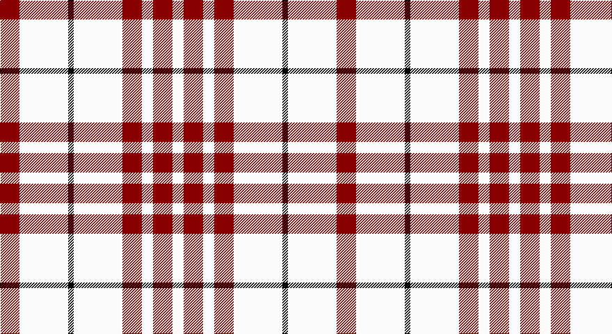

This page is one **sett** — a single exact thread-count. It belongs to the [tartan](/setts/r14w35k4w35r14w8r14w8/)
(the same proportion at any scale), whose colour order is pattern [RWKWRWRW](/stripes/rwkwrwrw/).

Part of the [Clayton Dress](/tartans/clayton-dress/) tartan — the named design grouping this sett with its other cloths.

Sourced from register-of-tartans.  It is a [8 stripe tartan](/stripes/stripes8/).

Original link https://www.tartanregister.gov.uk/tartanDetails.aspx?ref=670

## Register references

External register numbers recorded for this tartan.

- Scottish Register of Tartans: [670](https://www.tartanregister.gov.uk/tartanDetails.aspx?ref=670)
- Scottish Tartans Authority (ITI): 4529

## Thread count
DR/28 W70 K8 W70 DR28 W16 DR28 W/16

One full sett is **484 threads**.

## Palette

Palette: <strong>Tartan Register</strong>
<table><thead><tr><th>Colour</th><th>Threads</th><th>Shade</th><th>Base</th><th>OKLCh</th></tr></thead><tbody><tr><td>DR/</td><td style="text-align:right;font-variant-numeric:tabular-nums">28</td><td><code style="background-color:#880000;">#880000</code> <small style="color:#888">#880000</small></td><td>R <code style="background-color:#CC0000;">#CC0000</code></td><td><small style="color:#888">oklch(39.4% 0.162 29.2)</small></td></tr><tr><td>W</td><td style="text-align:right;font-variant-numeric:tabular-nums">70</td><td><code style="background-color:#FCFCFC;">#FCFCFC</code> <small style="color:#888">#FCFCFC</small></td><td>W <code style="background-color:#F7F7F7;">#F7F7F7</code></td><td><small style="color:#888">oklch(99.1% 0.000 89.9)</small></td></tr><tr><td>K</td><td style="text-align:right;font-variant-numeric:tabular-nums">8</td><td><code style="background-color:#000000;">#000000</code> <small style="color:#888">#000000</small></td><td>K <code style="background-color:#000000;">#000000</code></td><td><small style="color:#888">oklch(0.0% 0.000 0.0)</small></td></tr><tr><td>W</td><td style="text-align:right;font-variant-numeric:tabular-nums">70</td><td><code style="background-color:#FCFCFC;">#FCFCFC</code> <small style="color:#888">#FCFCFC</small></td><td>W <code style="background-color:#F7F7F7;">#F7F7F7</code></td><td><small style="color:#888">oklch(99.1% 0.000 89.9)</small></td></tr><tr><td>DR</td><td style="text-align:right;font-variant-numeric:tabular-nums">28</td><td><code style="background-color:#880000;">#880000</code> <small style="color:#888">#880000</small></td><td>R <code style="background-color:#CC0000;">#CC0000</code></td><td><small style="color:#888">oklch(39.4% 0.162 29.2)</small></td></tr><tr><td>W</td><td style="text-align:right;font-variant-numeric:tabular-nums">16</td><td><code style="background-color:#FCFCFC;">#FCFCFC</code> <small style="color:#888">#FCFCFC</small></td><td>W <code style="background-color:#F7F7F7;">#F7F7F7</code></td><td><small style="color:#888">oklch(99.1% 0.000 89.9)</small></td></tr><tr><td>DR</td><td style="text-align:right;font-variant-numeric:tabular-nums">28</td><td><code style="background-color:#880000;">#880000</code> <small style="color:#888">#880000</small></td><td>R <code style="background-color:#CC0000;">#CC0000</code></td><td><small style="color:#888">oklch(39.4% 0.162 29.2)</small></td></tr><tr><td>W/</td><td style="text-align:right;font-variant-numeric:tabular-nums">16</td><td><code style="background-color:#FCFCFC;">#FCFCFC</code> <small style="color:#888">#FCFCFC</small></td><td>W <code style="background-color:#F7F7F7;">#F7F7F7</code></td><td><small style="color:#888">oklch(99.1% 0.000 89.9)</small></td></tr></tbody></table>

# Sample pattern

## Nearest tartans

The nearest existing variants by ΔTartan distance, with this tartan at the top so the swatches line up against it.

ΔTartan

Tartan

Sett

—

<a href="/ttd/edit/#slug=r14w35k4w35r14w8r14w8~x2">Clayton Dress (Dance)</a> <a class="nn-out" href="/variants/s8/r14w35k4w35r14w8r14w8~x2/" title="open its dictionary page">↗</a>

0.79

<a href="/ttd/edit/#slug=w8r14w8r14w35k4~x2&amp;base=r14w35k4w35r14w8r14w8~x2">Clayton Dress (Dance)</a> <a class="nn-out" href="/variants/s6/w8r14w8r14w35k4~x2/" title="open its dictionary page">↗</a>

1.18

<a href="/ttd/edit/#slug=w12t2w12r17w12t2w5dp2~x4&amp;base=r14w35k4w35r14w8r14w8~x2">Milne, Dress (Dance)</a> <a class="nn-out" href="/variants/s8/w12t2w12r17w12t2w5dp2~x4/" title="open its dictionary page">↗</a>

1.38

<a href="/ttd/edit/#slug=w12dg2w12r17w12dg2w5b2~x4&amp;base=r14w35k4w35r14w8r14w8~x2">Milne (Personal)</a> <a class="nn-out" href="/variants/s8/w12dg2w12r17w12dg2w5b2~x4/" title="open its dictionary page">↗</a>

1.44

<a href="/ttd/edit/#slug=w18db4w18r30w18db4w9dp4&amp;base=r14w35k4w35r14w8r14w8~x2">Milne Dress Family Tartan</a> <a class="nn-out" href="/variants/s8/w18db4w18r30w18db4w9dp4/" title="open its dictionary page">↗</a>

1.45

<a href="/ttd/edit/#slug=w18db4w18r30w18db4w9p4&amp;base=r14w35k4w35r14w8r14w8~x2">Milne, dress</a> <a class="nn-out" href="/variants/s8/w18db4w18r30w18db4w9p4/" title="open its dictionary page">↗</a>

1.50

<a href="/ttd/edit/#slug=lb2r4lb2r4lb9k1~x2&amp;base=r14w35k4w35r14w8r14w8~x2">Buchanan VS</a> <a class="nn-out" href="/variants/s6/lb2r4lb2r4lb9k1~x2/" title="open its dictionary page">↗</a>

1.61

<a href="/ttd/edit/#slug=w12db2w12m17w12db2w5r2~x4&amp;base=r14w35k4w35r14w8r14w8~x2">Milne Purple Dress (Dance)</a> <a class="nn-out" href="/variants/s8/w12db2w12m17w12db2w5r2~x4/" title="open its dictionary page">↗</a>

1.68

<a href="/ttd/edit/#slug=w20k2w20lo5k3w3lo4k2&amp;base=r14w35k4w35r14w8r14w8~x2">Guzzo Dress (Personal)</a> <a class="nn-out" href="/variants/s8/w20k2w20lo5k3w3lo4k2/" title="open its dictionary page">↗</a>

1.68

<a href="/ttd/edit/#slug=w5t2w12r17w12t2w12t2w12r17w12t2w5dp2~x4&amp;base=r14w35k4w35r14w8r14w8~x2">Milne Dress Fancy Tartan</a> <a class="nn-out" href="/variants/s14/w5t2w12r17w12t2w12t2w12r17w12t2w5dp2~x4/" title="open its dictionary page">↗</a>

1.74

<a href="/variants/s6/k7w6k1w6~x4/">Wallace Dress</a>

## Neighbour map

Every grey dot is one of 14360 variants placed by the first two principal components of the ΔTartan feature space (44% of its variance). Red is this tartan; blue dots are its nearest — click one to open its page.

<svg viewBox="0 0 640 380" role="img" style="max-width:100%;height:auto;border:1px solid #e0e0e0;border-radius:4px;display:block" xmlns="http://www.w3.org/2000/svg"><image href="/nn/cloud.v1.png" width="640" height="380"/><a href="/variants/s6/w8r14w8r14w35k4~x2/"><circle cx="301.9" cy="199.1" r="4" fill="#3465a4"><title>Clayton Dress (Dance)</title></circle></a><a href="/variants/s8/w12t2w12r17w12t2w5dp2~x4/"><circle cx="295.5" cy="179.7" r="4" fill="#3465a4"><title>Milne, Dress (Dance)</title></circle></a><a href="/variants/s8/w12dg2w12r17w12dg2w5b2~x4/"><circle cx="297.9" cy="183.0" r="4" fill="#3465a4"><title>Milne (Personal)</title></circle></a><a href="/variants/s8/w18db4w18r30w18db4w9dp4/"><circle cx="268.3" cy="189.8" r="4" fill="#3465a4"><title>Milne Dress Family Tartan</title></circle></a><a href="/variants/s8/w18db4w18r30w18db4w9p4/"><circle cx="269.3" cy="190.7" r="4" fill="#3465a4"><title>Milne, dress</title></circle></a><a href="/variants/s6/lb2r4lb2r4lb9k1~x2/"><circle cx="320.3" cy="206.4" r="4" fill="#3465a4"><title>Buchanan VS</title></circle></a><a href="/variants/s8/w12db2w12m17w12db2w5r2~x4/"><circle cx="296.4" cy="183.9" r="4" fill="#3465a4"><title>Milne Purple Dress (Dance)</title></circle></a><a href="/variants/s8/w20k2w20lo5k3w3lo4k2/"><circle cx="399.2" cy="174.6" r="4" fill="#3465a4"><title>Guzzo Dress (Personal)</title></circle></a><a href="/variants/s14/w5t2w12r17w12t2w12t2w12r17w12t2w5dp2~x4/"><circle cx="270.4" cy="156.3" r="4" fill="#3465a4"><title>Milne Dress Fancy Tartan</title></circle></a><a href="/variants/s6/k7w6k1w6~x4/"><circle cx="322.1" cy="249.2" r="4" fill="#3465a4"><title>Wallace Dress</title></circle></a><circle cx="315.9" cy="192.8" r="5" fill="#c00000"/></svg>

ID: /variants/s8/r14w35k4w35r14w8r14w8~x2/
