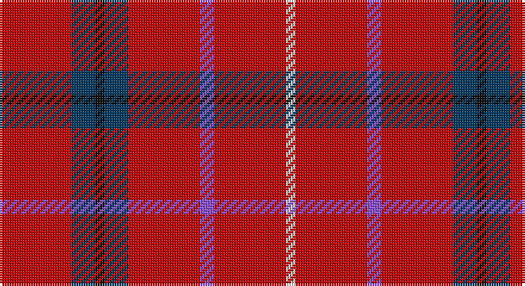

This page is one **sett** — a single exact thread-count. It belongs to the [tartan](/setts/r15dt5k2dt5r15p3r15w2/)
(the same proportion at any scale), whose colour order is pattern [RBKBRBRW](/stripes/rbkbrbrw/).

Sourced from tartans-authority.  It is a [8 stripe tartan](/stripes/stripes8/).

Original link http://www.tartansauthority.com/tartan-ferret/display/7673/

2 attestations — the source records this cloth was collapsed from (oldest owns this page)

<ul>
<li>pre 2008 — Goodwillie (Fashion) (tartans-authority, <a href="http://www.tartansauthority.com/tartan-ferret/display/7673/">record</a>)</li>
<li>undated — Goodwillie (register-of-tartans, <a href="https://www.tartanregister.gov.uk/tartanDetails.aspx?ref=5676">record</a>)</li>
</ul>

## Register references

External register numbers recorded for this tartan.

- Scottish Register of Tartans: [5676](https://www.tartanregister.gov.uk/tartanDetails.aspx?ref=5676)
- Scottish Tartans Authority (ITI): 7673

## Thread count
R/30 DB10 K4 DB10 R30 P6 R30 LN/4

One full sett is **214 threads**.

## Palette

Palette: <strong>Tartan Register</strong> <small style="color:#888">(4 of 5 colours)</small>
<table><thead><tr><th>Colour</th><th>Threads</th><th>Shade</th><th>Base</th><th>OKLCh</th></tr></thead><tbody><tr><td>R/</td><td style="text-align:right;font-variant-numeric:tabular-nums">30</td><td><code style="background-color:#C80000;">#C80000</code> <small style="color:#888">#C80000</small></td><td>R <code style="background-color:#CC0000;">#CC0000</code></td><td><small style="color:#888">oklch(52.3% 0.215 29.2)</small></td></tr><tr><td>DB</td><td style="text-align:right;font-variant-numeric:tabular-nums">10</td><td><code style="background-color:#003C64;">#003C64</code> <small style="color:#888">#003C64</small></td><td>B <code style="background-color:#2A418A;">#2A418A</code></td><td><small style="color:#888">oklch(34.5% 0.089 246.0)</small></td></tr><tr><td>K</td><td style="text-align:right;font-variant-numeric:tabular-nums">4</td><td><code style="background-color:#101010;">#101010</code> <small style="color:#888">#101010</small></td><td>K <code style="background-color:#000000;">#000000</code></td><td><small style="color:#888">oklch(17.3% 0.000 89.9)</small></td></tr><tr><td>DB</td><td style="text-align:right;font-variant-numeric:tabular-nums">10</td><td><code style="background-color:#003C64;">#003C64</code> <small style="color:#888">#003C64</small></td><td>B <code style="background-color:#2A418A;">#2A418A</code></td><td><small style="color:#888">oklch(34.5% 0.089 246.0)</small></td></tr><tr><td>R</td><td style="text-align:right;font-variant-numeric:tabular-nums">30</td><td><code style="background-color:#C80000;">#C80000</code> <small style="color:#888">#C80000</small></td><td>R <code style="background-color:#CC0000;">#CC0000</code></td><td><small style="color:#888">oklch(52.3% 0.215 29.2)</small></td></tr><tr><td>P</td><td style="text-align:right;font-variant-numeric:tabular-nums">6</td><td><code style="background-color:#9050D8;">#9050D8</code> <small style="color:#888">#9050D8</small></td><td>B <code style="background-color:#2A418A;">#2A418A</code></td><td><small style="color:#888">oklch(57.3% 0.201 302.1)</small></td></tr><tr><td>R</td><td style="text-align:right;font-variant-numeric:tabular-nums">30</td><td><code style="background-color:#C80000;">#C80000</code> <small style="color:#888">#C80000</small></td><td>R <code style="background-color:#CC0000;">#CC0000</code></td><td><small style="color:#888">oklch(52.3% 0.215 29.2)</small></td></tr><tr><td>LN/</td><td style="text-align:right;font-variant-numeric:tabular-nums">4</td><td><code style="background-color:#E0E0E0;">#E0E0E0</code> <small style="color:#888">#E0E0E0</small></td><td>W <code style="background-color:#F7F7F7;">#F7F7F7</code></td><td><small style="color:#888">oklch(90.7% 0.000 89.9)</small></td></tr></tbody></table>

# Sample pattern

## Nearest tartans

The nearest existing variants by ΔTartan distance, with this tartan at the top so the swatches line up against it.

ΔTartan

Tartan

Sett

—

<a href="/ttd/edit/#slug=r15dt5k2dt5r15p3r15w2~x2">Goodwillie (Fashion)</a> <a class="nn-out" href="/variants/s8/r15dt5k2dt5r15p3r15w2~x2/" title="open its dictionary page">↗</a>

1.43

<a href="/ttd/edit/#slug=r8dt2lb1o1r8dt2lb1o1r8g2~x6&amp;base=r15dt5k2dt5r15p3r15w2~x2">Fearns McIntosh Millennium (Personal)</a> <a class="nn-out" href="/variants/s10/r8dt2lb1o1r8dt2lb1o1r8g2~x6/" title="open its dictionary page">↗</a>

1.56

<a href="/ttd/edit/#slug=r28w2k12ly3r12ly3r12g3~x2&amp;base=r15dt5k2dt5r15p3r15w2~x2">Hackston or Halkerston Family Tartan</a> <a class="nn-out" href="/variants/s8/r28w2k12ly3r12ly3r12g3~x2/" title="open its dictionary page">↗</a>

1.57

<a href="/ttd/edit/#slug=r30dg12k5lr2b6r30~x2&amp;base=r15dt5k2dt5r15p3r15w2~x2">Sinclair</a> <a class="nn-out" href="/variants/s6/r30dg12k5lr2b6r30~x2/" title="open its dictionary page">↗</a>

1.57

<a href="/ttd/edit/#slug=r30dg12k5lr2b6r30&amp;base=r15dt5k2dt5r15p3r15w2~x2">Sinclair</a> <a class="nn-out" href="/variants/s6/r30dg12k5lr2b6r30/" title="open its dictionary page">↗</a>

1.59

<a href="/ttd/edit/#slug=r30g12k5w2t6r30&amp;base=r15dt5k2dt5r15p3r15w2~x2">Sinclair</a> <a class="nn-out" href="/variants/s6/r30g12k5w2t6r30/" title="open its dictionary page">↗</a>

1.72

<a href="/ttd/edit/#slug=r34w4t7lo10t7r18~x2&amp;base=r15dt5k2dt5r15p3r15w2~x2">Ploysongsang, Edward Thiravej (Personal)</a> <a class="nn-out" href="/variants/s6/r34w4t7lo10t7r18~x2/" title="open its dictionary page">↗</a>

1.74

<a href="/ttd/edit/#slug=r74w27r13lr7r13w13r74k7&amp;base=r15dt5k2dt5r15p3r15w2~x2">Cornell (Corporate)</a> <a class="nn-out" href="/variants/s8/r74w27r13lr7r13w13r74k7/" title="open its dictionary page">↗</a>

1.76

<a href="/ttd/edit/#slug=r30dg12k5lb8r30&amp;base=r15dt5k2dt5r15p3r15w2~x2">Sinclair</a> <a class="nn-out" href="/variants/s5/r30dg12k5lb8r30/" title="open its dictionary page">↗</a>

1.87

<a href="/ttd/edit/#slug=g4r32db9r6db2r3db2r12w3~x2&amp;base=r15dt5k2dt5r15p3r15w2~x2">Rose</a> <a class="nn-out" href="/variants/s9/g4r32db9r6db2r3db2r12w3~x2/" title="open its dictionary page">↗</a>

1.88

<a href="/ttd/edit/#slug=r34w4t7ly10t7r18~x2&amp;base=r15dt5k2dt5r15p3r15w2~x2">Ploysongsang, Edward Thiravej (Pers</a> <a class="nn-out" href="/variants/s6/r34w4t7ly10t7r18~x2/" title="open its dictionary page">↗</a>

## Neighbour map

Every grey dot is one of 14360 variants placed by the first two principal components of the ΔTartan feature space (44% of its variance). Red is this tartan; blue dots are its nearest — click one to open its page.

<svg viewBox="0 0 640 380" role="img" style="max-width:100%;height:auto;border:1px solid #e0e0e0;border-radius:4px;display:block" xmlns="http://www.w3.org/2000/svg"><image href="/nn/cloud.v1.png" width="640" height="380"/><a href="/variants/s10/r8dt2lb1o1r8dt2lb1o1r8g2~x6/"><circle cx="413.2" cy="187.8" r="4" fill="#3465a4"><title>Fearns McIntosh Millennium (Personal)</title></circle></a><a href="/variants/s8/r28w2k12ly3r12ly3r12g3~x2/"><circle cx="382.8" cy="148.3" r="4" fill="#3465a4"><title>Hackston or Halkerston Family Tartan</title></circle></a><a href="/variants/s6/r30dg12k5lr2b6r30~x2/"><circle cx="418.5" cy="183.1" r="4" fill="#3465a4"><title>Sinclair</title></circle></a><a href="/variants/s6/r30dg12k5lr2b6r30/"><circle cx="418.5" cy="183.1" r="4" fill="#3465a4"><title>Sinclair</title></circle></a><a href="/variants/s6/r30g12k5w2t6r30/"><circle cx="399.3" cy="169.7" r="4" fill="#3465a4"><title>Sinclair</title></circle></a><a href="/variants/s6/r34w4t7lo10t7r18~x2/"><circle cx="372.7" cy="211.4" r="4" fill="#3465a4"><title>Ploysongsang, Edward Thiravej (Personal)</title></circle></a><a href="/variants/s8/r74w27r13lr7r13w13r74k7/"><circle cx="449.4" cy="174.0" r="4" fill="#3465a4"><title>Cornell (Corporate)</title></circle></a><a href="/variants/s5/r30dg12k5lb8r30/"><circle cx="363.2" cy="235.4" r="4" fill="#3465a4"><title>Sinclair</title></circle></a><a href="/variants/s9/g4r32db9r6db2r3db2r12w3~x2/"><circle cx="461.9" cy="145.7" r="4" fill="#3465a4"><title>Rose</title></circle></a><a href="/variants/s6/r34w4t7ly10t7r18~x2/"><circle cx="351.9" cy="201.1" r="4" fill="#3465a4"><title>Ploysongsang, Edward Thiravej (Pers</title></circle></a><circle cx="395.9" cy="194.1" r="5" fill="#c00000"/></svg>

ID: /variants/s8/r15dt5k2dt5r15p3r15w2~x2/
